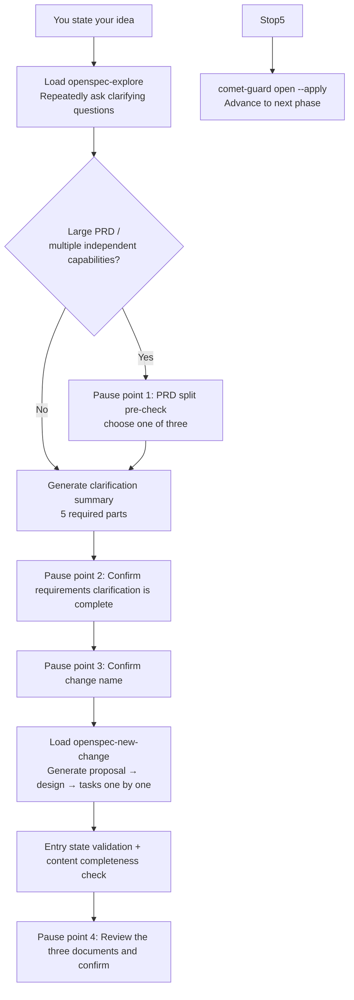

The open phase turns the idea in your head into an executable change: it explores requirements, clarifies scope, creates proposal/design/tasks, and initializes Comet state. From your perspective, this is a **guided conversation** — Comet asks you questions repeatedly, confirms its understanding is correct, and only then starts writing documents.

<Tip>
  <strong>
    Normally you only need <code>/comet</code>.
  </strong>{' '}
  When project configuration selects Classic, <code>/comet</code> forwards to{' '}
  <code>/comet-classic</code>. That internal entry point performs intent recognition, reads file
  state, detects the open phase, and invokes <code>/comet-open</code>. Call the phase Skill directly
  only for <strong>manual control</strong>. See{' '}
  <a href="#how-this-phase-is-triggered">How this phase is triggered</a>.
</Tip>

## How this phase is triggered

`/comet-open` is usually **not a command you type yourself**. It is the result of `/comet` selecting Classic and the internal `/comet-classic` router choosing the full workflow. Classic reads active changes and file state, builds routing context, and lets runtime scoring decide the route.

### Default: use /comet for automatic recognition

Every call to `/comet-classic` re-reads file state (it doesn't rely on conversation history) and routes to the open phase under these conditions:

| Trigger condition                                                                          | Behavior                                                        |
| ------------------------------------------------------------------------------------------ | --------------------------------------------------------------- |
| route is `full` and there is no active change in the project                               | Automatically invokes `/comet-open`                             |
| route is `full`, but there's already an active change and the user hasn't specified        | Pauses to ask: continue the existing change or create a new one |
| The active change's `.comet.yaml` is missing                                               | Automatically invokes `/comet-open` to backfill state           |
| Insufficient confidence, multiple active changes, or conflicting hotfix/tweak/full signals | Pauses to ask, doesn't create automatically                     |

You only need to type `/comet` and describe what you want to do. When Classic is configured, the internal `/comet-classic` entry decides whether a new change should be opened and automatically continues to design after open completes. See [Auto-transition mechanism](/en/concepts/auto-transition).

### Manual: when you'd need /comet-open directly

- You've disabled auto-transition (`auto_transition: false`) — in this case `/comet-classic` stops after advancing one phase, and you need to manually invoke the next phase Skill.
- You only want to run the open phase alone (debugging, or inserting a manual review between phases).

**Use the shared `/comet` entry normally; invoke phase commands directly only for manual control.**

---

## What you'll experience

The open phase isn't a one-shot document generation — it's a process of **multi-turn conversation + multiple pause points**. Throughout, questions are asked and documents produced in the language you used to trigger the workflow.



<p align="center">
  
</p>

<p align="center">The open phase filters a vague idea into three executable OpenSpec artifacts</p>

### Step 1: Explore the idea and clarify requirements

Comet loads `openspec-explore` and **keeps asking questions around your idea** until it can organize a complete **clarification summary**. It never treats a single Q&A as "enough" — it keeps asking until all five parts are clear:

| Five required parts of the clarification summary | What you need to think through                        |
| ------------------------------------------------ | ----------------------------------------------------- |
| **Goals**                                        | The real problem to solve, expected outcomes          |
| **Non-goals**                                    | What is explicitly out of scope                       |
| **Scope boundaries**                             | Modules, users, platforms, data involved/not involved |
| **Key unknowns**                                 | Assumptions, risks, dependencies                      |
| **Draft acceptance scenarios**                   | Core success scenarios + key boundary scenarios       |

### Pause point 1: PRD split pre-check (conditionally triggered)

If your input is a **large PRD, roadmap, or full product plan**, or the clarification summary surfaces **multiple independent capabilities**, Comet pauses here and gives you a **candidate split list** (each split item includes a suggested name, goal scope, non-goals, dependency order, and core acceptance scenarios), then asks you to choose one of three:

| Option                                 | Meaning                                                                                               |
| -------------------------------------- | ----------------------------------------------------------------------------------------------------- |
| **Create multiple OpenSpec changes**   | Create multiple independent changes per the split list (each needs its own `/comet-open`)             |
| **Keep as a single change**            | Don't split; continue the single-change flow and record the reason for not splitting in the documents |
| **Adjust the split plan and continue** | You describe adjustments, Comet regenerates the list and asks again                                   |

<Tip>
  After splitting, Comet <strong>does not</strong> automatically advance any single change to
  design. It asks which one to start first and keeps the rest active for future `/comet` resumption.
</Tip>

### Pause point 2: Confirm requirements clarification is complete

Before creating any documents, Comet presents the complete clarification summary (all five parts) for you to review and **waits for your explicit confirmation**. Until confirmed, it won't create proposal/design/tasks, nor will it use `openspec-propose` for one-shot generation.

### Pause point 3: Confirm the change name

Before `openspec new change`, Comet lets you decide the name. **The name must be kebab-case English** (lowercase letters, digits, hyphens, e.g. `refine-requirements-doc`). It will:

- Recommend 2–3 kebab-case English names, each with a one-line scope description
- Let you **type the name yourself** — if you type Chinese or non-compliant text, it converts it to compliant kebab-case and **echoes it back for your confirmation**
- If the name conflicts with an existing change, report the conflict and ask you to pick another

### Step 2: Create the change structure

Load `openspec-new-change`. The full workflow **does not load `openspec-propose` by default** (one-shot generation of everything) — it's only allowed when you explicitly request it. Comet uses the **standard artifact loop** to generate proposal → design → tasks one by one:

1. Refresh state: `openspec status --change "<name>" --json`
2. Get instructions: `openspec instructions proposal|design|tasks --change "<name>" --json`
3. Read `dependencies`, follow `template` and `instruction`, apply `context`/`rules` constraints (**without copying them into document content**), write to `resolvedOutputPath`
4. Refresh state after each artifact to confirm

<Warning>
  If <code>openspec instructions</code> fails, returns invalid JSON, or doesn't provide a usable{' '}
  <code>resolvedOutputPath</code>, Comet <strong>stops immediately</strong> and reports the OpenSpec
  error — it <strong>will not</strong> fall back to a hardcoded document structure, as that would
  bypass project rules. The change name must be the kebab-case name you confirmed; Comet won't
  expand or shrink scope on its own.
</Warning>

### Step 3: Entry state validation + content completeness check

```bash
node "$COMET_STATE" check <name> open
```

Then confirm one by one that the three files exist and are non-empty: proposal (background/goals/scope), design (architecture decisions/selection/data flow), tasks (task descriptions). If any is missing or empty, Comet won't continue — it goes back to the creation step.

### Pause point 4: Review the three documents and confirm

Comet presents a summary of the three documents (proposal's background/goals/scope, design's architecture decisions/selection, tasks' count and key tasks), then asks you to **choose one of two**:

| Option                             | Meaning                                                                             |
| ---------------------------------- | ----------------------------------------------------------------------------------- |
| **Confirm, proceed to next phase** | Documents meet expectations; run the phase guard to advance                         |
| **Needs adjustment**               | You provide notes; Comet revises the relevant files and requests confirmation again |

### Exit: Advance to the next phase

```bash
node "$COMET_GUARD" <change-name> open --apply
```

`--apply` is required — without it `.comet.yaml` stays at `phase: open` and the next phase's entry check fails. The full workflow advances to `phase: design`; hotfix/tweak jumps directly to `phase: build` (skipping design).

---

## Skills invoked

| Skill                 | Purpose                                         | When invoked                                    |
| --------------------- | ----------------------------------------------- | ----------------------------------------------- |
| `openspec-explore`    | Explore the problem space, clarify requirements | Step 1, executed immediately, cannot be skipped |
| `openspec-new-change` | Create the change scaffold                      | Step 2, executed immediately, cannot be skipped |

<Warning>
  The full workflow <strong>does not load</strong> <code>openspec-propose</code> (one-shot
  generation of all artifacts) by default. It's only allowed when the user explicitly requests it.
</Warning>

## Artifacts

<Tree>
  <Tree.Folder name="openspec/changes/<name>/" defaultOpen>
    <Tree.File name=".openspec.yaml" />
    <Tree.File name=".comet.yaml" />
    <Tree.File name="proposal.md" />
    <Tree.File name="design.md" />
    <Tree.File name="tasks.md" />
    <Tree.Folder name="specs/<capability>/">
      <Tree.File name="spec.md" />
    </Tree.Folder>
  </Tree.Folder>
</Tree>

Initialize Comet state:

```bash
node "$COMET_STATE" init <name> full
```

## Idempotency: safe to repeat

All operations in the open phase can be safely repeated. If `.comet.yaml` is already at `phase: open` and the three artifacts already exist, Comet **skips completed steps** and resumes from the first missing step. Re-running `/comet` after an interruption will not corrupt state.

## Overview of the four pause points

The open phase has 4 pause points (globally numbered 1–4; the entire five-phase workflow has 13 — see [Five-phase pause points and user decision points](/en/concepts/decision-points)):

| Pause point                           | When it occurs                                            | What you do                           |
| ------------------------------------- | --------------------------------------------------------- | ------------------------------------- |
| 1 PRD split                           | Input is a large PRD or multiple independent capabilities | Split / don't split / adjust the plan |
| 2 Requirements clarification complete | After the clarification summary is generated              | Confirm your understanding is correct |
| 3 Change name                         | Before creating the change                                | Pick a name / customize a name        |
| 4 Document review                     | After the three documents are generated                   | Confirm / request adjustments         |

All pause points follow the [decision point protocol](/en/concepts/decision-points) — Comet cannot substitute recommendation rules, defaults, or "the user would probably agree" for your explicit choice.

## FAQ

<AccordionGroup>
  <Accordion title="What if .comet.yaml is missing">
    Don't bypass it with `/opsx:new` — it only creates OpenSpec artifacts and won't create `.comet.yaml`, leaving the change outside Comet's state machine. Re-run `/comet`; after routing to Classic, it backfills state through `/comet-open`.
  </Accordion>

<Accordion title="What are the change name restrictions">
  It must be kebab-case English (lowercase letters, digits, hyphens). Chinese or non-compliant names
  are converted to kebab-case and echoed back for your confirmation. Conflicts with existing changes
  are reported so you can pick another.
</Accordion>

<Accordion title="What if openspec instructions fails">
  Comet stops artifact creation immediately and reports the OpenSpec error — it won't fall back to a
  hardcoded document structure. Check whether the OpenSpec CLI is working and whether
  `template`/`instruction`/`dependencies` are satisfied.
</Accordion>

  <Accordion title="Does a large PRD have to be split">
    Not necessarily. The split pre-check gives you three choices (split / keep as one / adjust the plan). You can choose to keep it as a single change, but you should record the reason for not splitting in the documents.
  </Accordion>
</AccordionGroup>

## Next steps

- [Design phase](/en/phases/design) — Enter deep design after open completes
- [Five-phase pause points and user decision points](/en/concepts/decision-points) — Detailed look at open's 4 pause points
- [Large PRD splitting](/en/guides/prd-splitting) — The full mechanism behind Step 1a
- [Auto-transition mechanism](/en/concepts/auto-transition) — How open automatically continues to design
