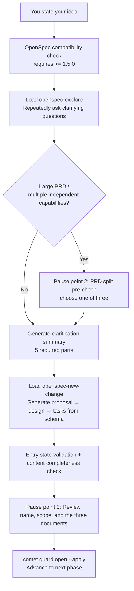

The open phase turns the idea in your head into an executable change: it explores requirements, clarifies scope, creates proposal/design/tasks, and initializes Comet state. From your perspective, this is a **guided conversation** — Comet asks you questions repeatedly, confirms its understanding is correct, and only then starts writing documents.

<Tip>
  <strong>Normally you only need <code>/comet</code>.</strong> <code>/comet</code> has built-in intent recognition and reads file state to automatically determine that you're in the open phase and invoke <code>/comet-open</code>. The <code>/comet-open</code> described here is the phase Skill it calls internally — you only need to type <code>/comet-open</code> directly when you want <strong>manual control</strong> (for example, you've disabled <code>auto_transition</code>, or you want to run only this phase). See <a href="#how-this-phase-is-triggered">How this phase is triggered</a>.
</Tip>

## How this phase is triggered

`/comet-open` is usually **not a command you type yourself** — it's the result of `/comet` routing automatically. `/comet` first reads the active change list, organizes the routing context, and then the runtime scoring decides the route. Only when the route is `full`, or you explicitly choose the full workflow, does it enter `/comet-open`.

### Default: use /comet for automatic recognition

Every call to `/comet` re-reads file state (it doesn't rely on conversation history) and routes to the open phase under these conditions:

| Trigger condition | Behavior |
| --- | --- |
| route is `full` and there is no active change in the project | Automatically invokes `/comet-open` |
| route is `full`, but there's already an active change and the user hasn't specified | Pauses to ask: continue the existing change or create a new one |
| The active change's `.comet.yaml` is missing | Automatically invokes `/comet-open` to backfill state |
| Insufficient confidence, multiple active changes, or conflicting hotfix/tweak/full signals | Pauses to ask, doesn't create automatically |

You only need to type `/comet` and describe what you want to do — it decides for itself whether a new change should be opened. After the open phase completes, `/comet` also automatically continues to the next phase (design). See [Auto-transition mechanism](/en/concepts/auto-transition).

### Manual: when you'd need /comet-open directly

- You've disabled auto-transition (`auto_transition: false`) — in this case `/comet` stops after advancing one phase, and you need to manually invoke the next phase Skill.
- You only want to run the open phase alone (debugging, or inserting a manual review between phases).

**If auto-transition is on, use `/comet`; only when it's off do you need to use the phase commands manually.**

---

## What you'll experience

The open phase isn't a one-shot document generation — it's a process of **multi-turn conversation + multiple pause points**. Throughout, questions are asked and documents produced in the language you used to trigger the workflow.



<p align="center">
  
</p>

<p align="center">The open phase filters a vague idea into three executable OpenSpec artifacts</p>

### Step 0b: OpenSpec compatibility check

Before any OpenSpec status or instructions command, Comet runs `openspec --version`. This flow **requires OpenSpec >= 1.5.0**. If the version is older, cannot be parsed, the command is unavailable, or it exits non-zero, Comet stops immediately and asks you to run `npm install -g @fission-ai/openspec@latest` and retry — it will not continue with an older CLI that lacks the `applyRequires`, `artifactPaths`, `changeRoot`, or `resolvedOutputPath` contracts.

### Step 1: Explore the idea and clarify requirements

Comet loads `openspec-explore` and **keeps asking questions around your idea** until it can organize a complete **clarification summary**. It never treats a single Q&A as "enough" — it keeps asking until all five parts are clear:

| Five required parts of the clarification summary | What you need to think through |
| --- | --- |
| **Goals** | The real problem to solve, expected outcomes |
| **Non-goals** | What is explicitly out of scope |
| **Scope boundaries** | Modules, users, platforms, data involved/not involved |
| **Key unknowns** | Assumptions, risks, dependencies |
| **Draft acceptance scenarios** | Core success scenarios + key boundary scenarios |

### Pause point 2: PRD split pre-check (conditionally triggered)

If your input is a **large PRD, roadmap, or full product plan**, or the clarification summary surfaces **multiple independent capabilities**, Comet pauses here and gives you a **candidate split list** (each split item includes a suggested name, goal scope, non-goals, dependency order, and core acceptance scenarios), then asks you to choose one of three:

| Option | Meaning |
| --- | --- |
| **Create multiple OpenSpec changes** | Create multiple independent changes per the split list, persisted to `.comet/batches/<batch-id>.json` |
| **Keep as a single change** | Don't split; continue the single-change flow and record the reason for not splitting in the documents |
| **Adjust the split plan and continue** | You describe adjustments, Comet regenerates the list and asks again |

After you confirm a split, Comet writes the accepted items to `.comet/batches/<batch-id>.json` (recording version, original goal summary, creation time, ordered change names, and each item's goals/scope/non-goals/acceptance scenarios and `pending|open-complete|selected` status). The file is atomically updated after each item is created or completed. This is a batch orchestration manifest, not a replacement for each change's own `.comet.yaml`.

After each split item completes its own open phase, Comet runs `openspec status --change "<name>" --json` and `comet state check <name> design` for every change in the list (the resolved `changeRoot` must be repository-local, every artifact in `applyRequires` must be `done`, and concrete outputs must exist and be non-empty). Splitting is only declared complete when all items pass.

<Tip>
  After splitting, Comet <strong>does not</strong> automatically advance any single change to design. It pauses to ask which one you want to do first (pause point 1), advances only the one you choose, and keeps the rest active for future `/comet` resumption. On resume, it reads the batch manifest first, skips items that already pass, and resumes incomplete items without recreating them.
</Tip>

### Clarification and naming (non-blocking by default)

Since 0.4.0-beta.5, requirements clarification and change naming are **non-blocking by default**. Comet turns Step 1 clarification into a resolved brief (goals, non-goals, scope boundaries, key unknowns, draft acceptance scenarios) and derives one kebab-case English name that accurately represents that scope:

- When scope and naming are both unambiguous, it **continues directly** without a separate pause to approve the summary or name — the final review (pause point 3) confirms the name, scope, and three documents together
- If you supplied a name, it normalizes it to kebab-case and echoes it in the progress update; it does not re-confirm when normalization preserves meaning
- It reuses a confirmed batch item's persisted summary and name; it re-clarifies only when scope drift or missing manifest data is detected
- It uses the decision-point protocol for one joint question only when mutually exclusive choices still change scope or the target change identity

OpenSpec names must be kebab-case English using lowercase letters, digits, and single hyphens. When a collision exists but the target remains clear, Comet derives a stable non-conflicting name and continues; it asks only when it cannot determine whether to reuse an existing change or create a new one.

### Step 2: Create the change structure

Load `openspec-new-change`. The full workflow **does not load `openspec-propose` by default** (one-shot generation of everything) — it's only allowed when you explicitly request it. After creating the change scaffold, initialize recoverable state immediately:

```bash
comet state init <name> full
comet state select <name>
comet state check <name> open
```

Stop if any command fails. Then run `openspec status --change "<name>" --json` once for a compatibility preflight: `changeRoot` must equal repository-local `openspec/changes/<name>`, `artifacts` must contain core ids `proposal`/`design`/`tasks`, and `applyRequires` must be a parseable list of artifact ids that all exist in `artifacts`.

After preflight, generate the implementation-required artifacts from the OpenSpec schema and dependency graph:

1. Run `openspec status --change "<name>" --json` and parse the complete JSON
2. Exit when every item in `applyRequires` is `done`; treat `isComplete` as diagnostic only, not a phase blocker
3. From unfinished `ready` artifacts, prioritize items that advance the `applyRequires` dependency closure and process them in CLI-returned order — do not hard-code the generation order
4. Fetch current instructions for each ready `<artifact-id>`: `openspec instructions <artifact-id> --change "<name>" --json`
5. Read `dependencies`, follow `template` and `instruction`, apply `context`/`rules` constraints (**without copying them into document content**), write to `resolvedOutputPath`
6. Refresh state after each artifact to confirm

<Warning>
  If <code>openspec instructions</code> fails, returns invalid JSON, or doesn't provide a usable <code>resolvedOutputPath</code>, Comet <strong>stops immediately</strong> and reports the OpenSpec error — it <strong>will not</strong> fall back to a hardcoded document structure, as that would bypass project rules.
</Warning>

### Step 3: Entry state validation + content completeness check

```bash
comet state check <name> open
```

Then confirm one by one that the three files exist and are non-empty: proposal (background/goals/scope), design (architecture decisions/selection/data flow), tasks (task descriptions). If any is missing or empty, Comet won't continue — it goes back to the creation step.

### Pause point 3: Review name, scope, and the three documents

Comet presents a summary of the three documents (proposal's background/goals/scope, design's architecture decisions/selection, tasks' count and key tasks) plus the derived change name, then asks you to **choose one of two**:

| Option | Meaning |
| --- | --- |
| **Confirm, proceed to next phase** | Documents meet expectations; run the phase guard to advance |
| **Needs adjustment** | You provide notes; Comet revises the relevant files and requests confirmation again |

### Exit: Advance to the next phase

```bash
comet guard <change-name> open --apply
```

`--apply` is required — without it `.comet.yaml` stays at `phase: open` and the next phase's entry check fails. The full workflow advances to `phase: design`; hotfix/tweak jumps directly to `phase: build` (skipping design).

---

## Skills invoked

| Skill | Purpose | When invoked |
| --- | --- | --- |
| `openspec-explore` | Explore the problem space, clarify requirements | Step 1, executed immediately, cannot be skipped |
| `openspec-new-change` | Create the change scaffold | Step 2, executed immediately, cannot be skipped |

<Warning>
  The full workflow <strong>does not load</strong> <code>openspec-propose</code> (one-shot generation of all artifacts) by default. It's only allowed when the user explicitly requests it.
</Warning>

## Artifacts

<Tree>
  <Tree.Folder name="openspec/changes/<name>/" defaultOpen>
    <Tree.File name=".openspec.yaml" />
    <Tree.File name=".comet.yaml" />
    <Tree.File name="proposal.md" />
    <Tree.File name="design.md" />
    <Tree.File name="tasks.md" />
    <Tree.Folder name="specs/<capability>/">
      <Tree.File name="spec.md" />
    </Tree.Folder>
  </Tree.Folder>
</Tree>

Initialize Comet state:

```bash
comet state init <name> full
```

## Idempotency: safe to repeat

All operations in the open phase can be safely repeated. If `.comet.yaml` is already at `phase: open` and the three artifacts already exist, Comet **skips completed steps** and resumes from the first missing step. This means re-running `/comet` after an interruption won't corrupt state.

## Open's pause points

The open phase's pause points (global numbering in [Five-phase pause points and user decision points](/en/concepts/decision-points)):

| Pause point | When it occurs | What you do |
| --- | --- | --- |
| 2 PRD split | Input is a large PRD or multiple independent capabilities | Split / don't split / adjust the plan |
| 3 Document review | After the three documents are generated | Confirm name, scope, and documents / request adjustments |

Requirements clarification and naming are non-blocking by default and no longer occupy separate pause points — they are confirmed together at the final review.

All pause points follow the [decision point protocol](/en/concepts/decision-points) — Comet cannot substitute recommendation rules, defaults, or "the user would probably agree" for your explicit choice.

## FAQ

<AccordionGroup>
  <Accordion title="What if .comet.yaml is missing">
    Don't bypass it with `/opsx:new` — it only creates OpenSpec artifacts and won't create `.comet.yaml`, leaving the change outside Comet's state machine. Re-run `/comet` and let it backfill state through `/comet-open`.
  </Accordion>

  <Accordion title="What are the change name restrictions">
    It must be kebab-case English (lowercase letters, digits, hyphens). Chinese or non-compliant names are converted to kebab-case and echoed back for your confirmation. Conflicts with existing changes are reported so you can pick another.
  </Accordion>

  <Accordion title="What if openspec instructions fails">
    Comet stops artifact creation immediately and reports the OpenSpec error — it won't fall back to a hardcoded document structure. Check whether the OpenSpec CLI is working and whether `template`/`instruction`/`dependencies` are satisfied.
  </Accordion>

  <Accordion title="Does a large PRD have to be split">
    Not necessarily. The split pre-check gives you three choices (split / keep as one / adjust the plan). You can choose to keep it as a single change, but you should record the reason for not splitting in the documents.
  </Accordion>
</AccordionGroup>

## Next steps

- [Design phase](/en/phases/design) — Enter deep design after open completes
- [Five-phase pause points and user decision points](/en/concepts/decision-points) — Detailed look at open's 4 pause points
- [Large PRD splitting](/en/guides/prd-splitting) — The full mechanism behind Step 1a
- [Auto-transition mechanism](/en/concepts/auto-transition) — How open automatically continues to design
