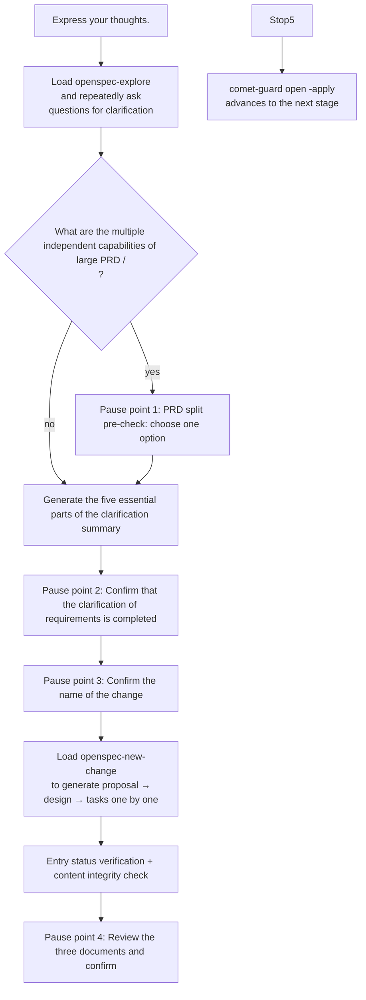

The open phase will turn your ideas into an executable change: explore requirements, clarify scope, create proposals/designs /tasks, and initialize the Comet state. From your perspective, this is a "guided conversation" - Comet will repeatedly ask you questions to make sure you understand correctly before starting to write the document.

<Tip>
  Normally, you only need <code>/comet</code>. When the project configuration selects Classic,
  <code>/comet</code> forwards to <code>/comet-classic</code>. It recognizes intent, reads file state,
  determines that the workflow is in the open phase, and invokes{" "}
  <code>/comet-open</code>. This page documents the internal phase Skill; enter it directly only when you want to{' '}
  <strong>control the phase manually</strong>. See{' '}
  <a href="#how-this-phase-is-triggered">How this phase is triggered</a>.
</Tip>

## How is this stage triggered

`/comet-open` is usually automatically routed after `/comet` enters Classic. The internal `/comet-classic` will read the active change list and file status, organize the routing context, and then determine the route based on the runtime score.

### Default: Use /comet for automatic recognition

Each time `/comet-classic` is called, the file state is re-read (not dependent on the dialogue history), and it is routed to the open phase under the following conditions:

|Trigger condition|"Behavior"|
| ------------------------------------------------------------ | ------------------------------------------- |
|The route is `full` and there is no active change in the project|Automatically invoke `/comet-open`|
|The route is `full`, but there is an active change and the user has not specified it|Pause inquiry: Continue with an existing change or create a new one|
|The `.comet.yaml` of active change is missing|Automatically invoke `/comet-open` to complete the status|
|Insufficient confidence level, multiple active changes or hotfix/tweak/full signal conflicts|Pause the inquiry. It will not be created automatically|

You just need to enter `/comet` and describe what you want to do. After the configuration is selected as Classic, the internal `/comet-classic` will determine whether a new change needs to be created and automatically connect to design after the open is completed. For details, please refer to [Automatic Propulsion Mechanism ](/en/concepts/auto-transition)

### Manual: When is direct /comet-open needed

- The auto-transition (`auto_transition: false`) is turned off - at this point, `/comet-classic` will stop after advancing through one stage, and you need to manually call the Skill of the next stage.
- I just want to run the open phase alone (debugging or inserting manual reviews between phases).

Use the unified entry `/comet` normally; The stage command is directly invoked only during the manual control stage. **

### Select the workspace when creating a Change

When creating a Classic change, Comet confirms the workspace before generating the OpenSpec product and state file:

- `current`: Work serially in the current branch;
- `branch`: Create an independent branch, but still use the current directory;
- `worktree`: Create or reuse an independent worktree, suitable for parallel work or when the current directory has been modified.

If there is already a registered worktree with matching branches, Comet will directly reuse it. When the branch still exists but the worktree is missing, it will be rebuilt during the recovery process. You just need to select as prompted by `/comet`. Do not manually copy the change directory.

---

## What will you experience

The open phase gradually generates the document through multiple rounds of dialogue and multiple pause points. Ask questions and produce documents in the language you used when triggering the workflow throughout the process.



<p align="center">
  
</p>

In the <p align="center">open stage, the vague ideas are filtered into three executable OpenSpec products: </p>

### The first step: Explore ideas and clarify requirements

Comet loads `openspec-explore`, and continuously asks questions around your ideas until a complete clarification summary can be compiled. It won't take a single question-and-answer session as "enough" - it will keep asking until all five parts are clear:

|Clarify the five essential parts of the abstract|The things you need to think clearly about|
| ---------------------- | ----------------------------------- |
|** Objective **|The real problems to be solved and the expected results|
|"Non-target.|Clearly what not to do|
|** Range boundary **|Involved/not involved modules, users, platforms, and data|
|** Key Unknown items **|Assumption, risk, dependence|
|"Draft Acceptance Scenario"|Core success scenarios + key boundary scenarios|

### Pause Point 1: PRD Split Pre-check (conditional trigger)

If your input is a ** large PRD, roadmap or complete product plan **, or if ** multiple independent capabilities ** appear in the clarification summary, Comet will pause here and provide you with a ** candidate split list ** (each split item includes a suggested name, target scope, non-target, dependency order, core acceptance scenario) Then let you choose one of the three:

|Options|Meaning|
| ----------------------------- | --------------------------------------------------------------- |
|Create multiple OpenSpec changes|Create multiple independent changes based on the split list (each using its own `/comet-open`)|
|Keep it as a change|Do not disassemble. Continue with the single change process and record the reasons for not disassembling in the document|
|Continue after adjusting the split plan|If you describe the adjustment, Comet will re-issue the list and ask again|

<Tip>
After splitting, Comet <strong> will not automatically advance any individual change to </strong>
"design. It will pause to ask you which one you want to do first, only advancing the one you chose, keeping the rest active, and then use {" "}
<code>/comet</code> restored.
</Tip>

### Pause point 2: Confirm that the clarification of requirements is completed

Before creating any document, Comet presents you with a complete clarification summary (in five parts), ** for your clear confirmation **. proposal/design/tasks will not be created before confirmation, nor will they be generated all at once using `openspec-propose`.

### Pause point 3: Confirm the name of the change

Before `openspec new change`, Comet asked you to choose a name. The name must be kebab-case in English (lowercase letters, numbers, hyphens, for example `refine-requirements-doc`). It will:

- Recommend 2-3 kebab-case English names, each with a line of range description
- Let you ** enter the name by yourself ** - if you enter Chinese or non-compliant text, it will be converted to compliant kebab-case and ** echo for your confirmation **
- If the name conflicts with an existing "change", report the conflict and ask you to change it

### Step 2: Create the change structure

Load `openspec-new-change`. The complete workflow ** does not load by default ** `openspec-propose` (generate all at once), and is only allowed when you explicitly request it. Comet uses the ** standard product loop ** to generate Proposals → designs → tasks one by one:

1. Refresh status: `openspec status --change "<name>" --json`
2. Obtain the instruction: `openspec instructions proposal|design|tasks --change "<name>" --json`
3. Read `dependencies`, follow `template` and `instruction`, apply `context`/`rules` constraints (** Do not copy to the document content **), write to `resolvedOutputPath`
4. Refresh the status for confirmation after each artifact

<Warning>
  If <code>openspec instructions</code> fails, returns invalid JSON, or does not provide a usable{" "}
  <code>resolvedOutputPath</code>, Comet will <strong>stop immediately</strong> and report the
  OpenSpec error. It <strong>will not</strong> fall back to a hard-coded document structure, because that would bypass project rules. The Change
  name must be the kebab-case name you confirmed. Comet will not expand or narrow the scope on its own.
</Warning>

### Step 3: Entry status verification + content integrity check

```bash
node "$COMET_STATE" check <name> open
```

Then, confirm one by one that the three files exist and are not empty: proposal (background/objective/scope), design (architecture decision/selection/data flow), and tasks (task description). If any one is missing or empty, Comet will not continue but return to the creation step.

### Pause point 4: Review the three documents and confirm

Comet presents the summaries of three documents to you (the background and target scope of the proposal, the architecture decision selection of the design, the number of tasks and key tasks of the Tasks), and then asks you to ** choose one ** :

|Options|Meaning|
| ---------------------- | ------------------------------------------ |
|"Confirmed. Proceed to the next stage.|The document meets expectations, and guard is advancing during the operation phase|
|"Needs to be adjusted.|Please provide your revision suggestions. Comet will request confirmation after the relevant files have been revised|

### Exit: Advance to the next stage

```bash
node "$COMET_GUARD" <change-name> open --apply
```

`--apply` is essential - without it, `.comet.yaml` will stop at `phase: open`, and the next stage of the entrance check will fail. full workflow advances to `phase: design`; hotfix/tweak directly jumps to `phase: build` (skips design).

---

## The invoked skill

| Skill                 |Purpose|When to call|
| --------------------- | ---------------------- | -------------------------- |
| `openspec-explore`    |Explore the problem space and clarify the requirements|Step 1, execute immediately, do not skip|
| `openspec-new-change` |Create the "change" skeleton|Step 2: Execute immediately. Do not skip|

<Warning>
The complete workflow defaults <strong> and does not load </strong>, <code>, openspec-propose</code>
(Generate all artifacts at once). It is only allowed when explicitly requested by the user.
</Warning>

## Product

The following figure uses `<classic-root>` to represent the current Classic OpenSpec root directory: The default for new projects is `docs/openspec/`, and for projects that retain the old layout, it is `openspec/`. The actual position is determined by `classic.artifact_layout` in `.comet/config.yaml`.

<Tree>
  <Tree.Folder name="<classic-root>/changes/<name>/" defaultOpen>
    <Tree.File name=".openspec.yaml" />
    <Tree.File name=".comet.yaml" />
    <Tree.File name="proposal.md" />
    <Tree.File name="design.md" />
    <Tree.File name="tasks.md" />
    <Tree.Folder name="specs/<capability>/">
      <Tree.File name="spec.md" />
    </Tree.Folder>
  </Tree.Folder>
</Tree>

Initialize the Comet state

```bash
node "$COMET_STATE" init <name> full
```

## Idempotence: It can be safely repeated

All operations in the open phase can be safely repeated. If `.comet.yaml` already exists in `phase: open` and all three products are present, Comet will ** skip the completed steps ** and continue from the first missing step. This ensures that even if you call `/comet` again after an interruption, the state will not be disrupted.

## A list of four pause points

There are 4 pause points in the open phase (globally numbered 1-4, with a total of 13 in the entire five-stage workflow. See [Five-stage Pause Points and User Selection points ](/en/concepts/decision-points)) :

|Pause point|When will it appear?|What are you going to do|
| -------------- | --------------------------- | ---------------------- |
|1 PRD split|The input is a large PRD or multiple independent capabilities|Split/not split/Adjust the plan|
|The clarification of requirements has been completed|After the clarification summary is generated|Confirm that your understanding is correct|
|3 change Name|Before creating "change"|Select a name/Custom name|
|4 Document Review|After the three documents are generated|Confirm/To adjust|

All pause points follow the [Decision Point Protocol ](/en/concepts/decision-points) - Comet cannot replace your explicit choice with recommendation rules, default values, or "users should agree"

## Q&A

<AccordionGroup>
  <Accordion title="What should I do if.comet.yaml is missing">
Do not bypass with `/opsx:new` - it only creates OpenSpec artifacts and does not create `.comet.yaml`. change will fall outside the Comet state machine. Re-run `/comet`; After entering the Classic configuration, the status will be completed through `/comet-open`.
  </Accordion>

<Accordion title="What restrictions apply to a Change name?">
It must be kebab-case English (lowercase letters, numbers, hyphens). Chinese or non-compliant names will be converted to
kebab-case and echo for your confirmation. A conflict with an existing change will be reported and you will be asked to switch to another one.
</Accordion>

<Accordion title="What should I do if openspec instructions fail">
Comet will immediately stop the creation of the artifact and report the OpenSpec
The error will not revert to a hard-coded document structure. Check the OpenSpec CLI
Is it normal? Does `template`/`instruction`/`dependencies` meet the requirements?
</Accordion>

  <Accordion title="Must a large PRD be dismantled">
Not necessarily. The split pre-check will give you one choice among three options (split/keep one/adjust the plan). You can choose to keep it as one change, but you need to record the reasons for not splitting it in the document.
  </Accordion>
</AccordionGroup>

## Next step

- After the design phase ](/en/phases/design)-OPEN is completed, proceed to in-depth design
- Detailed explanation of the four pause points of the five-stage pause point and the user selection point ](/en/concepts/decision-points)-open
- The complete mechanism of large PRD splitting ](/en/guides/prd-splitting)-STEP 1a
- How does the automatic propulsion mechanism ](/en/concepts/auto-transition)-OPEN automatically connect to design after completion
