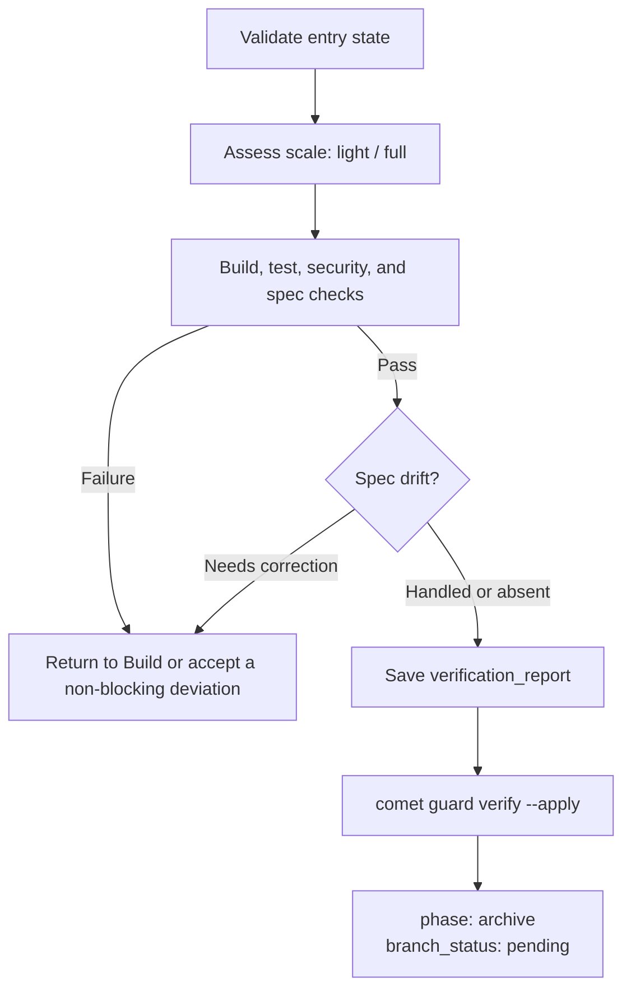

Verify confirms that implementation matches the Design Doc, OpenSpec specs, and task list, then saves the conclusions as reviewable evidence. It does not merge, push, discard, or otherwise handle the branch.

<Tip>
  Normally, invoke <code>/comet</code>. When project configuration selects Classic, the internal{' '}
  <code>/comet-classic</code> router sends a completed build to <code>/comet-verify</code>.
</Tip>

## Prerequisites

- Build is complete
- Every task in `tasks.md` is complete
- `isolation` and `bound_branch` match the current worktree
- Full workflow execution, TDD, and review modes are selected

## Flow



## Verification depth

Comet selects `light` or `full` from the task count, delta spec count, and changed-file count:

- **Light** checks task completion, change ownership, build, relevant tests, security, and the configured code review.
- **Full** adds proposal, OpenSpec design, Design Doc, acceptance-scenario, and spec-drift checks.

Full verification uses `openspec-verify-change` to check spec coverage. Code review follows `review_mode`, but branch delivery always remains in Archive.

## The invoked skill

| Skill                            | Purpose                                  | When it runs                                                                 |
| -------------------------------- | ---------------------------------------- | ---------------------------------------------------------------------------- |
| `verification-before-completion` | Evidence check before completion claims  | Loaded once before the light/full branch decision; cannot be skipped         |
| `requesting-code-review`         | Lightweight code review                  | The review item of light verification, run once when `review_mode` is `standard`/`thorough` |
| `openspec-verify-change`         | OpenSpec spec-coverage check             | Full verification mode; checks spec coverage of proposal, design, and acceptance scenarios |

When spec drift needs realignment, verify does not load `brainstorming` directly: it returns to Build through `verify-fail`, and the build stage loads it.

## Failure handling

- Objectively fixable build, test, security, or acceptance failures return to Build through `verify-fail`.
- WARNING and SUGGESTION findings ask the user only when accepting them involves a real tradeoff; the rationale is recorded in the verification report.
- CRITICAL and IMPORTANT findings cannot be waived.
- `verify-fail` preserves existing field values, but `branch_status` should remain `pending` throughout the normal Verify flow.

## Save verification evidence

After verification passes, record the report path:

```bash
comet state set <change-name> verification_report docs/superpowers/reports/YYYY-MM-DD-<name>-verify.md
```

Do not write `branch_status: handled` in Verify, and do not set `verify_result: pass` by hand.

Then run:

```bash
comet guard <change-name> verify --apply
```

The guard requires the report to exist, then advances to `phase: archive` and records `verify_result: pass` and `verified_at`. `branch_status` stays `pending`; Archive handles it after the user confirms immediate remote delivery.

## Spec drift

When full verification finds a mismatch between the delta spec and Design Doc, the user can:

- Record an Implementation Divergence in the Design Doc;
- Return to Build through `verify-fail` and realign design with implementation; or
- Accept a non-blocking deviation and let the main spec become the final authority during archive.

## Next steps

- [Archive phase](/en/phases/archive)
- [Decision points](/en/concepts/decision-points)
- [Code review modes](/en/concepts/review-mode)
- [State management](/en/concepts/state-management)
