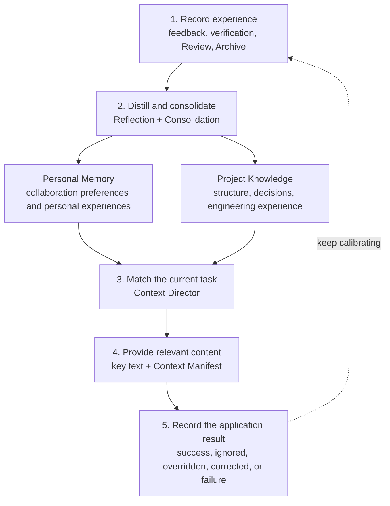

Agent Learning Loop is Comet's learning mechanism for Personal Memory and Project Knowledge. It turns user feedback, task results, and project evidence into reusable context and provides it to the Agent in later tasks as needed.

The two kinds of plugins store different content:

- **Personal Memory** keeps your language, expression, and collaboration preferences.
- **Project Knowledge** keeps project structure, design rationale, change relationships, and verified engineering experience.

## How common scenarios are handled

| Scenario | Handling |
| --- | --- |
| You explicitly ask to keep a preference long term | Save it as Personal Memory and record its owner and scope |
| Review or verification confirms a project pattern | Save a project record with its source and re-verification state |
| A source file changes | Mark the related records as pending re-check or invalid |
| A candidate is long | Provide the Context Manifest first and expand by record ID when needed |
| Plugin processing fails | Keep the current task, record the failure, and allow a later replay |

Comet's goal is a better starting point for the Agent. The current code, configuration, tests, and Runtime state remain the direct basis when you execute a task.

## Industry practice and Comet's trade-offs

Mainstream coding agents typically add cross-session context from three directions:

| Capability | Representative approach | Problem it solves | Boundary |
| --- | --- | --- | --- |
| Project instructions | Rule carriers supported by each platform, such as Codex `AGENTS.md`, Claude Code `CLAUDE.md`, and Cursor Rules | Keep providing the behavioral requirements the team wrote down explicitly | Relies on manual maintenance; natural-language instructions cannot do deterministic checks |
| Automatic memory | Claude Code Auto Memory, earlier Cursor Memories schemes, GitHub Copilot Memory | Keep user preferences and historical collaboration information | Needs a clear owner, scope, correction path, and invalidation conditions |
| Project knowledge | Qoder Knowledge Engine, code indexes, and repository knowledge layers | Understand project structure, engineering conventions, and cross-file relationships | Search results must be verified back against the current repository |

[Claude Code](https://code.claude.com/docs/en/memory) separates the hand-maintained `CLAUDE.md` from automatically formed memory; [GitHub Copilot Memory](https://docs.github.com/en/copilot/concepts/agents/copilot-memory) separates repository facts from user preferences; [Cursor Rules](https://cursor.com/docs/rules) controls instruction loading by path and relevance; [Qoder Knowledge Engine](https://qoder.com/en/blog/qoder-knowledge-engine) organizes project understanding into an agent-facing knowledge layer.

Each long-lived record keeps an owner, source, scope, source status, and application result, so you can view, correct, and trace why a record entered a task.

## Responsibility layers

| Layer | Core responsibility | Typical content | Owner or executor |
| --- | --- | --- | --- |
| Personal Memory | Describe the way you prefer to collaborate | Language, expression, personal working habits, reusable experiences | The current user |
| Project Knowledge | Describe project structure, design rationale, and engineering experience | Modules, dependencies, decisions, processes, constraints, failure resolutions | The current project |
| Rule / Agent instructions | Prescribe how the Agent behaves in scope | Rule files or rule directories supported by the target platform | The repository or platform |
| Hook / checks | Observe, block, or verify engineering constraints | Hooks, linter, test, build, CI | The execution environment |

> Project Knowledge helps the Agent understand the project, Rule provides team instructions, and Hook and engineering checks enforce constraints deterministically.

## Key concepts

| Concept | Product meaning |
| --- | --- |
| Experience | A compact record of one piece of user feedback, task result, or verification result |
| Reflection | Identifying conclusions of long-term value from experience records |
| Consolidation | Merging similar content, adding evidence, and retiring invalid records |
| Provider | The unified interface that saves and queries Personal Memory or Project Knowledge |
| Context Director | Selecting relevant content based on the current project, path, task, and phase |
| Context Manifest | A slim index of summaries, application reasons, and stable IDs that supports expanding details on demand |

## From experience to task context

### 1. Record experiences with a clear scope

Classic, Native, Hotfix, and Tweak hand structured events to the same learning channel. Valid signals include:

- An explicit request to remember, correct, or forget;
- The actual result after a task completes;
- A verification that succeeded or failed;
- Processed Review conclusions;
- Faults whose root cause was confirmed, fixed, and re-verified;
- The final decisions after a change is archived;
- The result after a piece of context was applied.

An Experience keeps only the context, action summary, result, and evidence references. Full conversations, full diffs, raw logs, tool output, and hidden reasoning never enter long-term records.

### 2. Distill reusable conclusions

Explicit long-term requests take effect through fixed rules right away. For example, after you say "answer in Chinese by default from now on", Personal Memory can apply it immediately.

Experiences that need semantic induction are processed by Reflection in the background. For example, when a Review confirms that a certain type of change must also update the registry, the system checks whether the conclusion was accepted, whether the change was completed, and whether verification passed, and only then decides whether to form a project policy.

Consolidation merges similar content, adds new evidence, tightens the scope, and keeps invalid records out of later tasks.

### 3. Match the current task

Context Director filters candidates by the current project, path, task, operation, and phase. Key profiles and a few verified policies can be provided in full; other relevant content enters the Context Manifest.

Each Manifest item contains a stable ID, title, source type, and `whyApplied`. `whyApplied` states which concrete condition the content matched in the current task. When the Agent needs the full text, source, or verification method, it expands the item by stable ID.

### 4. Record application results

After content enters a task, Comet records one of these results:

| Result | Meaning |
| --- | --- |
| `used-successfully` | The content helped complete the task |
| `ignored` | The content was provided but not used this time |
| `overridden` | The content was overridden by a higher-priority requirement |
| `corrected` | The content needs correction or replacement |
| `contributed-to-failure` | The content took part in causing a failure |

Application results affect later ranking, status promotion, content rewriting, or replacement. Comet tracks both matching relevance and real task value.

## Evidence and lifecycle

Automatically formed content must be verified and reused before it can get a higher priority. Comet keeps these states for a record:

| State | Product meaning |
| --- | --- |
| `trial` | Has preliminary grounds and joins related tasks at lower priority |
| `proven` | Comes from an explicit request, a directly checkable fact, or stable content reused successfully |
| `enforced` | Bound to a currently existing, successfully executed deterministic verification; Project Policies only |
| `superseded` | Was corrected, lost its source, or was replaced by higher-priority content |

Forgetting writes an independent tombstone. When Comet replays historical events it recognizes the tombstone, so forgotten content never takes effect again.

## Failure isolation

Add, correct, forget, and expand are operations the user is waiting on. When one fails, Comet returns the real error and keeps the original state.

When background capture, Reflection, retrieval, or a Learner fails, Comet records the diagnostic and continues the current workflow. Personal Memory and Project Knowledge use separate Providers, storage, and scopes, so one plugin's failure never interrupts the other kind of long-term context.

## Product boundaries

Agent Learning Loop produces viewable, correctable, traceable external context. It does not train or fine-tune the model, and it respects these boundaries:

- Never saves full chats, full task traces, or hidden reasoning;
- Never publishes personal project habits as team knowledge automatically;
- Never overwrites `AGENTS.md`, Rule, Skill, or project configuration;
- Never auto-generates linter, test, build, or CI configuration for an unknown stack;
- Never expands permissions for operations such as commit, push, delete, and publish.

## Further reading

- [Personal Memory: Keeping collaboration preferences effective](/en/plugins/personal-memory)
- [Personal Memory Principles: From user signals to task context](/en/plugins/personal-memory-principles)
- [Project Knowledge: Accumulating reusable project understanding in tasks](/en/plugins/project-rules)
- [Project Knowledge Principles: From project evidence to task context](/en/plugins/project-knowledge-principles)
