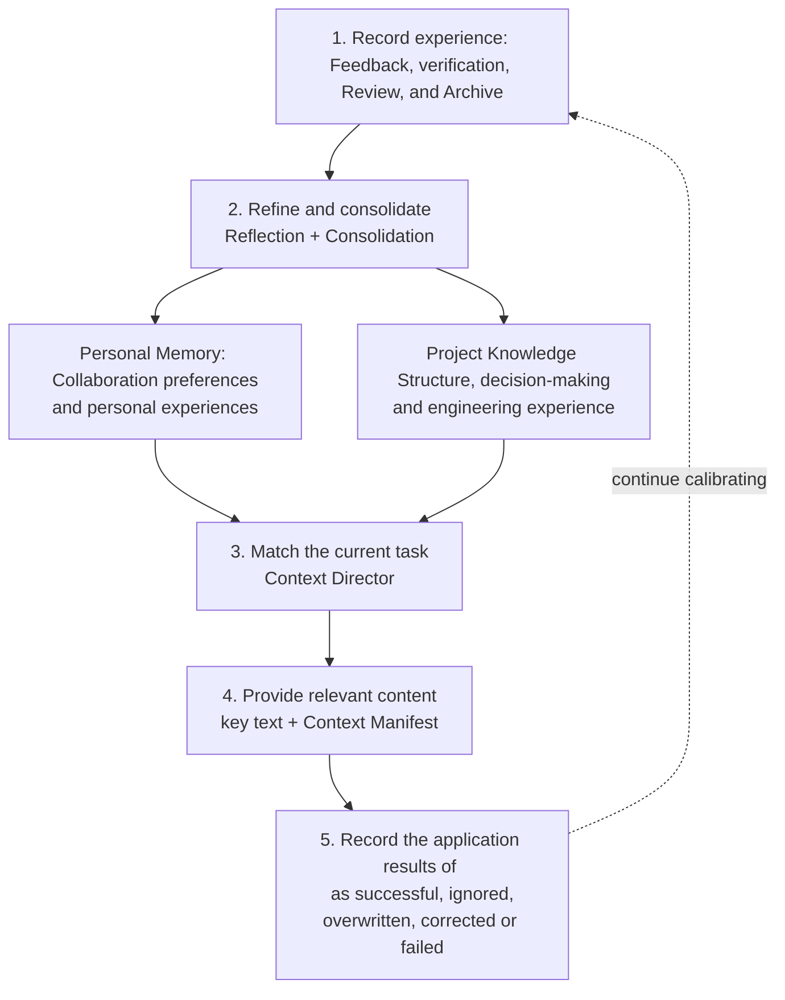

The Agent Learning Loop is a shared learning mechanism provided by Comet for Personal Memory and Project Knowledge. It organizes user feedback, task results and project evidence into reusable contexts and provides them to the Agent as needed in subsequent tasks.

This mechanism addresses two types of cross-task continuity problems:

- ** Personal Memory ** retains your language, expression and collaboration preferences;
- ** Project Knowledge ** Retain the project structure, design basis, modification relationships and verified engineering experience.

The Agent Learning Loop is the underlying mechanism of two types of plugins. You can use it through your Personal Memory and Project Knowledge without installing a third learning plugin.

## Core value

|Common costs|The processing method of Comet|The resulting outcome|
| -------------------------------- | -------------------------------------- | ---------------------------------- |
|Repeat the collaboration preferences for each task|Save stable preferences as personal memories|The Agent can quickly enter the collaboration mode that suits your habits|
|The Agent re-explores the project from the directory and keywords|Organize structure, dependencies and decisions into Project Knowledge|Locate the entry point and related modules earlier|
|The scope of the changes will only be completed during the Review stage|Retain the verified modification relationships, processes and troubleshooting methods|Configuration, testing and products can be checked during the planning stage|
|The old conclusion continues to influence the current task|Record the source version, scope of application and life cycle|Check the current project status before use|
|Historical content fills the context|First, provide a concise list. When necessary, expand on the main text and evidence|Leave the context budget to the current task|

The goal of Comet is to provide Agents with a better starting point for tasks. The current code, configuration, test and Runtime status still serve as the direct basis for task execution.

## The trade-off between industry practice and Comet

Mainstream Coding agents typically supplement cross-session contexts from three directions:

|Ability|Representative practices|Problems suitable for solving|Use boundaries|
| -------- | ----------------------------------------------------------------------------------- | ---------------------------------- | ---------------------------------------------- |
|Project Instruction|Rule carriers supported by various platforms, such as Codex `AGENTS.md`, Claude Code `CLAUDE.md`, and Cursor Rules|Continuously provide the behavioral requirements clearly written down by the team|Rely on manual maintenance; Natural language instructions do not have the ability of deterministic checking|
|"Automatic memory"|Claude Code Auto Memory, Cursor Memories History Scheme, GitHub Copilot Memory|Retain user preferences and historical collaboration information|It is necessary to clearly define the owner, scope, correction method and failure conditions|
|Project Knowledge|Qoder Knowledge Engine, code index and repository knowledge layer|Understand the project structure, engineering conventions and cross-file relationships|The search results need to be verified in the current warehouse|

[Claude Code](https://code.claude.com/docs/en/memory) distinguishes manually maintained `CLAUDE.md` from automatically formed memories; [GitHub Copilot Memory](https://docs.github.com/en/copilot/concepts/agents/copilot-memory) distinguishes repository facts from user preferences; [Cursor Rules](https://cursor.com/docs/rules) loads control instructions through paths and correlations; [Qoder Knowledge Engine](https://qoder.com/en/blog/qoder-knowledge-engine) organizes project understanding into an agent-oriented knowledge layer

Comet continues these hierarchical principles and incorporates five governance pieces of information into the same chain: ** Owner, source, scope of application, source status, and application results **. This enables long-term context to be viewed, corrected and tracked, and also facilitates the location of why a piece of content enters the current task.

## Responsibility stratification in the long-term context

|layer|Core responsibilities|Typical content|Owner or executor|
| ----------------- | -------------------------------- | -------------------------------------- | -------------- |
|Personal Memory|Describe your preferred way of collaboration|Language, expression, personal working habits and reusable experiences|Current User|
|Project Knowledge|Describe the project structure, design basis and engineering experience|Modules, dependencies, decisions, processes, constraints, and troubleshooting methods|Current project|
|Rule/Agent instructions|Specify the behavior of the Agent within the current scope|The Rule file or rule directory supported by the target platform|Warehouse or host|
|Hook/Check|Observe, block or verify deterministic engineering boundaries| Hook、linter、test、build、CI          |Execution environment|

> Project Knowledge helps agents understand the project, rules provide team instructions, hooks and engineering checks are responsible for executing the boundaries of determinable judgments.

## Key concept

|Concept|Product meaning|
| -------------------------------- | -------------------------------------------------------- |
|Experience (Experience Record|A compact record of a single user feedback, task result or verification result|
|"Reflection (Experience Refinement|Identify conclusions of long-term value from empirical records|
|Consolidation|Merge synonyms, supplement evidence and handle invalid records|
|Provider (Data provider|A unified interface for saving and querying personal memories or Project Knowledge|
|Context Director|Select relevant content based on the current project, path, task and stage|
|Context Manifest|A streamlined index including summaries, application reasons, and stable ids, supporting on-demand expansion of details|

## From experience to task context

### 1. Record experiences with a clear scope

Classic, Native, Hotfix and Tweak hand over structured events to the same learning channel. Effective signals include:

- The user explicitly requests to remember, correct or forget.
- The actual result after the task is completed;
- Verification of success or failure;
- Processed Review conclusions;
- Faults that have completed root cause confirmation, repair and re-inspection;
- Change the final decision after archiving;
- The result after a certain context is applied.

Experience only retains context, action summaries, results, and evidence references. Complete conversations, complete diffs, original logs, tool outputs, and hidden reasoning do not enter the long-term record.

### 2. Extract reusable conclusions

Clear long-term requirements follow a definite path. For instance, if you propose "I will answer in Chinese by default from now on", your Personal Memory can take effect immediately.

Experiences that require semantic induction are processed in the background by Reflection. For instance, after the Review confirms that a certain type of modification must be updated synchronously in the registry, the system will check whether the conclusion has been accepted, whether the modification has been completed, and whether the verification has been successful, and then decide whether to form a project strategy.

Consolidation is responsible for consolidating synonyms, supplementing new evidence, tightening the scope of application, and removing invalid records from subsequent tasks.

### 3. Match the current task

The Context Director screens candidates based on the current project, path, task, operation and stage. The key portraits and a few verified strategies can be fully provided, and other relevant contents enter the Context Manifest.

Each Manifest item contains a stable ID, title, source type, and `whyApplied`. `whyApplied` indicates the specific conditions under which this content hits the current task. When the Agent requires the complete text, source or verification method, it will be expanded according to the stable ID.

### 4. Continuously calibrate with the application results

After the content enters the task, Comet records the following results:

|Result|Meaning|
| ------------------------ | ------------------------ |
| `used-successfully`      |The content has helped complete the task|
| `ignored`                |The content has been provided, but it was not used this time|
| `overridden`             |The content is covered by higher-priority requirements|
| `corrected`              |The content needs to be corrected or replaced|
| `contributed-to-failure` |Content participation led to failure|

The application results will affect subsequent sorting, status promotion, content rewriting or substitution. Comet pays attention to both matching relevance and actual task performance simultaneously.

## Evidence and life cycle

Automatically generated content needs to be verified and reused to gain higher authority. Comet retains the following states for records:

|"Status"|Product meaning|
| ------------ | ---------------------------------------------------- |
| `trial`      |Have a preliminary basis and participate in relevant tasks with a lower priority|
| `proven`     |Stable content from clear requirements, definite facts or successful reuse|
| `enforced`   |The currently existing and successfully executed deterministic validations have been associated and are only used for project policies|
| `superseded` |It has been corrected, the source is invalid, or it has been replaced by higher-priority content|

The forget operation uses an independent tombstone (forget marker). When the system replays historical events, it will recognize this tag to prevent forgotten content from re-taking effect.

## Failure isolation

Explicitly add, correct, forget and expand the operations that the user is waiting for. When an operation fails, Comet returns an actual error and maintains the original state.

When the background collection, Reflection, retrieval or a certain Learner fails, Comet records the diagnosis and continues the current workflow. Personal Memory and Project Knowledge use separate Providers, storage, and scopes. A single plugin failure will not interrupt another type of long-term context.

## Product boundary

The Agent Learning Loop forms an external context that is visible, correctable and traceable. It does not train or fine-tune the model and adheres to the following boundaries

- Not saving the complete chat, complete task trajectory or hiding reasoning;
- Do not automatically publish personal project habits as team knowledge;
- Do not cover `AGENTS.md`, Rule, Skill or project configuration;
- Do not automatically generate linter, test, build or CI configurations for unknown technology stacks;
- Do not expand the operation permissions such as submission, push, deletion and publication.

## Follow-up Reading

- Personal Memory: Keep Collaboration Preferences in effect ](/en/plugins/personal-memory)
- Personal Memory principle: From user signals to task context ](/en/plugins/personal-memory-principles)
- Project Knowledge: Accumulate reusable project understanding in tasks ](/en/plugins/project-rules)
- Project Knowledge principle: From project evidence to Task context ](/en/plugins/project-knowledge-principles)
