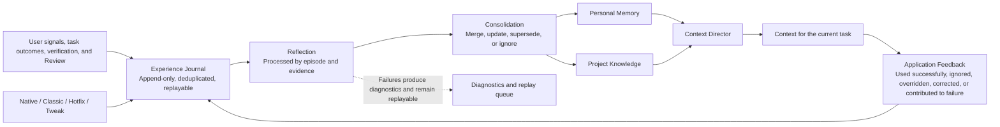

Agent Learning Loop is Comet's deterministic process for handling work experience. It receives user signals, workflow outcomes, verification results, Review conclusions, and Archive outcomes, then routes the parts with long-term reuse value to Personal Memory or Project Knowledge.

It is not model training, and it does not store complete conversations. Task logs, tool output, full diffs, hidden reasoning, and ordinary facts that can be rediscovered from the repository are not learning content.

## What problem it solves

When a collaboration pattern exists only in one conversation, you must explain it again in the next task. Fully automatic storage creates the opposite problem by mixing temporary requests, incidental errors, and project facts. Agent Learning Loop separates these concerns: it first records bounded experience, then uses evidence to decide whether that experience should become reusable.

For example, an explicit request to "respond in Chinese from now on" is a direct signal that can be written immediately to Personal Memory. If a Review finds that a file type requires a specific check, the repair and a successful rerun are needed before that lesson can become Project Policy. A command used temporarily in one task does not become a long-term rule just because it was recorded.

## What you can see

- Explicit remember, correct, and forget operations return results immediately.
- After a workflow finishes, background processing can consolidate successful, corrected, and failed experiences without blocking the current task.
- The next task receives only content related to its project, path, operation, and phase.
- When relevant content is too long, the Agent first receives summaries and stable IDs, then expands full content only when needed.
- You can inspect an experience's source, application reason, and latest application result in the corresponding Dashboard.
- If learning or semantic Reflection fails, the current Native, Classic, Hotfix, or Tweak workflow continues and retains diagnostics for later processing.

## How an experience flows



<p align="center">
  <a
    href="/assets/agent-learning-loop-illustrations/02-experience-loop-readable.png"
    target="_blank"
    rel="noreferrer"
    title="View the original image"
  >
    
  </a>
</p>

## Internal mechanics

### 1. Runtime records events first

Workflow Runtime carries experience through versioned `comet.agent-experience.v1` events. Each event contains stable event and episode IDs, scope, project identity, task context, user signals, minimal evidence, and an outcome. Retries are deduplicated by ID. Events from the same episode can be merged across recovery, reverification, and cross-session continuation.

Experience Journal is append-only state. It performs a fast write first, then lets Reflection handle slower semantic consolidation. Personal Memory and Project Knowledge share the event entry point but use separate record formats, storage, and retrieval rules. They do not copy records into each other.

### 2. Reflection produces candidate changes only

Reflection outputs a structured Learning Delta with `create`, `update`, `supersede`, `forget`, and `noop` actions. Every action includes record ownership, applicability scope, and evidence. Large inputs are processed in batches by episode and evidence, so a long Review Packet does not cause valid events to be discarded.

When a semantic service is unavailable, explicit user signals, deterministic project facts, and real verification outcomes can still follow deterministic paths. Content that requires semantic generalization remains in the pending queue.

### 3. Records have an explicit lifecycle

| State        | Meaning                                                                                     |
| ------------ | ------------------------------------------------------------------------------------------- |
| `trial`      | An evidence-backed inference that may be used at low priority but lacks reuse evidence      |
| `proven`     | Stable content supported by explicit confirmation, deterministic facts, or successful reuse |
| `enforced`   | A Project Policy bound to a deterministic verification entry point that currently succeeds  |
| `superseded` | Content whose source is stale, corrected, or replaced by higher-priority content             |

Forgetting creates a separate tombstone, preventing replayed historical events from restoring a record that was already forgotten.

## Control the scope

Project configuration independently controls whether Personal Memory learns and whether it is injected into task context:

```yaml
memory:
  learning: true
  retrieval: true
```

Disabling `learning` does not delete existing records. Disabling `retrieval` does not affect management operations in the Dashboard. Project Knowledge uses its own Provider configuration; see [Project rules](/en/plugins/project-rules).

Current user requests and system constraints always take priority over learned content. Personal Memory cannot authorize commits, pushes, deletion, or publishing. Project Policy does not silently rewrite repository `AGENTS.md`, Rule, configuration, test, or check files.

## What belongs in memory

- Long-term language, communication, and output preferences explicitly confirmed by the user.
- Project decisions, procedures, or failure resolutions with clear sources and successful reverification.
- Collaboration experience that appears consistently across tasks and remains useful for future work.

One-off task requirements, temporary debugging output, complete sessions, full diffs, hidden model reasoning, and ordinary facts directly readable from the current repository do not belong in memory.

Continue with [Personal Memory](/en/plugins/personal-memory), [Project rules](/en/plugins/project-rules), and [Native workflow](/en/concepts/native-workflow).
