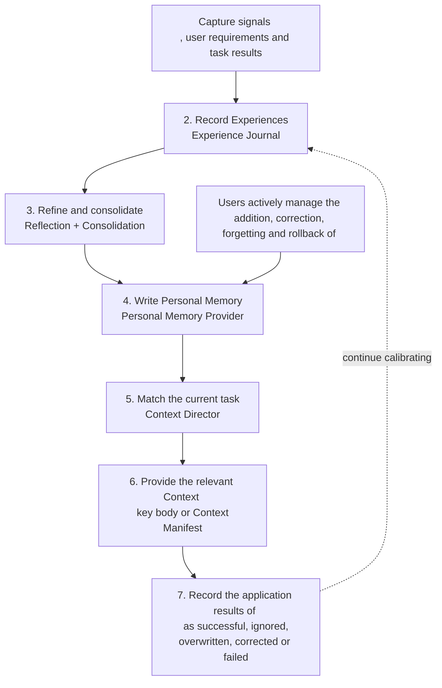

Personal Memory converts the long-term requirements explicitly expressed by users and reusable collaborative experiences into standardized records. Each record retains its owner, scope, applicable conditions, source and life cycle. The system only provides it in the relevant task.

This design simultaneously meets four product requirements: traceable records, correctable content, contextual boundaries, and plugin failures not blocking current work.

## Core component

|Component|Duties|
| -------------------------------- | --------------------------------------------------------- |
|Experience Journal|Add records of user signals, task results and application feedback, and support deduplication and failure replay|
|"Reflection (Experience Refinement|Identify preferences, strategies or experiences with long-term value from structured events|
|Consolidation|Merge near-meaning records, supplement evidence, tighten the scope of application and handle invalid versions|
| Personal Memory Provider         |Save and query standardized personal memories, and provide a unified contract for Local and Remote|
|Context Director|Filter, sort and control the resident context based on the current task|
|Context Manifest|Provide summaries, application reasons, and stable ids for the Agent to expand the complete content as needed|

## Data path



Synchronous management and background learning remain separated in this path:

- When the user explicitly adds, corrects or forgets, the Provider immediately performs deterministic operations.
- When semantic induction is required for the task results, Journal first records the events, and then Reflection processes them in the background.
- The Context Director only selects the content required by the current task and does not modify the record body.
- The application results are re-entered into the Journal for subsequent sorting and lifecycle updates.

## "Record model"

Personal Memory Record consists of the main text and governance information together:

|Field|Product function|
| ------------- | ----------------------------------------------------------- |
|Stable ID|Supports unfolding, correcting, forgetting, rolling back and historical tracking|
| `scope`       |Distinguish between global user memory and project scope memory|
| `projectKey`  |Bind the project scope records to a stable project identity|
| `memoryType`  |Distinguish between Core Profile, Collaboration Policy and Personal Episode|
| `memoryClass` |Mark user facts, user preferences, collaboration habits or personal project agreements|
| selectors     |Define the applicable paths, tasks, operations and stages|
| `authority`   |Distinguish between user explicit Settings and system inferences|
| evidence      |Retain the minimum evidence necessary for the formation or correction of records|
| lifecycle     |Represents `trial`, `proven` or `superseded`|
| application   |Record the reasons for the most recent application and the actual results|

The Provider saves the normalized machine state for joint reading and writing by the CLI, Dashboard, Skill, and Hook. User-readable Markdown is used for viewing and management, and can also serve as the input for rebuilding after index corruption.

## Record formation path

### User's explicit Settings

`user.signal` indicates long-term preferences, corrections or forgetfulness voluntarily proposed by users. The coordinator first writes the event into the Journal and then synchronously completes the deterministic processing.

Clear long-term requirements can be directly accessed at `proven`, as current users are the authoritative source of such content. The system will also recognize one-off expressions, such as "Do not submit this time". This requirement continues to constrain the current task but is not written into long-term memory.

### System inference candidate

The results of task completion, verification, Review and contextual application can form inferred candidates. Reflection converts the relevant Personal episodes into Learning Delta (memory change instructions) :

|Operation|Meaning|
| ----------- | -------------------------------- |
| `create`    |Create a new record|
| `update`    |Supplement evidence or tighten the scope of application of existing records|
| `supersede` |Stop using conflicting or invalid old records|
| `forget`    |Carry out the forgetting explicitly proposed by the user|
| `noop`      |The current evidence is insufficient and does not form long-term content|

Consolidate near-meaning records, retain more specific selectors (applicable conditions), and link new evidence to existing records. The system's inferred content initially enters `trial` and participates in related tasks with a lower priority. After one successful application, you can be promoted to `proven`.

## The responsibilities of Experience Journal

Experience Journal is an append, replayable machine event log that undertakes three responsibilities:

1. Use stable `eventId` for deduplication to avoid repeated learning caused by retries.
2. Use `episodeId` to associate the events generated for recovery, verification, and cross-session continuation;
3. Retain the replay capability after a failed Reflection in the background and do not block the current workflow.

The Journal saves structured contexts and evidence citations, but does not save complete transcripts, complete Diffs, original logs, or hidden reasoning. Old Personal episodes that have completed Consolidation can be compressed, and records still in use will retain the necessary chain of evidence.

## Task matching

The Provider first returns the available candidates, and the Context Director then performs hierarchical matching according to the current request:

```text
project → path → task → operation → phase
```

The sorting takes into account the following factors simultaneously:

- The priority of `proven` is higher than that of `trial`.
- The priority explicitly set by the user is higher than that inferred by the system.
- The priority of precise project and path Selectors is higher than that of broad global content.
- Recent successful applications will improve subsequent sorting.
- Correcting or participating in failure will lower the ranking and trigger subsequent Reflection.
- The `superseded` record does not enter the task context.

The current user requirements, system constraints and project strategies always have a higher priority. Personal Memory only provides a collaborative context and does not change the boundaries of authorization.

## Progressive context

Comet uses a hierarchical provisioning approach to control resident contexts:

1. The key Core Profile can be fully integrated into the context;
2. A small number of directly related stable Collaboration policies can be fully integrated into the context;
3. Other relevant candidates enter the Context Manifest first;
4. The Agent expands the required text, source and verification information through a stable ID.

The Context Manifest is a streamlined index. It provides each candidate with a title, abstract, stable ID and `whyApplied`. `whyApplied` comes from actual matching conditions, such as "Current Project Match", "Current Path Match", "User Explicit Settings", or "Recently Applied Successfully".

The character budget is only limited to the resident text in one task. A successfully saved record will only appear in the context or Manifest when the current condition is hit.

## Application feedback

When the Context Director provides a record, an application record is created. After the task is completed, the following results can be written:

|Result|Subsequent impact|
| ------------------------ | -------------------------------- |
| `used-successfully`      |By enhancing the reusability, `trial` can be promoted|
| `ignored`                |Minor impact on sorting does not directly determine content error|
| `overridden`             |The record was overwritten by a higher-priority requirement this time|
| `corrected`              |Trigger correction or substitution|
| `contributed-to-failure` |Reduce the reuse intensity and trigger re-refinement|

The retrieval hit rate is used to measure relevance, and the application results are used to measure the actual task value. The two types of information jointly determine the subsequent sorting and life cycle.

## Correction, forgetting and replay

The correction operation creates an updated normalized record and marks the conflicting old version as `superseded`. The system's inferred content cannot cover the main text explicitly set by the user.

Forget operations are written into tombstone (forget mark). This tag is saved separately from the lifecycle, allowing the content that the user has withdrawn to still be recognized when historical events are replayed.

`forget` retains the rollback capability by default. `--permanent` performs permanent deletion. When an explicit operation fails, the Provider remains in its original state and returns an actual error.

## Local and Remote Provider

The Personal Memory domain accesses the Provider through the unified `status/query/apply` contract.

### Local Provider

- Retain user-readable `profile.md` and project projections;
- Machine indexes can be rebuilt after an upgrade or damage.
- Identify the same repository using a stable repository identity;
- The main workspace and linked worktree share project-wide Personal Memory;
- Different warehouses are isolated from each other.

### Remote Provider

- Use the same versioned Provider contract as Local;
- Tokens are only provided through environment variables;
- After enabling Remote configuration, Local will no longer be read simultaneously.
- When Remote fails, it returns the actual state and does not read Local data.

Project configuration can separately control automatic learning and task retrieval:

```yaml
memory:
  learning: true
  retrieval: true
```

Closing `learning` will stop the formation of new records and retain existing data. Turning off `retrieval` will stop providing memory to tasks, but Dashboard and explicit management operations remain available.

## Failure isolation

|Failure position|Product behavior|
| -------------------------- | ------------------------------------------ |
|Explicitly add, correct, forget, roll back|Return the actual error and maintain the original state|
|Journal Back-end processing|Record the diagnosis and retain the ability to replay it later|
|Semantic Reflection|It is clear that the user signal continues along a deterministic path, and the inference task is postponed|
|Task retrieval|The current workflow continues and no failed content is provided|
|The Personal Memory plugin is disabled|Stop learning and retrieving, and continue with other workflows and Project Knowledge|

## Recall diagnosis

When diagnosing memory usage once, check the three links in sequence:

1. ** Save Status ** : View records using `comet memory list .` or Dashboard;
2. ** Matching Conditions ** : Check scope, project, path, operation and phase;
3. ** application Basis ** : View `whyApplied`, delivery and application outcome.

```bash
comet memory status .
comet memory retrieve . --task "Modify the authentication module"
comet task . --task "Modify the authentication module" --path src/auth --phase build --json
```

Return to [Personal Memory ](/en/plugins/personal-memory), or continue reading [Agent Learning Loop](/en/plugins/agent-learning-loop).
