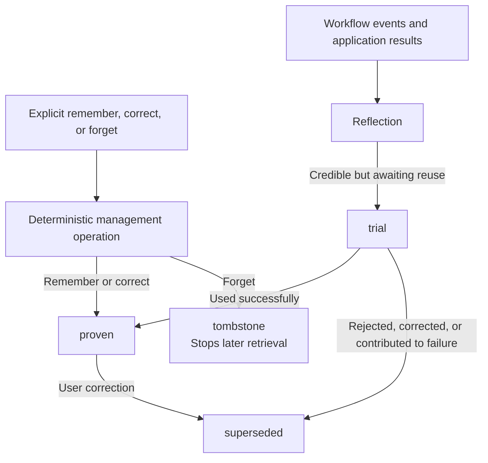
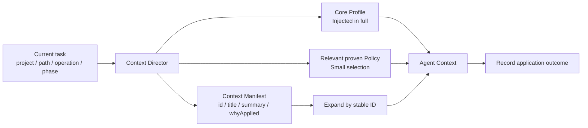

Personal Memory is Comet's first-party user-level plugin. It stores user preferences and personal collaboration patterns that remain useful in future tasks. It does not store shared repository facts or automatically turn personal preferences into team rules.

You can disable or uninstall Personal Memory independently. If the plugin is unavailable, Native, Classic, Hotfix, and Tweak continue through their existing workflows.

## Three kinds of content

| Type                 | Stored content                                                      | Typical scope                    |
| -------------------- | ------------------------------------------------------------------- | -------------------------------- |
| Core Profile         | Language, role, technical background, communication, output preferences | Global or user-level          |
| Collaboration Policy | How one person works in a particular project, path, operation, or phase | Project, path, or task conditions |
| Personal Episode     | A compact record of one success, correction, or failure             | Background reflection or expansion on demand |

A Personal Episode retains only necessary fields such as `situation`, `action summary`, `outcome`, and `lesson`. It does not store a complete conversation or tool log.

## Explicit requests and inferred experience

When you explicitly say "remember this" or "do this from now on," directly correct existing content, or explicitly ask to forget something, the operation takes effect immediately. These records can enter `proven` directly.

Requests limited to "this time" or "the current task" are not written to long-term memory. Reusable experience inferred from repeated work outcomes enters `trial` first and can advance to `proven` after successful use. Content that is rejected, corrected, or contributes to failure is rewritten or marked `superseded`.



<p align="center">
  
</p>

## How agents use it

At task start, Context Director filters records by project identity, task, path, operation, and phase. The complete Core Profile and a small number of directly relevant `proven` collaboration policies can remain in context. Other records first appear in a Context Manifest.

Each Manifest item contains a stable ID, title, summary, source type, and truthful `whyApplied`. When an Agent needs full content, its source, or its verification method, it expands the item by ID. This supplies the task with necessary information without loading all historical records into context at once.



If the task path, operation, or phase changes within the same session, the system selects context again without redelivering unchanged content. Application outcomes distinguish at least `used-successfully`, `ignored`, `overridden`, `corrected`, and `contributed-to-failure`. These outcomes affect later ranking and lifecycle transitions.

## CLI management

The CLI, Dashboard, Skill, and Hook use the same Personal Memory state. Common operations include:

```bash
comet memory list .
comet memory retrieve . --task "Implement a new CLI command"
comet memory remember . --text "Respond in Chinese by default" --scope global
comet memory correct . --id <memory-id> --text "Use concise Chinese responses instead"
comet memory forget . --id <memory-id>
comet memory rollback . --id <memory-id>
comet memory status .
```

Use `remember` when the user explicitly asks to store something long term. Use `observe` only for stable collaboration patterns discovered by an Agent, not for task summaries, progress, command output, or test results. `forget` retains rollback capability by default. Permanent deletion requires the explicit `--permanent` option.

## Provider, configuration, and storage

Personal Memory can use a Local Provider or a Remote Provider. Exactly one is active at a time. A failed Remote request never falls back silently to Local.

Project-level configuration controls automatic learning and retrieval:

```yaml
memory:
  learning: true
  retrieval: true
```

User-level configuration selects the Provider and sets the per-task injection budget:

```yaml
personal_memory:
  provider: local
  profile_char_limit: 2000
  task_context_char_limit: 6000
```

Character budgets limit only the amount of full text resident in one Agent Context. Relevant content beyond the budget enters the Manifest. It is not rejected during storage, used to truncate authoritative records, or treated as the total memory capacity.

The Local Provider keeps a readable `profile.md` and project projections. Machine state can be rebuilt during upgrades. A main workspace and linked worktrees from the same repository share a stable project identity, while different repositories remain isolated. The Remote Provider transmits only bounded requests through a fixed protocol, with tokens stored in environment variables.

## Priority and boundaries

Current user requests and system constraints always take priority over Personal Memory. A more specific project or path selector takes priority over broad global content. Explicit content takes priority over automatic inference. Project Policy takes priority over personal project habits.

Personal Memory does not write to Project Knowledge automatically, modify project rules, or commit, push, delete, or publish on the user's behalf. Explicit remember, correct, forget, rollback, and configuration failures return real errors and leave the previous state unchanged. Background collection, Reflection, feedback, or retrieval failures record diagnostics while the current workflow continues.

In the Dashboard's Plugin hub, you can inspect record state, source summaries, application reasons, recent application outcomes, and complete history. You can also remember, correct, forget, roll back, and expand content on demand.

Continue with [Agent Learning Loop](/en/plugins/agent-learning-loop), [Project rules](/en/plugins/project-rules), and [Dashboard overview](/en/dashboard/overview).
