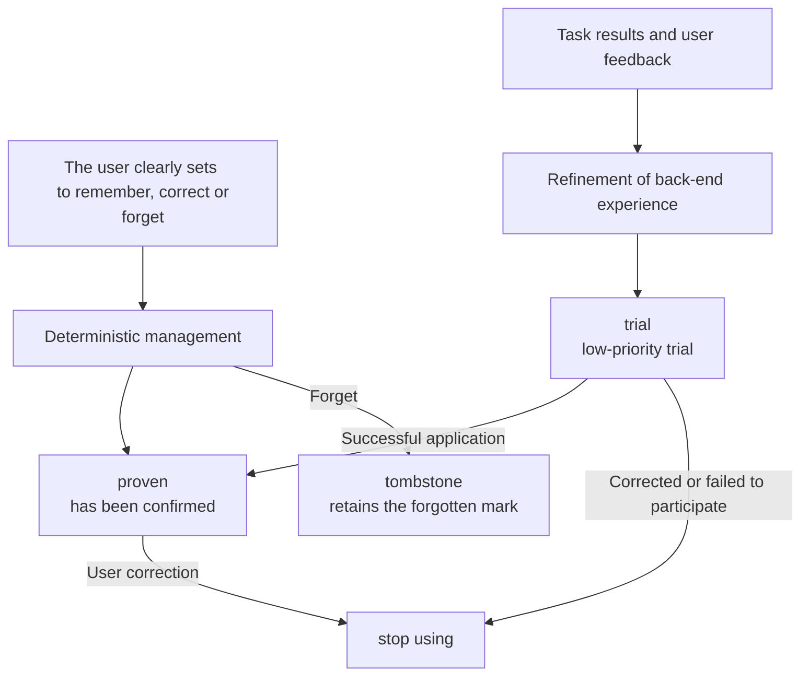

Personal Memory is a first-party user-level plugin of Comet. It saves the collaboration preferences you wish to use for a long time and provides them to the Agent in related tasks. Language, expression methods, verification habits and delivery requirements can all be carried over across tasks without the need to repeat them in each session.

Personal Memory belongs to the current user. You can make a record effective in all projects or limit it to a specific project.

## Content suitable for preservation

|The content you expressed|The processing method of Comet|Basis for judgment|
| -------------------------------- | ---------------------------- | ------------------------------------ |
|"From now on, I will answer in Chinese by default."|Save as global Personal Memory|This is a stable expression preference across tasks and projects|
|Run the minimum correlation test first in this warehouse.|Save as a personal collaboration policy for the project scope|This is your working habit in the current project|
|"Don't submit it this time."|It only works on the current request|A one-time granted permission should not be extended to long-term default behavior|
|"`domains` cannot directly access the file system.|Entrust it to Project Knowledge or warehouse rules|This is a project constraint shared by the team|

This classification retains the ownership of the content: personal habits within the project scope still belong to you; Team knowledge sharing requires project evidence or clear sharing operations.

## Product positioning

New Agent sessions usually start from a new context window. Personal Memory provides a layer of user context independent of the conversation history, focusing on managing four types of information:

- "Ownership" : The record belongs to the current user;
- ** Scope ** : The record takes effect globally or within a specified project;
- ** Authority level ** : Distinguish between user explicit Settings and system inferences;
- ** Life Cycle ** : Supports trial, confirmation, correction, forgetting and rollback.

[Claude Code Auto Memory](https://code.claude.com/docs/en/memory) records build commands, debugging experiences and user preferences; Cursor's [Memories historical data ](https://docs.cursor.com/en/context/memories) records schemes for forming project-wide memory from conversations; [GitHub Copilot Memory](https://docs.github.com/en/copilot/concepts/agents/copilot-memory) distinguishes between source-level facts and user-level preferences

Comet adds traceable governance on top of cross-session memory. You can check the source, scope of application, current status, reason for application and recent results of a memory, and you can also directly correct or forget it.

## Three types of personal memories

### Core Profile: Stable user profile

Core Profile saves long-term valid information across tasks:

- Language and expression preferences;
- Character and technical background;
- Output format and evidence habits;
- Stable communication boundaries.

These contents usually do not rely on specific files or workflow stages. At the beginning of the task, a few key portraits can directly enter the context.

### Collaboration Policy: A conditional collaboration strategy

The Collaboration Policy describes the way you want the Agent to work under specific conditions:

- In a certain project, prioritize the execution of minimal correlation tests;
- Before modifying the specified path, check the synchronization range of the products.
- List reproducible issues by severity during the Review.
- Check the status of the workspace and the remote end before archiving.

Collaboration strategies can define projects, paths, tasks, operations or stages. The specific scope can reduce incorrect matching in irrelevant tasks.

### Personal Episode: A personal experience that can be reviewed

Personal Episode: A compact record of success, correction or failure.

- The task context at that time;
- Actions already taken;
- Actual result;
- Reusable experience.

Personal experiences are mainly used for background refinement or on-demand viewing. It only retains necessary evidence references and does not save complete sessions, complete tool logs, or model hidden reasoning.

<p align="center">
  
</p>

## Two formation methods

### User's explicit Settings

When you propose "remember", "Always be like this", or directly correct or forget a record, Comet writes the record directly through fixed rules. Clear long-term requirements can directly enter the `proven` (confirmed) status and take effect in the next related task.

One-time requests such as "this time", "current task", and "temporary first" only constrain the current request and are not written into long-term memory.

### Form candidates from the task results

The Agent Learning Loop can extract reusable experience from the results of multiple collaborations. The content inferred by the system first enters the `trial` (trial) state and participates in the relevant tasks with a lower priority. After a successful application, it can be promoted to `proven`. Content that is denied, corrected or participated in and leads to failure will be rewritten or enter the `superseded` (replaced) state.



## Task matching and context provision

At the beginning of the task, the Context Director filters the records based on the current project, path, task, operation and stage.

- The key Core Profile and a small number of directly related stability strategies can be fully provided;
- Other relevant candidates enter the Context Manifest;
- The context list only contains the summary, application reason and stable ID.
- When the Agent needs the main text, source or verification method, expand by ID.
- When the path, operation or stage changes, the system will reselect the relevant content.
- Content that remains unchanged in the same session will not be provided repeatedly.

Each selected piece of content is accompanied by `whyApplied`. This field records the actual hit items, paths or task conditions, making it convenient for you to verify the reason why the content enters the current task. The application results will also affect subsequent sorting and the life cycle.

## Division of labor with Project Knowledge

Both Personal Memory and Project Knowledge serve the Agent context, but they have different owners and data sources:

|"Content|Personal Memory|Project Knowledge|
| -------------------------------- | ---------------------- | ------------------------------ |
|"I hope to reply in Chinese by default."|Global personal preferences|Not applicable|
|"I tend to run the minimum test first in the current project."|Personal collaboration strategies within the project scope|Not applicable|
|The authentication module is composed of three packages.|Not applicable|Project Model|
|"Modifying the Provider must synchronize the contract test."|Not applicable|Project Policy|
|A successful or failed experience| Personal Episode       |When there is project evidence, experience in troubleshooting can be formed|

Personal project habits do not automatically translate into team knowledge. The sharing process needs to be explicitly initiated by the user, personal information removed, and the current project source rechecked.

## Management Entry

The "Personal Memory" page of the Dashboard will display the record type, scope of application, source summary, status, application reason and recent results. You can add, correct, forget, roll back or expand complete information.

CLI, Dashboard, Skill and Hook read and write to the same status:

```bash
comet memory status .
comet memory list .
comet memory retrieve . --task "Implement new CLI commands"
comet memory remember . --text "The default answer is in Chinese" --scope global
comet memory correct. --id < memory identifier > --text "Change to a concise Chinese answer"
comet memory forget. --id < Memory Identifier >
comet memory rollback. --id < Memory Identifier >

# Cross-device sync and pause
comet memory remote . --set <your memory repository Git URL>
comet memory sync .
comet memory pause . --project <project-key> --learning
comet memory pause . --resume
```

`remember` is used for explicit long-term storage requirements. `observe` is used to record the stable collaboration methods discovered by the Agent and should not be written into task summaries, progress, command outputs or test results. `forget` retains the rollback capability by default. Permanent deletion requires explicit use of `--permanent`.

**Cross-device sync**: Personal memory is stored locally by default. When switching devices, first bind a dedicated memory repository with `comet memory remote --set <git URL>`, then run `comet memory sync` on each device to pull and push the latest memories.

**Pause**: `comet memory pause --learning` pauses learning (no new records are written), `--retrieval` pauses retrieval (context is no longer injected), and `--resume` restores it. To pause only a specific project, add `--project <key>`.

**Default state**: Personal memory is enabled by default after Comet initialization, with no extra configuration required.

## Provider and workflow boundaries

The Provider (data provider) is responsible for saving and querying Personal Memory. Personal Memory supports two providers: Local and Remote. Select one of them when configuring. When a Remote request fails, the system returns the actual state and does not switch to reading Local data.

The Local Provider retains user-readable profiles and project projections. The main workspace shares a stable project identity with the linked worktree in the same warehouse, while different warehouses are isolated from each other. The character budget for a single task only limits the current resident context and does not limit the total amount of memory that has been saved.

When you do not need memory to participate, use `comet memory pause` to pause learning or retrieval for a project, or disable Personal Memory in the Dashboard plugin center. When the plugin is unavailable, the background experience extraction fails, or the search fails, Native, Classic, Hotfix, and Tweak continue to run. When an explicit addition, correction, forgetting, or rollback fails, Comet returns the actual error and maintains the original state.

## Permissions and privacy boundaries

Personal Memory only provides a collaborative context. Current user requirements and system constraints always have a higher priority and adhere to the following boundaries:

- Does not automatically convert to team Project Knowledge or repository rules;
- Do not save the full chat, full diff, tool logs and hidden inference;
- Do not record ordinary project facts that can be directly obtained from the current repository;
- Does not commit, push, delete, or publish on your behalf;
- Do not automatically modify the project source code, configuration, tests or skills.

Continue reading [Personal Memory Principles: From User Signals to Task Context ](/en/plugins/personal-memory-principles) to understand record formation, task Matching, and invalidation Handling

Relevant contents: [Agent Learning Loop](/en/plugins/agent-learning-loop), [Project Knowledge ](/en/plugins/project-rules) and [Dashboard Overview ](/en/dashboard/overview).
