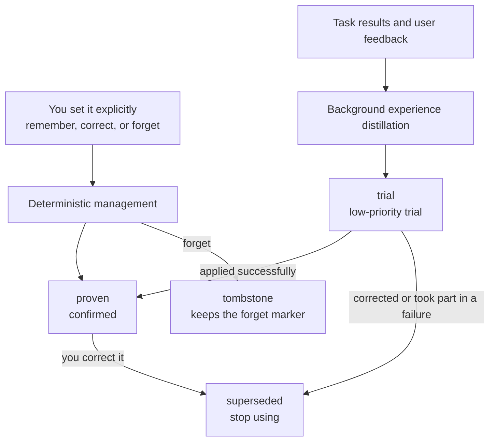

Personal Memory is Comet's first-party, user-level plugin. It saves the collaboration preferences you want to keep using long term and provides them to the Agent in related tasks. Language, expression, verification habits, and delivery requirements all carry across tasks without you repeating them in every session.

Personal Memory belongs to the current user. You can let one record apply in every project or limit it to a specific project.

## What to save here

| What you say | What Comet does | Why |
| --- | --- | --- |
| "Answer in Chinese by default from now on" | Save it as global Personal Memory | A stable expression preference across tasks and projects |
| "Run the minimal relevant tests first in this repository" | Save it as a project-scoped personal collaboration policy | Your working habit in the current project |
| "Don't commit this time" | Apply it to the current request only | A one-time grant must not become a long-term default |
| "`domains` cannot access the file system directly" | Leave it to Project Knowledge or a repository Rule | A project constraint the team shares |

This classification keeps ownership clear: project-scoped personal habits still belong to you, while team-shared knowledge requires project evidence or an explicit sharing action.

## Product positioning

A new Agent session usually starts from a fresh context window. Personal Memory provides a layer of user context independent of the conversation history, managing four things:

- **Ownership**: the record belongs to the current user.
- **Scope**: the record applies globally or in a specified project.
- **Authority**: distinguishes what you set explicitly from what the system inferred.
- **Lifecycle**: supports trial, confirmation, correction, forgetting, and rollback.

[Claude Code Auto Memory](https://code.claude.com/docs/en/memory) records build commands, debugging experience, and user preferences; Cursor's [Memories](https://docs.cursor.com/en/context/memories) turns conversations into project-scoped memory; [GitHub Copilot Memory](https://docs.github.com/en/copilot/concepts/agents/copilot-memory) separates repository-level facts from user-level preferences.

Comet adds traceable governance on top of cross-session memory. You can see where a memory came from, where it applies, its current state, why it was applied, and its recent results, and you can correct or forget it directly.

## Three kinds of personal memory

### Core Profile: stable user profile

Core Profile stores information that stays valid across tasks:

- Language and expression preferences;
- Role and technical background;
- Output format and evidence habits;
- Stable communication boundaries.

This content usually does not depend on specific files or workflow phases. At the start of a task, a few key profile entries can enter the context directly.

### Collaboration Policy: conditional collaboration policy

Collaboration Policy describes how you want the Agent to work under specific conditions:

- Run the minimal relevant tests first in a certain project;
- Before changing a specified path, check the artifact sync scope;
- List reproducible issues by severity during Review;
- Check the workspace and remote state before Archive.

A collaboration policy can be limited to a project, path, task, operation, or phase. Narrow scopes reduce false matches in unrelated tasks.

### Personal Episode: reviewable personal experience

Personal Episode stores a compact record of a success, correction, or failure:

- The task context at the time;
- The actions that were taken;
- The actual result;
- The experience you can reuse.

Personal episodes are mostly used for background distillation or on-demand review. They keep only the necessary evidence references, never full sessions, full tool logs, or hidden model reasoning.

<p align="center">
  
</p>

## Two ways records form

### Set explicitly by you

When you say "remember" or "always do it this way", or when you correct or forget a record directly, Comet writes it through fixed rules. A clear long-term requirement can enter the `proven` (confirmed) state directly and take effect in the next related task.

One-time requests such as "this time", "for the current task", or "just temporarily" constrain only the current request and never enter long-term memory.

### Form candidates from task results

Agent Learning Loop can extract reusable experience from the results of repeated collaborations. Content the system inferred first enters the `trial` state and joins related tasks at lower priority. After one successful application it can be promoted to `proven`. Content that was rejected, corrected, or took part in a failure is rewritten or enters the `superseded` (retired) state.



## Task matching and context provision

At the start of a task, Context Director (the context scheduler) filters records by the current project, path, task, operation, and phase.

- Key Core Profile entries and a few directly related stable policies can be provided in full.
- Other relevant candidates enter the Context Manifest.
- The Context Manifest carries only summaries, application reasons, and stable IDs.
- When the Agent needs the body, source, or verification method, it expands the entry by ID.
- When the path, operation, or phase changes, the system reselects relevant content.
- Content that has not changed in the same session is not provided repeatedly.

Every selected record carries a `whyApplied` field. It records the project, path, or task conditions that actually matched, so you can check why content entered the current task. Application results also affect later ranking and lifecycle.

## Division of labor with Project Knowledge

Personal Memory and Project Knowledge both serve Agent context, but they have different owners and data sources:

| Content | Personal Memory | Project Knowledge |
| --- | --- | --- |
| "I want Chinese answers by default" | Global personal preference | Not applicable |
| "In this project I tend to run minimal tests first" | Project-scoped personal collaboration policy | Not applicable |
| "The auth module is made of three packages" | Not applicable | Project Model |
| "Changing a Provider must also update the contract test" | Not applicable | Project Policy |
| A successful or failed experience | Personal Episode | Can form a failure-resolution record when project evidence exists |

Personal project habits never become team knowledge on their own. Sharing has to be started explicitly by you: remove personal information and re-check the current project source.

## Management entry

The Dashboard's **Personal Memory** page shows each record's type, scope, source summary, state, application reason, and recent results. Current active records and history are shown separately. Forgotten or conflicted records remain available for tracking and rollback, but are not provided to tasks as current personal memory. You can add, correct, forget, roll back, or expand the full information.

The CLI, Dashboard, Skill, and Hook all read and write the same state:

```bash
comet memory status .
comet memory list .
comet memory retrieve . --task "implement the new CLI command"
comet memory remember . --text "answer in Chinese by default" --scope global
comet memory correct . --id <memory-id> --text "answer concisely in Chinese"
comet memory forget . --id <memory-id>
comet memory rollback . --id <memory-id>

# Cross-device sync and pause
comet memory remote . --set <your-memory-repository-Git-URL>
comet memory sync .
comet memory pause . --project <project-key> --learning
comet memory pause . --resume
```

`remember` is for explicit long-term storage requests. `observe` records stable collaboration practices the Agent discovered; it must not capture task summaries, progress, command output, or test results. `forget` keeps the rollback capability by default; permanent deletion requires an explicit `--permanent`.

**Cross-device sync**: Personal Memory is stored locally by default. When you switch devices, first bind a dedicated memory repository with `comet memory remote --set <Git URL>`, then run `comet memory sync` on each device to pull and push the latest memories.

**Pause**: `comet memory pause --learning` pauses learning (no new records), `--retrieval` pauses retrieval (context is no longer injected), and `--resume` restores it. To pause only a specific project, add `--project <key>`.

**Default state**: Personal Memory is enabled by default after Comet initialization; no extra configuration is required.

## Recall diagnosis

To diagnose one memory use, check the three links in order:

1. **Saved state**: view the records with `comet memory list .` or the Dashboard.
2. **Match conditions**: check the scope, project, path, operation, and phase.
3. **Application basis**: review `whyApplied`, delivery, and the application outcome.

```bash
comet memory status .
comet memory retrieve . --task "modify the authentication module"
comet task . --task "modify the authentication module" --path src/auth --phase build --json
```

## Provider and workflow boundaries

The Provider is the data layer that saves and queries Personal Memory. Personal Memory supports two Providers — Local and Remote — and you pick one when configuring. When a Remote request fails, the system returns the actual state and does not fall back to reading Local data.

The Local Provider keeps a user-readable profile and project records. The main workspace and linked worktrees of the same repository share a stable project identity; different repositories are isolated. The character budget of one task limits only the context injected now, never the total amount of memory already saved.

When you do not want memory involved, use `comet memory pause` to pause learning or retrieval per project, or disable Personal Memory in the Dashboard plugin center. Native, Classic, Hotfix, and Tweak keep running when the plugin is unavailable, background experience distillation fails, or retrieval fails. When an explicit add, correct, forget, or rollback fails, Comet returns the actual error and keeps the original state.

## Permissions and privacy boundaries

Personal Memory only provides collaboration context. The current user's requirements and system constraints always have higher priority, and the following boundaries hold:

- Never converts to team Project Knowledge or a repository Rule automatically;
- Never saves full chats, full diffs, tool logs, or hidden reasoning;
- Never records ordinary project facts you can read directly from the current repository;
- Never commits, pushes, deletes, or publishes on your behalf;
- Never modifies project source code, configuration, tests, or Skills automatically.

Continue to [Personal Memory Principles: From User Signals to Task Context](/en/plugins/personal-memory-principles) to understand record formation, task matching, and invalidation handling.

Related content: [Agent Learning Loop](/en/plugins/agent-learning-loop), [Project Knowledge](/en/plugins/project-rules), and the [Dashboard overview](/en/dashboard/overview).
