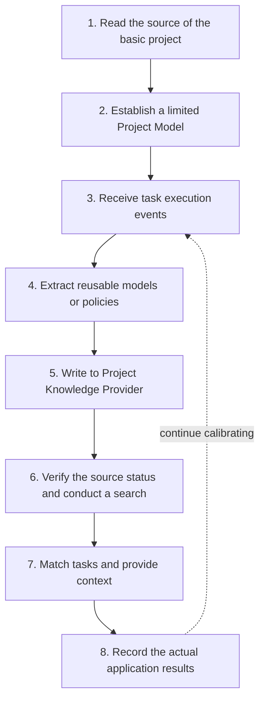

Project Knowledge builds project understanding using two types of input: one type is basic project sources such as manifest, configuration, directory structure, and specified documentation; Another type is task execution events such as Review, verification, fault recheck, Change Archive and application results.

The system only saves the content that has a source, a scope of application and is helpful for subsequent tasks as Project Knowledge Record. It does not take over rules written by users, nor does it generate project wikis that cover the entire repository.

## Core component

|Component|Duties|
| -------------------------------- | -------------------------------------------------- |
|Corpus (Project corpus|Define the collection of project sources that the system can read and index|
| Project Model Builder            |Generate topologies, facts, and dependency records from deterministic project structures|
| Project Policy Learner           |Extract project strategies from accepted decisions, verification results and fault handling records|
| Project Knowledge Record         |Save the main text, scope, source, verification method, relationship and lifecycle|
| Project Knowledge Provider       |Provide a unified saving and querying interface for Local or Remote|
|Context Director|Perform second-layer filtering and context budget control based on the current task|
|Context Manifest|Provide summaries, application reasons and stable ids, and support the expansion of complete records as needed|

## Overall data path



Three types of objects in the data link undertake different responsibilities:

- ** Project evidence ** includes source code, configuration, tests, documentation and verification results in the current repository, and is the direct source of project facts;
- **Project Knowledge Record** is a standardized Project Model or project strategy established from evidence;
- **SQLite FTS Index ** is a reconfigurable retrieval read model used to improve the efficiency of candidate recall.

Rules are maintained by users or teams and loaded by the host by scope. Project Knowledge can reference the basis of the Rule when the source configuration allows, but it will not write, replace or take over the Rule. The project Wiki is a complete project document oriented towards people and is not included in this automatic learning chain.

## Corpus: The scope of the project's corpus

The Corpus (project corpus) defines the sources that the Local Provider can read, split, and index. Default sources include:

- Native current Spec and Archive;
- "Classic Current Spec and Archive;"
- Workflow products supported by Comet;
- The identifiable project structure, manifest and configuration can be determined;
- The Markdown path explicitly added in the configuration.

You can use `knowledge.local.include` to expand the corpus range:

```yaml
knowledge:
  provider: local
  local:
    include:
      - docs/**/*.md
      - packages/*/README.md
      - architecture/**/decisions-*.md
```

`include` uses the glob relative to the project root directory. The system will split the document into source units with path and section (chapter) information for retrieval and source status checking.

The default corpus scope only includes sources that Comet can clearly recognize. The Rule files or rule directories supported by the target platform are managed by the host. When it is necessary to use the Markdown as a knowledge corpus at the same time, please explicitly add it through `include`.

The Corpus defines the range of sources that are allowed to be read, but this does not mean that Comet will convert all of their content into long-term knowledge. The Builder only selects the content that can form the Project Model, project strategy or subsequent task clues.

## Formation logic: Basic model and execution accumulation

### Project Model Builder

When the Project is used for the first time, the Project Model Builder builds the base Project Model from the manifest, configuration, directory structure, limited source code relationships, and custom Markdown. The subsequent `repository.changed`, `verification.completed` and `change.archived` events will update these records.

The Project Model only saves the structural information that can be determined for extraction:

- `topology`: Directory, module and workspace topology;
- `fact`: Facts that can be verified from the current project;
- `dependency`: Relationships among modules, packages and components.

The deterministic extracted Project Model can directly enter the `proven` (confirmed) state and retain the source for review before task use. It consists of structured knowledge records and does not generate a complete project Wiki in directory or chapter format.

### Project Policy Learner

The Project Policy Learner processes engineering experiences that have formed project significance during task execution:

|"Event|Strategies that can be formed|
| ------------------------ | ------------------------------------------ |
|The Review conclusion has been accepted and processed|`decision` or `constraint`|
|The root cause analysis and re-examination of the fault have been completed| `failure-resolution`                       |
|The verification has been successfully executed|Connect the actual command to verification|
|"Change" has been archived|Final decision, pattern, procedure and deprecation items|
| Context outcome          |Strengthen, rewrite or replace the `trial` Policy|

Candidates that require semantic induction and have not yet been reused first enter the `trial` (trial) state. Project agreements explicitly proposed by users, existing project instructions, definite project facts, and execution results that have been successfully re-verified can be entered into `proven`. `trial` can also be promoted to `proven` after successfully assisting with subsequent tasks.

## Record: Traceable knowledge unit

Project Knowledge Record (Project Knowledge Record) contains at least the following information:

|Field|Product function|
| -------------------------------------- | ---------------------------------------------- |
|Stable ID and project ID|Bind the current repository and support historical tracking|
|"type and family"|Distinguish between Project Model and Project Policy|
|"title and summary"|Used for lists and Context Manifest|
| applicable paths / operations / phases |Limit the applicable paths, operations and stages|
| conclusions                            |Save structured conclusions that can be verified|
| relations                              |Describe finite relations such as contains, depends on, consumes, etc|
|sources and source versions|Point to the relative path of the project, anchor (location anchor point), and source version|
| verification                           |Connect the actual project commands with the expected results|
| authority                              |Distinguish between automatic, user and repository|
| lifecycle                              |Represents `trial/proven/enforced/superseded`|
| application statistics                 |Record the number of uses as well as successful, ignored, corrected and failed results|

The system uses semantic identity (content identity) to identify the same knowledge unit. New evidence will update existing records and retain version relationships, reducing synonym duplication. The main text clearly corrected by the user has higher authority. Automatic extraction can only supplement evidence or form a version to be confirmed.

## Policy Compiler: Policy activation

The Policy Compiler selects the following activation forms for the Project Policy based on content determinism and usage methods:

1. **Context** : decision, pattern, procedure or constraint need to be judged by the Agent in combination with the task and provided in the form of a complete policy or Context Manifest;
2. **Verification** : constraint has bound a runnable project command that can be judged as successful or failed and is provided as a verification policy;
3. **Skill candidate** : When the procedure is stable across tasks, contains multiple steps and can be combined, generate an evidence-based Skill candidate summary.

During the strategy compilation stage, only context, validation associations, or candidate summaries are generated. Skill, linter, compiler, build and CI are still maintained by users and the existing processes of the project.

Only Project Policy can enter `enforced` and needs to bind the currently existing and successfully executed deterministic validation entry. `enforced` indicates that this strategy has a runnable validation association and does not expand model permissions or system permissions.

## Hybrid retrieval

The project task involves multiple retrieval signals:

- Precise paths, commands, error codes and identifiers are suitable for strong string matching;
- The Chinese description, chapter titles and engineering semantics are suitable for full-text search.
- Module responsibilities and cross-file impacts are suitable for structural filtering and finite relationship extension;
- The current branch changes and source failures need to be verified on-site.

The Local Provider combines these channels into a bounded search chain:

```text
project/path/operation/phase/type/state filtering
→ FTS section candidate
Limited ripgrep strong matching and change file supplementation
Controlled relationship expansion
Sort the source status and application feedback
```

SQLite FTS5 provides section-level full-text indexing and sorting; Limited ripgrep retains the capabilities of exact matching, changing file supplementation, and fault rollback. When SQLite indexes are corrupted, lock conflicts occur, or FTS is unavailable, the system can rebuild the read model or use bounded source code search.

Hybrid retrieval takes into account both semantic recall and precise engineering evidence, reduces wide-area exploration, and improves the coverage of the complete modification range.

## Source validity check

Before the record enters the context, the system will check the project-relative source, anchor, digest, or version:

1. When the source exists and the content is consistent, the record continues to participate in the search.
2. When the source changes, the old record shall cease to be used as the current conclusion.
3. When the source is deleted, the selector becomes invalid, or the verification command disappears, the record enters `superseded`.
4. New evidence forms a new version and retains the substitution relationship with the old version.

Source checking binds Project Knowledge to the current warehouse status, reducing the risk of outdated conclusions entering tasks.

## Context Director: Task context control

The Provider query returns a candidate set. The Context Director then performs the second layer of selection:

- Filter out candidates that do not match the current project, path, task, operation, or phase;
- Exclude `superseded`;
- Rank `proven` and `enforced` before `trial`.
- Prioritize the repository and user explicit authority over automatic inference;
- Improve the ranking of specific scope and recently successful application content;
- Reduce the ranking of corrected or failed content.

A small number of key Project policies can be provided completely. Project Model, `trial` Policy, long Procedure and evidence are usually included in the Context Manifest.

The Manifest uses a stable ID and carries:

- Title and Abstract;
- Knowledge types and life cycles;
- Source type;
- `whyApplied`；
- application ID。

The Agent acquires the complete text, source and verification through `expand`. The single-character budget only limits the resident content of the current task and does not limit the total number of records of the Provider.

## The main workspace and linked worktree

The Local Provider distinguishes items using a stable repository identity:

- The main workspace shares the normalized Record with the linked worktree in the same repository;
- Document sections and full-text indexes are isolated by workspace.
- File changes in a branch or worktree only affect the source snapshot corresponding to the workspace.
- Different warehouses are isolated from each other.

This design enables the same repository to reuse stable Project Knowledge while keeping the search results consistent with the current workspace files.

## Local and Remote Provider

The Project Knowledge domain accesses the Provider through the unified `status/query/apply` contract.

### Local Provider

- Use SQLite isolated by repository ID in the user data directory;
- Record stores the normalized machine state;
- The section and FTS indexes can be rebuilt.
- Limited ripgrep is responsible for strong matching, changing file supplementation, and fault rollback.

### Remote Provider

- After enabling Remote configuration, Local will no longer be read simultaneously.
- Queries only send bounded task, path, phase, operation and ID selector;
- apply only sends normalized records and evidence.
- Complete repositories, complete diffs, logs, personal memories, and credentials will not enter the request;
- When Remote fails, it returns the actual state and does not switch to Local.

```yaml
knowledge:
  provider: remote
  remote:
    endpoint: https://knowledge.example.com/provider
    token_env: COMET_KNOWLEDGE_TOKEN
    scope: team-project
    timeout_ms: 5000
```

## Execution boundaries with rules, hooks, and engineering checks

|layer|The way to enter the model context|Deterministic execution ability|Typical content|
| -------------------------- | ----------------------------- | --------------------------------------- | -------------------------------- |
| Project Model / Policy     |Provide the task completely or enter the Manifest|The Policy for binding verification can be marked as `enforced`|Architecture, dependencies, decision-making, processes, and troubleshooting methods|
|Platform Rule file or rule directory|Loaded by the host by scope|Rely on the Agent for interpretation and compliance|Team instructions and behavioral requirements|
| Hook / Guard               |Executed as a runtime event or command|The process can be observed, blocked or adjusted|Permissions, security, workflow boundaries|
| linter / test / build / CI |Provide diagnostic or verification results|Use the exit code and project rules to determine the result|Engineering constraints that can be automatically judged|

You can continue to write project constraints through the Rule carrier supported by the target platform, and the host is still responsible for loading. The `AGENTS.md` of Codex, the `CLAUDE.md` of Claude Code and the `.cursor/rules` of Cursor are all just specific examples. Comet reuses these rules and the existing checks of the project; The basis for the existence of Project Knowledge record constraints, applicable paths and verification commands, deterministic judgments are still completed by the corresponding actuators.

## Failed behavior

|Failure position|Product behavior|
| -------------- | --------------------------------------------------- |
|Query or search|The current task continues without providing any failed content|
|The source is unreadable.|Stop using relevant records and report the diagnosis|
|FTS index is damaged|Rebuild the read model or use finite ripgrep|
|Back-end learning|Keep the Journal and allow replay later|
|Correct or abandon|Return the actual error and maintain the original state|
|Disable or uninstall the plugin|Stop learning, querying, policy validation, SQLite access and Remote requests|

## Recall diagnosis

When diagnosing a Project Knowledge recall, check in the order of `Provider → Record → Query → Context`:

```bash
comet knowledge status .
comet knowledge list . --state proven
comet knowledge query . --task "Modify the authentication module" --path src/auth --phase build --operation edit
comet knowledge get. --id < Record Identifier >
```

Focus on verifying the following information:

1. The source has entered the default Corpus or `knowledge.local.include`;
2. The project, path, operation, phase and lifecycle of Record match the task.
3. The source version is still valid.
4. The Query has returned relevant candidates.
5. The `whyApplied` and application history in the Context Manifest are in line with expectations.

Return to [Project Knowledge ](/en/plugins/project-rules), or continue reading [Agent Learning Loop](/en/plugins/agent-learning-loop).
