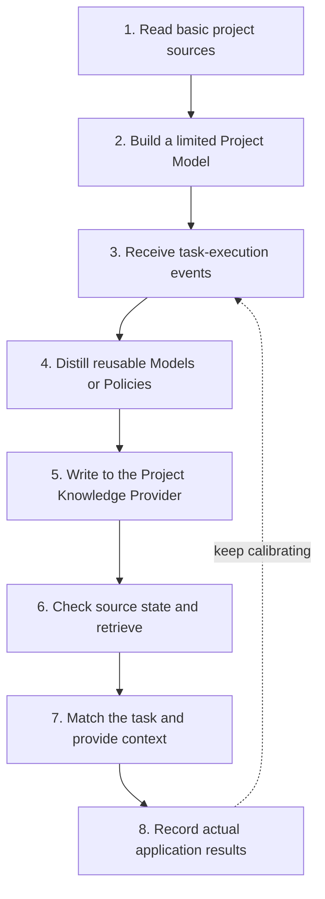

For setup, configuration, and everyday commands, see [Project Knowledge](/en/plugins/project-rules). This page explains how Project Knowledge builds records from project evidence, verifies sources, and provides content to tasks.

Project Knowledge builds project understanding from two kinds of input: basic project sources such as the manifest, configuration, directory structure, and specified documents, and task-execution events such as Review, verification, failure re-verification, change archives, and application results.

Only content that has a source, can be given an applicable scope, and helps later tasks is saved as a Project Knowledge Record. Project Knowledge never takes over Rules you wrote, and it never generates a project Wiki that covers the whole repository.

## Core components

| Component | Responsibility |
| --- | --- |
| Corpus | Defines the Markdown sources that can be split, indexed, and retrieved |
| Project Model Builder | Generates topology, fact, and dependency records from deterministic project structure |
| Project Policy Learner | Distills project policies from accepted decisions, verification results, and failure-handling records |
| Project Knowledge Record | Keeps the content, scope, sources, verification method, relationships, and lifecycle |
| Project Knowledge Provider | Provides the unified save-and-query interface for Local or Remote |
| Context Director | Runs the second-layer filtering and context budget control for the current task |
| Context Manifest | Provides summaries, application reasons, and stable IDs so full records can be expanded on demand |

## Overall data path



Three kinds of objects in this chain play different roles:

- **Project evidence** — the source code, configuration, tests, documents, and verification results in the current repository — is the direct source of project facts.
- **Project Knowledge Record** is the normalized Project Model or Project Policy built from that evidence.
- The **SQLite FTS index** can be rebuilt at any time; it exists to make candidate recall faster.

Rules are maintained by users or teams and loaded by the platform per scope. When the source configuration allows, Project Knowledge can cite a Rule's basis, but it never writes, replaces, or takes over a Rule. The project Wiki is human-oriented, complete project documentation and is not part of this automatic learning chain.

## Corpus: the project corpus scope

The Corpus defines which Markdown sources the Local Provider can split, index, and retrieve. The default sources include:

- The Native current Spec and Archive;
- The Classic current Spec and Archive;
- Comet-supported workflow artifacts;
- The Markdown paths explicitly added in the configuration.

You can extend the corpus with `knowledge.local.include`:

```yaml
knowledge:
  provider: local
  local:
    include:
      - docs/**/*.md
      - packages/*/README.md
      - architecture/**/decisions-*.md
```

`include` uses globs relative to the project root. The system splits documents into source units with path and section information, which retrieval and source-state checks use.

The default corpus only contains sources Comet can identify clearly. Rule files or rule directories the target platform supports are managed by the platform; if you also want their Markdown as knowledge corpus, add it explicitly through `include`.

Source code, manifests, configuration, and tests can help build Project Models and remain as record evidence, but do not enter the Markdown retrieval corpus directly. The Dashboard corpus page shows the Markdown used for retrieval; other evidence is available in the corresponding knowledge records.

## Formation logic: base model and execution accumulation

### Project Model Builder

On first project use, the Project Model Builder builds a base Project Model from the manifest, configuration, directory structure, limited source relationships, and custom Markdown. Later `repository.changed`, `verification.completed`, and `change.archived` events update these records.

Project Model only keeps structural information that can be extracted deterministically:

- `topology`: directory, module, and workspace topology;
- `fact`: facts checkable against the current project;
- `dependency`: relationships between modules, packages, and components.

A deterministically extracted Project Model can enter the `proven` (confirmed) state directly and keeps its sources for re-checking before a task uses it. It is made of structured knowledge records; it never becomes a directory-style or chapter-style Wiki of the whole project.

### Project Policy Learner

The Project Policy Learner processes engineering experience accumulated during task execution:

| Event | Policy that can form |
| --- | --- |
| Review conclusion accepted and acted on | `decision` or `constraint` |
| Fault with completed root-cause analysis and re-verification | `failure-resolution` |
| Verification executed successfully | The real command is attached as the verification |
| Change archived | Final `decision`, `pattern`, `procedure`, and deprecations |
| Context outcome | Strengthens, rewrites, or replaces a `trial` policy |

Experiences that need interpretation go to the host Agent for review by default; see [Project Knowledge](/en/plugins/project-rules#distill-project-policies-from-execution-results) for usage. Newly distilled policies start in `trial` and are promoted to `proven` after helping later tasks successfully. Source refresh does not replace validation through actual use.

## Record: the traceable knowledge unit

A Project Knowledge Record contains at least the following:

| Field | Product role |
| --- | --- |
| Stable ID and project ID | Bind to the current repository and support history tracking |
| type and family | Distinguish Project Model from Project Policy |
| title and summary | Used for lists and the Context Manifest |
| applicable paths / operations / phases | Limit the applicable paths, operations, and phases |
| conclusions | Hold structured conclusions that can be checked |
| relations | Describe bounded relationships such as contains, depends-on, and consumes |
| sources and source versions | Point to project-relative paths, anchors, and source versions |
| verification | Connects real project commands with the expected result |
| authority | Distinguishes `automatic`, `user`, and `repository` |
| lifecycle | Represents `trial` / `proven` / `enforced` / `superseded` |
| application statistics | Record the number of uses and the success, ignore, correction, and failure results |

The system judges whether multiple records point to the same thing by content: updating content creates a new version and keeps its relationship with the old version, which reduces near-duplicate entries. Content you explicitly corrected has higher authority; automatic distillation can only add evidence or form a pending version.

## Policy Compiler: policy activation

The Policy Compiler chooses how a Project Policy is activated, based on whether the content can be judged programmatically and how it will be used:

1. **Context**: a `decision`, `pattern`, `procedure`, or `constraint` that needs the Agent to judge it against the task is provided as a full policy or through the Context Manifest.
2. **Verification**: a `constraint` bound to a runnable project command whose success or failure can be judged is provided as a verification policy.
3. **Skill candidate**: when a `procedure` is stable across tasks, has several steps, and can be composed, an evidence-based Skill candidate summary is generated.

The compilation stage only produces context, a verification binding, or a candidate summary. Skill, linter, compiler, build, and CI stay maintained by you and the project's existing processes.

Only a Project Policy can enter `enforced`, and it must be bound to a deterministic verification entry that currently exists and has run successfully. `enforced` means the policy has a runnable verification binding; it never expands model or system permissions.

## Hybrid retrieval

Project tasks carry several kinds of retrieval signals:

- Precise paths, commands, error codes, and identifiers fit strong string matching;
- Chinese descriptions, section titles, and engineering semantics fit full-text search;
- Module responsibilities and cross-file impact fit structural filtering and bounded relationship expansion;
- Current-branch changes and stale sources need on-site verification.

The Local Provider combines these channels into one bounded retrieval chain:

```text
project / path / operation / phase / type / state filter
  → FTS section candidates
  → bounded ripgrep strong matches + changed-file supplement
  → controlled relationship expansion
  → ranking by source state and application feedback
```

SQLite FTS5 provides section-level full-text indexing and ranking; bounded ripgrep searches the Markdown corpus for exact matches, changed-file supplements, and failure fallback. When the SQLite index is corrupted, locked, or FTS is unavailable, the system can rebuild it or fall back to bounded Markdown search.

Hybrid retrieval covers both semantic recall and exact matching, reducing broad blind searches and improving coverage of the full change scope.

## Source-validity checks

Before a record enters context, the system checks the project-relative source, anchor, digest, or version:

1. When the source exists and its content is unchanged, the record keeps participating in retrieval.
2. When the source changed, the old record stops being used as the current conclusion.
3. When the source is deleted, a selector stops applying, or a verification command disappears, the record enters `superseded`.
4. New evidence forms a new version and keeps its replacement relationship with the old version.

Source checks bind Project Knowledge to the current repository state, reducing the chance that an outdated conclusion reaches a task.

## Context Director: task context control

The Provider query returns a candidate set. Context Director then applies a second layer of selection:

- Drops candidates that do not match the current project, path, task, operation, or phase;
- Excludes `superseded`;
- Ranks `proven` and `enforced` ahead of `trial`;
- Ranks repository-level sources and records you explicitly provided ahead of automatic inference;
- Ranks specific scopes and recently successful applications higher;
- Ranks corrected or failure-involved content lower.

A few key Project Policies can be provided in full. Project Model entries, `trial` policies, long procedures, and evidence usually enter the Context Manifest.

The Manifest uses stable IDs and carries:

- Title and summary;
- Knowledge type and lifecycle;
- Source type;
- `whyApplied`;
- Application ID.

The Agent gets the full content, sources, and verification through `expand`. The per-task character budget limits only the content injected for the current task, never the total records the Provider holds.

## Main workspace and linked worktrees

The Local Provider tells projects apart with a stable repository identity:

- The main workspace and linked worktrees of the same repository share the normalized Records;
- Document sections and full-text indexes are isolated per workspace;
- File changes in a branch or worktree affect only that workspace's source snapshot;
- Different repositories are isolated from each other.

This lets one repository reuse stable Project Knowledge while keeping retrieval results consistent with the current workspace files.

## Local and Remote Providers

The Project Knowledge domain accesses the Provider through the unified `status / query / apply` contract.

### Local Provider

- Uses per-repository-ID SQLite in the user data directory;
- Records store the structured state Comet maintains automatically;
- Section and FTS indexes can be rebuilt;
- Bounded ripgrep handles strong matches, changed-file supplement, and failure fallback.

### Remote Provider

- Once Remote is enabled, Local is no longer read at the same time;
- Queries send only bounded task, path, phase, operation, and ID selectors;
- apply sends only normalized Records and evidence;
- Full repositories, full diffs, logs, Personal Memory, and credentials never enter a request;
- A Remote failure returns the actual state and does not switch to Local.

```yaml
knowledge:
  provider: remote
  remote:
    endpoint: https://knowledge.example.com/provider
    token_env: COMET_KNOWLEDGE_TOKEN
    scope: team-project
    timeout_ms: 5000
```

## Execution boundaries with Rule, Hook, and engineering checks

| Layer | How it enters the model context | Deterministic execution capability | Typical content |
| --- | --- | --- | --- |
| Project Model / Policy | Provided in full per task or listed in the Manifest | A bound-verification Policy can be marked `enforced` | Architecture, dependencies, decisions, processes, failure solutions |
| Platform Rule files or rule directories | Loaded by the host per scope | Depends on the Agent interpreting and following them | Team instructions and behavioral requirements |
| Hook / Guard | Executes as runtime events or commands | Can observe, block, or adjust the flow | Permissions, security, workflow boundaries |
| linter / test / build / CI | Provides diagnostics or verification results | Judges results with exit codes and project rules | Engineering constraints that can be judged automatically |

You can keep writing project constraints in the Rule carriers your target platform supports; the platform still loads them. Codex `AGENTS.md`, Claude Code `CLAUDE.md`, and Cursor `.cursor/rules` are only concrete examples. Comet reuses these Rules and the project's existing checks: Project Knowledge records why a constraint exists, where it applies, and which verification command enforces it, while the deterministic judgment stays with the corresponding executor.

## Failure behavior

| Where it fails | Product behavior |
| --- | --- |
| Query or retrieval | The current task continues; no failed content is provided |
| Source unreadable | The related records stop being used and a diagnostic is reported |
| FTS index corrupted | Rebuild the index or fall back to bounded ripgrep |
| Background learning | The Journal is kept so it can replay later |
| Correction or retirement | Returns the actual error and keeps the original state |
| Plugin disabled or uninstalled | Learning, querying, policy verification, SQLite access, and Remote requests stop |

Return to [Project Knowledge](/en/plugins/project-rules), or continue with [Agent Learning Loop](/en/plugins/agent-learning-loop).
