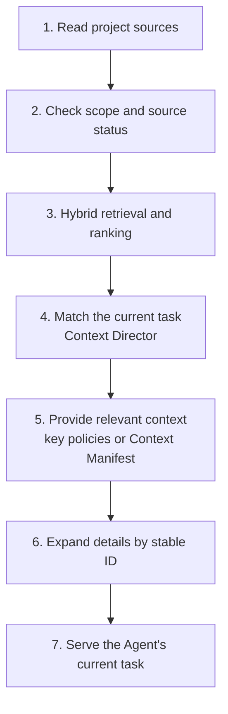

Project Knowledge is Comet's first-party, project-level plugin. As the Agent works on tasks, it discovers project information that has reuse value and organizes it into Project Knowledge records that carry a source, an applicable scope, and verification records.

On first use, Comet builds a limited base Project Model from the manifest, configuration, directory structure, Comet artifacts, and the Markdown you explicitly added. Review, verification, failure re-verification, change archives, and actual application results in later tasks keep adding project policies. The Agent can reuse confirmed project understanding while still treating the current source code, configuration, and tests as its direct basis.

## The boundary with Rule and the project Wiki

### Rule remains the explicit constraint entry

Project Knowledge does not replace Rule. You can keep writing team directives and behavioral constraints in the Rule files or rule directories your target platform supports, such as `AGENTS.md` for Codex, `CLAUDE.md` for Claude Code, `.cursor/rules` for Cursor, and the Rule carriers other platforms provide. The platform still loads this content according to its own scoping rules.

Comet does not take over Rule authoring or loading, and it never silently rewrites a Rule. When a Rule is configured as a knowledge source, Project Knowledge can cite its basis and scope; the original Rule stays the higher-priority project evidence.

### Project Knowledge accumulates per task, not as a full Wiki

Project Knowledge does not offer "one-click project Wiki generation". Comet does not scan and explain every directory, file, or implementation detail in the repository, and it does not promise to produce human documentation that covers the whole project.

Project Knowledge is scoped to the Agent's later tasks. It only keeps records that help locate an entry point, complete a change scope, understand a decision, or pick a verification method. Ordinary details without a reliable source, valid only for the current task, or directly readable from the source code are not stored long term just to fill a knowledge base.

## Core capabilities

| Capability | Context Comet provides | How it helps a task |
| --- | --- | --- |
| Project orientation | Directory, module, workspace, and component responsibilities | Narrows the source search scope |
| Impact-scope analysis | Module dependencies, registration relationships, configuration and artifact relationships | Fills in the implementation, test, configuration, and documentation scope in advance |
| Design understanding | Accepted technical and product decisions and implementation patterns | Explains the constraints and rationale behind the current implementation |
| Process reuse | Stable operation steps and real verification commands | Reuses ways of working the project already verified |
| Failure handling | Root causes, fixes, and successful re-verification records | Reduces repeated troubleshooting of the same kind of problem |

The core goal of Project Knowledge is a better first-hit quality and a more complete change scope. Retrieval speed is only a means; the real effect depends on whether the Agent finds the right entry point, related files, and verification path earlier.

## Industry practice and where Comet fits

The industry typically gives coding agents project context through three kinds of capability:

1. **Project instructions**: [Codex](https://openai.com/index/unrolling-the-codex-agent-loop/) uses `AGENTS.md`, [Claude Code](https://code.claude.com/docs/en/memory) uses `CLAUDE.md` and path-scoped rules, and [Cursor](https://cursor.com/docs/rules) uses Project Rules. They fit behavioral requirements a team writes down explicitly.
2. **Code indexes**: tools such as [Sourcegraph Cody](https://sourcegraph.com/docs/cody/core-concepts/local-indexing) index the code so agents can find symbols and related fragments.
3. **Agent knowledge layers**: the [Qoder Knowledge Engine](https://qoder.com/en/blog/qoder-knowledge-engine) organizes architecture, engineering conventions, and cross-file relationships into reusable project understanding.

[OpenAI's harness engineering practice](https://openai.com/index/harness-engineering/) suggests keeping `AGENTS.md` short and pointing to structured repository knowledge. Short instructions stay focused, while detailed knowledge can be loaded per task and maintained separately.

Comet splits these three kinds of capability further:

- Repository Rules hold the Agent instructions the team wrote explicitly;
- Project Knowledge holds engineering understanding with sources, scopes, and a lifecycle;
- Full-text and exact search recall relevant candidates;
- Hooks, linters, tests, builds, and CI perform the actual rule checks and enforcement.

On top of this layering, Comet adds source-validity checks, progressive context, and application feedback. Project Knowledge updates as the repository changes and keeps calibrating against real task results.

## What Project Knowledge records

Content becomes a normalized Project Knowledge Record only when it has a source, can be given an applicable scope, and helps later tasks:

- Directory, module, and workspace topology;
- Facts that can be checked against the current repository;
- Dependencies between modules, packages, and components;
- Accepted design and product decisions;
- Stable implementation patterns and operation flows;
- Project constraints and failure-resolution experience.

The user-facing name is **Project Knowledge**. Project Policy is one kind of record inside Project Knowledge that describes decisions, processes, and constraints in the project. It is not a new Rule file format.

## Two kinds of Project Knowledge

### Project Model

Project Model stores structures and facts that can be verified against the current project's evidence:

| Type | Product meaning | Example |
| --- | --- | --- |
| `topology` | Directory, module, and workspace structure | The CLI entry lives under `app/`; domain logic lives under `domains/` |
| `fact` | A fact about the current project | Runtime artifacts are regenerated by a specific build command |
| `dependency` | Module, package, and component relationships | The Dashboard reads plugin state through the Plugin Host |

Module records include entry points, dependencies, callers, registration points, and related tests for the Agent to expand as needed. The Local Provider restores missing or stale model records and consolidates duplicate generated history.

### Project Policy

Project Policy stores engineering practices accumulated through real work:

| Type | Product meaning | Example |
| --- | --- | --- |
| `decision` | An accepted technical or product decision | Native and Classic keep independent state machines |
| `pattern` | A stable implementation pattern | New platform capabilities derive from a unified registry |
| `procedure` | A repeatable operation flow | Regenerate and verify artifacts after changing Runtime |
| `constraint` | A project constraint to honor | Domains do not scatter platform path logic |
| `failure-resolution` | A failure solution that was re-verified | Rebuild assets first, then run browser tests |

A Project Policy can enter the `enforced` (verified constraint) state only after its bound verification command currently exists and has run successfully. In the Native workflow those verification commands run together with the necessary Verify-phase checks (see [Verification and repair](/en/native/verification-and-repair)), and the policy is promoted only when they pass. `enforced` means the project already has a tool that can check this policy; the natural-language content is still provided to the Agent as context.

<p align="center">
  
</p>

## Relationship with Rule, Hook, and engineering checks

| Layer | Core responsibility | Typical carrier | Executor |
| --- | --- | --- | --- |
| Project Knowledge | Provide structure, rationale, relationships, processes, and engineering experience | Project Model, Project Policy, source records | Comet retrieves and provides to the Agent |
| Rule / Agent instructions | Prescribe how the Agent behaves in scope | Rule files or rule directories the target platform supports | The platform loads and provides to the Agent |
| Hook / Guard | Observe, block, or adjust the flow when an action happens | Hooks, permission rules, Comet Guard | The platform or Runtime |
| Deterministic checks | Judge whether the current implementation meets project requirements | compiler, linter, test, build, CI | The project's existing tools |

> Project Knowledge provides understanding, Rule provides instructions, and Hook and engineering checks handle enforcement.

Repository Rules, source code, configuration, tests, and checks always stay the higher-priority evidence. Comet reads and links these sources; it never silently rewrites them.

## How Project Knowledge forms

### Establish a base Project Model

The Local Provider builds a limited Project Model from three kinds of sources:

- The Native, Classic, and Archive artifacts Comet manages;
- The project structure, manifest, and configuration that can be identified deterministically;
- The Markdown documents you specify through `knowledge.local.include`.

```yaml
knowledge:
  provider: local
  local:
    include:
      - docs/**/*.md
      - packages/*/README.md
      - architecture/**/decisions-*.md
```

Extra paths are resolved relative to the project root. Only Markdown enters the full-text retrieval corpus; source code, configuration, and tests can support model records without becoming retrieval corpus. The default corpus does not automatically include every platform Rule file or rule directory. Add their Markdown through `include` when needed.

### Distill project policies from execution results

While the Agent executes tasks, the Project Policy Learner processes completed events:

- Review conclusions that were accepted and acted on;
- Faults whose root cause was confirmed, fixed, and re-verified successfully;
- Verifications that succeeded and the real commands behind them;
- The final decisions, stable patterns, operation flows, and deprecations in change archives;
- The success, ignore, correction, or failure results of Project Knowledge in later tasks.

Comet extracts candidate records from these events and re-checks their sources before writing. Experiences that need interpretation can be reviewed by the current host Agent without a separate model or API key. The Agent uses these commands to inspect pending evidence and submit its review:

```bash
comet knowledge review . --json
comet knowledge review . --id <review-id> --file <review-result.json>
```

The first command returns pending evidence and the submission format. Newly distilled knowledge starts in `trial` and is promoted after successful use in later tasks. Source refresh checks validity; it does not promote untried experience to confirmed knowledge.

## Source-validity checks

Every record keeps its project identity, source path, applicable scope, source version, and verification information. Before content enters a task, Comet runs these checks:

- When the source content is unchanged, the record keeps participating in retrieval.
- When the source changed, the old conclusion stops being used as current content.
- When the source is deleted or a selector stops applying, the record enters `superseded`.
- When a verification command disappears, the previous `enforced` state stops being valid.
- New evidence forms a new version and keeps its replacement relationship with the old version.

When refreshing, Comet rechecks the source content and can detect a change even when the file size and modification time are unchanged. Dashboard status counts cover every project record; the number currently shown in the list is not the total record count.

Project Knowledge gives the Agent grounded task clues. The Agent still reads the current code, configuration, and tests to confirm what this change actually involves.

## Task recall and provision

Context Director filters candidates by the current project, path, task, operation, phase, type, and state, then ranks them using Markdown full-text search, bounded exact search, project relationships, source status, and application results. Without a file path, the Agent can discover relevant knowledge and expand its scope, sources, and verification methods. Explicit scope mismatches are still excluded.



A few key `proven` or `enforced` Project Policies can be provided in full. Project Model entries, `trial` policies, longer procedures, and evidence usually enter the Context Manifest first. The Manifest carries only summaries, application reasons, and stable IDs, and the Agent expands the full content, source, and verification method as needed.

The success, ignore, override, correction, or failure results after the Agent uses the content feed back into later ranking and the lifecycle.

## Management entry

The Dashboard's **Project Knowledge** page separates Project Models from Project Policies and shows each record's applicable scope, source, verification method, state, `whyApplied`, recent application results, and full history.

The CLI reads and writes the same state:

```bash
comet knowledge status .
comet knowledge query . --task "modify the authentication module" --path src/auth --phase build --operation edit
comet knowledge list . --state proven
comet knowledge get . --id <record-id>
comet knowledge correct . --id <record-id> --text <new-description>
comet knowledge forget . --id <record-id>
comet knowledge feedback . --id <record-id> --outcome used-successfully
comet knowledge rebuild .
```

You can add or correct knowledge by hand, retire old records, expand sources, and refresh the index. Background learning and index refreshes never block the Dashboard's first paint.

**Troubleshooting recall**: check in the order Provider → Record → Query → Context. Verify that the source entered the default corpus or `knowledge.local.include`; that the record's project, path, operation, phase, and lifecycle match the task; that the source version is still valid; that the Query returns relevant candidates; and that the `whyApplied` and application history in the Context Manifest match expectations.

## Product boundaries

Project Knowledge serves the Agent's understanding of the project within these boundaries:

- The current source code, configuration, tests, and Runtime state always take priority;
- The platform keeps using the original Rule files and loading mechanism;
- Personal Memory can become team knowledge only through an explicit sharing action that removes personal information and re-checks sources;
- linter, compiler, test, build, and CI stay maintained by the project's existing tools;
- Project Knowledge grants no commit, push, delete, or publish permissions;
- Disabling the plugin stops learning, querying, policy verification, and Remote requests; disable it in the Dashboard plugin center, and it is enabled by default after initialization.

Continue to [Project Knowledge Principles: From Project Evidence to Task Context](/en/plugins/project-knowledge-principles) to understand how the corpus, records, hybrid retrieval, and Providers cooperate internally.

Related content: [Agent Learning Loop](/en/plugins/agent-learning-loop), [Personal Memory](/en/plugins/personal-memory), and the [Dashboard overview](/en/dashboard/overview).
