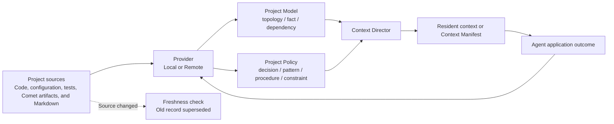

Project Knowledge provides Comet's project rules capability. It lets an Agent retrieve project structure, facts, dependencies, decisions, patterns, procedures, constraints, and failure resolutions. The Dashboard uses the related labels "Project knowledge" and "Project rules": the former describes the content, while the latter emphasizes how that content applies to behavior in the current project.

Project rules are not a second `AGENTS.md` or Rule file system. Repository rules, source code, configuration, tests, and checks remain higher-priority evidence. Comet builds a retrievable model and activation layer without silently rewriting those files.

## Two kinds of records

### Project Model

Project Model describes what the project is:

- `topology`: directory, module, and workspace structure;
- `fact`: facts that can be verified from project files;
- `dependency`: relationships between modules, packages, and components.

### Project Policy

Project Policy describes how work should be done in the project:

- `decision`: an accepted technical or product decision;
- `pattern`: a stable implementation approach;
- `procedure`: a repeatable operating procedure;
- `constraint`: a project requirement that must be followed;
- `failure-resolution`: a failure resolution with a root cause, repair, and successful reverification.

Both record types use the same lifecycle. `enforced` applies only to a Project Policy bound to a deterministic verification command that currently succeeds. It does not mean Comet replaces repository rules.

## Sources and freshness

The Local Provider reads Comet-managed Native, Classic, and archived artifacts, deterministic project structure, and additional Markdown files selected in configuration. Additional sources use globs relative to the project root:

```yaml
knowledge:
  provider: local
  local:
    include:
      - docs/**/*.md
      - packages/*/README.md
      - architecture/**/decisions-*.md
```

The system rechecks sources before every injection. When a file changes, is deleted, or no longer matches its selector, the old record enters `superseded` and new evidence creates a new record version. Stale documents therefore do not continue influencing tasks merely because they remain in an index.



<p align="center">
  
</p>

## How agents use it

At task start, Context Director filters candidates by project identity, task, path, operation, phase, type, and state. It then ranks them using full-text search, relationships, source freshness, and application feedback. A small number of important `proven` or `enforced` Project Policies can be injected in full. Project Model records, `trial` policies, long procedures, and evidence enter the Context Manifest by default.

Each Manifest item contains a stable ID, title, summary, source type, and truthful `whyApplied`. When an Agent needs the full content, source file, or verification method, it expands the item by ID instead of reloading the entire project knowledge base.

```bash
comet task . --task "Modify the authentication module" --path src/auth --operation edit --phase build --session <id> --json
comet task . --task "Modify the authentication module" --session <same-id> --expand-context <id> --json
```

Project Knowledge retrieval provides context only. It does not change the current user request, system constraints, host Rule, Skill, or workflow state.

## Local and Remote Providers

The Local Provider uses SQLite storage outside the project repository. The main workspace and linked worktrees from the same repository share a stable repository identity. Individual document sections and full-text indexes remain isolated by workspace and can be rebuilt. Index corruption or refresh timeouts preserve authoritative records and report diagnostics.

The Remote Provider supports team-wide project knowledge. It receives only bounded task, path, phase, operation, normalized Record, and evidence data. It does not receive the full repository, full diffs, logs, Personal Memory, or credentials. A failed Remote request never falls back silently to Local.

Provider configuration example:

```yaml
knowledge:
  provider: remote
  remote:
    endpoint: https://knowledge.example.com/provider
    token_env: COMET_KNOWLEDGE_TOKEN
    scope: team-project
    timeout_ms: 5000
```

## Dashboard and CLI

The project rules center displays records under Project Model and Project Policy. Details include lifecycle, scope, source, verification method, `whyApplied`, recent application outcomes, and complete history. You can also preview the Context Manifest for the current task.

```bash
comet knowledge status .
comet knowledge query . --task "Modify the authentication module" --path src/auth --phase build --operation edit
comet knowledge list . --state proven
comet knowledge get . --id <record-id>
comet knowledge correct . --id <record-id> --text <new-description>
comet knowledge forget . --id <record-id>
comet knowledge feedback . --id <record-id> --outcome used-successfully
comet knowledge rebuild .
```

In the Dashboard, you can manually create, correct, retire, expand sources, and refresh records. The first screen uses a cached snapshot, so background indexing and learning do not block the page.

## Priority and boundaries

Project rules normally follow this priority order: current user requests and system constraints; existing repository Rules and deterministic checks; more specific, verified Project Policies for the current project; general Project Model records and `trial` inferences. Project Policy never overrides higher-priority evidence during a conflict.

After the plugin is disabled or uninstalled, it no longer learns, queries, runs policy verification, opens SQLite, or sends network requests. Query and background learning failures allow the current task to continue without injecting failed content. Correction or retirement failures preserve the previous state.

Continue with [Personal Memory](/en/plugins/personal-memory), [Agent Learning Loop](/en/plugins/agent-learning-loop), and [Dashboard overview](/en/dashboard/overview).
