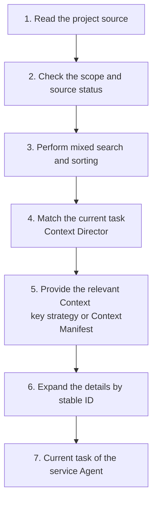

Project Knowledge is a first-party project-level plugin for Comet. It discovers project information with reuse value during the Agent's task execution process and organizes this information into Project Knowledge with source, scope of application and verification records.

When used for the first time, Comet builds a limited base Project Model from the manifest, configuration, directory structure, Comet products, and the Markdown you explicitly add. The Review, verification, fault re-verification, Change Archive and actual application results in the subsequent tasks will continue to supplement the project strategy. The Agent can thus reuse the confirmed project understanding while still relying directly on the current source code, configuration and tests.

## The boundary with Rule and the project Wiki

### Rule is still an explicit constraint entry

Project Knowledge does not replace Rule. You can continue to write team directives and behavioral constraints through Rule files or Rule directories supported by the target platform, such as `AGENTS.md` for Codex, `CLAUDE.md` for Claude Code, `.cursor/rules` for Cursor, and rule carriers provided by other platforms. The host still loads these contents according to its own scope rules.

Comet does not take over the writing and loading of rules, nor does it silently rewrite rules. When a Rule is configured as a knowledge source, Project Knowledge can refer to the basis and scope of application within it. The original Rule remains evidence for higher-priority projects.

### Project Knowledge is accumulated by task and does not generate a complete Wiki

Project Knowledge does not offer the ability to "generate the entire project Wiki with one click". Comet does not require scanning and interpreting every directory, file, and implementation detail in the repository, nor does it promise to generate human documentation covering the entire project.

Project Knowledge is used in scenarios based on the subsequent tasks of the Agent, and only records that can help locate the entry point, complete the scope of changes, understand decisions, or select verification methods are kept. Ordinary details that lack reliable sources, are only valid for the current task, or can be directly read from the source code will not be saved for a long time to fill the knowledge base.

## Core competence

|Ability|The context provided by Comet|Help with the task|
| ------------ | ------------------------------------ | ---------------------------------- |
|Project positioning|Directory, module, workspace and component responsibilities|Narrow down the search scope of source code|
|Analysis of influence scope|Module dependencies, registration relationships, configuration and product relationships|Complete the implementation, testing, configuration and documentation scope in advance|
|Design understanding|Accepted technical decisions, product decisions and implementation models|Understand the constraints and basis of the current implementation|
|Process reuse|Stabilize the operation steps and verify the actual commands|Continue to use the working method that has been verified in the project|
|Fault handling|Root causes, repair plans and successful re-inspection records|Reduce the repetitive screening of similar problems|

The core objective of Project Knowledge is to enhance the quality of the initial positioning and the completeness of the scope of changes. Retrieval speed is a means of implementation. The actual effect depends on whether the Agent can find the correct entry point, associated files and verification paths earlier.

## Industry Practices and the positioning of Comet

The industry typically provides project context to agents through three types of capabilities:

1. ** Project Instructions ** : [Codex](https://openai.com/index/unrolling-the-codex-agent-loop/) uses `AGENTS.md`, [Claude Code](https://code.claude.com/docs/en/memory) uses `CLAUDE.md` and path-scoped rules, [Cursor](https://cursor.com/docs/rules) uses Project Rules They are suitable for preserving the behavioral requirements explicitly written down by the team.
2. ** Code Index ** : [Tools such as Sourcegraph Cody](https://sourcegraph.com/docs/cody/core-concepts/local-indexing) establish code indexes to assist agents in finding symbols and related fragments.
3. **Agent Knowledge Layer ** : [Qoder Knowledge Engine x Q0qxz organizes architecture, engineering conventions, and cross-file relationships into reusable project understanding

OpenAI's Harness Engineering practice ](https://openai.com/index/harness-engineering/) suggests using short `AGENTS.md` to point to structured repository knowledge. Short instructions help maintain focus, while detailed knowledge can be loaded and maintained separately by task.

Comet further divides these three types of capabilities:

- The warehouse Rule stores the explicit Agent instructions of the team.
- Project Knowledge preservation includes the source, scope of application and life cycle of engineering understanding;
- Full-text search and source code search are responsible for recalling relevant candidates.
- Hook, linter, test, build and CI are responsible for implementing deterministic boundaries.

In this layering, Comet has added source validity checks, progressive context, and application feedback. Project Knowledge can be updated along with warehouse changes and continuously calibrated based on the actual task performance.

## The scope of Project Knowledge records

The content entering the normalized Project Knowledge Record needs to have a source, be able to define the scope of application, and be able to assist subsequent tasks:

- Directory, module and workspace topology;
- Facts that can be verified from the current warehouse;
- Dependencies among modules, packages and components;
- Accepted design and product decisions;
- Stabilize the implementation mode and operation process;
- Project constraints and troubleshooting experience.

The user entry uniformly uses "Project Knowledge". Project Policy is a type of record within Project Knowledge, used to describe decisions, processes and constraints in the project. It is not the new Rule file format.

## Two types of Project Knowledge

### Project Model: Project Model

The Project Model saves the structure and facts that can be verified from the current project evidence:

|Type|Product meaning|Example|
| ------------ | ---------------------- | -------------------------------------------- |
| `topology`   |Directory, module and workspace structure|The CLI entry is located at `app/`, and the domain logic is located at `domains/`|
| `fact`       |Current project facts|The Runtime output is synchronized by the specified build command|
| `dependency` |Module, package and component relationships|The Dashboard reads the status of the Plugin through the Plugin Host|

### Project Policy: Project strategy

Project Policy saves engineering practices that have formed project significance:

|Type|Product meaning|Example|
| -------------------- | ------------------------ | ------------------------------------ |
| `decision`           |Accepted technical or product decisions|Native and Classic remain independent machines|
| `pattern`            |Stable implementation mode|The capabilities of the new platform are derived from the unified registry|
| `procedure`          |Repeatable operation procedures|After modifying the Runtime, regenerate and verify the assets|
| `constraint`         |Project constraints that need to be adhered to|The domain does not directly scatter the platform path logic|
| `failure-resolution` |The fault solution that has been re-inspected|When the build asset expires, rebuild it first and then run the browser test|

The Project Policy can enter the `enforced` (Verified Constraint) state only after associating the currently existing and successfully executed deterministic validation entry. This status indicates that the project already has tools capable of checking this strategy, and the natural language text is still provided to the Agent as context.

<p align="center">
  
</p>

## The relationship with rules, hooks and engineering checks

|layer|Core responsibilities|Typical carrier|"Executive party|
| ----------------- | ------------------------------------ | --------------------------------------- | ------------------------ |
|Project Knowledge|Provide structure, basis, relationship, process and engineering experience|Project Model, Project Policy, Source record|Comet retrieves and provides to the Agent|
|Rule/Agent instructions|Specify the behavior of the Agent within the current scope|The Rule file or rule directory supported by the target platform|The host loads and provides it to the Agent|
| Hook / Guard      |Observe, block or adjust the process when the action occurs|Hook, permission rules, Comet Guard|Host or Runtime|
|Deterministic check|Determine whether the current implementation meets the project requirements| compiler、linter、test、build、CI       |The existing tools of the project|

> Project Knowledge provides understanding, rules provide instructions, hooks and engineering checks provide deterministic execution.

Repository rules, source code, configuration, testing, and inspection are always higher-priority evidence. Comet reads and associates these sources without silently rewriting them.

## The way Project Knowledge is formed

### Establish a basic Project Model

The Local Provider builds a limited number of Project Models using three types of sources:

- Native, Classic and Archive products managed by Comet;
- The identifiable project structure, manifest and configuration can be determined;
- The Markdown document specified by `knowledge.local.include`.

```yaml
knowledge:
  provider: local
  local:
    include:
      - docs/**/*.md
      - packages/*/README.md
      - architecture/**/decisions-*.md
```

The additional path is relative to the project root directory. The default corpus range will not automatically include all Rule files or rule directories of the target platform. When it is necessary to use the Markdown as a knowledge source at the same time, please explicitly add it through `include`.

### Distill project strategies from the execution results

When the Agent performs the task, the Project Policy Learner will handle the following completed events:

- The Review conclusion that has been accepted and processed;
- Faults whose root causes have been confirmed, repaired and successfully re-inspected;
- Successfully executed verifications and their actual commands;
- Final decision, stabilization mode, operation process and deprecation items in Change Archive;
- The success, neglect, correction or failure results of Project Knowledge in subsequent tasks.

Comet extracts candidate records from these events and rechecks the sources before writing. Candidates that require semantic induction and have not yet been reused first enter `trial`; Content with a definite source or successful re-verification results can be directly entered into `proven`. `trial` can also be promoted to `proven` after successfully assisting with subsequent tasks. Therefore, Project Knowledge is gradually accumulated through actual work and does not rely on generating a complete project description at one time.

## Source validity check

Each record retains the project identity, source path, scope of application, source version and verification information. Before the content enters the task, Comet will perform the following checks

- When the source content is consistent, the record continues to participate in the search.
- When the source changes, the old conclusion shall cease to be used as the current content.
- When the source is deleted or the selector (applicable condition) becomes invalid, the record enters `superseded`.
- When the verification command disappears, the original `enforced` status becomes invalid.
- New evidence forms a new version and retains the substitution relationship with the old version.

Project Knowledge provides Agents with well-grounded task clues. The Agent will still read the current code, configuration and tests to confirm the actual situation of this modification.

## Task recall and provision

The Context Director filters candidates by the current project, path, task, operation, phase, type and status, and then sorts them by combining full-text search, limited source code search, project relationship, source status and application results.



A small number of key `proven` (confirmed) or `enforced` Project policies can be provided in full. Project Model, `trial` Policy, longer procedures and evidence usually enter the Context Manifest first. The list only carries the summary, application reason and stable ID. The Agent expands the complete text, source and verification method as needed.

The success, neglect, overwrite, correction or failure results of an Agent after its use will have a reverse impact on subsequent sorting and the life cycle.

## Management Entry

The "Project Knowledge" page of the Dashboard distinguishes between Project Models and project strategies, and displays the scope of application, source, verification method, status, `whyApplied`, recent application results, and complete history.

CLI access to the same status:

```bash
comet knowledge status .
comet knowledge query . --task "Modify the authentication module" --path src/auth --phase build --operation edit
comet knowledge list . --state proven
comet knowledge get. --id < Record Identifier >
comet knowledge correct. --id < Record Identifier > --text < New Description >
comet knowledge forget. --id < Record Identifier >
comet knowledge feedback. --id < Record identifier > --outcome used-successfully
comet knowledge rebuild .
```

You can manually add or correct knowledge, discard old records, expand sources and refresh indexes. Background learning and index refreshing will not block the first screen of the Dashboard.

## Product boundary

Project Knowledge serves the Agent's project understanding and adheres to the following boundaries:

- The current source code, configuration, test and Runtime status always take priority.
- The host continues to use the original Rule file and loading mechanism;
- Personal Memory can only form team knowledge after being explicitly shared by users, personal information removed and sources verified.
- linter, compiler, test, build and CI continue to be maintained by the project's existing tools;
- Project Knowledge does not grant the authority to submit, push, delete or publish.
- After the plugin is disabled, learning, querying, policy validation, and Remote requests are stopped.

Continue reading [Project Knowledge Principles: From Project Evidence to Task Context ](/en/plugins/project-knowledge-principles)] to understand the internal collaboration of corpora, records, hybrid Retrieval, and Providers

Relevant contents: [Agent Learning Loop](/en/plugins/agent-learning-loop), [Personal Memory ](/en/plugins/personal-memory) and [Dashboard Overview ](/en/dashboard/overview).
