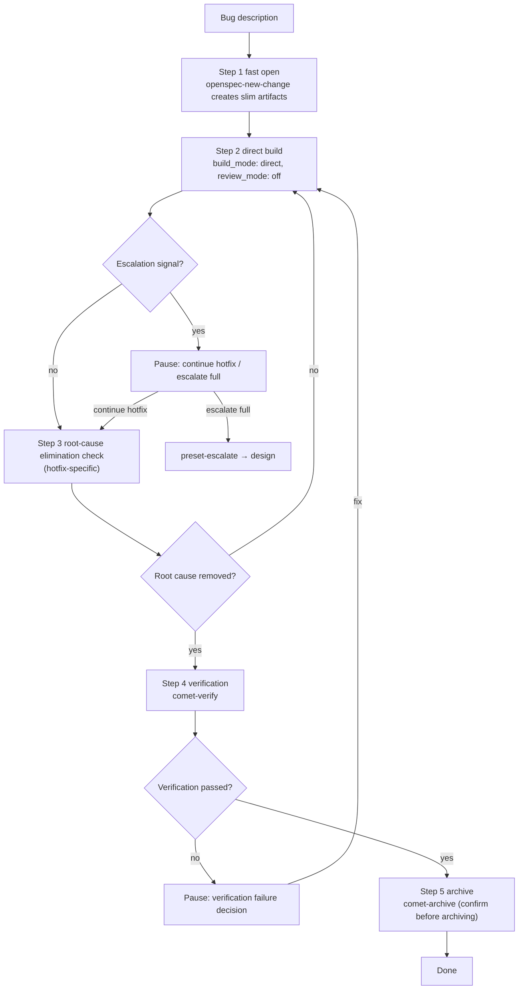

`hotfix` is one of Comet's lightweight presets, for **fixing a clear bug**. It runs `open -> build -> verify -> archive`, skipping full brainstorming and full planning while still keeping OpenSpec state, **root-cause elimination checks**, verification, and archive.

hotfix is not "no process". It only lowers the up-front design cost; recovery, verification, and archive all still apply.

tweak and hotfix are both lightweight presets and share mechanisms such as the escalation decision, continuous execution, and mandatory stops. For the differences, see [tweak preset](/en/presets/tweak).

<p align="center">
  
</p>

<p align="center">
  hotfix is fast because the design overhead is lower; root-cause checks, verification, and archive
  still apply.
</p>

<Tip>
  Normally you only need <code>/comet</code>. When the project configuration selects Classic, the
  internal <code>/comet-classic</code> detects an intent to fix existing broken, regressed, or
  misbehaving behavior, prefers hotfix, and auto-invokes <code>/comet-hotfix</code>. Type the preset
  command directly only when you want manual control. See <a href="#how-it-gets-triggered">How it
  gets triggered</a>.
</Tip>

## How it gets triggered

hotfix is usually **not a command you type**. When you call `/comet` and land in Classic, the internal `/comet-classic` runs preset detection first at Step 0:

| Your description                                                                                             | Routing                                                    |
| ------------------------------------------------------------------------------------------------------------ | ----------------------------------------------------------- |
| Fix existing broken/regressed/misbehaving behavior + meets the hotfix conditions (no new capability, no full design) | Auto `/comet-hotfix`                                        |
| A light/medium change that fits a single OpenSpec change, executed through OpenSpec apply, with no need for full deep design or plan | Auto `/comet-tweak` (see [tweak preset](/en/presets/tweak)) |
| No preset matches                                                                                            | Full `/comet-classic`, following the active change          |

You can also type `/comet-hotfix` directly. To resume normally, keep using `/comet`; once the configuration enters Classic, the internal `/comet-classic` reads the `workflow` field of `.comet.yaml` and routes back to `/comet-hotfix` while the change is in `phase: build`.

---

## When to use it

All of these must be true:

- You are fixing a bug in existing functionality and **not adding a capability**.
- No interface or architecture changes are involved.
- The scope is predictable (file count is only a hint, not a hard escalation condition).

**Not suitable for:** cross-module redesign, database schema changes, a new capability or public API, or product design discussion. If a fix hits an escalation signal, Comet pauses and lets you choose between continuing hotfix and escalating to full.

## Relationship to full and tweak

| Dimension | hotfix | full | tweak |
| --- | --- | --- | --- |
| Goal | Fix a bug | New feature / architecture / large requirement | Adjust behavior or content |
| Flow | open → build → verify → archive | open → design → build → verify → archive | open → build → verify → archive |
| Brainstorming | Skipped | Required | Skipped |
| Design Doc | Not required | Required | Not required |
| Delta spec | Exception (only when the fix changes an existing spec acceptance scenario) | Split from the PRD | Formal artifact (needing a delta spec is not an escalation reason) |
| Build style | Manual task loop (`build_mode: direct`) | Chosen at build time | OpenSpec apply (`build_mode: direct`) |

If you cannot classify the change, call `/comet` and describe its scope. When the routing evidence is insufficient or conflicts with a risk signal, Comet asks for confirmation.

---

## What happens



### Step 1: Fast open (preset open)

Load `openspec-new-change` (without the long `openspec-explore` exploration) and create slim artifacts:

| Artifact | Content |
| --- | --- |
| proposal.md | Problem description + root-cause analysis + fix goal (no solution comparison) |
| design.md | The fix approach (one is enough; no multi-option comparison) |
| tasks.md | Fix task list |
| delta spec | **Usually not needed** (only when the fix changes an existing spec acceptance scenario, and only `## MODIFIED Requirements`) |

Initialize the hotfix state (the defaults `init` writes are listed below):

```bash
node "$COMET_STATE" init <name> hotfix
node "$COMET_STATE" check <name> open
node "$COMET_GUARD" <change-name> open --apply
```

The open guard does **not** require `design.md` for hotfix (only full does), so open jumps straight to build and **skips the design phase**.

### Hotfix init defaults

`init <name> hotfix` writes the following defaults to `.comet.yaml` (identical to tweak — both skip the design phase):

| Field | hotfix/tweak default | (full default) |
| --- | --- | --- |
| `build_mode` | `direct` | `null` (chosen at build) |
| `tdd_mode` | `direct` | `null` (chosen at build) |
| `review_mode` | `off` | From project config / env (may be null) |
| `isolation` | `null` (chosen at entry) | `null` (chosen at build) |
| `verify_mode` | `light` | `null` (decided by scale at verify) |

hotfix pauses once at entry so you can explicitly keep the current branch, create a branch, or create a worktree; it never selects an isolation mode silently. After you confirm, `isolation` and `bound_branch` record the actual execution workspace, and later accidental branch switches are blocked. The remaining build fields use the preset values, and the guard **waives** the `review_mode`/`tdd_mode` selection check for preset workflows. `build_mode: direct` allows hotfix/tweak only by default; full must explicitly set `direct_override: true`.

### Step 2: Direct build (preset build)

Use the defaults `build_mode: direct`, `tdd_mode: direct`, and `review_mode: off`, plus the `isolation` confirmed at entry. `brainstorming` and `writing-plans` are skipped. Work through the tasks one by one:

1. **Reproduce first, then fix**: reproduce the bug and record failing evidence before touching code. When automation is possible, add a regression test that fails first. Do not modify code without reproduction evidence; when the bug cannot be reproduced automatically, record the manual reproduction steps and result in the proposal or the verification report.
2. Read the unfinished tasks in tasks.md.
3. Per task: change code → format → run tests → tick `- [x]` → commit (`fix: <short fix description>`).
4. When all tasks are done, explicitly run the project's test and build commands.

<Warning>
  On a crash, test failure, or build failure, <strong>force-load</strong> <code>systematic-debugging</code> —
  do not fix source code before the root-cause investigation is complete. Add a minimal failing test to
  reproduce the issue first, then fix the source, and confirm with the relevant tests and builds. This is
  the debugging protocol shared by build/hotfix/tweak (<a href="/en/concepts/decision-points">decision
  points</a>).
</Warning>

Task count alone **never** switches the execution mode: no matter how many tasks there are, work advances sequentially inside the current hotfix, and only a qualitative-change signal or the file-count threshold pauses to ask about escalation. When the fix **changes an existing spec acceptance scenario**, create a delta spec (`## MODIFIED Requirements` only).

### Step 3: Root-cause elimination check (hotfix-specific)

**This step exists only in hotfix** (tweak does not have it). It runs before the build guard to make sure the fix actually removes the root cause:

1. Read the bug description and root cause from proposal.md.
2. Search and verify that the problem code no longer exists.
3. If the root cause is not removed, go back to Step 2 and keep fixing (still in build; no state rollback is needed).

This step is also a source of escalation signals: if the root-cause check finds a **deep architecture issue**, or the fix needs **extra interface changes**, a qualitative signal hits and Comet pauses for your decision.

```bash
node "$COMET_GUARD" <change-name> build --apply
```

### Step 4: Verification (preset verify)

Reuse `/comet-verify`; the scale assessment decides between light and full:

| Situation | Verification path |
| --- | --- |
| Small hotfix with no delta spec | Usually light (6 checks; `review_mode: off` means no automatic review) |
| A delta spec was created | Full, per the scale-assessment rules |

To add review, set it manually before verifying:

```bash
node "$COMET_STATE" set <name> review_mode standard
```

### Step 5: Archive (preset archive)

Reuse `/comet-archive`. It requires `verify_result: pass` and waits for the **final confirmation before archiving**. If there is a delta spec, sync it into the main spec.

---

## Escalation decision (three layers)

hotfix's scope decision uses three layers so that a raw file count never becomes a hard escalation condition that wrongly stops normal bug fixes.

### 1. Qualitative signals (any hit pauses)

| Qualitative signal | Meaning |
| --- | --- |
| Cross-module coordinated change | Requires coordinated changes across components or layers |
| New capability needed | The fix introduces new capability |
| Database schema change | Structural adjustment |
| New public API introduced | The fix creates a new external interface |
| Deep architecture issue | The root-cause check finds something that needs an architecture-level solution |

### 2. File-count threshold (you decide)

When the number of changed files crosses the hint threshold (for example **more than 4**), Comet pauses for your decision. File count is a **tripwire for user choice**, not a hard escalation condition — more files does not equal a qualitative change.

### 3. Verification level (decided by scale)

`comet-state scale` only sets `verify_mode`; it does not gate the flow or trigger escalation.

### The escalation decision (a pause point)

When an escalation signal or the file-count threshold hits, Comet **pauses and lets you choose between two options** (you cannot escalate on your own, or decide on your own to continue):

| Option | Result |
| --- | --- |
| **A. Continue hotfix** | You confirm the scope is contained; continue open → build → verify → archive |
| **B. Escalate to full** | You decide deep design is needed |

After choosing B, use the legal escalation channel (**do not hand-edit `.comet.yaml`**):

```bash
node "$COMET_STATE" transition <name> preset-escalate
```

It sets `workflow: full` and `classic_profile: full` in one shot, rolls `phase` back to `design`, and clears `design_doc`; then it loads `/comet-design` to fill in the Design Doc. Completed code, tasks, and OpenSpec artifacts are all kept — you only add a Design Doc, you do not start over. `preset-escalate` can only fire from a hotfix/tweak in `phase: build`; any other situation reports an error.

## Continuous execution and mandatory stops

hotfix **executes continuously in one go** by default — once invoked, it advances automatically and does not pause on its own. But regardless of `auto_transition`, the following situations **must pause** for your confirmation:

1. An escalation signal or the file-count threshold hits.
2. The verification phase reaches a verification-failure decision.
3. Final archive and delivery confirmation (including the archive-locally-only option).

With `auto_transition: false`, execution degrades to manual per-phase advancement: it stops at every phase boundary and you run the next phase command yourself.

<Tip>
  After an escalation, Comet never archives automatically — whether the handoff is automatic or manual,
  <code>/comet-archive</code> still asks for a final confirmation before archiving.
</Tip>

## Exit conditions

- The bug is fixed and tests pass.
- The change is archived.
- If the spec changed, it is synced into the main spec.
- Phase guards: run `comet-guard <name> build --apply` before build → verify, and `comet-guard <name> verify --apply` before verify → archive.

## Recovery

hotfix is idempotent. After an interruption, resume with `/comet`; once the configuration enters Classic, the internal `/comet-classic` reads the `workflow` field of `.comet.yaml` and routes back to `/comet-hotfix` while the change is in `phase: build`. `comet-state check <name> build --recover` prints recovery context, and work continues from the first unfinished task in tasks.md.

## Next steps

- [tweak preset](/en/presets/tweak) — the other lightweight preset (adjust behavior or content)
- [Auto-transition](/en/concepts/auto-transition) — continuous execution, escalation, and `preset-escalate`
- [Decision points](/en/concepts/decision-points) — hotfix's pause points
- [Verify phase](/en/phases/verify) — the verification flow hotfix reuses
