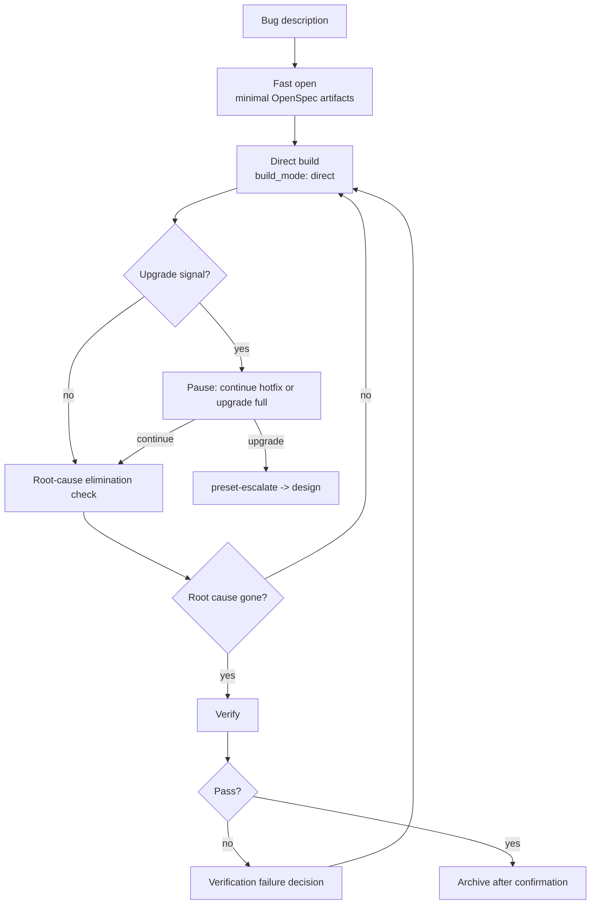

`hotfix` is a lightweight Comet preset for fixing a clear bug. It runs `open -> build -> verify -> archive`, skips full brainstorming and planning, but still keeps OpenSpec state, **root-cause elimination checks**, verification, and archive.

hotfix is not “no process.” It reduces up-front design cost while preserving recovery, verification, and traceability.

<p align="center">
  
</p>

<p align="center">
  hotfix is faster because the design overhead is lower, not because verification and archive
  disappear.
</p>

<Tip>
  Normally you only need <code>/comet</code>. When project configuration selects Classic, the
  internal <code>/comet-classic</code> router recognizes a request to fix existing broken behavior,
  prefers hotfix, and invokes <code>/comet-hotfix</code>. Use the preset command directly only for
  manual control.
</Tip>

## When to use it

Use hotfix when all of these are true:

- You are fixing existing behavior.
- You are not adding a new capability.
- You are not changing public APIs, schemas, or architecture.
- The scope is predictable.

Do not use hotfix for cross-module redesign, database schema changes, new capabilities, public API changes, or product design discussion. If the fix hits an upgrade signal, Comet pauses and asks whether to continue hotfix or upgrade to full.

## Relationship to full and tweak

| Dimension     | hotfix                             | full                                         | tweak                              |
| ------------- | ---------------------------------- | -------------------------------------------- | ---------------------------------- |
| Goal          | Fix a bug                          | New feature, architecture, large requirement | Adjust behavior or content         |
| Flow          | open -> build -> verify -> archive | open -> design -> build -> verify -> archive | open -> build -> verify -> archive |
| Brainstorming | Skipped                            | Required                                     | Skipped                            |
| Design Doc    | Not required                       | Required                                     | Not required                       |
| Delta spec    | Exception only                     | Normal                                       | First-class artifact               |
| Build style   | Direct task loop                   | Selected during build                        | OpenSpec apply                     |

## Flow



## Default state

`comet-state init <name> hotfix` defaults to:

| Field         | Default  |
| ------------- | -------- |
| `build_mode`  | `direct` |
| `tdd_mode`    | `direct` |
| `review_mode` | `off`    |
| `isolation`   | `branch` |
| `verify_mode` | `light`  |

## Root-cause check

This is hotfix-specific. Before build exits, Comet checks that the proposal's described root cause has actually been removed. If not, it stays in build and continues fixing.

## Upgrade signals

Comet pauses when it sees qualitative signals such as cross-module coordination, new capability, schema change, new public API, or deep architecture issue. File-count thresholds are tripwires for user confirmation, not automatic full-workflow upgrades.

Upgrade through the legal transition:

```bash
node "$COMET_STATE" transition <name> preset-escalate
```

This switches the workflow to full and returns to design without discarding existing artifacts.

## Recovery

Hotfix is idempotent. After interruption, run `/comet`. When configuration selects Classic, the internal `/comet-classic` router reads `.comet.yaml` and returns to `/comet-hotfix` when the change is in `phase: build`.

## Next steps

- [tweak preset](/en/presets/tweak)
- [Auto-transition](/en/concepts/auto-transition)
- [Decision points](/en/concepts/decision-points)
- [Verify phase](/en/phases/verify)
