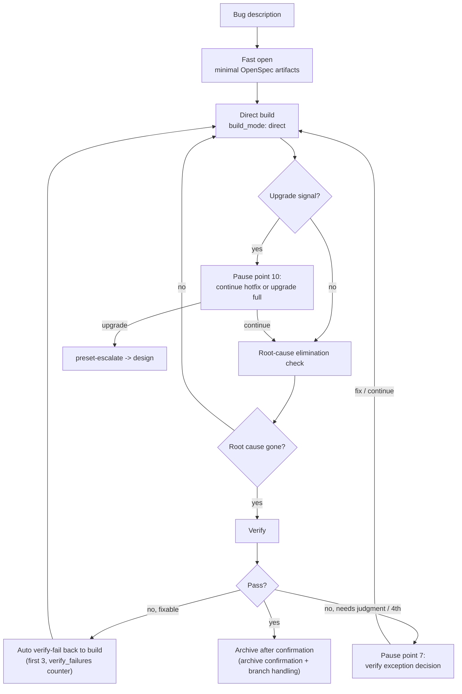

`hotfix` is a lightweight Comet preset for fixing a clear bug. It runs `open -> build -> verify -> archive`, skips full brainstorming and planning, but still keeps OpenSpec state, **root-cause elimination checks**, verification, and archive.

hotfix is not “no process.” It reduces up-front design cost while preserving recovery, verification, and traceability.

<p align="center">
  
</p>

<p align="center">hotfix is faster because the design overhead is lower, not because verification and archive disappear.</p>

<Tip>
  Normally you only need <code>/comet</code>. When your request is about fixing existing broken behavior, routing prefers the hotfix preset and invokes <code>/comet-hotfix</code> automatically. Use <code>/comet-hotfix</code> directly only when you want manual control.
</Tip>

## When to use it

Use hotfix when all of these are true:

- You are fixing existing behavior.
- You are not adding a new capability.
- You are not changing public APIs, schemas, or architecture.
- The scope is predictable.

Do not use hotfix for cross-module redesign, database schema changes, new capabilities, public API changes, or product design discussion. If the fix hits an upgrade signal, Comet pauses and asks whether to continue hotfix or upgrade to full.

## Relationship to full and tweak

| Dimension | hotfix | full | tweak |
| --- | --- | --- | --- |
| Goal | Fix a bug | New feature, architecture, large requirement | Adjust behavior or content |
| Flow | open -> build -> verify -> archive | open -> design -> build -> verify -> archive | open -> build -> verify -> archive |
| Brainstorming | Skipped | Required | Skipped |
| Design Doc | Not required | Required | Not required |
| Delta spec | Exception only | Normal | First-class artifact |
| Build style | Direct task loop | Selected during build | OpenSpec apply |

## Flow



## Default state

```bash
comet state init <name> hotfix
comet state select <name>
```

`init <name> hotfix` writes these defaults to `.comet.yaml`:

| Field | Default |
| --- | --- |
| `build_mode` | `direct` |
| `tdd_mode` | `direct` |
| `review_mode` | `off` |
| `isolation` | `current` |
| `verify_mode` | `light` |

`isolation: current` truthfully records execution in the current workspace; it switches to `branch`/`worktree` only after a branch or workspace is created. `tdd_mode: direct` skips Red-Green-Refactor but still requires relevant tests and regression evidence.

## Build requires RED evidence

Before implementation, **reproduce the bug and record failing evidence first**: confirm the reported old behavior with minimal repeatable steps; when automatable, add a regression test that fails for this bug and confirm the failure is caused by the bug. Only after RED evidence exists does Comet proceed task by task — and each task re-runs the new failing regression test to confirm it turns green before running related tests.

## Must-stop points

Hotfix runs as one continuous execution, but these genuine user decisions always pause:

1. An upgrade-assessment signal is hit (pause point 10)
2. Verify-phase acceptance of a WARNING/SUGGESTION deviation, spec drift handling, or the strategy after the 4th failure (pause point 7) — the first 3 repairable failures return to build automatically
3. Final archive confirmation (pause point 8) and branch handling after the archive commit (pause point 9)

With `auto_transition: false`, each phase boundary ends the current invocation and returns control with `HINT` — this is a manual handoff, not a new confirmation point.

## Root-cause check

This is hotfix-specific. Before build exits, Comet checks that the proposal's described root cause has actually been removed. If not, it stays in build and continues fixing.

## Upgrade signals

Comet pauses when it sees qualitative signals such as cross-module coordination, new capability, schema change, new public API, or deep architecture issue. File-count thresholds are tripwires for user confirmation, not automatic full-workflow upgrades.

Upgrade through the legal transition:

```bash
comet state transition <name> preset-escalate
```

This atomically sets `workflow: full` and clears the preset-only lightweight build settings, then returns to design without discarding existing artifacts. After upgrading to full, the full workflow configuration is re-selected in the joint decision after the Design Doc. `preset-escalate` can only be triggered from hotfix/tweak at `phase: build`.

## Recovery

Hotfix is idempotent. After interruption, run `/comet`; it reads `.comet.yaml` and routes back to `/comet-hotfix` when the change is in `phase: build`.

## Next steps

- [tweak preset](/en/presets/tweak)
- [Auto-transition](/en/concepts/auto-transition)
- [Decision points](/en/concepts/decision-points)
- [Verify phase](/en/phases/verify)
