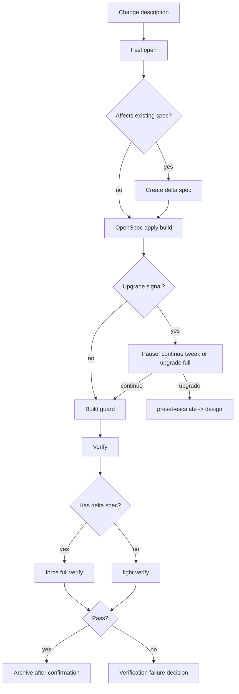

`tweak` is Comet's lightweight OpenSpec path. It runs `open -> build -> verify -> archive`, skips brainstorming and full planning, but treats **delta spec as a first-class artifact** and builds through OpenSpec apply.

<p align="center">
  
</p>

<p align="center">
  tweak is not a casual edit path; it uses delta spec and OpenSpec apply for bounded medium changes.
</p>

Use tweak for configuration changes, documentation or prompt improvements, behavior tuning, and brownfield changes that need a delta spec but do not require full deep design.

<Tip>
  Normally you only need <code>/comet</code>. When project configuration selects Classic, the
  internal <code>/comet-classic</code> router recognizes a request that fits one OpenSpec change
  without full design and prefers tweak automatically.
</Tip>

## When to use it

Use tweak when all of these are true:

- The work fits one OpenSpec change.
- You do not need a Superpowers Design Doc or full implementation plan.
- There is no cross-module architectural coordination.
- Scope is predictable.

If you are unsure, start with tweak. Upgrade signals pause and let you move to full.

## Relationship to full and hotfix

| Dimension        | tweak                              | full                                            | hotfix                             |
| ---------------- | ---------------------------------- | ----------------------------------------------- | ---------------------------------- |
| Goal             | Adjust behavior or content         | New capability, architecture, large requirement | Fix a bug                          |
| Flow             | open -> build -> verify -> archive | open -> design -> build -> verify -> archive    | open -> build -> verify -> archive |
| Build style      | OpenSpec apply                     | Superpowers plan + execution choice             | Direct task loop                   |
| Delta spec       | First-class artifact               | Normal via PRD/spec design                      | Exception only                     |
| Root-cause check | No                                 | No                                              | Yes                                |
| Commit prefix    | `tweak:`                           | Normal project convention                       | `fix:`                             |

## Flow



## OpenSpec apply build

The apply path belongs to tweak. The agent must read `openspec instructions apply --change <name> --json`, consume listed context files, complete tasks, run relevant tests, and commit focused changes. Full workflow must not reuse this path.

## Verification

If a tweak has a delta spec, verification is forced to full so OpenSpec consistency is checked. Without a delta spec, light verification is usually enough.

## Upgrade signals

Tweak pauses for qualitative signals such as cross-module coordination, need to split into multiple OpenSpec changes, schema change, public API change, or deep architecture issue. File count is a tripwire for user choice, not an automatic upgrade.

Upgrade through:

```bash
node "$COMET_STATE" transition <name> preset-escalate
```

## Recovery

Tweak is idempotent. After interruption, run `/comet`. When configuration selects Classic, the internal `/comet-classic` router reads `.comet.yaml` and returns to `/comet-tweak` when needed.

## Next steps

- [hotfix preset](/en/presets/hotfix)
- [Auto-transition](/en/concepts/auto-transition)
- [Decision points](/en/concepts/decision-points)
- [Verify phase](/en/phases/verify)
