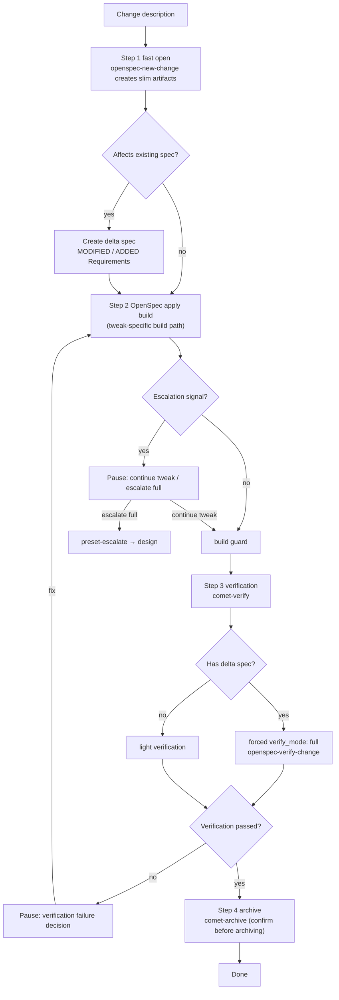

`tweak` is Comet's lightweight preset for reusing the native OpenSpec flow. It runs `open -> build -> verify -> archive`, skipping brainstorming and full planning, but it treats **delta spec as a formal artifact** — and builds through OpenSpec's native apply action.

<p align="center">
  
</p>

<p align="center">
  tweak records the change in a delta spec and executes it through OpenSpec apply.
</p>

Use tweak for configuration changes, documentation or prompt improvements, and behavior tuning, as long as the scope converges into a single change and you do not need a full Design Doc or implementation plan.

<Tip>
  Normally you only need <code>/comet</code>. After the project configuration selects Classic, the
  internal <code>/comet-classic</code> recognizes a light or medium modification that fits one
  OpenSpec change and needs no full design, prefers tweak, and auto-invokes
  <code>/comet-tweak</code>. Type the preset command directly only when you want manual control. See
  <a href="#how-it-gets-triggered">How it gets triggered</a>.
</Tip>

## How it gets triggered

tweak is generally **not a command you type**. When you call `/comet` and land in Classic, the internal `/comet-classic` runs preset detection first at Step 0:

| Your description                                                                                             | Routing                                                    |
| ------------------------------------------------------------------------------------------------------------ | ----------------------------------------------------------- |
| A light/medium change that fits a single OpenSpec change, executed through OpenSpec apply, with no need for full deep design or plan | Auto `/comet-tweak`                                        |
| Fix existing broken/regressed/misbehaving behavior + meets the hotfix conditions (no new capability, no full design) | Auto `/comet-hotfix` (see [hotfix preset](/en/presets/hotfix)) |
| No preset matches                                                                                            | Full `/comet-classic`, following the active change          |

You can also type `/comet-tweak` directly. To resume normally, keep using `/comet`; once the configuration enters Classic, the internal `/comet-classic` reads the `workflow` field of `.comet.yaml` and routes back to `/comet-tweak` while the change is in `phase: build`.

---

## When to use it

All of these must be true:

- The work converges into a **single OpenSpec change**.
- You do not need a Superpowers Design Doc or a full plan to clarify the approach.
- No cross-module or cross-layer architectural coordination is involved.
- The task size is predictable (file count and task count are only hints, not hard escalation conditions).

**Typical scenarios:**

| Scenario | Why tweak |
| --- | --- |
| Configuration adjustment | Changing a config value or rule needs the motivation recorded, but not architectural design |
| Documentation or prompt optimization | Changing copy/prompts benefits from spec-driven acceptance, but full is too heavy |
| Behavior tuning | Adjusting existing behavior parameters/logic across a few files without changing substance |
| Brownfield changes that need a delta spec | Modifying acceptance scenarios in an existing spec; the delta spec is the core artifact |

<Tip>
  If you cannot classify the change, call <code>/comet</code> and describe its scope. When the routing
  evidence is insufficient or conflicts with a risk signal, Comet asks for confirmation.
</Tip>

## Relationship to full and hotfix

| Dimension | tweak | full | hotfix |
| --- | --- | --- | --- |
| Goal | Adjust behavior or content | New feature / architecture / large requirement | Fix a bug |
| Flow | open → build → verify → archive | open → design → build → verify → archive | open → build → verify → archive |
| Build style | **OpenSpec apply** (`openspec-apply-change`, tweak-specific) | writing-plans + execution choice | Manual task loop |
| Delta spec | **Formal artifact** (`## MODIFIED`/`## ADDED`; needing it is not an escalation reason) | Split from the PRD | Exception (only `## MODIFIED`) |
| Root-cause elimination check | No | No | **Yes** (hotfix-specific) |
| Commit prefix | `tweak:` | Per the project's commit convention | `fix:` |
| File-count threshold | More than 6 | — | More than 4 |

<Note>
  <strong>The key difference is the status of the delta spec</strong>: hotfix treats the delta spec as
  an exception, tweak treats it as a normal artifact — <strong>needing a delta spec is not by itself an
  escalation reason</strong>. If your change naturally modifies a spec, tweak is the right choice. The
  other key difference is the build style: tweak uses OpenSpec's native apply path (which belongs only
  to tweak; full must not adopt it).
</Note>

---

## What happens



### Step 1: Fast open (preset open)

Load `openspec-new-change` (**without** the long `openspec-explore` exploration) and create slim artifacts:

| Artifact | Content |
| --- | --- |
| proposal.md | Change motivation + goal + scope |
| design.md | A short implementation note (no solution comparison) |
| tasks.md | Task list |
| delta spec | **Optional but common** — if the change affects an existing spec acceptance scenario, create it as a normal artifact (`## MODIFIED Requirements` or `## ADDED Requirements`). Needing a delta spec is not by itself an escalation reason |

Initialize the tweak state:

```bash
node "$COMET_STATE" init <name> tweak
node "$COMET_STATE" check <name> open
node "$COMET_GUARD" <change-name> open --apply
```

The open guard does **not** require `design.md` for tweak (only full does), so open jumps straight to build and **skips the design phase**. The defaults `init` writes and the isolation choice at entry (`isolation` defaults to `null`, and you explicitly keep the current branch, create a branch, or create a worktree; after confirmation, `isolation` and `bound_branch` are recorded) are the same as hotfix. The default value table and its explanation are in [hotfix preset: Init defaults](/en/presets/hotfix#hotfix-init-defaults).

### Step 2: OpenSpec apply build (tweak-specific build)

**This is the biggest difference between tweak and hotfix.** tweak does not run a manual task loop; it executes tasks through OpenSpec's native `openspec-apply-change`:

Use the default `build_mode: direct` and skip Superpowers `brainstorming` and `writing-plans`. The apply flow is:

1. Run `openspec status --change "<name>" --json` to confirm the schema and task artifacts.
2. Run `openspec instructions apply --change "<name>" --json` to read the apply instructions, `contextFiles`, task progress, and dynamic instructions.
3. **Read every context file listed in the apply instructions** (never implement from an old conversation or a handwritten task loop alone).
4. Complete the unchecked tasks one by one according to the apply instructions, keeping changes minimal and focused.
5. After each task: format → run the relevant tests → tick it off per the `openspec-apply-change` rules → commit (`tweak: <short change description>`).
6. When all tasks are done, explicitly run the project's relevant tests and build commands.
7. Run the build guard to complete the build → verify transition.

<Warning>
  This apply path <strong>belongs to tweak only</strong>. Full <code>/comet-classic</code> or{' '}
  <code>workflow: full</code> <strong>must not adopt</strong> tweak's{' '}
  <code>openspec-apply-change</code> build path — full still has to produce a Design Doc through{' '}
  <code>/comet-design</code> first, and then go through Superpowers planning and execution with{' '}
  <code>/comet-build</code>.
</Warning>

On a crash, test failure, or build failure, force-load `systematic-debugging` (the shared debugging protocol). Throughout build, keep judging escalation signals and do a consolidated review before the build → verify guard.

### Step 3: Verification (preset verify)

Reuse `/comet-verify`; the verification path depends on whether there is a delta spec:

| Situation | Verification path |
| --- | --- |
| Has a delta spec | **Forced full** (`verify_mode: full`), via `openspec-verify-change`, covering delta spec consistency |
| No delta spec | Usually light (6 checks) |

When there is a delta spec, set it explicitly:

```bash
node "$COMET_STATE" set <change-name> verify_mode full
```

To add review, set it manually before verifying:

```bash
node "$COMET_STATE" set <name> review_mode standard
```

### Step 4: Archive (preset archive)

Reuse `/comet-archive`. It requires `verify_result: pass` and waits for the **final confirmation before archiving**. If there is a delta spec, sync it into the main spec with the `ADDED`/`MODIFIED`/`REMOVED`/`RENAMED` semantics.

---

## The invoked skill

| Skill                    | Purpose                                           | When it runs                                                              |
| ------------------------ | ------------------------------------------------- | ------------------------------------------------------------------------- |
| `openspec-new-change`    | Create the slim change scaffold                   | Step 1, immediately; **no** long `openspec-explore` exploration           |
| `openspec-apply-change`  | OpenSpec apply build; executes and checks off tasks | Step 2, the tweak-specific execution mode                                |
| `systematic-debugging`   | Exception debugging                               | Force-loaded whenever a crash, test failure, or build failure occurs      |
| `openspec-verify-change` | Delta-spec-to-implementation consistency check    | Step 3, with `verify_mode: full` forced when a delta spec exists          |

- `brainstorming` and `writing-plans` are skipped as well: tweak does no technical design or implementation plan and applies changes directly from the delta spec.
- Without a delta spec, verification runs in light mode; verify and archive load skills exactly like their stage pages.

## Escalation decision (three layers)

tweak's three-layer escalation decision shares the same mechanism as hotfix: when a qualitative-change signal hits or the file-count threshold is crossed, Comet **pauses and lets you choose between two options** (continue tweak or escalate to full). File count is only a tripwire and never escalates on its own; `comet-state scale` only sets `verify_mode` and does not gate the flow. To escalate, you can only use the legal `preset-escalate` channel — no self-escalation and no hand-editing `.comet.yaml`. For the complete mechanism (the signal list, the escalation decision, and the one-shot effect of `preset-escalate`), see [hotfix preset](/en/presets/hotfix).

tweak differs from hotfix in exactly two ways:

1. **Qualitative signal #2 is different**: tweak's is "the work needs to be split into multiple OpenSpec changes", hotfix's is "a new capability is needed" — because tweak must converge into a single change, while hotfix adds no capability. The other signals (cross-module coordinated changes, database schema changes, new public APIs, deep architecture issues) are identical on both pages.
2. **The file-count threshold is higher**: when the number of changed files exceeds **6**, tweak pauses for your decision (hotfix pauses above 4), because tweak itself may touch more files. File count is a **tripwire for user choice**, not a hard escalation condition — more files does not equal a qualitative change.

## Continuous execution and mandatory stops

The default behavior and mandatory stops are the same as hotfix: tweak **executes continuously in one go** by default — once invoked, it advances automatically and does not pause on its own. Regardless of `auto_transition`, tweak **must pause** for your confirmation when an escalation signal or the file-count threshold hits, when it reaches a verification-failure decision, or when archive and delivery confirmation is needed. With `auto_transition: false`, execution degrades to manual per-phase advancement. For the complete list of mandatory stops, see [hotfix preset: Continuous execution and mandatory stops](/en/presets/hotfix#continuous-execution-and-mandatory-stops).

There is one difference in how tweak executes: tweak always runs through OpenSpec apply, so **task count does not change the execution mode**, and it never pauses to confirm because of task count.

## Exit conditions

The exit conditions are the same as hotfix, except for the object being described: tweak says "the change is complete and tests pass", hotfix says "the bug is fixed and tests pass". The remaining conditions — the change is archived, spec changes are synced into the main spec, and the phase guards before build → verify and verify → archive — are covered in [hotfix preset: Exit conditions](/en/presets/hotfix#exit-conditions).

## Recovery

The recovery mechanism is the same as hotfix: tweak is idempotent. After an interruption it resumes from the first unchecked task in tasks.md, and `comet-state check <name> build --recover` prints recovery context. For phase routing after an interruption, see [hotfix preset: Recovery](/en/presets/hotfix#recovery); tweak's own routing entry is in [How it gets triggered](#how-it-gets-triggered) on this page.

## Next steps

- [hotfix preset](/en/presets/hotfix) — the other lightweight preset (fix a bug)
- [Auto-transition](/en/concepts/auto-transition) — continuous execution, escalation, and `preset-escalate`
- [Decision points](/en/concepts/decision-points) — tweak's pause points
- [Verify phase](/en/phases/verify) — the verification flow tweak reuses
