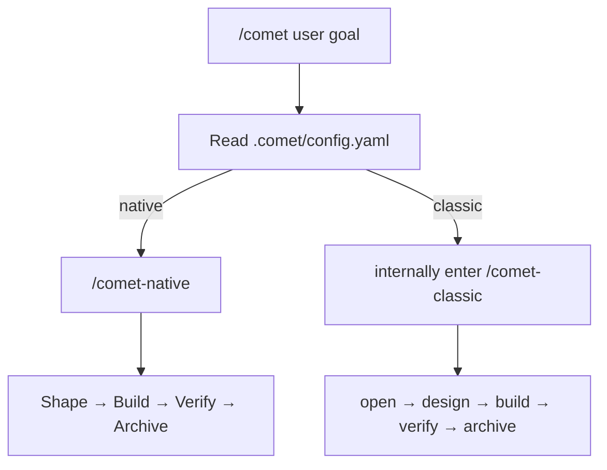

This page covers the shortest path: install the CLI, initialize a project with Native as the default, and invoke `/comet` from an agent platform.

## Prerequisites

- Node.js 22 or newer
- npm or npx
- Git
- A supported AI coding platform, such as Claude Code, Codex, Cursor, Gemini CLI, OpenCode, or ZCode

## 1. Install the CLI

```bash
npm install -g @rpamis/comet
```

Check that the command is available:

```bash
comet --version
```

## 2. Initialize your project

Enter the project root:

```bash
cd your-project
comet init
```

A project-scope initialization asks you to choose the Skill language and target platforms, then enables Native by default for a new Comet project and creates:

```text
.comet/config.yaml
comet/
```

Projects with clear existing Classic state remain Classic. You can also choose a workflow or Native artifact root explicitly:

```bash
# Initialize Native with artifacts under docs
comet init --workflow native --root docs

# Initialize Classic
comet init --workflow classic

# Initialize Native and Classic
comet init --workflow both

# Install Native globally
comet init --scope global --workflow native

# Install Native and Classic globally
comet init --scope global --workflow both
```

Only Classic installs or configures OpenSpec, Superpowers, and CodeGraph. Project-level Native, Classic, and both installs each receive one Comet workflow Rule; platforms with Hook support receive one shared Router that selects the Guard for the current change.

<Info>
  A project-scope installation records the project's default workflow, making it suitable for teams.
  A global installation provides the selected Native or Classic capabilities. On the first explicit
  `/comet` invocation in an unconfigured project, Comet snapshots those global defaults into the
  project's `.comet/config.yaml` and keeps artifacts inside that project. Later global-default changes
  do not rewrite an activated project.
</Info>

## 3. Call `/comet`

Open your agent platform in the project and type:

```text
/comet add avatar uploads to the user profile
```

`/comet` reads `.comet/config.yaml` and forwards the request to `/comet-native` or `/comet-classic`. Native creates a change for the goal and manages it through Shape → Build → Verify → Archive; the model chooses implementation methods for the project.



<p align="center">
  
</p>

<p align="center">
  Install, initialize, invoke `/comet`, and recover from file-backed state after an interruption.
</p>

## 4. Check state

Run this at any time:

```bash
comet status
```

You will see the default entry point and separate sections for Native, Classic, and unmanaged OpenSpec changes.

Run `comet doctor` to check the installation and configuration:

```bash
comet doctor
```

## 5. Resume interrupted work

If the session is interrupted, reopen the project and type:

```text
/comet continue
```

Comet resolves the project's default workflow, then resumes unfinished work from its change and runtime evidence.

## Next steps

- For the lightweight workflow, see [Native workflow](/en/concepts/native-workflow).
- For the classic five-phase constrained flow, see [Classic workflow concepts](/en/concepts/workflow).
- For quick fixes, see the [hotfix preset](/en/presets/hotfix).
