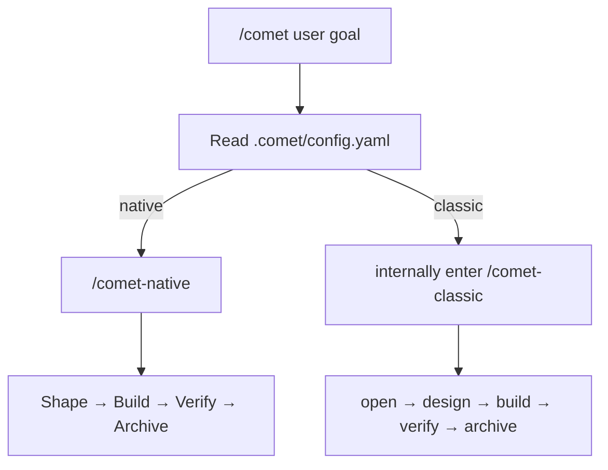

This page walks you through the shortest path: install the CLI, initialize your project with Native as the default, and invoke `/comet` from an agent platform.

## Prerequisites

- Node.js 22 or newer
- npm or npx
- Git
- A supported AI coding platform, such as Claude Code, Codex, Cursor, Gemini CLI, OpenCode, or ZCode

## 1. Install the CLI

```bash
npm install -g @rpamis/comet
```

Successful run indicator: `comet --version` prints a version number.

## 2. Initialize your project (Native by default)

Change into your project root and run:

```bash
cd your-project
comet init
```

Follow the wizard prompts to finish the setup. When initialization completes, a new project has Native enabled by default, and `.comet/config.yaml` is created at the project root.

Successful run indicator: `.comet/config.yaml` now exists at the project root. You can also run `comet doctor`; an output with no `✗` failure items means the installation is complete.

<Accordion title="Other initialization situations">
  New projects default to Native, so the command above covers most cases. Only reach for the variants below when you actually need them.

  If your project already has clear Classic state, `comet init` keeps Classic — do not manually flip such a project back to Native. To choose a workflow or a Native artifact root (such as `docs`) explicitly, use the `--workflow`, `--root`, and `--scope` options, for example:

  ```bash
  # Initialize Native with artifacts under docs
  comet init --workflow native --root docs

  # Initialize Classic
  comet init --workflow classic

  # Initialize Native and Classic
  comet init --workflow both

  # Install Native globally
  comet init --scope global --workflow native

  # Install Native and Classic globally
  comet init --scope global --workflow both
  ```

  Only Classic installs or configures OpenSpec, Superpowers, and CodeGraph. A project-level install of Native, Classic, or both always receives one Comet workflow Rule; on platforms with Hook support, Comet installs one shared Router that hands writes to the Guard of the current change.

  A global install provides the chosen workflow's capabilities globally. When an unconfigured project first explicitly calls `/comet`, Comet snapshots the global defaults into the project's `.comet/config.yaml`, and artifacts are still written only inside that project. An activated project is not rewritten by later changes to the global defaults.

  For all options and configuration merge rules, see [comet init](/en/cli/init); for the workflow trade-off, see [Native or Classic](/en/native/native-vs-classic).
</Accordion>

## 3. Call `/comet`

Open your agent platform inside the project and type:

```text
/comet implement avatar upload for the user profile page
```

`/comet` reads `.comet/config.yaml` and forwards the request to the `/comet-native` or `/comet-classic` Skill. With the default Native workflow, Comet creates a change for the goal and manages its goals, acceptance evidence, and archive through Shape → Build → Verify → Archive; the model chooses the concrete implementation approach for your project.

Successful run indicator: Comet replies that it has entered the Native Shape phase and created a change. You can also run `comet status` in a terminal and find the change listed under `Native Changes` (see Check status below).



<p align="center">
  
</p>

<p align="center">
  Install, initialize, invoke `/comet`, and recover from file-backed state after an interruption.
</p>

## Check status

Run this at any time:

```bash
comet status
```

You will see the default entry point and separate sections for Native, Classic, and unmanaged OpenSpec changes.

Run `comet doctor` to check your installation and configuration:

```bash
comet doctor
```

## Resume an interrupted workflow

If a session is interrupted, reopen the project and type:

```text
/comet continue
```

Comet resolves the project's default workflow, then resumes the unfinished work from the corresponding change and its runtime evidence.

## Next steps

- To understand the lightweight workflow, see [Native workflow](/en/concepts/native-workflow).
- For the classic five-phase flow, see [Classic workflow concepts](/en/concepts/workflow).
- For quick bug fixes, see the [hotfix preset](/en/presets/hotfix).
