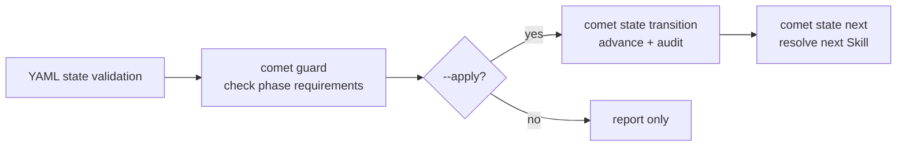

Comet's Classic commands are the runtime foundation of the five-phase workflow. Users, agents, and automation should prefer the stable top-level CLI:

```bash
comet state <subcommand>
comet guard <change-name> <phase> [--apply]
comet handoff <change-name> [options]
comet archive <change-name> [--dry-run]
```

| Public command | Responsibility | Reference |
| --- | --- | --- |
| `comet state` | Select the current change, read and transition state, record command evidence, and resolve the next Skill. | [comet state](/en/scripts/comet-state) |
| `comet guard` | Check phase requirements; `--apply` advances only after all checks pass. | [comet guard](/en/scripts/comet-guard) |
| `comet handoff` | Generate design/build context or calculate the handoff hash. | [comet handoff](/en/scripts/comet-handoff) |
| `comet archive` | Complete the OpenSpec merge and archive after final confirmation. | [comet archive](/en/scripts/comet-archive) |

## Packaged launchers

Comet moved from Bash scripts to Node `.mjs` launchers so the same workflow works on Windows, macOS, and Linux without Git Bash or WSL. The packaged command launchers are thin wrappers that import the generated `comet-runtime.mjs` in the same directory. The runtime bundles its dependencies and does not rely on the project's `node_modules`; launchers and runtime must stay on the same version.

<Note>
  The <code>comet-*.mjs</code> files remain compatibility and troubleshooting entrypoints. Normal instructions should use the stable top-level CLI above.
</Note>

## How the commands cooperate



State remains split across human-readable `.comet.yaml`, machine-owned `.comet/run-state.json`, and append-only `.comet/state-events.jsonl`. Use `comet status`, `comet doctor`, or `comet dashboard` for normal inspection.
