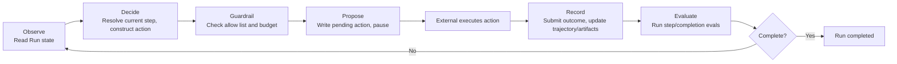
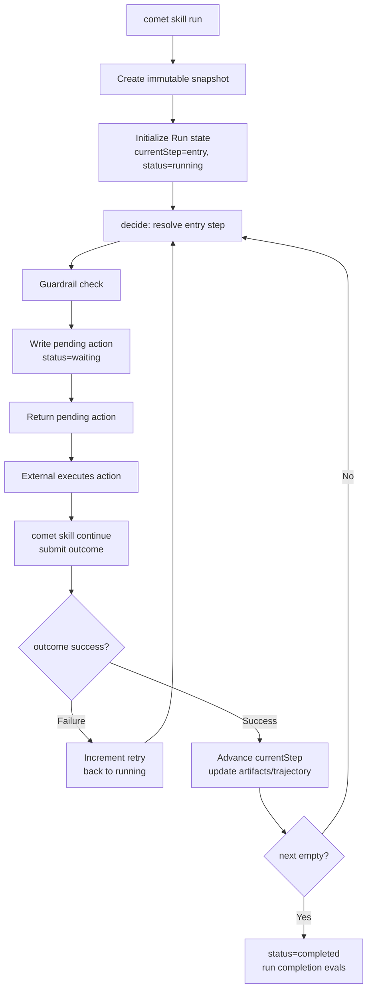
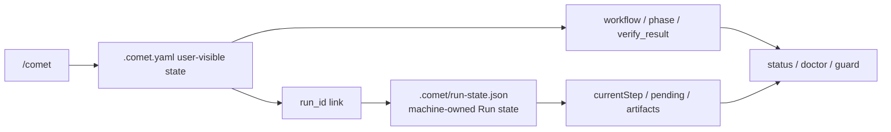

<Info>
  This is advanced content, for users who want to deeply understand the artifacts produced by `/comet-any` and the underlying mechanics of `comet skill`. Classic Spec-mode `/comet` users don't need to understand the Engine to use the five-phase workflow.
</Info>

Comet Skills are more than just Markdown prompts. As of 0.4.0-beta.1, Comet ships a built-in **Skill Engine** — a deterministic runtime responsible for executing, constraining, persisting, recovering, and evaluating Comet Skills. It provides stable content hashes, immutable snapshots, pending action recovery, guardrails, and runtime checks for multi-step Skills.

## Three types of Skill

| Type | Source | Common entry point | Notes |
| --- | --- | --- | --- |
| Built-in workflow Skills | Distributed in `assets/skills/` | `/comet`, `/comet-open`, `/comet-any` | Drive the five-phase workflow and Skill Creator |
| Project Skills | Installed to `.comet/skills/<name>` | `comet skill add` | Override built-in Skills by name; invalid overrides fail closed |
| Factory-generated Skills | Created or composed by `/comet-any` | `/comet-any`, `comet publish` | After generation they are ordinary Skill packages — evaluable, publishable, distributable |

### Skill discovery order

`resolveSkill` searches in the following order and stops when found:

1. **explicit** — the selector points to an existing directory, loaded directly. If the path doesn't exist, it errors out and doesn't keep searching.
2. **project** — `<projectRoot>/.comet/skills/<selector>`, **takes precedence over built-in**, so projects can override built-in Skills by name.
3. **builtin** — `assets/skills/<selector>`.
4. None found → **fail closed**, no silent fallback.

<Warning>
  When a project Skill overrides a built-in Skill by name, if the project Skill is invalid it fails outright rather than falling back to the built-in. This avoids the problem of "you think you're using a custom version, but you're silently using the built-in."
</Warning>

## Skill package structure

An Engine-enabled Skill package is more than just `SKILL.md` — it also includes a `comet/` control plane:

<Tree>
  <Tree.Folder name="<skill-name>/" defaultOpen>
    <Tree.File name="SKILL.md" />
    <Tree.Folder name="comet/" defaultOpen>
      <Tree.File name="skill.yaml" />
      <Tree.File name="guardrails.yaml" />
      <Tree.File name="checks.yaml" />
      <Tree.File name="evals.yaml" />
      <Tree.File name="eval.yaml" />
    </Tree.Folder>
    <Tree.Folder name="evals/" defaultOpen>
      <Tree.File name="evals.json" />
    </Tree.Folder>
    <Tree.Folder name="scripts/" />
    <Tree.Folder name="references/" />
    <Tree.Folder name="assets/" />
  </Tree.Folder>
</Tree>

### Responsibilities of each file

| File | Lifecycle | Responsibility | Loaded by |
| --- | --- | --- | --- |
| `comet/skill.yaml` | Runtime + authoring | Skill definition: goal, orchestration, skills, agents, tools | `loadSkillPackage` |
| `comet/guardrails.yaml` | Runtime | Override default guardrails (allow lists, budgets, confirmation requirements) | `loadSkillPackage` |
| `comet/checks.yaml` or `comet/evals.yaml` | Runtime | Runtime checks (progress/step/completion), one or the other | `loadSkillPackage` → `SkillPackage.evals` |
| `comet/eval.yaml` | Authoring | Authoring-time eval manifest (task, quality gates, expected evidence) | `comet eval` / Bundle backend |

<Note>
  <strong>Easy-to-confuse naming:</strong> the plural <code>evals.yaml</code> (or <code>checks.yaml</code>) is a runtime eval, checked by the Engine at run time; the singular <code>eval.yaml</code> is the authoring-time eval manifest, validated by <code>comet eval</code> before publishing. The two have different lifecycles and shouldn't be conflated. <code>checks.yaml</code> and <code>evals.yaml</code> cannot coexist.
</Note>

## Skill definition: skill.yaml

`skill.yaml` describes a Skill's goal, orchestration style, and declared capabilities:

```yaml
apiVersion: comet/v1alpha1
kind: Skill
metadata:
  name: comet-classic
  version: "1"
goal:
  statement: "Drive the five-phase recoverable workflow"
  inputs: []
  outputs: []
  success: []
orchestration:
  mode: deterministic
  entry: full.open
  steps:
    - id: full.open
      action:
        type: invoke_skill
        ref: comet-open
      next: full.design
    # ...more steps
skills: [comet-open, comet-design, comet-build, ...]
agents: []
tools: []
```

Key fields:

| Field | Meaning |
| --- | --- |
| `goal` | The Skill's goal, inputs, outputs, and success criteria — the basis for runtime completion evals; must be observable |
| `orchestration.mode` | `deterministic` (static step graph) or `adaptive` (Agent-driven) |
| `orchestration.entry` | Required in deterministic mode; references a known step id |
| `orchestration.steps` | The step graph; each step has an `id`, `action`, `next`, and optional `completionEvals` |
| `skills` / `agents` / `tools` | Declare available capabilities; the guardrails allow list can only reference declared items |

### Step action types

Each step's `action.type` is one of the following:

| Type | Meaning |
| --- | --- |
| `invoke_skill` | Invoke another Comet Skill |
| `call_tool` | Call a tool (including script tools) |
| `handoff` | Hand off control |
| `ask_user` | Ask the user a question (must have a `question`) |
| `checkpoint` | Checkpoint (usually used for terminal steps) |

## Two orchestration modes

Both modes share **the same execution loop**. The difference is who decides the next action.

### deterministic

- Steps form a static graph; `entry` specifies the starting point, and each step's `next` specifies the next step.
- The Engine itself resolves the current step → constructs the action → passes it through guardrails → pauses for the result.
- On success it advances to `next`; on failure it increments the retry count and stays on the current step.
- When `next` is empty the Run completes. `comet skill run` currently only supports deterministic end-to-end execution.

### adaptive

- Cannot define `entry` or `steps`.
- The Engine **doesn't propose actions itself** — an external Agent proposes them, injected via `acceptAdaptiveAction`, also passing through guardrails.
- Completion is driven by evals/Agent; there is no `next: null` terminal step.
- The loop layer is ready and covered by tests, but the public entry point of `comet skill run` currently rejects adaptive packages.

<Tip>
  If you're writing a multi-step Skill that needs recovery, use deterministic. Adaptive is intended for Agent autonomous-decision scenarios — it's loop-ready but not yet exposed through the CLI.
</Tip>

## Engine run loop

The Engine's core is a ReAct-style loop, but the Engine itself **performs no side effects** — it only decides, constrains, records, and evaluates. The actual action execution is delegated externally (Agent, platform, or human).



<p align="center">
  
</p>

<p align="center">The Engine only proposes, constrains, and records; actual side effects are executed externally and then resumed</p>

### pending action: why it pauses

A pending action is the mechanism by which the Engine hands control back to the executor. After the Engine proposes an action, the Run state becomes `waiting`, until the external party submits the result of that action (`ActionOutcome`).

Why pause: the Engine is a deterministic state machine that does no actual work itself (it doesn't call models, doesn't write code). It writes "what to do" into a pending action persisted to disk; after external execution, the result is submitted via `resume`. This also makes the Run **recoverable across processes** — the pending action is on disk, and a new process can read it and continue.

The action id is deterministic: the first 16 characters of `sha256(runId:iteration:stepId)`.

## Run lifecycle



### run: starting

1. Reject adaptive packages (currently).
2. Reject an already-existing Run (change mode allows only one Run per directory).
3. **Create an immutable snapshot** — freeze the entire Skill package to `.comet/skill-snapshots/<hash>/`; the hash is locked to the Run's `skillHash`.
4. Initialize Run state: `currentStep = entry`, `status = running`.
5. Record a `run_started` trajectory event.
6. `decide` resolves the entry step, constructs the first action, passes it through guardrails, writes the pending action, `status = waiting`.

### resume: submit results or recover

With an outcome (actual advancement):

1. Verify the submitted outcome corresponds to the current pending action id.
2. Merge the outcome's artifacts into the artifacts store.
3. Record an `action_completed` trajectory event.
4. `recordOutcome`: clear the pending; on failure increment retry, on success advance `currentStep`.
5. Run step-scope evals.
6. If `next` is empty, set `status = completed` and run completion-scope evals.
7. Otherwise `decide` again to propose the next action.

Without an outcome (view / re-decide):

- Return the current pending action (if one exists).
- Or, when there's no pending, re-propose the next action.

### eval: on-demand checks

`comet skill check` re-runs evals on demand against the persisted Run state and artifacts, outputting `PASS`/`FAIL` per item:

```bash
comet skill check --run-id demo-run --scope completion
```

## Immutable snapshots

At the start of every Run, the Engine freezes the Skill package into an immutable snapshot.

### How the hash is computed

A stable JSON serialization of `{ definition, guardrails, evals }` (keys sorted alphabetically), plus `SKILL.md` and the `{ path, sha256 }` of each script tool source, ultimately produce a single SHA-256.

### Why it matters

- **The Run is locked to the Skill version at startup** — subsequent modifications to `skill.yaml` don't affect an in-flight Run. On recovery it reloads from the snapshot, not the latest file in the workspace.
- **Tamper protection** — reloading a snapshot recomputes the hash to verify integrity.
- **Reproducibility** — the same snapshot + the same outcome sequence produces the same Run trajectory.

### Upgrading a Skill mid-run

The only legitimate way to change a Skill version for an in-flight Run is an explicit upgrade (`--upgrade`):

```bash
comet skill continue --run-id demo-run --upgrade my-skill --project .
```

Upgrades have strict guards: there must be no pending action, the Skill name must match, the orchestration mode must match, and the current step must still exist in the new version. After upgrading, a `state_migrated` event is recorded.

## guardrails

guardrails constrain what actions the Engine can execute, overridden by `guardrails.yaml`.

### Defaults

When `guardrails.yaml` doesn't exist, defaults are: allow list = all skills/agents/tools declared in the definition, `maxIterations = 50`, `maxRetriesPerAction = 3`, `confirmationRequiredFor` = all tools marked `requiresConfirmation: true`.

### Constraint checks

Every action passes through `checkAction` before being proposed:

| Check | Failure behavior |
| --- | --- |
| `iteration >= maxIterations` | Blocked: iteration budget exhausted |
| The action's ref is not in the allow list | Blocked: skill/tool/agent not declared |
| ref requires confirmation but none provided | Blocked: user confirmation required |
| `retries[actionId] > maxRetriesPerAction` | Blocked: retry budget exhausted |

<Warning>
  Dynamic replanning <strong>cannot relax guardrails</strong>. The allow list and budgets are fixed by the Skill; the runtime Agent cannot negotiate an expansion. This is core to Engine safety — the Skill defines the boundaries, and the executor can only act within them.
</Warning>

### Example

```yaml
# guardrails for comet-classic
allowedSkills: [comet-open, comet-design, comet-build, comet-verify, comet-archive, comet-hotfix, comet-tweak]
allowedAgents: []
allowedTools: []
maxIterations: 500
maxRetriesPerAction: 3
confirmationRequiredFor: []
```

## runtime checks

runtime checks are conditions the Engine verifies at run time to see whether a Run satisfies them — different from authoring-time eval (`comet eval`).

### Two check types

| Type | How it decides |
| --- | --- |
| `artifact_exists` | The corresponding artifact exists in the artifacts store |
| `state_equals` | A field in the Run state equals the specified value |

### Three scopes

| Scope | When it runs | Command |
| --- | --- | --- |
| `step` | Runs automatically after each action outcome is submitted | Automatic |
| `completion` | Runs automatically when the Run reaches completed | Automatic |
| `progress` | Runs on demand | `comet skill check --scope progress` |

### Example

```yaml
# runtime check for comet-classic (evals.yaml)
runtime:
  - id: classic-completed
    scope: completion
    type: state_equals
    field: status
    equals: completed
```

This eval checks that `status === completed` when the Run completes.

<Warning>
  <code>comet skill check</code> only checks the completeness of a single Engine Run — it is not a general-purpose Skill evaluation. To evaluate whether a Skill's product capabilities are ready to publish, use <a href="/en/cli/eval">comet eval</a>. See <a href="/en/eval/runtime">Runtime check</a>.
</Warning>

## Authoring lanes

When `/comet-any` generates a Skill package, it assembles artifacts through **authoring lanes** rather than rendering all files at once. Each lane is responsible for one category of artifact and has its own author (deterministic-adapter or subagent).

| Lane | Output | Key artifacts |
| --- | --- | --- |
| `workflow-entry` | Entry Skill | `SKILL.md` |
| `skill-core` | Internal Skill per Workflow Node | Each node's `../<node-skill>/SKILL.md` |
| `script-contract` | Control-plane scripts | `scripts/workflow-state.mjs`, `workflow-guard.mjs`, `workflow-handoff.mjs`, `comet-plan.mjs`, `comet-check.mjs`, `comet-hook-guard.mjs` |
| `reference` | Source of truth, protocols, and composition evidence | `reference/resolved-skills.json`, `workflow-protocol.json`, `composition-report.md`, `decision-points.md`, `recovery.md`, `authoring-lanes.json` |
| `eval` | Eval manifest (when Engine is enabled) | `comet/eval.yaml` |
| `skill-review` | Author self-review (runs last) | `reference/skill-review.md`, `authoring-lanes.json` |

Each lane's output carries a `protocolHash` that must equal `workflowProtocolHash(workflow)`, otherwise it throws `Factory authoring protocol hash drift`.

### Review gate

After generation, `reviewFactoryArtifactProposals` is a mandatory review gate. It checks:

- **Required lanes** are all present (`workflow-entry` / `skill-core` / `script-contract` / `reference` / `skill-review`, plus `eval` when the Engine is enabled).
- **Required artifacts** exist (`SKILL.md`, `reference/workflow-protocol.json`, `decision-points.md`, `recovery.md`, `composition-report.md`, `resolved-skills.json`, `skill-review.md`, the six control-plane scripts, etc.).
- **Required claims** exist and the artifacts they reference exist (`workflow-entry`, `script:workflow-state`, etc.).
- Artifacts are consistent with the Workflow Contract (nodes, Output Schema, Required Skill Call all line up).

If the review doesn't pass (`passed === false`), `generateFactorySkillPackage` throws `Generated Skill package failed authoring review` and **writes no files**.

<Tip>
  This lane design lets the platform produce artifacts in parallel using native subagents (each subagent reads only its own brief). When the platform doesn't support subagents, the same briefs run inline as a fallback. Ordinary users don't need to worry about this — just understand that "every artifact has an author and a review."
</Tip>

## Run state storage

Run state is machine-owned — don't edit it manually.

### Two storage locations

| runnerMode | Storage location | Characteristics |
| --- | --- | --- |
| `change` | `<changeDir>/.comet/` | Bound to the OpenSpec change directory; one Run per directory. Used by the classic `/comet` workflow. |
| `standalone` | `<projectRoot>/.comet/runs/<runId>/` | Standalone Run, addressed by runId; multiple Runs coexist |

### run-state.json fields

```json
{
  "runId": "demo-run",
  "skill": "my-skill",
  "skillVersion": "1",
  "skillHash": "<sha256>",
  "orchestration": "deterministic",
  "currentStep": "step-1",
  "iteration": 3,
  "pending": "<action-id>",
  "status": "waiting",
  "retries": {}
}
```

### Five companion files

| File | Contents |
| --- | --- |
| `.comet/pending-action.json` | The currently waiting pending action |
| `.comet/trajectory.jsonl` | Append-only trajectory audit log |
| `.comet/context.md` | Current Agent context |
| `.comet/artifacts.json` | Mapping of produced artifacts |
| `.comet/checkpoint.json` | Consistency checkpoint (written during classic migration) |

All file IO is sandboxed within the change/run directory; absolute paths, `~`, drive letters, and `..` path traversal are rejected. Writes are atomic (write to tmp then rename).

## Relationship between the classic workflow and the Engine

The classic `/comet` five-phase workflow is driven by the Engine under the hood, but users don't need to operate the Engine directly.



### Boundary between .comet.yaml and run-state.json

- `.comet.yaml` holds the user-understandable workflow projection (phase, build_mode, verify_result, etc.) and links to the Engine Run only via `run_id`.
- Full Run details (currentStep, pending, trajectory, artifacts) live in `.comet/run-state.json` and are never written into `.comet.yaml`.
- The first time you enter a change, `ensureClassicRun` derives the current step from the classic fields in `.comet.yaml`, creates the snapshot and Run state, and establishes the `run_id` link.

<Note>
  <code>comet-classic</code> itself is a deterministic Skill with 30 steps covering the full/hotfix/tweak profiles. It's an internal Skill — users never invoke it directly; instead they use <code>/comet</code>, <code>/comet-open</code>, etc., and the Engine runs it under the hood.
</Note>

#### How the Classic control package is packaged

`comet-classic` is packaged as an **internal control package** in pure YAML form under `comet/runtime/classic/`, containing three files:

| File | Contents |
| --- | --- |
| `comet/runtime/classic/skill.yaml` | Deterministic orchestration graph (30 steps, full/hotfix/tweak profiles) |
| `comet/runtime/classic/guardrails.yaml` | The 7 allowed public Skills, `maxIterations: 500`, `maxRetriesPerAction: 3` |
| `comet/runtime/classic/checks.yaml` | Runtime check (`classic-completed`: `status == completed` at completion) |

It is **not** a top-level `comet-classic/` directory like a user Skill — the installation artifact exposes only these three YAMLs, registered by `assets/manifest.json`'s `internalSkills`, and loaded by the Engine at runtime. All user-facing behavior of `/comet*` commands remains unchanged.

## When to use /comet-any

If you want to turn a workflow into a team-reusable Skill, don't start by hand-writing Engine files. Use `/comet-any` to read real Skills, generate structured evidence, evaluate, and enter the publishing gate.

The normal user path is:

```text
/comet-any -> comet eval -> comet publish
```

See [Compose any Skill — Quickstart](/en/skill-creator/getting-started).

## Common commands

```bash
# Package management
comet skill add ./my-skill --project .
comet skill show my-skill --project .
comet skill show my-skill --json

# Run lifecycle
comet skill run my-skill --run-id demo-run --project .
comet skill continue --run-id demo-run --status succeeded --summary "Done"
comet skill check --run-id demo-run --scope completion

# Upgrade an in-flight Run
comet skill continue --run-id demo-run --upgrade my-skill --project .
```

For the full set of options, see [comet skill](/en/cli/skill).

## Next steps

- [Workflow concepts](/en/concepts/workflow) — How `/comet` uses the Engine under the hood
- [comet skill](/en/cli/skill) — Complete command reference
- [Runtime check](/en/eval/runtime) — The difference between `comet skill check` and `comet eval`
- [Skill Creator overview](/en/skill-creator/overview) — Create Engine-enabled Skills with `/comet-any`
