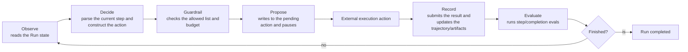
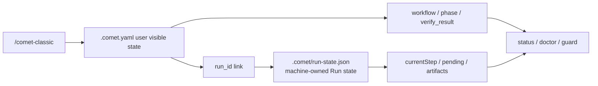

<Tip>
When creating, optimizing or combining skills, it is usually only necessary to call <code>/comet-any</code>{' '} in the Agent
And confirm as prompted. Unless you are debugging Engine Run, runtime checks
Or the structure of the product, there is no need to first understand the underlying mechanism of this page. Classic Spec mode <code>/ Comet-Classic </code>{' '}
Users do not need to understand the Engine to use the five-stage workflow either.
</Tip>

Comet's Skill is not just about Markdown prompts. Starting from 0.4.0-beta.1, Comet has built-in the **Skill Engine** - a deterministic runtime responsible for executing, constraining, persisting, restoring, and evaluating Comet Skill. It provides stable content hashing, immutable snapshots, pending action recovery, guardrails and runtime checks for multi-step skills.

## Do you need to read this page

|Your goal|Suggestion|
| ------------------------------------- | ----------------------------------------------------------------- |
|Run the classic five-stage workflow using `/comet`|No need to read this page. First, take a look at [Quick Start ](/en/quickstart)|
|Create or combine skills using `/comet-any`|First, take a look at [Quick Start: Combine Any Skill](/en/skill-creator/getting-started)|
|Publish Skill|First, take a look at [Publishing and Distributing Skill](/en/skill-creator/publishing)|
|Debug `comet skill run/continue/check`|Read this page|
|Write the Engine-enabled Skill package|Read this page|

For daily use, just remember three points:

- `SKILL.md` is the entry description seen by both humans and agents.
- The `comet/` directory is the runtime control plane that determines how to execute, restore, check and evaluate.
- For `comet eval`, check the pre-release evidence; for `comet skill check`, check the runtime check of a certain Run. The two are not the same thing.

## Three types of skills

|Type|Source|Common entrances|Explanation|
| ------------------ | ----------------------------- | --------------------------------------------- | ----------------------------------------------- |
|Built-in workflow Skill|Distributed with the package at `assets/skills/`| `/comet-classic`、`/comet-open`、`/comet-any` |Drive the five-stage process and Skill Creator|
|Project Skill|Install to `.comet/skills/<name>`| `comet skill add`                             |Override the built-in Skill by name and fail closed for invalid ones|
|Factory generates Skill|Create or combine `/comet-any`| `/comet-any`、`comet publish`                 |After generation, it becomes a regular Skill package, which can be evaluated, published and distributed|

### Skill discovery sequence

Search for `resolveSkill` in the following order. Stop once found:

1. **explicit** -Selector points to an existing directory and loads directly. If the path does not exist, an error will be reported and the search will not continue.
2. **project** - `<projectRoot>/.comet/skills/<selector>`, ** takes precedence over built-in **, so the project can override the built-in Skill by name.
3. **builtin** — `assets/skills/<selector>`。
4. None of them were found → **fail closed**, no silent rollback.

<Warning>
When the project Skill overrides the built-in Skill by name, if the project Skill
When invalid, it will fail directly and prohibit rollback to the built-in version. This can prevent silent downgrading when the custom version is invalid.
</Warning>

## "Skill package structure"

An Engine-enabled Skill package is not only `SKILL.md`, but also includes a `comet/` control plane:

<Tree>
  <Tree.Folder name="<skill-name>/" defaultOpen>
    <Tree.File name="SKILL.md" />
    <Tree.Folder name="comet/" defaultOpen>
      <Tree.File name="skill.yaml" />
      <Tree.File name="guardrails.yaml" />
      <Tree.File name="checks.yaml" />
      <Tree.File name="evals.yaml" />
      <Tree.File name="eval.yaml" />
    </Tree.Folder>
    <Tree.Folder name="evals/" defaultOpen>
      <Tree.File name="evals.json" />
    </Tree.Folder>
    <Tree.Folder name="scripts/" />
    <Tree.Folder name="references/" />
    <Tree.Folder name="assets/" />
  </Tree.Folder>
</Tree>

### Responsibilities of each document

|"File|Life cycle|Duties|By whom was it loaded|
| ----------------------------------------- | --------------- | ------------------------------------------------------------- | ----------------------------------------- |
| `comet/skill.yaml`                        |Runtime + creation period|Skill definition: goal, orchestration, skills, agents, tools| `loadSkillPackage`                        |
| `comet/guardrails.yaml`                   |Operating period|Override the default guardrails (allowed list, budget, confirmation requirements)| `loadSkillPackage`                        |
|`comet/checks.yaml` or `comet/evals.yaml`|Operating period|runtime checks (progress/step/completion), choose one| `loadSkillPackage` → `SkillPackage.evals` |
| `comet/eval.yaml`                         |Creation period|Creation period assessment manifest (task, quality gates, expected evidence)|`comet eval`/Bundle backend|

<Note>
<strong> confusing name: </strong> plural <code>evals yaml</code> (or <code>checks yaml</code>
It is the runtime eval, which is checked by the Engine at runtime. The singular <code>eval.yaml</code> is the creation period evaluation manifest, which is {' '}
<code>comet eval</code> is verified before release. The life cycles of the two are different and should not be confused. <code>checks yaml</code> and {' '}
<code>evals.yaml</code> cannot exist simultaneously.
</Note>

## skill Definition: Skill.yaml

`skill.yaml` describes the objective, orchestration method and declared capabilities of a Skill:

```yaml
apiVersion: comet/v1alpha1
kind: Skill
metadata:
  name: comet-classic
  version: '1'
goal:
  statement: 'Drive a five-stage recoverable workflow'
  inputs: []
  outputs: []
  success: []
orchestration:
  mode: deterministic
  entry: full.open
  steps:
    - id: full.open
      action:
        type: invoke_skill
        ref: comet-open
      next: full.design
    # ... More steps
skills: [comet-open, comet-design, comet-build, ...]
agents: []
tools: []
```

Key field

|Field|Meaning|
| ----------------------------- | ---------------------------------------------------------------------------- |
| `goal`                        |Skill objectives, inputs, outputs and success criteria - the basis of runtime completion eval, must be observable|
| `orchestration.mode`          |`deterministic` (static step diagram) or `adaptive` (Agent-driven)|
| `orchestration.entry`         |The deterministic pattern must specify that a known step id is referenced|
| `orchestration.steps`         |step diagram, each step has `id`, `action`, `next`, and optional `completionEvals`|
| `skills` / `agents` / `tools` |When declaring the available capabilities, the allowed list of guardrails can only refer to the declared items|

### Step action type

The `action.type` for each step is one of the following:

|Type|Meaning|
| -------------- | ------------------------------- |
| `invoke_skill` |Invoke another Comet Skill|
| `call_tool`    |Calling tools (including script tools)|
| `handoff`      |Transfer control|
| `ask_user`     |Ask the user questions (must include `question`)|
| `checkpoint`   |Checkpoint (typically used to terminate a step|

## Two arrangement modes

The two modes share the same execution loop. The difference lies in who decides the next move.

### deterministic

- The steps are a static diagram. `entry` specifies the starting point, and `next` of each step specifies the next step.
- The Engine automatically parses the results of the current step → construct action → pass guardrails → pause, etc.
- After success, move on to `next`; If it fails, increase the retry count and remain at the current step.
- `next` indicates that the Run is completed in empty time. Currently, `comet skill run` only supports end-to-end execution of deterministic.

### adaptive

- `entry` or `steps` cannot be defined.
- Engine ** does not propose actions by itself ** - proposed by an external Agent, injected through `acceptAdaptiveAction`, and also through guardrails.
- The completion is driven by evals/Agent, and there is no `next: null` termination step.
- The loop layer is ready and has test coverage, but the public entry of `comet skill run` currently rejects adaptive packages.

<Tip>
If you are writing a multi-step Skill that requires recovery, use deterministic. "adaptive" is an Agent
Prepared for the autonomous decision-making scenario, currently loop-ready but not exposed through CLI yet.
</Tip>

## Engine runs the loop

The core of Engine is a React-style loop, but Engine itself ** does not execute side effects ** - it is only responsible for decision-making, constraint, recording, and evaluation, while the actual action execution is left to the outside (Agent, platform, or person).



<p align="center">
  
</p>

<p align="center">Engine only proposes, constrains and records; The real side effects are carried out externally before resume</p>

### pending action: Why pause

The pending action is the mechanism by which the Engine returns control to the executor. After Engine proposes an action, the Run state changes to `waiting` until the result of this action (`ActionOutcome`) is submitted externally.

Why pause: Engine is a deterministic state machine, and it does not do actual work itself (no model adjustment, no code writing). It writes "What to do" into the pending action and persists it to the disk. After the external execution is completed, the result is submitted through `resume`. This also makes the Run ** cross-process recoverable ** -- pending action on the disk, and the new process can continue by reading it.

The action id is deterministic: the first 16 digits of `sha256(runId:iteration:stepId)`.

## "Run Lifecycle"

```mermaid
flowchart TD
  A["comet skill run"] --> B[" Create immutable snapshots"]
  B --> C["Initialize Run state<br/>currentStep=entry, status=running"]
  C --> D["decide: Parse entry step"]
  D --> E["guardrail inspection"]
  E --> F["Write "pending action<br/>status=waiting""]
  F --> G["Return Pending action"]
  G --> H["External execution action"]
  H --> I["comet skill continue<br/> submit outcome"]
  I --> J{""outcome Success?""}
  J -->|Failure| K["Add retry <br/> to return to running"]
  J -->|Success| L["Push the currentStep<br/> to update the artifacts/trajectory"]
  K --> D
  L --> M{"Is "next" empty?"}
  M -->|no| D
  M -->|is| N["status=completed<br/> run completion evals"]
```

### run: Start

1. Reject the adaptive package (currently).
2. Reject existing runs (in change mode, there can only be one Run per directory).
3. ** Create an immutable snapshot ** - Freeze the entire Skill package to `.comet/skill-snapshots/<hash>/` and hash lock it to Run's `skillHash`.
4. Initialize the Run state: `currentStep = entry`, `status = running`.
5. Record the `run_started` trajectory event.
6. `decide` parses entry step, constructs the first action, passes guardrails, writes pending action, `status = waiting`.

### resume: Submit results or resume

With outcome (actual progress) :

1. Verify that the submitted outcome corresponds to the current pending action id.
2. Merge the artifacts of outcome into the artifacts store.
3. Record the `action_completed` trajectory event.
4. `recordOutcome`: Clear pending, add retry if fails, and advance `currentStep` if successful.
5. Run step-scope evals.
6. If `next` is empty, `status = completed`, run completion-scope evals.
7. Otherwise, `decide` proposes the next move again.

Without outcome (view/redecide)

- Return the current pending action (if it exists).
- Or re-propose the next action when there is no pending status.

### eval: Check on demand

`comet skill check` re-runs evals on the persistent Run state and artifacts as needed, and outputs `PASS`/`FAIL` item by item:

```bash
comet skill check --run-id demo-run --scope completion
```

## Immutable snapshot

Each time Run starts, the Engine freezes the Skill package into an immutable snapshot.

### How is hash calculated?

Create a stable JSON for `{ definition, guardrails, evals }` (with keys sorted alphabetically), add `SKILL.md` and the `{ path, sha256 }` of each script tool source, and finally calculate a SHA-256.

### Why is it important

- ** The Run is locked to the Skill version at startup ** -- Modifying `skill.yaml` afterwards does not affect the ongoing Run. When restoring, reload from the snapshot instead of reading the latest files in the workspace.
- ** Tamper-proof ** - When reloading a snapshot, the hash will be recalculated to verify integrity.
- ** Reproducibility ** - The same snapshot + the same outcome sequence generates the same Run trajectory.

### Upgrade the running Skill

The only legal way to modify a running Skill version is to explicitly upgrade (`--upgrade`) :

```bash
comet skill continue --run-id demo-run --upgrade my-skill --project .
```

Upgrades are strictly guarded: there cannot be pending actions, Skill names must match, orchestration patterns must match, and the current step must still exist in the new version. After the upgrade, record the `state_migrated` event.

## guardrails

guardrails restricts what actions the Engine can perform, with `guardrails.yaml` overriding the default values.

### Default value

When `guardrails.yaml` does not exist, by default: allow list = definition for all skills/agents/tools declared, `maxIterations = 50`, `maxRetriesPerAction = 3`, `confirmationRequiredFor` = all tools marked with `requiresConfirmation: true`.

### Constraint check

Each action should go through `checkAction` before being proposed:

|"Check|Failed behavior|
| ----------------------------------------- | ----------------------------- |
| `iteration >= maxIterations`              |Blocking: The iteration budget is exhausted|
|The ref of the action is not in the allowed list|Blocking: skill/tool/agent is not declared|
|ref requires confirmation but it is not provided|Blocking: User confirmation is required|
| `retries[actionId] > maxRetriesPerAction` |Block: Retry budget exhausted|

<Warning>
Dynamic re-planning of <strong> cannot relax guardrails</strong>. Allow the list and budget to be fixed by the Skill, the runtime Agent
It cannot be negotiated for expansion. This is the core of Engine security - Skill defines the boundaries, and the executor can only act within the boundaries.
</Warning>

### Example

```yaml
# guardrails for comet-classic
allowedSkills:
  [comet-open, comet-design, comet-build, comet-verify, comet-archive, comet-hotfix, comet-tweak]
allowedAgents: []
allowedTools: []
maxIterations: 500
maxRetriesPerAction: 3
confirmationRequiredFor: []
```

## runtime checks

runtime checks is when the Engine checks whether the Run meets the conditions during runtime, which is different from eval (`comet eval`) during the creation period.

### Two types of inspections

|Type|Judgment method|
| ----------------- | --------------------------------- |
| `artifact_exists` |The corresponding artifacts are stored in the Artifacts store|
| `state_equals`    |A certain field of Run state is equal to the specified value|

### Three scopes

| scope        |When to run|Command|
| ------------ | ---------------------------------- | ------------------------------------ |
| `step`       |It runs automatically each time an action outcome is submitted|"Automatic|
| `completion` |Run automatically when it reaches completed|"Automatic|
| `progress`   |Run on demand| `comet skill check --scope progress` |

### Example

```yaml
# comet-classic runtime check (evals.yaml)
runtime:
  - id: classic-completed
    scope: completion
    type: state_equals
    field: status
    equals: completed
```

This eval checks `status === completed` when the Run is completed.

<Warning>
<code>comet skill check</code> only checks the completion degree of a certain Engine Run and is not a general Skill assessment. Evaluate a Skill
Can the product capabilities be released? Use <a href="/en/cli/eval">comet eval</a>. For more details, see {' '}
  <a href="/en/eval/runtime">Runtime check</a>。
</Warning>

## Product authoring lanes

`/comet-any` classifies and assemps Skill packages through authoring lanes. Each channel is responsible for one type of product, has its own author (deterministic-adapter or subagent), and completes the rendering in sequence.

|Passage|Output|Key artifact|
| ----------------- | ----------------------------------- | ------------------------------------------------------------------------------------------------------------------------------------------------ |
| `workflow-entry`  |Entry Skill| `SKILL.md`                                                                                                                                       |
| `skill-core`      |The internal Skill corresponding to each Workflow Node|Each node is `../<node-skill>/SKILL.md`|
| `script-contract` |Control plane script| `scripts/workflow-state.mjs`、`workflow-guard.mjs`、`workflow-handoff.mjs`、`comet-plan.mjs`、`comet-check.mjs`、`comet-hook-guard.mjs`          |
| `reference`       |True source, agreement and combined evidence| `reference/resolved-skills.json`、`workflow-protocol.json`、`composition-report.md`、`decision-points.md`、`recovery.md`、`authoring-lanes.json` |
| `eval`            |Evaluation Checklist (when Engine is enabled)| `comet/eval.yaml`                                                                                                                                |
| `skill-review`    |Author's self-review (Final run)| `reference/skill-review.md`、`authoring-lanes.json`                                                                                              |

The output of each channel will carry `protocolHash`, which must be equal to `workflowProtocolHash(workflow)`; otherwise, `Factory authoring protocol hash drift` will be thrown.

### Review access control

After the generation is completed, `reviewFactoryArtifactProposals` is a mandatory review access control. It will check:

- Whether all the necessary channels are complete (`workflow-entry`/`skill-core`/`script-contract`/`reference`/`skill-review`, and `eval` when Engine is enabled).
- Whether the necessary artifacts exist (`SKILL.md`, `reference/workflow-protocol.json`, `decision-points.md`, `recovery.md`, `composition-report.md`, `resolved-skills.json`, `skill-review.md`, six control plane scripts, etc.).
- ** Must claim** Whether it exists and the referenced artifact exists (`workflow-entry`, `script:workflow-state`, etc.).
- The product is consistent with the Workflow Contract (nodes, Output Schema, Required Skill Call match).

If the review is not passed (`passed === false`), `generateFactorySkillPackage` will throw `Generated Skill package failed authoring review` and ** no documents will be written **.

<Tip>
This channel design is intended to enable the platform to generate artifacts in parallel using native subagents (each subagent only reads its own)
brief. When the platform does not support subagent, the same brief
It will run inline as a safety net. For daily use, there is no need to worry about these. Just understand that "every product has an author and a reviewer".
</Tip>

## Run state store

Run state is machine-owned and should not be edited manually.

### Two storage locations

| runnerMode   |Storage location|Features|
| ------------ | ------------------------------------ | --------------------------------------------------------------------------------- |
| `change`     | `<changeDir>/.comet/`                |Bind the OpenSpec change directory, with one Run for each directory. The classic `/comet-classic` workflow uses this.|
| `standalone` | `<projectRoot>/.comet/runs/<runId>/` |Independent Run, addressed by runId, multiple runs coexist|

### The run-state.json field

```json
{
  "runId": "demo-run",
  "skill": "my-skill",
  "skillVersion": "1",
  "skillHash": "<sha256>",
  "orchestration": "deterministic",
  "currentStep": "step-1",
  "iteration": 3,
  "pending": "<action-id>",
  "status": "waiting",
  "retries": {}
}
```

### Five supplementary documents

|"File|"Content|
| ---------------------------- | ------------------------------ |
| `.comet/pending-action.json` |The pending action currently waiting|
| `.comet/trajectory.jsonl`    |append-only trajectory audit record|
| `.comet/context.md`          |Current Agent context|
| `.comet/artifacts.json`      |The mapping of the produced artifacts|
| `.comet/checkpoint.json`     |Consistency checkpoint (written during classic migration)|

All file I/O operations are sandboxed within the "change/run" directory, and absolute paths, `~`, drive letters, and `..` path traversals are rejected. The write is atomic (write to tmp and then rename).

## The relationship between classic workflows and engines

The classic five-stage workflow of `/comet-classic` is driven by the Engine at the bottom layer, but users do not need to directly operate the Engine.



### The boundary between comet.yaml and run-state.json

- `.comet.yaml` saves workflow projections that users can understand (phase, build_mode, verify_result, etc.) and only links to Engine Run via `run_id`.
- The complete Run details (currentStep, pending, trajectory, artifacts) are in `.comet/run-state.json` and not written into `.comet.yaml`.
- When entering a change for the first time, `ensureClassicRun` deduces the current step from the classic field of `.comet.yaml`, creates a snapshot and Run state, and establishes the `run_id` link.

<Note>
The <code>ComET-Classic </code> definition within the Engine is a deterministic Skill with 30 steps to cover
Three profiles: full, hotfix, and tweak. Users can enter through the permanent entry <code>/comet-classic</code> (or {' '} driven by project configuration)
Enter (<code>/comet</code> alias forwarding) without directly operating these internal YAMLs; The Engine loads and runs them at the bottom layer.
</Note>

#### The packaging method of the Classic control package

`comet-classic` is packaged as an "internal control package" in pure YAML form under `comet/runtime/classic/` and contains three files:

|"File|"Content|
| --------------------------------------- | ------------------------------------------------------------------------- |
| `comet/runtime/classic/skill.yaml`      |deterministic layout diagram (30 steps, three profiles: full/hotfix/tweak)|
| `comet/runtime/classic/guardrails.yaml` |The seven publicly allowed skills are `maxIterations: 500` and `maxRetriesPerAction: 3`|
| `comet/runtime/classic/checks.yaml`     |runtime check (`classic-completed`: `status == completed` upon completion)|

The Engine definition here is not the top-level `comet-classic/` entry directory that the user calls. The internal installation products are these three YAMLs, registered by `internalSkills` of `assets/manifest.json` and loaded by Engine. The top-level `/comet-classic` is only responsible for stabilizing the entry point and workflow orchestration.

## When to use /comet-any

If you want to turn a workflow into a team reusable Skill, don't start with a handwritten Engine file. Use `/comet-any` to make it read real skills, generate structured evidence, evaluate and enter the release access control.

The normal user path is:

```text
/comet-any -> comet eval -> comet publish
```

For more details, please refer to [Quick Start with Combining Any Skill ](/en/skill-creator/getting-started)

## Common commands

```bash
# Package management
comet skill add ./my-skill --project .
comet skill show my-skill --project .
comet skill show my-skill --json

# "Run Lifecycle"
comet skill run my-skill --run-id demo-run --project .
comet skill continue --run-id demo-run --status succeeded --summary "Completed"
comet skill check --run-id demo-run --scope completion

# Run is in the process of upgrading
comet skill continue --run-id demo-run --upgrade my-skill --project .
```

Complete options see [comet skill](/en/cli/skill).

## Next step

- Workflow Concept ](/en/concepts/workflow) - `/comet-classic` How to use Engine at the bottom layer
- [comet skill](/en/cli/skill) - Complete Command Reference
- [Runtime check](/en/eval/runtime) - The difference between `comet skill check` and `comet eval`
- [Overview of Skill Creator ](/en/skill-creator/overview) - Creating Engine-enabled Skill with `/comet-any`
