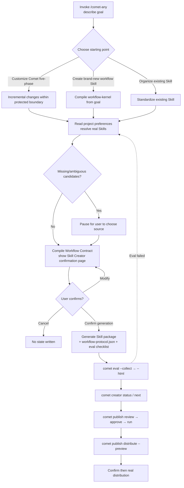

`/comet-any` (also called **Skill Creator**) is the single entry point for creating, optimizing, and composing reusable Skills in Comet. This page is its shortest onboarding path — it only covers how to use it, not the internals. For a deeper understanding, see [Advanced Topics](#advanced-topics).

## Who It's For

- Those who want to distill a recurring team process into a **reusable Skill** instead of re-describing it every time.
- Those who want to **add, replace, or disable** certain steps on top of the classic `/comet` five phases.
- Those who want to **organize** existing but scattered Skills into a standard Skill package that can be evaluated, published, and distributed.

## What You Need to Prepare First

1. **Comet installed**. Run `comet doctor` to confirm the CLI is working. If not installed yet, see [CLI Quickstart](/en/cli/quickstart).
2. **A Skill-capable Agent platform**, such as Claude Code, Codex, Cursor, etc. `/comet-any` is a Skill invoked inside these platforms, not a standalone terminal command.
3. **(Optional) Project-level preference file**. On first use, `/comet-any` will automatically scan the platform and recommend default preferences, so you can skip this step. To configure in advance, see [Optional: Prepare a Preference File](#optional-prepare-a-preference-file).

<Note>
  <code>/comet-any</code> is the <strong>single entry point users need to remember</strong>. Use <code>comet creator</code> when you need to check recovery state; use <code>comet publish</code> after entering the publishing flow. Ordinary users do not need to run <code>comet bundle</code> directly.
</Note>

## The Mainline: Remember This One Line

```text
/comet-any create  →  comet eval verify  →  comet creator status/next check next step  →  review/approve/run  →  distribute
```

You only need to invoke `/comet-any`. If the flow is interrupted, prioritize running `comet creator next <name>` to see the single recommended next step; if you want to see the full readiness, blockers, and evidence, run `comet creator status <name>`. Below we'll walk through the entire chain with a real creation.

<p align="center">
  
</p>

<p align="center">`/comet-any` creates the Skill, `comet eval` provides evidence, and `comet creator next/status` translates an interrupted flow into the next user command</p>

---

## Step 1: Invoke /comet-any and Describe Your Goal

Type the following in the Agent platform:

```text
/comet-any
```

Then describe the Skill you want to create. **The more specific the description, the higher the quality of the generated Skill**. A good description should at least include: what it does, how many steps it has, and who will reuse it. For example:

```text
Please create a PR review assistant.
It should first clarify the review scope, then create a check plan,
then execute the code review, and finally require verification evidence before completion.
The goal is for team reuse, not just a one-off task.
```

## Step 2: Choose a Starting Point

`/comet-any` will have you choose from **three starting points**. This is the first layer of choice in the Skill Creator and determines the entire generation approach:

| Starting Point | Skill Creator Intent | Meaning | Typical Scenario |
| --- | --- | --- | --- |
| **Five-phase customization based on existing Comet Skills** | `customize-comet` | Incremental adjustments on top of the classic five phases | Want to add a review step to `/comet`, or require using a component library |
| **Create a brand-new workflow Skill** | `new-skill` | Create an entirely new workflow from the goal description | Distill a team-specific process |
| **Organize an existing Skill** | `upgrade-existing` | Organize an existing Skill into a publishable standard package | Standardize a scattered Skill |

No matter which starting point you choose, `/comet-any` ultimately compiles the goal into the same kind of **Workflow Contract** (composed of Workflow Node, Skill Binding, Required Skill Call, Output Schema, Guardrail, and Handoff). See [Skill Creator Overview](/en/skill-creator/overview#workflow-contract-the-common-model-for-all-paths).

<Warning>
  When choosing <strong>five-phase customization based on existing Comet Skills</strong>, <code>/comet</code> is treated as a <strong>protected boundary</strong>: control nodes (<code>open</code>/<code>execute</code>/<code>verify</code>/<code>archive</code>) cannot have their implementations replaced — you can only <strong>add Required Skill Calls to nodes, augment them, or disable them (only for optional nodes)</strong>.
</Warning>

## Step 3: Confirm the Composition Plan (Skill Creator Confirmation Page)

`/comet-any` reads the real Skills in your project, compiles the goal into a **Workflow Contract**, generates a **composition plan**, and then **pauses for your confirmation**. This page is called the "Skill Creator plan confirmation page" and is a key checkpoint in the entire flow. It shows:

- What type of Skill you're building (Skill Creator intent) and what the goal is
- Which nodes are **kept**, which Required Skill Calls are **added**, which node implementations are **replaced**, and which optional nodes are **disabled**
- What **cannot be done** (e.g., replacing control nodes will be rejected)
- Each node's responsibility, implementation Skill, required Skills to call, and Output Schema
- The Workflow Contract type (`comet-five-phase-overlay` / `workflow-kernel`) and the list of Output Schemas
- Whether there are missing or ambiguous candidates you need to handle
- What **executable disclosures** the scripts / hooks will introduce
- Which files will be generated

You need to make a **three-way choice**:

1. **Confirm generation** — Write the plan to the draft and continue generating.
2. **Modify the plan** — Adjust the goal, preferences, or candidates and regenerate the plan.
3. **Cancel** — No state is written.

<Tip>
  If <code>/comet-any</code> reports that a candidate is <strong>missing</strong> or has <strong>multiple sources</strong>, it will always pause and ask you — it will never choose for you or silently ignore it. Just follow the prompt to select a source. This is a hard rule, not an optional behavior.
</Tip>

## Step 4: Evaluate

After confirmation, `/comet-any` generates the Skill package. Then evaluate whether it meets the bar. This is **mandatory evidence** before publishing, not an optional step:

```bash
# 1. Low-cost discovery pre-check (does not consume model calls)
comet eval ./generated-skill/comet/eval.yaml --collect

# 2. Run the real evaluation and generate a browsable HTML report
comet eval ./generated-skill/comet/eval.yaml --html
```

Open the `Report path` printed by the CLI and confirm the evaluation passed. For detailed environment preparation and report interpretation, see [Evaluate Any Skill](/en/eval/quickstart).

<Info>
  <strong>Prerequisite</strong>: Running <code>comet eval</code> requires <code>uv</code>, Python 3.11+, and Docker on your machine, plus <code>ANTHROPIC_API_KEY</code> (or <code>ANTHROPIC_AUTH_TOKEN</code>). See the full preparation steps at <a href="/en/eval/quickstart#what-you-need-to-prepare-before-running">Eval Quickstart · What you need to prepare before running</a>.
</Info>

## Step 5: Publish and Distribute

After the evaluation passes, check publishing readiness and publish:

```bash
# View full readiness and blockers
comet creator status my-skill --project . --json

# Just want to know what to run next
comet creator next my-skill --project . --json

# Generate a review summary (see Readiness / Blockers / Evidence)
comet publish review my-skill --platform claude --json

# Manually approve the current version
comet publish approve my-skill --reviewer alice --json

# Publish
comet publish run my-skill --platform claude --json
```

**Before** distributing to a platform, a preview is enforced — only after confirmation is it actually written:

```bash
# Force a preview (writes no files)
comet publish distribute my-skill --platform claude --scope project --preview --json

# After confirming the preview is correct, do the real distribution
comet publish distribute my-skill --platform claude --scope project --json
```

For the complete publishing state chain and gates, see [Publishing and Distributing Skills](/en/skill-creator/publishing).

<Tip>
  <code>/comet-any</code> will also proactively drive these steps and ask for your confirmation at each one. The commands above are <strong>optional manual paths</strong> for troubleshooting or automation.
</Tip>

---

## The Complete Flow at a Glance



## Optional: Prepare a Preference File

On first use, `/comet-any` scans the platform's Skills and recommends default preferences. You can also create the preference file directly to tell it which Skills to prefer reusing. Save it to `.comet/skill-preferences.yaml`:

```yaml
# .comet/skill-preferences.yaml
version: 1
mode: advisory

prefer:
  - brainstorming
  - writing-plans
  - requesting-code-review
  - verification-before-completion

require:
  - verification-before-completion

policies:
  missing: ask
  ambiguous: ask
  deviation: explain
  scripts: disclose
  hooks: disclose
```

For the full meaning of each field, see [Skill Preferences and Source of Truth](/en/skill-creator/preferences).

## FAQ

<AccordionGroup>
  <Accordion title="What is the difference between /comet-any and /comet">
    <code>/comet</code> is used to complete a project change. <code>/comet-any</code> is used to create, optimize, or organize reusable Skills.

    Use <code>/comet</code> for features, bug fixes, or modifying project code. Use <code>/comet-any</code> to distill a process into a reusable Skill, or to add team rules on top of the <code>/comet</code> five phases.
  </Accordion>

  <Accordion title="Do I need to understand terms like Workflow Node and Output Schema">
    Not for everyday use. You only need to look at the plan confirmation page to see what each step does, which Skills will be invoked, and which capabilities will be added or disabled.

    When you need to do deep customization or audit the generated artifacts, read the [Skill Creator Overview](/en/skill-creator/overview).
  </Accordion>

  <Accordion title="What if I get interrupted halfway through">
    Just say to the Agent: "Continue the previous Skill creation." <code>/comet-any</code> will first try to <strong>recover the existing creation state</strong>, showing the name, status, next step, and blocker reason, letting you choose which to continue. See [Complete Skill Creation Workflow · Resuming an Interrupted Flow](/en/skill-creator/workflow#resuming-an-interrupted-flow).
  </Accordion>

  <Accordion title="Will the generated artifacts be automatically distributed">
    No. After publishing, <code>/comet-any</code> will ask whether to distribute and <strong>show a preview first</strong>. Only after you confirm will it actually write to the platform. The preview is a mandatory step and cannot be skipped.
  </Accordion>

  <Accordion title="I don't want to run eval and publish commands myself">
    You can invoke only <code>/comet-any</code> throughout the whole process — it will proactively drive evaluation and publishing and ask for your confirmation at each step. The commands on this page are listed so you understand the flow and can troubleshoot or do automation integration.
  </Accordion>
</AccordionGroup>

## Advanced Topics

That's the end of the basic path. If you need a deeper understanding of the Skill Creator, check out these pages:

| Advanced Topic | Suited For |
| --- | --- |
| [Skill Creator Overview](/en/skill-creator/overview) | Understanding Workflow Contract, the three starting points, the protected boundary, and built-in nodes |
| [Complete Skill Creation Workflow](/en/skill-creator/workflow) | Step-by-step details from recovering state to generation, evaluation, review, publishing, and distribution |
| [Skill Preferences and Source of Truth](/en/skill-creator/preferences) | `advisory`/`strict` modes, policies, and `resolved-skills.json` evidence |
| [Publishing and Distributing Skills](/en/skill-creator/publishing) | The readiness state chain, gates, capability gaps, and executable disclosures |
| [Skill and Engine](/en/skill-creator/engine) | Skill package structure, the Engine run loop, runtime checks, and immutable snapshots |
