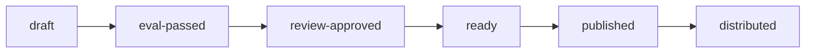
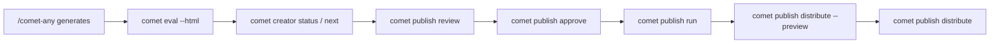

<Tip>
  This page is for troubleshooting a publishing state or wiring up automation. In the normal flow,
  <code>/comet-any</code> guides evaluation, approval, publishing, and distribution.
</Tip>

This page is the authoritative reference for the Skill publishing state machine, readiness conclusions, and blocker codes. For command-level syntax, see [comet publish](/en/cli/publish).

Before publishing, Comet checks the eval evidence for the current hash, human approval, and the requirements of the target platform. A Skill can be published and distributed only after every gate passes.

## Publish state chain



Every state has a clear gate:

| Status | Meaning | Entry condition |
| --- | --- | --- |
| `draft` | Just generated, not verified yet | `/comet-any` generation completes |
| `eval-passed` | Eval evidence exists for the current hash | `comet eval ... --html` passes and the hash matches |
| `review-approved` | The current hash is approved by a human | `comet publish approve` |
| `ready` | Meets every publishing gate | Review summary is publishable |
| `published` | Published as an installable candidate | `comet publish run` |
| `distributed` | Distributed to the platform | `comet publish distribute` |

There is also an abnormal state, `drift-conflict`: a Bundle sitting in `ready` enters the conflict state when both the draft hash **and** the ready hash change, carrying `conflict: {draftHash, readyHash}`; if only one of them changes, it falls back to `draft`.

## Readiness conclusions

Readiness reports four conclusions:

| Conclusion | Meaning | Trigger condition |
| --- | --- | --- |
| `published` | Already published | status `ready`, hash matches, no blocker |
| `can-publish` | Can be published | status `review-approved`, review matches hash, decision approved, no blocker |
| `needs-confirmation` | Awaiting confirmation | No blocker, but not approved yet |
| `blocked` | Cannot be published | At least one blocker exists |

<p align="center">
  
</p>

<p align="center">Before publishing, confirm that the eval evidence is bound to the current draft and manifest, use creator to read status, and use publish for review, approval, publishing, and distribution preview</p>

For non-JSON output, these headings are used: `published` → "Already published"; `can-publish` → "Ready to publish"; `needs-confirmation` → "Ready for review approval"; `blocked` → "Cannot publish yet".

## Publishing flow

`comet publish` is the publishing entry for `/comet-any` artifacts. It only handles review, approval, publish, and distribute after the eval evidence is ready. Creating state, resuming state, and the unique next step belong to `comet creator`.



## User commands

```bash
# Read the full readiness and blockers
comet creator status my-skill --project . --json

# Only want to know the next command to run
comet creator next my-skill --project . --json

# Generate a review summary
comet publish review my-skill --platform claude --json

# Human approval
comet publish approve my-skill --reviewer alice --json

# Publish the approved candidate
comet publish run my-skill --platform claude --json

# Distribution preview (mandatory)
comet publish distribute my-skill --platform claude --scope project --preview --json

# Real distribution
comet publish distribute my-skill --platform claude --scope project --json
```

If the Skill contains hooks or scripts, distribution requires confirming the executable disclosure:

```bash
comet publish distribute my-skill --platform claude --scope project --confirm-executables --json
```

If you explicitly choose to skip an optional capability:

```bash
comet publish distribute my-skill --platform claude --scope project --skip-capability <capability> --json
```

## Choosing between status and next

| What you want | Command to use | What the output focuses on |
| --- | --- | --- |
| Read full readiness, blockers, warnings, and evidence | `comet creator status <name>` | Full status and recovery context |
| Recover an interrupted flow and only want to know what to run now | `comet creator next <name>` | A single recommended action, command, reason, and whether user confirmation is required |

`comet creator next` does not expose the backend Bundle commands. It translates the backend's next action into everyday, runnable commands — for example `comet eval ... --html`, `comet publish review ...`, `comet publish approve ...` — or tells you to go back to `/comet-any` to resolve candidates, confirm the plan, or regenerate.

## Blocker codes

Readiness blockers prevent publishing. Each blocker carries a **prefix code** that tells you where the problem is. When `Readiness: blocked`, locate the issue with this table:

| Blocker code | Meaning | Recovery suggestion |
| --- | --- | --- |
| `[candidate]` | Unresolved missing or ambiguous candidates remain | Go back to `/comet-any` to choose sources, or let `comet creator next` give you the recovery command |
| `[preference]` | (strict) a required Skill is missing or ambiguous; preference drift | Confirm preferences or regenerate |
| `[proposal]` | Proposal not confirmed | Go back to `/comet-any` to review and confirm the composition plan |
| `[composition]` | Composition has an issue (cycle, unresolved-choice, etc.) | Fix the composition plan |
| `[control-plane]` | Stable control-plane validation failed | Check that the required capability set is complete |
| `[authoring]` | Generated content still has `AUTHORING PENDING` or substance nodes that are not finished | Complete the corresponding authoring lane, then record the output |
| `[draft]` | `currentHash` missing | Regenerate the draft |
| `[eval]` | Eval evidence missing, failing, or tied to an old hash | Re-run `comet eval ... --html` |
| `[agent]` | Claude Code custom agent does not appear in the platform preview | Re-run the Claude platform distribution preview |
| `[publish]` | status is `ready` but ready metadata is missing | Walk the review flow again |

<Note>
  Every blocker carries a <code>nextAction: { label, command }</code> that gives the recovery
  suggestion directly. Use <code>comet creator status</code> when you want the full context; use{' '}
  <code>comet creator next</code> when you only want to copy the next user command.
</Note>

### Warnings (non-blocking)

These do not block, but they are surfaced in the review summary:

- `[preference]` preference drift in advisory mode
- `[review]` approval corresponds to an old hash
- `[capability]` optional capability gap
- `[agent]` platform agent preview missing
- `[executable]` executable disclosure pending confirmation

## Review summary

You must read readiness before publishing. The `comet publish review` review summary contains at least:

- The Bundle name, version, and hash
- The list of multiple entries and internal Skills
- Real Skill evidence for `planHash`, `preferenceHash`, and `reference/resolved-skills.json`
- The recommended invocation order and `preferenceIndex`
- Items that deviate from the preferred order, and why
- Whether `.comet/skill-preferences.yaml` drifted after Factory initialization
- Whether the required capability set of the stable composition Skill Bundle is fully declared
- Capability gaps and executable disclosure
- Eval selection, token consumption, and result summary
- The `Validate this Skill` and next-step prompts

Non-JSON output also clearly shows `Readiness:`, `Blockers:`, `Warnings:`, and `Evidence:` so you can directly see why a Skill is publishable or blocked.

## Distribution preview is mandatory

Before performing a real distribution, **you must run the preview first**:

```bash
comet publish distribute my-skill --platform claude --scope project --preview --json
```

Preview is a **mandatory check**, not an optional extra. It shows:

- `Install preview`
- Planned files
- Unsupported capabilities
- Executable disclosures
- `No files were written`

Only after you confirm the preview results may you remove `--preview` and run the real distribution.

## Capability gaps and executable disclosure

Platform capability differences must be handled before distribution:

| Capability type | How the gap is handled |
| --- | --- |
| Required capability gap | **Cancel that platform**; it cannot be skipped |
| Optional capability gap | You must **explicitly choose to skip it** (`--skip-capability`) |
| Hook/script disclosure | You must **confirm it** before distribution (`--confirm-executables`) |

`hooks/*.yaml` are **Comet portable hook descriptors**; they take effect only after `comet publish distribute` compiles them into the target platform configuration. Copying hook files directly into a platform directory does nothing.

## The eval-record evidence contract

If you record eval evidence manually with `comet bundle eval-record`, the result JSON must satisfy this schema:

```json
{
  "schemaVersion": 2,
  "provider": "comet-eval",
  "level": "quick",
  "draftHash": "<64-character hex SHA-256>",
  "evalManifestHash": "<64-character hex SHA-256>",
  "tasks": ["authoring-skill-smoke"],
  "treatments": ["CONTROL", "COMET_FULL"],
  "passAtK": { "authoring-skill-smoke": 1 },
  "weightedScore": { "authoring-skill-smoke": 0.92 },
  "instabilityGap": { "authoring-skill-smoke": 0 },
  "failures": [],
  "reports": ["eval/local/logs/experiments/example/summary.html"],
  "passed": true,
  "summary": "All quality gates passed."
}
```

<Warning>
  <code>draftHash</code> must equal the current <code>currentHash</code>, and{' '}
  <code>evalManifestHash</code> must equal the hash of the currently generated{' '}
  <code>comet/eval.yaml</code>. Evidence tied to an old hash or old manifest is kept on disk, but it
  cannot advance readiness. Daily use does not require writing this file by hand —
  <code>/comet-any</code> produces it automatically through <code>comet eval</code>.
</Warning>

## The relationship between bundle and publish

`comet creator` is the creation and recovery entry, `comet publish` is the publishing entry. `comet bundle` is the internal backend that handles Bundle state management, hashes, readiness, publish, and distribute. Unless you are troubleshooting or auditing, you do not need to touch the Bundle state files directly.

| Command | Role | Who it is for |
| --- | --- | --- |
| `comet creator` | Creation state and recovery entry | Daily use, automation |
| `comet publish` | User publishing entry | Daily use, automation |
| `comet bundle` | Advanced Bundle backend | Audit, debugging, automation integration |

When you need to inspect backend state, see [comet bundle](/en/cli/bundle).

## Next steps

- [comet publish command](/en/cli/publish) — full subcommand and option reference
- [Skill creation workflow](/en/skill-creator/workflow) — the processing order from generation to distribution
- [Evaluation overview](/en/eval/overview) — how eval evidence drives readiness
