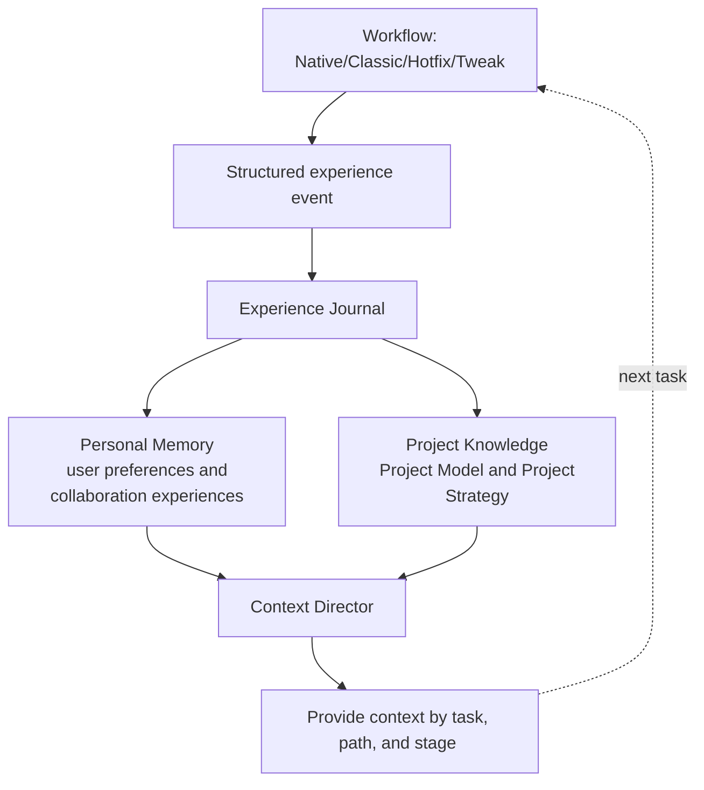

The changes from 0.4.0 to rc.1 focus on three directions: enabling work experience to be managed, Project Knowledge to be verified, and large Native requirements to be accomplished through the collaboration of multiple independent sessions. They all follow the same principle: user-readable content, machine operation status, and verifiable evidence each assume different responsibilities.

This is not a command name adjustment. After the upgrade, users will see the new plugin center on the Dashboard and also see the parent Change, child, worktree and the final integration status in the Native large-scale requirements. The ordinary workflow still starts from the existing `/comet` or `/comet-native` entry.

## Main changes

|Theme|Changes that users can perceive|Detailed article|
| ---------------------------------- | ----------------------------------------------------------------------------------------------- | ------------------------------------------------------ |
| Agent Learning Loop                |User signals, verification and Review results can form controlled and reusable experiences. The background organization failed without blocking the task| [Agent Learning Loop](/en/plugins/agent-learning-loop) |
| Personal Memory                    |Users can view, correct, forget and roll back their personal preferences. The relevant content is gradually injected according to the tasks|Personal Memory ](/en/plugins/personal-memory)|
| Project Knowledge / Project Policy |The Agent can retrieve the project structure, decisions, processes and constraints. Changes in the source will render the old records invalid|[Project Rules ](/en/plugins/project-rules)|
|Dashboard Plugin Center|Personal Memory and Project Knowledge have independent states, sources, application records and life cycle operations|[Dashboard Overview ](/en/dashboard/overview)|
| Native Supervisor Change           |Large targets can be broken down into dependent children, which are executed in an independent worktree and finally accepted on the parent Change| [Supervisor Change](/en/native/supervisor-change)      |
| Native Portable State              |Phase, acceptance, handoff, inspection, recovery and Supervisor summaries are saved in a readable state, while the machine execution state remains in the native Runtime|Product and State ](/en/native/artifacts-and-state)|
|CodeGraph and platform support|Native initialization can choose CodeGraph; DeepSeek Harness and Oh My Pi enter the installation, update, diagnosis and uninstallation processes|The platform supports ](/en/platforms)|

## Let's take a look at the working mode of rc1 from one task

The workflow does not put all the historical content into the Agent Context at one time. Personal Memory and Project Knowledge should first be screened based on the scope of application, current task, path, operation and stage. A small amount of highly relevant content can be directly injected, while longer or lower-priority content enters the Context Manifest and expands by stable ID when needed by the Agent.

## The changes that users can most easily notice

### The Dashboard now has a plugin center

The Dashboard no longer only displays Change and workflow products. The Plugin Center places personal memories and Project Knowledge in separate workspaces, presenting records, sources, statuses, application histories, diagnoses, and Settings respectively. The page prioritizes the display of cache snapshots, and the background refresh will not make the first screen wait for indexing or Reflection.

The deactivation, restoration and uninstallation of plugins have clear scopes. Disabling Personal Memory will not delete records. Suspending Project Knowledge only affects the retrieval of the current project. Uninstalling the plugin will not delete the project documentation or personal data either. After re-enabling, the plugin continues to work according to the current configuration.

### Personal information and project information are no longer mixed together

Personal Memory stores users' language preferences, communication styles and personal collaboration experiences. Project Knowledge preserves the project structure, dependencies, decisions, processes, constraints, and verified failure resolution methods. Personal Memory will not automatically become team rules, and project rules will not override current user requirements and existing rules in the repository.

### Large-scale Native requirements can be completed separately

Supervisor Change confirms the split at the Shape stage, Runtime determines which children are ready, and independent sessions only handle their own Child Worktree. The parent Change is responsible for integrating in sequence and executing the final Verify. Codex can use independent project tasks; Claude Code can be used in an interactive session with Agent Teams enabled using teammate. The user only selects one multi-session or single-session advancement. When the multi-session capability is unavailable or lost during recovery, it will automatically switch to subagent without repeatedly asking or silently switching to a single session.

## What haven't these changes changed

- Native still consists of Shape, Build, Verify and Archive, and the completion determination is still jointly handled by Runtime checks and independent verifications.
- Project Policy is not a new Rule file. `AGENTS.md`, rules, code, configuration and tests in the repository are still high-priority evidence.
- Personal Memory does not save complete sessions, tool logs, complete Diffs, hidden reasoning, or ordinary project facts;
- Remote Provider is an optional configuration. Network failure will not silently switch to another Provider.
- Learning and retrieval are limited auxiliary capabilities and cannot be authorized for submission, push, deletion or publication.
- The existing Native Quick Start and Classic five-stage documentation remain the entry points for daily use.

## The upgraded reading sequence

If you only want to learn about the new features, first read [Plugin Center ](/en/plugins/agent-learning-loop), then view [Personal Memory ](/en/plugins/personal-memory) and [Project Rules ](/en/plugins/project-rules)] as needed. If you need to handle large Native requirements, directly read [Supervisor Change](/en/native/supervisor-change). The complete item-by-item changes shall still be subject to [0.4.0-rc.1 Changelog](/en/changelog)]
