`comet bundle` 是 `/comet-any` 和 `comet publish` 背后的**高级后端**。它创建平台无关的 Skill Bundle，把它们编译成原生平台 install plan，并能携带 Engine metadata、要求结构化 Eval 证据、人工批准后才能发布和分发。

普通用户通常**不需要**直接使用它——`/comet-any` 会在内部调用这些命令。直接使用 Bundle CLI 的场景是**审计后端状态、调试平台 compile、capability gap 或 executable disclosure，或自动化集成**。

## 什么时候需要直接用

- 排查 `/comet-any` 生成或恢复问题。
- 审计 Bundle factory metadata（`planHash`、`preferenceHash`、resolved Skill 证据）。
- 调试平台 compile、capability gap 或 executable disclosure。
- 自动化集成需要 JSON 后端命令。

## 常见后端阶段

```mermaid
flowchart LR
  A["factory-guide / candidates"] --> B["factory-propose"]
  B --> C["factory-init"]
  C --> D["factory-resolve"]
  D --> E["factory-generate"]
  E --> F["compile"]
  F --> G["eval-plan"]
  G --> H["eval-record"]
  H --> I["review-summary"]
  I --> J["review"]
  J --> K["publish"]
  K --> L["distribute"]
```



## Factory 创作命令

`/comet-any` 在内部通过这些命令维护确定性状态，你不需要手写 `.comet/bundle-*` 状态文件。

```bash
# 首次使用向导和恢复入口
comet bundle factory-guide --project . --json

# 候选发现
comet bundle candidates --json

# dry-run proposal，不写 Bundle state
comet bundle factory-propose <name> --file <plan.json> --json

# 写入确认后的 Factory state
comet bundle factory-init <name> --file <plan.json> --confirmed-proposal --json

# 解决缺失或歧义候选
comet bundle factory-resolve <name> --candidate <query> --source <root-or-hash> --json
comet bundle factory-resolve <name> --candidate <query> --ignore-missing --reason <reason> --json

# 生成 Bundle draft
comet bundle factory-generate <name> --json
```

### factory-guide 返回的关键字段

- `preference`：当前项目级偏好，或建议写入 `.comet/skill-preferences.yaml` 的默认值（状态 `missing`/`present`/`invalid`）
- `inventory`：平台 Skill inventory 摘要
- `resumable`：可恢复的 Factory / Bundle 状态列表
- `nextQuestions`：首次使用或恢复时仍需确认的问题
- `userMessage`：直接面向用户的 guide 文案

### factory-propose 返回的关键字段

- `userSummary`：给用户看的组合方案摘要
- `skillMakerSummary`：Skill Maker 方案（含阶段名 stage names）
- `actions`：至少包含 `confirm-generate`、`revise-proposal`、`cancel`（`confirm-generate` 仅当 `canGenerate === true` 时出现）
- `proposalHash`：确认 proposal 的哈希
- `blockers` / `warnings`：带前缀码（`[candidate]`、`[composition]`、`[policy]`、`[deviation]`）
- `canGenerate`：无 blocker 时为 true

<Info>
  <code>proposalHash</code> 由 Factory metadata 记录并在后端校验，用户不需要把它作为 CLI 参数传入。<code>factory-init</code> 会把规范化 plan 固化到 <code>.comet/bundle-factory-plans/&lt;name&gt;/plan.json</code>，并记录 <code>planHash</code> 和 <code>preferenceHash</code>。
</Info>

## draft 和 compile 命令

```bash
# 手动创建或优化 draft（排障或显式优化时）
comet bundle draft create <name> --default-locale en --json
comet bundle draft optimize <bundle> --name <name> --json

# 查看状态
comet bundle list --json
comet bundle status <name> --json

# 编译到参考平台
comet bundle compile <name> --platform <id> --json
```

## eval 命令

```bash
# 规划 eval 工作量
comet bundle eval-plan <name> --level quick --json
comet bundle eval-plan <name> --level full --json

# 记录 eval 证据
comet bundle eval-record <name> --result <file> --json
```

### eval-plan

返回 `BundleEvalPlan { level, components[], estimatedRuns, tokenWorkload, explanation }`，是**描述性估算**，不是 token 承诺：

| 级别 | components | estimatedRuns |
| --- | --- | --- |
| `quick` | static、entry-smoke、baseline、assertion-grading、platform-compile | `4 + entries*2` |
| `full` | quick 全部 + trigger-accuracy、routing-overlap、failure-analysis 等 | `quick + 6 + entries*3` |

### eval-record

结果必须绑定当前 Bundle hash。校验规则：

- `result.bundleHash !== state.currentHash` → 只写文件，不推进状态。
- 否则校验 stable control plane，断言每个 entry Skill 恰好出现一次。
- 全部通过（`result.passed`、所有 entry passed、`compilePassed`、`safetyPassed`）→ status 推进到 `eval-passed`。
- 否则回退到 `draft`，清除 review/ready/conflict。

eval-result JSON 的 schema 见[发布和分发 Skill · eval-record 证据契约](/zh/skill-factory/publishing#eval-record-证据契约)。

## review 和 publish 命令

```bash
# 生成评审摘要
comet bundle review-summary <name> --platform <id> --json

# 批准或拒绝
comet bundle review <name> --approve --reviewer <reviewer> --json
comet bundle review <name> --reject --reviewer <reviewer> --json

# 发布
comet bundle publish <name> --platform <id> --json

# 分发
comet bundle distribute <name> --platform <id> --scope project --preview --json
comet bundle distribute <name> --platform <id> --scope project --json
```

发布前必须读取 review summary 的 readiness：存在 unresolved candidate、缺失当前 hash 的 Eval 证据、缺失当前 hash 的人工 approval、capability gap 或 executable disclosure 未确认时，不得发布 ready。详见[发布和分发 Skill](/zh/skill-factory/publishing)。

## 通用选项

| 选项 | 说明 |
| --- | --- |
| `--project <dir>` | 项目根目录（默认 `.`） |
| `--json` | 输出结构化 JSON |
| `--platform <id>` | 目标平台（可多次传） |
| `--scope <project\|global>` | 分发范围 |
| `--file <path>` | plan.json 路径 |
| `--confirmed-proposal` | 确认 proposal 后初始化 |
| `--candidate <query>` | 候选查询 |
| `--source <root-or-hash>` | 候选来源 |
| `--ignore-missing` | 忽略缺失候选（需配合 `--reason`） |
| `--reason <text>` | 原因说明 |
| `--level <quick\|full>` | eval 工作量级别 |
| `--result <path>` | eval 结果文件路径 |
| `--approve` / `--reject` | 批准或拒绝 |
| `--reviewer <name>` | 评审人 |
| `--preview` | 分发预览 |
| `--confirm-executables` | 确认可执行披露 |
| `--skip-capability <cap>` | 跳过 optional 能力 |
| `--default-locale <locale>` | 默认语言（`draft create`） |
| `--locale-option <locale>` | 语言选项（可多次传） |
| `--engine` | 启用 Engine（`draft create`） |

## Bundle 和 publish 的关系

`comet publish` 是用户入口，复用 Bundle 后端的状态和 readiness 契约，但不引入第二个状态模型。`comet bundle` 是高级后端，直接操作内部状态。

| 命令 | 定位 | 适合谁 |
| --- | --- | --- |
| `comet publish` | 用户发布入口 | 普通用户 |
| `comet bundle` | 高级 Bundle 后端 | 审计、调试、自动化集成 |

<Info>
  面向用户的发布路径请优先使用 <a href="/zh/cli/publish">comet publish</a>。<code>comet bundle</code> 只在排障或审计时直接使用。
</Info>

## 下一步

- [comet publish](/zh/cli/publish) — 用户发布入口
- [Skill Factory 概览](/zh/skill-factory/overview) — `/comet-any` 如何在内部使用 Bundle
- [发布和分发 Skill](/zh/skill-factory/publishing) — readiness 和分发流程
