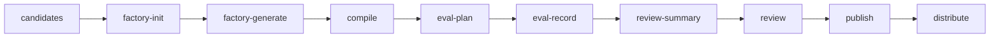

`comet bundle` 是 `/comet-any` 和 `comet publish` 背后的高级后端。普通用户通常不需要直接使用它。

## 什么时候需要直接用

- 排查 `/comet-any` 生成或恢复问题。
- 审计 Bundle factory metadata。
- 调试平台 compile、capability gap 或 executable disclosure。
- 自动化集成需要 JSON 后端命令。

## 常见后端阶段



## 常见命令

```bash
comet bundle candidates --json
comet bundle factory-init my-bundle --file plan.json --json
comet bundle factory-resolve my-bundle --candidate brainstorming --source C:\skills\brainstorming --json
comet bundle compile my-bundle --platform claude --json
comet bundle eval-plan my-bundle --level quick --json
comet bundle eval-record my-bundle --result result.json --json
comet bundle review-summary my-bundle --platform claude --json
```

<Info>
  面向用户的发布路径请优先使用 [comet publish](/zh/cli/publish)。
</Info>
