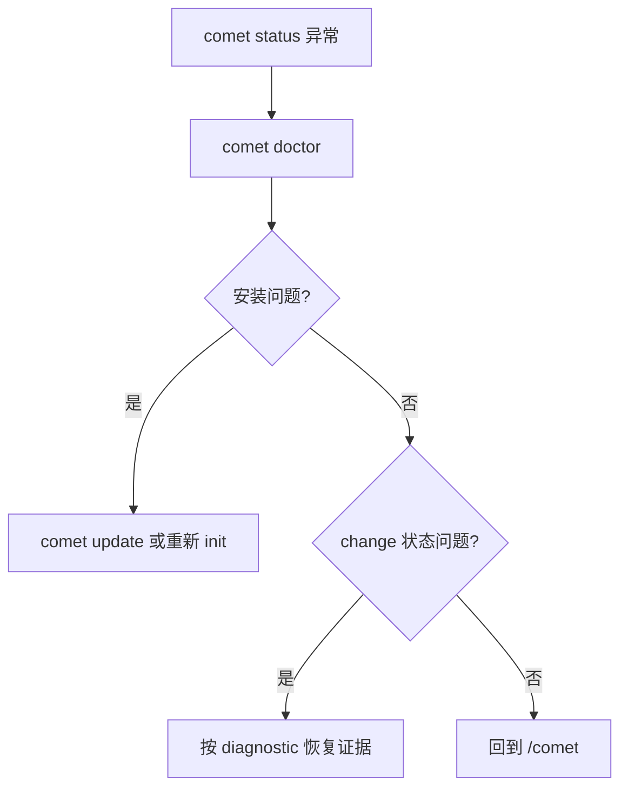

`comet doctor` 是健康检查入口。它覆盖安装和工作流状态两个层面。

## 基本用法

```bash
comet doctor [path]
```

| 选项 | 说明 |
| --- | --- |
| `--json` | 输出结构化诊断 |
| `--scope <scope>` | 诊断 `auto`、`project` 或 `global` |

## 检查内容

- 项目级和全局安装。
- 目标平台 Skill 目录。
- Comet Skill、规则、脚本和 hooks。
- 活跃 change 的 `.comet.yaml`。
- 当前 step、runtime mode 和缺失证据。

## 排障顺序


