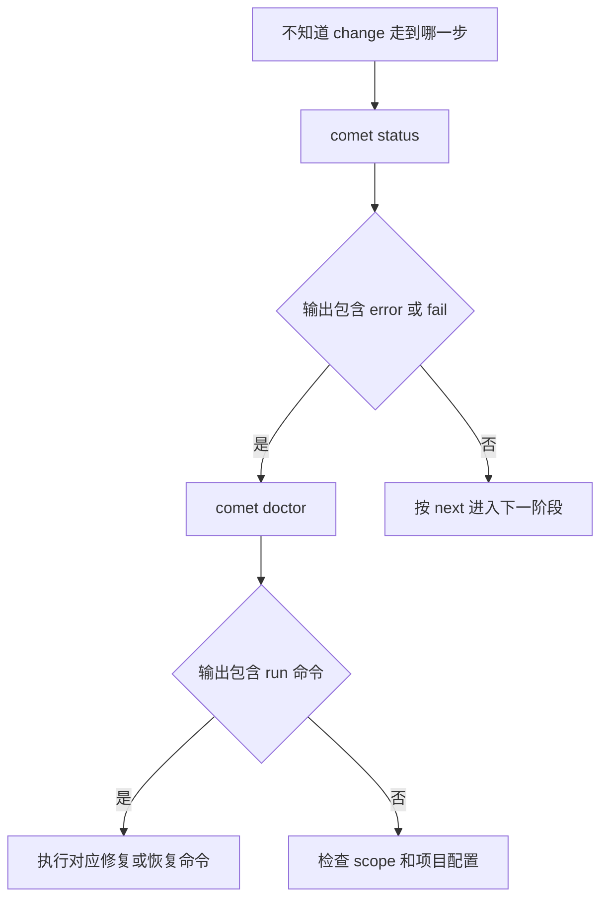

`comet doctor` 用于定位 Comet 无法正常工作的原因。

它会检查安装环境、CLI 和依赖、项目目录、Skill/Rule/Hook、Runtime、CodeGraph，以及当前 change 的状态。`comet status` 主要告诉你 change 走到哪一步；`comet doctor` 主要告诉你环境或项目哪里不完整。

默认检查是只读的，不会因为诊断而修复或改写项目。只有显式使用 `--repair` 时，才会执行支持的修复动作。

CodeGraph 现在从四个维度报告：CLI 是否安装、当前项目索引状态、检测到的 Agent 是否注册 MCP，以及每个检测到的 Agent 是否具备有效能力。项目索引最新本身不代表 Agent 已经注册有效的 CodeGraph MCP；需要详细状态时可以查看 JSON 输出中的 `codegraph` 对象。

## 基本用法

```bash
comet doctor
comet doctor --scope project
comet doctor --json
```

| 选项                    | 说明                                                                                 |
| ----------------------- | ------------------------------------------------------------------------------------ |
| `--json`                | 输出结构化诊断。                                                                     |
| `--scope <scope>`       | 诊断 `auto`、`project` 或 `global`。默认是 `auto`。                                  |
| `--repair`              | 修复 Comet 管理的 Hook、Rule 和当前 change 选择状态。                                |
| `--strategy <strategy>` | 恢复 Classic 根目录迁移，值为 `continue` 或 `rollback`；必须和 `--repair` 一起使用。 |
| `--yes`                 | 确认执行需要用户同意的项目修复，例如 CodeGraph 索引；必须和 `--repair` 一起使用。            |

## 先看文本输出

例如，在项目级 Skill 尚未安装、Classic 根目录缺失、CodeGraph 还有待同步内容时，`comet doctor --scope project` 会打印：

```text
Comet Doctor (scope: project)

  ✓ Environment: node v22.20.0; platform win32/x64; project D:\Project\Comet; global C:\Users\BENYM
  ✓ Comet CLI: installed (0.4.0-beta.20)
  ✓ openspec CLI: installed (1.7.0)
  ✓ Superpowers: detected (Claude Code project, Codex project, Antigravity project, Antigravity 2.0 project; version not recorded by skills installer)
  ✗ Classic artifact layout: docs: configured docs/openspec/ missing; alternate openspec/ missing — run: comet classic root show, then restore the configured root or use comet classic root move
  ✓ Classic platform tool assets: no OpenSpec platform tool assets under docs/
  ✗ Classic OpenSpec root: Configured Classic OpenSpec root is missing: docs/openspec (alternate openspec is missing)
  ⚠ working directories: partial (missing: docs/openspec/changes, docs/openspec/changes/archive, docs/openspec/specs)
  ⚠ Comet skills: not installed in project scope — run: comet init --scope project
  ✓ scripts present: OK (12 scripts)
  ✓ CodeGraph CLI: CodeGraph CLI is installed
  ⚠ CodeGraph project index: CodeGraph index has 1 pending change(s) — run: codegraph sync
  ⚠ CodeGraph MCP registration: no supported Agent configuration detected
  ✓ current selection: no active Comet change
```

版本、路径和数量会随你的环境变化，但输出的结构相同。按符号理解：

- `✓`：该项检查通过，不需要处理。
- `⚠`：发现警告或可选组件缺失。通常可以继续工作，但输出会给出建议动作。
- `✗`：该项检查失败。优先处理这一行及其 `run:` 后面的命令。

这个例子中，真正需要优先处理的是 Classic 根目录：配置指向 `docs/openspec/`，但目录不存在。先运行 `comet classic root show` 查看实际配置，再恢复该目录或使用 `comet classic root move`。`current selection: no active Comet change` 不是错误，只表示当前没有选中的 Comet change。

## 检查哪些问题

输出中的每一行对应一类检查：

| 输出项                                              | 检查作用                                           |
| --------------------------------------------------- | -------------------------------------------------- |
| `Environment`                                       | 当前 Node、平台、项目路径和全局目录是什么。        |
| `Comet CLI` / `openspec CLI`                        | CLI 是否安装，以及当前版本。                       |
| `Superpowers`                                       | 外部 Superpowers 是否可用。                        |
| `Classic artifact layout` / `Classic OpenSpec root` | Classic 配置的根目录是否存在、是否可读。           |
| `working directories`                               | `changes`、归档目录和 `specs` 等工作目录是否完整。 |
| `Comet skills` / `scripts present`                  | 当前 scope 的 Skill 和 Runtime 脚本是否完整。      |
| `CodeGraph CLI`                                     | CodeGraph CLI 是否已经安装。                       |
| `CodeGraph project index`                           | 当前项目索引是否最新、不完整、过期或未初始化。     |
| `CodeGraph MCP registration`                        | 检测到的 Agent 是否注册了有效的 CodeGraph MCP。    |
| `CodeGraph effective for <Agent>`                   | Agent 是否同时具备 CLI、最新索引和有效 MCP 注册。  |
| `current selection`                                 | 是否存在当前写入归属的 Comet change。              |

## 选择检查范围

- `--scope auto`：默认值。先检查当前项目；如果项目没有完整安装，再检查可用的全局安装。
- `--scope project`：只检查当前项目，适合确认项目是否已经完成本地初始化。
- `--scope global`：只检查全局安装，适合排查全局 Skill、Rule、Hook 或 Runtime。

如果全局 Comet 安装完整，但当前项目没有项目级 Skill 副本，`--scope auto` 会报告全局安装可用，并把项目级副本视为可选项。只有当项目需要自己的 Comet 配置和 Skill 副本时，才运行：

```bash
comet init --scope project
```

## JSON 输出怎么看

需要自动化处理时，使用：

```bash
comet doctor --json
```

输出顶层会先告诉你整体结果：

```json
{
  "scope": "project",
  "status": "failed",
  "healthy": false,
  "repaired": [],
  "results": [
    {
      "check": "Comet CLI",
      "status": "pass",
      "message": "installed (0.4.0-beta.19)"
    },
    {
      "check": "Classic OpenSpec root",
      "status": "fail",
      "message": "Configured Classic OpenSpec root is missing: docs/openspec"
    }
  ]
}
```

`healthy: false` 表示至少有一项 `fail`；具体处理方式在 `results[].message` 中。`status: passed` 且 `healthy: true` 才表示本次诊断没有失败项。`runtime` 和 `codegraph` 字段还会提供 Runtime 来源和 CodeGraph 的详细状态。

`codegraph` 对象包含 `cliStatus`、`indexStatus`、`mcpStatus`、`agents` 和 `effectiveForAgent`。只有 CLI 已安装、项目索引最新，并且对应 MCP 配置指向 CodeGraph 服务时，该 Agent 才会被标记为 effective。

## 什么时候使用 `--repair`

先运行不带 `--repair` 的 `comet doctor`，确认问题和建议动作。只有输出明确指向修复，或者你已经确认要修复 Comet 管理的 Hook、Rule、selection 或迁移现场时，才运行：

```bash
comet doctor --repair
```

`--repair` 会执行写操作。Classic 根目录迁移中断时，根据现场选择 `continue` 或 `rollback`；涉及 CodeGraph 等需要你确认的项目修复时，再加 `--yes`。如果只想重新检查，请省略 `--repair`。

## 排障顺序


