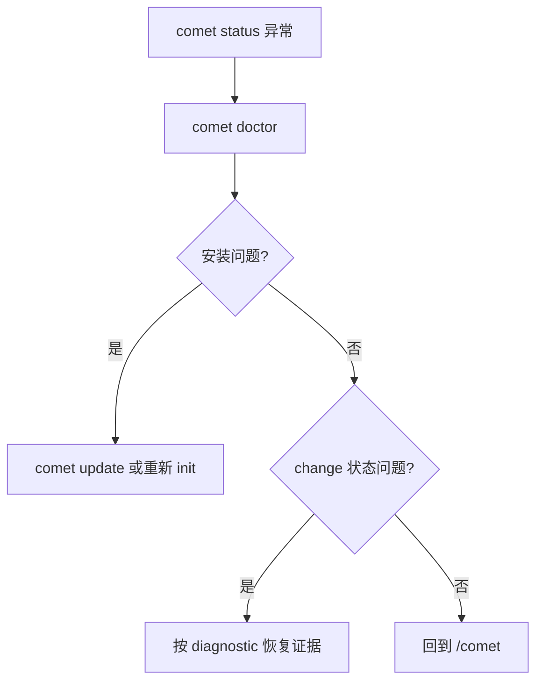

`comet doctor` 是健康检查入口。它覆盖安装和工作流状态两个层面。

## 基本用法

```bash
comet doctor
```

| 选项 | 说明 |
| --- | --- |
| `--json` | 输出结构化诊断 |
| `--scope <scope>` | 诊断 `auto`、`project` 或 `global` |

## 检查内容

- 项目级和全局安装。
- 目标平台 Skill 目录。
- Comet Skill、规则、脚本和 hooks。
- 活跃 change 的 `.comet.yaml`。
- 当前 step、runtime mode 和缺失证据。

## 范围诊断

默认情况下，`comet doctor` 使用 `--scope auto`。auto 会先检查当前项目，再在全局安装位于不同目录时继续检查全局安装。

如果全局 Comet 安装是完整的，但当前项目没有项目级 Skill 副本，`doctor` 会报告全局安装可用，并把项目级副本视为可选项。只有当这个项目需要自己提交一份 Comet 配置时，才需要运行 `comet init --scope project`。

诊断结果还会包含 Node 版本、平台、项目路径和实际使用的全局 home 目录，方便对比不同环境里的安装问题。

## 排障顺序


