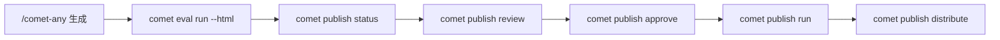

`comet publish` 是普通用户面对 `/comet-any` 产物的发布入口。它复用 Bundle 后端，但把命令组织成 readiness、review、approval、publish 和 distribute。

## 子命令

| 命令 | 用途 |
| --- | --- |
| `list` | 列出可恢复的 publish candidate |
| `status <name>` | 查看 readiness 和 next action |
| `review <name>` | 生成发布前评审摘要 |
| `approve <name>` | 批准当前 hash 的 candidate |
| `run <name>` | 发布已批准 candidate |
| `distribute <name>` | 分发已发布 candidate 到平台 |

## 推荐流程



## 示例

```bash
comet publish list --project . --json
comet publish status review-helper --project .
comet publish review review-helper --platform claude --json
comet publish approve review-helper --reviewer alice
comet publish run review-helper --platform claude
comet publish distribute review-helper --platform claude --scope project --confirm-executables
```

## readiness 阻塞项

- unresolved candidates。
- 缺少当前 hash 的 eval 证据。
- 缺少当前 hash 的人工 approval。
- required capability gap。
- executable disclosure 未确认。
- review summary 不是 publishable。
