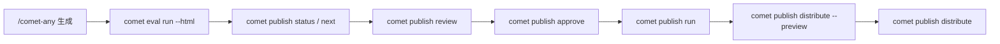

`comet publish` 是普通用户面对 `/comet-any` 产物的发布入口。它**复用 Bundle 后端**的状态和 readiness 契约，但不引入第二个状态模型，把命令组织成 readiness、review、approval、publish 和 distribute。

预设的心智模型是：

- `/comet-any` 创建、恢复和优化 Skill
- `comet eval` 验证生成物
- `comet publish status` / `comet publish next` 是普通用户查 readiness 和**下一步要做什么**的入口
- `comet publish` 处理 readiness、人工批准、发布和分发

<Info>
  <code>comet publish</code> 是 <code>comet bundle</code> 后端的<strong>薄封装</strong>（thin facade）。每个 <code>publish</code> 子命令都委托给对应的 <code>bundle</code> 函数。普通用户用 <code>publish</code>，审计/排障时才直接用 <code>bundle</code>。
</Info>

## 子命令

| 命令 | 用途 | 必需参数 |
| --- | --- | --- |
| `comet publish list` | 列出可恢复的 publish candidate | — |
| `comet publish status <name>` | 查看 readiness 和 next action | `<name>` |
| `comet publish next <name>` | 打印**单个**推荐下一步（不暴露后端 Bundle 命令） | `<name>` |
| `comet publish review <name>` | 生成发布前评审摘要 | `<name>`、`--platform` |
| `comet publish approve <name>` | 批准当前 hash 的 candidate | `<name>`、`--reviewer` |
| `comet publish run <name>` | 发布已批准 candidate | `<name>`、`--platform` |
| `comet publish distribute <name>` | 分发已发布 candidate 到平台 | `<name>`、`--platform` |

所有子命令都支持 `--json`。

<Note>
  <code>comet publish</code> 没有 reject 子命令。<code>approve</code> 是用户唯一批准入口（内部调用 <code>reviewBundle</code> 并固定 decision=approved）。需要拒绝时用高级的 <code>comet bundle review &lt;name&gt; --reject --reviewer &lt;name&gt;</code>。
</Note>

## 推荐流程



## 完整示例

```bash
# 列出可恢复 candidate
comet publish list --project . --json

# 查看完整 readiness 和阻塞项
comet publish status review-helper --project . --json

# 只想知道下一步该跑什么
comet publish next review-helper --project . --json

# 生成评审摘要
comet publish review review-helper --platform claude --json

# 人工批准
comet publish approve review-helper --reviewer alice --json

# 发布已批准 candidate
comet publish run review-helper --platform claude --json

# 分发预览（强制）
comet publish distribute review-helper --platform claude --scope project --preview --json

# 真实分发
comet publish distribute review-helper --platform claude --scope project --json
```

## 通用选项

| 选项 | 说明 |
| --- | --- |
| `--project <dir>` | 项目根目录（默认 `.`） |
| `--json` | 输出结构化 JSON |
| `--platform <id>` | 目标平台（可多次传） |
| `--scope <project\|global>` | 分发范围 |
| `--reviewer <name>` | 评审人（`approve` 必需） |
| `--locale <locale>` | 语言 |
| `--overwrite` | 覆盖已有发布候选（`run`）/ 已有分发（`distribute`） |
| `--preview` | 分发预览 |
| `--confirm-executables` | 确认可执行披露 |
| `--skip-capability <cap>` | 跳过 optional 能力（可多次传） |

## 只想知道下一步：comet publish next

`comet publish status` 给你完整的 readiness 结论和阻塞项；如果你**只想知道现在该跑哪一条命令**，用 `comet publish next`——它打印**单个**推荐下一步，不暴露任何后端 Bundle 命令：

```bash
comet publish next review-helper --project . --json
```

文本输出大致长这样：

```text
Next step for review-helper
Status: draft
Current step: review
Action: Run validation review
Command: comet publish review review-helper --platform claude --json
Reason: Eval evidence exists but review has not been recorded
Requires confirmation: no
```

`--json` 模式额外返回结构化字段：

| 字段 | 含义 |
| --- | --- |
| `status` / `currentStep` | candidate 当前状态和所在阶段 |
| `nextStep.action` / `nextStep.label` | 推荐动作的类别和用户可读标签 |
| `nextStep.command` | 你**应该直接跑的命令**（已填好参数） |
| `nextStep.reason` | 为什么推荐这一步 |
| `nextStep.requiresUserConfirmation` | 这一步是否需要你先确认（如批准、分发） |
| `preferenceDrift.changed` | 项目 Skill 偏好在本次流程启动后是否发生了漂移 |

<Tip>
  <code>comet publish next</code> 是给"被打断的 <code>/comet-any</code> 流程"恢复用的：它把后端 Bundle 的 next action 翻译成一条用户命令，所以你不需要去读 <code>comet bundle status</code> 的内部输出。<strong>偏好漂移</strong>（<code>preferenceDrift.changed</code>）为真时，<code>advisory</code> 模式会警告，<code>strict</code> 模式默认阻塞——你需要决定是继续旧方案还是重新生成。
</Tip>

## readiness 结论

`comet publish status` 会展示四种 readiness 结论之一：

| 结论 | 含义 |
| --- | --- |
| `published` | 已发布 |
| `can-publish` | 可以发布（已批准且 hash 匹配） |
| `needs-confirmation` | 等待确认（无 blocker 但还没批准） |
| `blocked` | 不能发布（有 blocker） |

## readiness 阻塞项

readiness blockers 会阻止 publish。每个 blocker 有一个**阻塞码**前缀，`comet publish status` 会直接展示 `Readiness:`、`Blockers:`、`Warnings:` 和 `Evidence:`，并给出 `nextAction` 恢复命令：

| 阻塞码 | 含义 |
| --- | --- |
| `[candidate]` | 还有 unresolved candidate |
| `[preference]` | （strict）required Skill 缺失/歧义；偏好漂移 |
| `[proposal]` | proposal 未确认 |
| `[composition]` | composition 有 issue |
| `[control-plane]` | 稳定控制面校验失败 |
| `[draft]` | 缺少 `currentHash` |
| `[eval]` | 缺少/失败/对应旧 hash 的 Eval 证据 |
| `[publish]` | status `ready` 但没有 ready metadata |

完整的阻塞码表和恢复建议见[发布和分发 Skill · 阻塞码](/zh/skill-creator/publishing#阻塞码blocker-codes)。

## 分发预览是强制的

执行真实分发前**必须先跑 preview**：

```bash
comet publish distribute review-helper --platform claude --scope project --preview --json
```

preview 会展示：

- `Install preview`、planned files
- unsupported capability
- executable disclosures
- `No files were written`

只有确认 preview 结果后，才可以移除 `--preview` 执行真实分发。

## 处理可执行披露和能力缺口

如果目标平台包含 hook 或脚本等可执行能力：

```bash
comet publish distribute review-helper --platform claude --scope project --confirm-executables --json
```

如果用户明确选择跳过 optional 能力：

```bash
comet publish distribute review-helper --platform claude --scope project --skip-capability <capability> --json
```

| 能力类型 | 缺口处理 |
| --- | --- |
| required 能力缺口 | **取消该平台**，不能跳过 |
| optional 能力缺口 | 必须**由用户显式选择 skip** |
| Hook/脚本披露 | 必须**由用户确认**后才可分发 |

`hooks/*.yaml` 是 **Comet portable hook descriptor**，只在 `comet publish distribute` 编译到目标平台配置后生效。

## Bundle 和 publish 的关系

| 命令 | 定位 | 适合谁 |
| --- | --- | --- |
| `comet publish` | 用户发布入口 | 普通用户 |
| `comet bundle` | 高级 Bundle 后端 | 审计、调试、自动化集成 |

## 下一步

- [发布和分发 Skill](/zh/skill-creator/publishing) — readiness 状态链和门禁详解
- [comet bundle](/zh/cli/bundle) — 高级 Bundle 后端
- [comet eval](/zh/cli/eval) — 发布前证据入口
