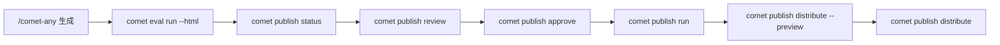

`comet publish` 是普通用户面对 `/comet-any` 产物的发布入口。它复用 Bundle 后端的状态和 readiness 契约，但不引入第二个状态模型，把命令组织成 readiness、review、approval、publish 和 distribute。

预设的心智模型是：

- `/comet-any` 创建、恢复和优化 Skill
- `comet eval` 验证生成物
- `comet publish` 处理 readiness、人工批准、发布和分发

## 子命令

| 命令 | 用途 |
| --- | --- |
| `comet publish list` | 列出可恢复的 publish candidate |
| `comet publish status <name>` | 查看 readiness 和 next action |
| `comet publish review <name>` | 生成发布前评审摘要 |
| `comet publish approve <name>` | 批准当前 hash 的 candidate |
| `comet publish run <name>` | 发布已批准 candidate |
| `comet publish distribute <name>` | 分发已发布 candidate 到平台 |

所有子命令都支持 `--json`。

## 推荐流程



## 完整示例

```bash
# 列出可恢复 candidate
comet publish list --project . --json

# 查看 readiness 和下一步
comet publish status review-helper --project . --json

# 生成评审摘要
comet publish review review-helper --platform claude --json

# 人工批准
comet publish approve review-helper --reviewer alice --json

# 发布已批准 candidate
comet publish run review-helper --platform claude --json

# 分发预览（强制）
comet publish distribute review-helper --platform claude --scope project --preview --json

# 真实分发
comet publish distribute review-helper --platform claude --scope project --json
```

## 通用选项

| 选项 | 说明 |
| --- | --- |
| `--project <dir>` | 项目根目录（默认 `.`） |
| `--json` | 输出结构化 JSON |
| `--platform <id>` | 目标平台（可多次传） |
| `--scope <project\|global>` | 分发范围 |
| `--reviewer <name>` | 评审人（`approve`） |
| `--preview` | 分发预览 |
| `--confirm-executables` | 确认可执行披露 |
| `--skip-capability <cap>` | 跳过 optional 能力 |

## readiness 阻塞项

readiness blockers 会阻止 publish。只要存在以下任一项，就必须停在评审阶段：

- 还有 unresolved candidate。
- required Skill 缺失或歧义。
- strict 模式下偏好文件漂移。
- Eval 没跑、Eval 对应旧 hash、或缺少当前 hash 的 Eval 证据。
- 没有人工 approval，或 approval 对应旧 hash。
- required capability gap。
- executable disclosure 未确认。
- review summary 不是 publishable。

<Tip>
  `comet publish status` 会直接展示 `Readiness:`、`Blockers:`、`Warnings:` 和 `Evidence:`。当 `Readiness: blocked` 时，先根据 blockers 处理候选恢复、Eval 或 review，再继续 publish。
</Tip>

## 分发预览是强制的

执行真实分发前必须先跑 preview：

```bash
comet publish distribute review-helper --platform claude --scope project --preview --json
```

preview 会展示：

- `Install preview`、planned files
- unsupported capability
- executable disclosures
- `No files were written`

只有确认 preview 结果后，才可以移除 `--preview` 执行真实分发。

## 处理可执行披露和能力缺口

如果目标平台包含 hook 或脚本等可执行能力：

```bash
comet publish distribute review-helper --platform claude --scope project --confirm-executables --json
```

如果用户明确选择跳过 optional 能力：

```bash
comet publish distribute review-helper --platform claude --scope project --skip-capability <capability> --json
```

- required 能力缺口：取消该平台。
- optional 能力缺口：必须由用户显式选择 skip。
- Hook/脚本披露：必须由用户确认后才可分发。

`hooks/*.yaml` 是 Comet portable hook descriptor，只在 `comet publish distribute` 编译到目标平台配置后生效。

## 下一步

- [发布和分发 Skill](/zh/skill-factory/publishing) — readiness 状态链和门禁详解
- [comet bundle](/zh/cli/bundle) — 高级 Bundle 后端
- [comet eval](/zh/cli/eval) — 发布前证据入口
