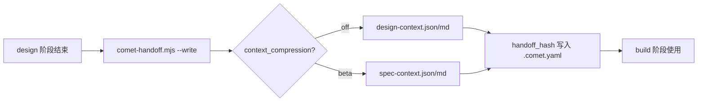

上下文压缩（context compression）控制 design→build 阶段交接时，有多少 OpenSpec 上下文传给 Superpowers。它是一个 beta 功能，目的是在不损失实现正确性的前提下减少 token 消耗。

它和传统的摘要式压缩不同。摘要式压缩把重点内容总结后传递，在 Spec 任务上容易漏掉任务和细节，导致 Spec 漂移，进而影响下游 Agent 的实现。Comet 的做法是结构化摘录加 hash 引用：delta spec 原样保留，其余文件用 hash 关联源文件，需要时重新读取原文，在保证 Spec 完整的同时减少 token 消耗。

## 它解决什么问题

design 阶段结束时，需要把 OpenSpec 的需求规格（proposal、design、tasks、delta spec）交给 build 阶段作为实现依据。默认模式下这些内容完整传入，token 开销大。上下文压缩通过 hash 引用和结构化摘录减少冗余传输。

## 两种模式

| 模式 | 行为 | token 节省 | 状态 |
| --- | --- | --- | --- |
| `off`（默认） | 生成可追溯的完整摘要（截断超过 80 行的文件） | 基线 | 稳定 |
| `beta` | 结构化 spec 摘录，delta spec 原样保留，proposal/design/tasks 只存 hash 引用 | 约 25–30% | beta |

<p align="center">
  
</p>

<p align="center">off 保留完整摘要，beta 保留 delta spec 并用 hash 引用 supporting 文件</p>

### off 模式

该模式生成以下文件：

- `design-context.json` — 机器索引（change、phase、canonical spec、源文件路径、per-file sha256、context_hash）
- `design-context.md` — 供 Superpowers 读取。每个文件带源路径、行范围、sha256 和摘要。超过 80 行的文件会截断，并带有 `[TRUNCATED]` 标记和 `Full source:` 指针。

用 `--full` 标志可以输出未截断的完整原文。

### beta 模式

该模式生成以下文件：

- `spec-context.json` — 机器索引，每文件标 `role: spec`（delta spec）或 `role: supporting`（proposal/design/tasks）
- `spec-context.md` — 原样摘录 delta spec，包括验收场景；proposal、design 和 tasks 只记录 hash 引用

<Note>
  beta 模式下 <code>--full</code> 被忽略（会输出 warning）。beta 只对 delta spec 原样写入，其他文件靠 hash 引用，所以节省来自不重复传输 proposal/design/tasks 的全文。
</Note>

## delta spec 的处理方式

OpenSpec 的 delta spec（`specs/<capability>/spec.md`）包含本次变更的需求和验收场景。beta 模式原样写入 delta spec，对 proposal、design 和 tasks 使用 hash 引用：

- delta spec 的正文不经过摘要。
- proposal、design 和 tasks 通过 sha256 关联源文件，需要时可以重新读取原文。

<Warning>
  OpenSpec delta spec 始终是权威来源。beta 摘录缺失或过期时，必须重新生成或直接读源 spec，绝不能用 Agent 摘要替代。
</Warning>

## 何时触发

上下文压缩在 **design→build 交接时**触发，由 `comet-handoff.mjs <change> design --write` 生成。



design 守卫会检查交接包的存在和有效性：`handoff_context`/`handoff_hash` 必须写入 `.comet.yaml`，markdown 包必须带 `Generated-by:` 标记和可追溯的源/hash 引用。beta 模式下 `spec-context.json` 还必须结构有效并引用当前源文件。

## 主动式压缩

design 阶段在写完 `brainstorm-summary.md` 后、创建 Design Doc 之前，会触发平台原生的 compact/compaction 机制（如果平台支持），或暂停让你手动执行。压缩后重新加载交接文件。这是独立于 `context_compression` 的运行时优化。

## 当前基准数据

下表记录当前 Comet benchmark 的结果。数据只适用于该任务集和测试配置：

| 指标 | off | beta |
| --- | --- | --- |
| 测试通过率 | 100% | 100% |
| spec 覆盖率 | 100% | 95% |
| token 节省 | 基线 | 约 25–30% |
| 大型任务节省 | — | 最多约 15,000 tokens |

在该基准中，beta 模式的 token 使用量降低约 25–30%，spec 覆盖率从 100% 变为 95%。原因是辅助文件（proposal/design/tasks）只保留 hash 引用。

## 怎么启用 beta

### 项目级（推荐）

编辑 `.comet/config.yaml`：

```yaml
classic:
  context_compression: beta
```

新 change 创建时会快照这个值到自己的 `.comet.yaml`。

### 单个 change

通过 `comet-state` 命令：

```bash
node "$COMET_STATE" set <change-name> context_compression beta
```

### 环境变量临时覆盖

```bash
export COMET_CONTEXT_COMPRESSION=beta
```

仅在 change 级字段为空时生效。

## 怎么选

| 场景 | 推荐模式 |
| --- | --- |
| token 成本敏感、大型项目 | `beta`（节省 25–30%） |
| 需要完整 spec 覆盖、正确性优先 | `off` |
| 不确定 | 先用 `off`，benchmark 后再切 `beta` |

## 下一步

- [Classic 配置](/zh/classic/configuration) — context_compression 字段和配置优先级
- [代码审查机制](/zh/concepts/review-mode) — 另一个项目配置项
- [工作流概念](/zh/concepts/workflow) — design→build 交接在五阶段中的位置
- [comet-handoff](/zh/scripts/comet-handoff) — 交接包生成的脚本细节
