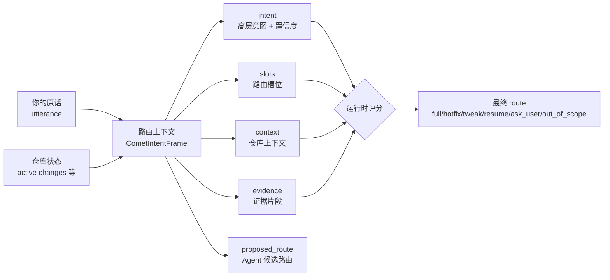
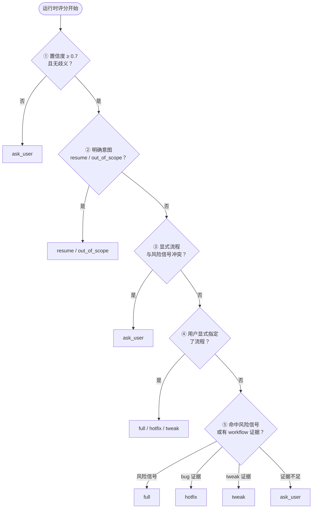

每次你输入 `/comet-classic` 加一句话，Comet 都要做一个关键判断：这次到底该走哪条 Classic profile？这个判断由两件事驱动——**意图识别**和**槽位提取**。

**意图识别**回答"你想干什么"：启动新变更、修已有 bug、做轻量调整、恢复进行中的变更，还是只是在提问？**槽位提取**把你的原话和仓库状态拆解成结构化的路由信号——动作、候选流程、风险标记——每条信号都带来源标注，供运行时按固定优先级评分。

0.4.0 起，这套机制（实现为 `CometIntentFrame`）取代了 Skill 正文里的自然语言经验规则，让路由结果变得**可解释、可复核、可恢复**，在我们的基准测试上这使得Comet的可恢复能力大幅提高。

<p align="center">
  
</p>

<p align="center">路由上下文把原话、仓库状态和风险信号整理成可复核证据，再交给运行时决定最终 route</p>

## 为什么需要路由上下文

<Note>
  一句话概括：路由上下文让 <code>/comet-classic</code> 的路由<strong>可解释、可复核、可恢复</strong>，而不是一个黑盒猜测。
</Note>

在路由上下文之前，`/comet-classic` 入口靠的是 Skill 正文里的一段自然语言规则——"如果是 bug 就走 hotfix，如果是文案改动就走 tweak……"。这种做法有三个问题：

| 问题 | 表现 |
| --- | --- |
| **不可解释** | 路由结果是怎么得出来的？用户和 Agent 都说不清，只能信任提示词 |
| **不可复核** | 没有结构化的判断依据，无法在路由错的时候定位是哪个信号出了问题 |
| **不可恢复** | 中断后重新进来，Agent 只能重新读一遍提示词，重新"猜"一次 |

路由上下文把"用户想干什么"变成一份**有字段、有证据、有置信度**的结构化数据。运行时不再信任 Agent 自己提的路由建议，而是**重新评分**后给出最终路由，并把分歧写进诊断日志。

## 路由的六种结果

运行时评分后，会把你的请求路由到下面六种结果之一：

| 路由（route） | 含义 | 下一步 Skill | 需要确认 |
| --- | --- | --- | --- |
| `full` | 走完整五阶段（open→design→build→verify→archive） | `comet-open` | 否 |
| `hotfix` | 快速修复已有行为，跳过头脑风暴 | `comet-hotfix` | 否 |
| `tweak` | OpenSpec 链路的中等改动，delta spec 是一等公民 | `comet-tweak` | 否 |
| `resume` | 恢复一个进行中的变更 | 由该变更的当前阶段决定 | 否 |
| `ask_user` | 证据不足或有冲突，停下来问你 | 无 | **是** |
| `out_of_scope` | 你只是在提问，没要求执行工作流 | 无 | **是** |

注意两点：

- 只有 `ask_user` 和 `out_of_scope` 需要**显式确认**——Comet 不会在没足够证据时替你硬选一条路。
- `full`/`hotfix`/`tweak` 各自映射到一个确定的入口 Skill，而 `resume` 的下一步取决于你要恢复的那个变更当前停在哪一阶段。

## 意图识别与槽位提取

路由决策的核心输入是 `intent`（意图识别）和 `slots`（槽位提取），两者连同其余字段构成 `CometIntentFrame`——运行时用这份结构评分并给出最终路由：



| 部分 | 作用 |
| --- | --- |
| `utterance` | 触发 `/comet-classic` 的用户原话，便于事后追溯 |
| `intent` | 高层意图（启动/恢复/修 bug/小改/提问/未知）+ 置信度 |
| `slots` | 从原话归一化出来的路由槽位：动作、候选流程、风险信号等 |
| `context` | 从**仓库状态**读取的上下文，不是从你的话里抽的 |
| `evidence` | 支撑关键判断的证据片段，每条标注来源（`user`/`repo`/`state`） |
| `proposed_route` | Agent 提交的候选路由——**只是建议，运行时会复核** |

### 意图识别（`intent`）

`intent` 包含两个子字段：

- **`name`**:（意图类型）。`start_new_change` / `fix_bug` / `make_tweak` / `resume_change` / `ask_question` / `unknown`
- **`confidence`**:（0–1 的置信度评分）。置信度低于 0.7 时，运行时直接路由到 `ask_user`——宁可停下来问，不依赖模糊意图冒险选路。

### 槽位提取（`slots`）

槽位里最影响路由的是几个**风险信号**布尔值。它们决定了"这事是不是该走完整流程"：

| 槽位 | 命中时倾向 |
| --- | --- |
| `existing_behavior: true` | 修复已有行为 → 倾向 `hotfix` |
| `new_capability: true` | 新增能力 → 倾向 `full` |
| `public_api_change: true` | 改了对外接口/契约 → 倾向 `full` |
| `schema_change: true` | 改了结构化数据格式（如 `.comet.yaml`） → 倾向 `full` |
| `cross_module_change: true` | 跨模块/跨工作流边界 → 倾向 `full` |

只要命中**任何一个**风险信号（`new_capability`/`public_api_change`/`schema_change`/`cross_module_change`），运行时就倾向于走 `full`，哪怕用户说的是"小改一下"。

<Warning>
  这是 Comet 的安全设计：<strong>风险信号优先于口头说的流程</strong>。如果你明确要求走 <code>hotfix</code> 但同时命中了风险信号，运行时会停下来问你（<code>ask_user</code>），而不是默默放行一个高风险的轻量流程。
</Warning>

## 运行时怎么评分

Agent 整理好路由上下文后，运行时（`comet-intent.mjs`）会按一套**固定优先级**重新评分，给出最终 `route`。

<Note>
  **这套固定优先级顺序，就是可解释路由的核心。** 每一步都有明确的判断条件，分歧写入诊断日志，方便事后追溯。
</Note>



这套顺序回答了几个常见的"为什么路由成这样"的疑问：

1. **置信度低于 0.7 → `ask_user`。** 连 Agent 自己都不确定你想干什么，运行时不会替你赌。
2. **多个进行中的变更 + 没指定恢复哪个 → `ask_user`。** Comet 不会猜你恢复哪个。
3. **风险信号优先于口头流程。** 你说"走 hotfix"，但命中 `public_api_change`，运行时停下来确认，而不是放行。
4. **没风险信号 + 修已有 bug + 有证据 → `hotfix`。** 这是 hotfix 的典型画像。
5. **证据不足 → `ask_user`。** 比起猜一条路，Comet 宁可问你。

<Info>
  运行时评分和 Agent 的 <code>proposed_route</code> 可能不一致。这种时候运行时输出最终 <code>route</code>，并把分歧写进 <code>diagnostics</code>（例如"agent proposed_route 'hotfix' normalized to 'full'"）。这让路由<strong>可复核</strong>：出问题时你能看到是哪一步改写了建议。
</Info>

## 几个典型场景

下面用具体例子说明同一条用户输入，不同上下文会路由到不同结果。

### 场景一：修一个已知 bug

```text
/comet-classic 登录接口偶发 500，帮我看一下
```

- `intent.name`: `fix_bug`，置信度高
- `existing_behavior: true`（修已有行为）
- 风险信号全为 `false`
- 有 `workflow_candidate: hotfix` 的证据

→ 路由 **`hotfix`**，下一步 `comet-hotfix`。这是 hotfix 的标准画像：修已有异常，不碰新能力、API、schema。

### 场景二：嘴上说小改，实则动了对外接口

```text
/comet-classic 小改一下，把 CLI 的 --force 参数去掉
```

- `intent.name`: `make_tweak`
- `user_explicit_workflow: tweak`（你明确说了"小改"）
- 但 `public_api_change: true`（去掉 CLI 参数是改对外接口）

→ 路由 **`ask_user`**。显式的 `tweak` 和风险信号冲突，运行时停下来问你，而不是放行一个影响外部契约的轻量流程。

### 场景三：恢复一个进行中的变更

```text
/comet-classic 继续上次的 note-board
```

- `requested_action: continue`
- `change_id: note-board`，且在 `active_change_names` 里

→ 路由 **`resume`**，下一步由 `note-board` 这个变更当前停在哪一阶段决定。

### 场景四：只是问个问题

```text
/comet-classic Comet 的 verify 阶段大概做什么？
```

- `intent.name: ask_question`
- `requested_action: question`

→ 路由 **`out_of_scope`**。你在提问，没要求执行工作流，Comet 不会强行启动一个变更。

## 这套机制对用户意味着什么

对普通用户，你**不需要手写路由上下文**——上下文整理和评分都是 `/comet-classic` 内部自动完成的。你只需要知道：

1. **说清楚你要干什么。** 越具体，路由越准。"修这个 bug"比"帮我看看"更容易命中 `hotfix`。
2. **Comet 会问，而不是猜。** 如果证据不足或冲突，它会停下来确认，而不是把一条不确定的路走到底。
3. **路由是可以事后追溯的。** 如果你觉得路由错了，路由上下文和诊断信息记录了完整的判断依据。

如果你是高级用户或贡献者，想看后端实际的路由输出，可以手工跑：

```bash
# 把一个路由上下文 JSON 交给运行时评分
node "$COMET_INTENT" route '{"schema_version":"comet.intent.v1", ...}'
# 或从 stdin 读
node "$COMET_INTENT" route --stdin < frame.json
```

它会返回最终的 `route`、`diagnostics`（分歧诊断）和完整的 `normalizedFrame`。字段含义见随 Skill 分发的 `reference/intent-frame.md`。

## 和 `/comet-tweak` 的关系

路由上下文让 `/comet-classic` 能自动路由到 `tweak`，那 `/comet-tweak` 这个独立命令还有用吗？

有用，但定位不同：

- **`/comet-classic`**：Classic 永久入口，由路由上下文决定走 `full`/`hotfix`/`tweak`/`resume`。适合已经选择 Classic、但不确定走哪条 profile 时。
- **`/comet-tweak`**：**tweak 专用**的 OpenSpec action 路径。你已经明确知道要做一次 OpenSpec 链路的中等改动，直接走它更快。

换句话说，`/comet-classic` 是"在 Classic 内帮我判断该走哪条"，`/comet-tweak` 是"我已经知道要走 tweak"。完整的五阶段 `full` 仍然走 Superpowers 的 design/plan/build 路径。

## 下一步

- [Comet 工作流总览](/zh/concepts/workflow) — 五阶段、阶段交接和 verify 漂移决策
- [决策点](/zh/concepts/decision-points) — Comet 在关键节点如何停下来问你
- [核心脚本概览](/zh/scripts/overview) — `comet-intent.mjs` 等脚本如何协作
