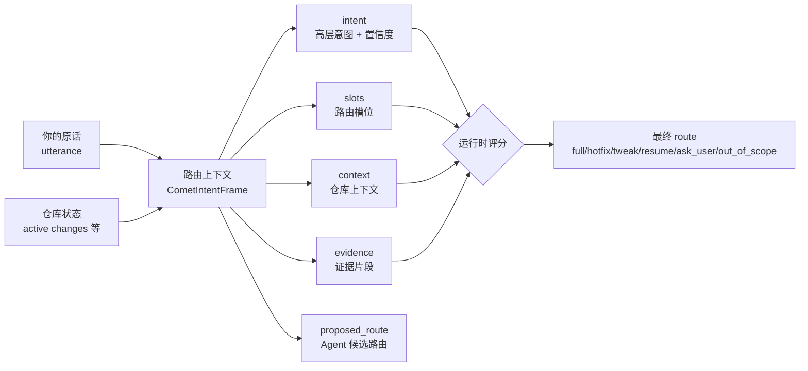

在 Classic 模式下，输入 `/comet` 并说明目标即可。内部 `/comet-classic` 会判断这次该走哪条 Classic profile。判断依据包括**意图识别**、**槽位提取**和实际文件状态。

<p align="center">
  
</p>

<p align="center">
  路由上下文记录用户请求、仓库状态和风险信号，运行时据此计算 route
</p>

## 路由的六种结果

输入一句话后，Comet 会把这次调用路由到下面六种结果之一：

| 路由（route）  | 含义                                             | 下一步 Skill           | 需要确认 |
| -------------- | ------------------------------------------------ | ---------------------- | -------- |
| `full`         | 走完整五阶段（open→design→build→verify→archive） | `comet-open`           | 否       |
| `hotfix`       | 快速修复已有行为，跳过头脑风暴                   | `comet-hotfix`         | 否       |
| `tweak`        | 使用 OpenSpec 的中等改动，delta spec 是正式产物  | `comet-tweak`          | 否       |
| `resume`       | 恢复一个进行中的变更                             | 由该变更的当前阶段决定 | 否       |
| `ask_user`     | 证据不足或有冲突，停下来问你                     | 无                     | **是**   |
| `out_of_scope` | 你只是在提问，没要求执行工作流                   | 无                     | **是**   |

其中：

- 只有 `ask_user` 和 `out_of_scope` 需要**显式确认**。证据不足时，Comet 会暂停并等待你选择。
- `full`/`hotfix`/`tweak` 各自映射到一个确定的入口 Skill，而 `resume` 的下一步取决于你要恢复的那个变更当前停在哪一阶段。

<Warning>
  这是 Comet 的安全设计：<strong>风险信号优先于口头说的流程</strong>。如果你明确要求走{' '}
  <code>hotfix</code> 但同时命中了风险信号，运行时会停下来问你（<code>ask_user</code>
  ），并在高风险的轻量流程入口暂停确认。
</Warning>

## 几个典型场景

下面用具体例子说明同一条用户输入，不同上下文会路由到不同结果。

### 场景一：修一个已知 bug

```text
/comet 登录接口偶发 500，帮我看一下
```

- `intent.name`: `fix_bug`，置信度高
- `existing_behavior: true`（修已有行为）
- 风险信号全为 `false`
- 有 `workflow_candidate: hotfix` 的证据

→ 路由 **`hotfix`**，下一步 `comet-hotfix`。这是 hotfix 的标准画像：修已有异常，不碰新能力、API、schema。

### 场景二：嘴上说小改，实则动了对外接口

```text
/comet 小改一下，把 CLI 的 --force 参数去掉
```

- `intent.name`: `make_tweak`
- `user_explicit_workflow: tweak`（你明确说了"小改"）
- 但 `public_api_change: true`（去掉 CLI 参数是改对外接口）

→ 路由 **`ask_user`**。显式的 `tweak` 和风险信号冲突，运行时会暂停并请你确认是否继续这条会影响外部契约的轻量流程。

### 场景三：恢复一个进行中的变更

```text
/comet 继续上次的 note-board
```

- `requested_action: continue`
- `change_id: note-board`，且在 `active_change_names` 里

→ 路由 **`resume`**，下一步由 `note-board` 这个变更当前停在哪一阶段决定。

### 场景四：只是问个问题

```text
/comet Comet 的 verify 阶段大概做什么？
```

- `intent.name: ask_question`
- `requested_action: question`

→ 路由 **`out_of_scope`**。你在提问，没要求执行工作流，Comet 会保持在信息查询范围。

## 使用时需要知道什么

对普通用户，你**不需要手写路由上下文**。调用 `/comet` 后，配置进入 Classic，`/comet-classic` 会在内部完成上下文整理和评分。你只需要知道：

1. **说清楚你要干什么。** 越具体，路由越准。"修这个 bug"比"帮我看看"更容易命中 `hotfix`。
2. **Comet 在证据不足时请你确认。** 证据不足或存在冲突时，它会暂停在路由入口，等待明确决定。
3. **路由可追溯。** 如果你觉得路由错了，可以回看路由上下文和诊断信息。

如果你是高级用户或贡献者，想看后端实际的路由输出，可以手工跑：

```bash
# 把一个路由上下文 JSON 交给运行时评分
node "$COMET_INTENT" route '{"schema_version":"comet.intent.v1", ...}'
# 或从 stdin 读
node "$COMET_INTENT" route --stdin < frame.json
```

它会返回最终的 `route`、`diagnostics`（分歧诊断）和完整的 `normalizedFrame`。字段含义见随 Skill 分发的 `reference/intent-frame.md`。

## 和 `/comet-tweak` 的关系

路由上下文让 `/comet-classic` 能自动路由到 `tweak`，那 `/comet-tweak` 这个独立命令还有用吗？

有用，但定位不同：

- **`/comet`**：正常用户入口，按项目配置选择 Native 或 Classic。
- **`/comet-classic`**：Classic 内部永久入口，由路由上下文决定走 `full`/`hotfix`/`tweak`/`resume`；通常由 `/comet` 转发进入。
- **`/comet-tweak`**：**tweak 专用**的 OpenSpec action 路径。适用于已经确认范围的中等改动。

两者的差别是：`/comet-classic` 用于“在 Classic 内判断该走哪条流程”，`/comet-tweak` 用于“我已经确定要走 tweak”。完整五阶段 `full` 仍走 Superpowers 的 design/plan/build 路径。

## 路由怎么判定（想复现或排查时再读）

下面这些结构用于解释和排查路由结果，日常使用不必了解。

### 路由上下文解决的问题

在路由上下文机制出现之前，`/comet-classic` 入口主要依赖 Skill 正文里的自然语言规则，比如“如果是 bug 就走 hotfix，如果是文案改动就走 tweak……”。这种做法有三个问题：

| 问题         | 表现                                                           |
| ------------ | -------------------------------------------------------------- |
| **不可解释** | 路由结果是怎么得出来的？用户和 Agent 都说不清，只能信任提示词  |
| **不可复核** | 没有结构化的判断依据，无法在路由错的时候定位是哪个信号出了问题 |
| **不可恢复** | 中断后重新进来，Agent 只能重新读一遍提示词，重新"猜"一次       |

路由上下文会把“用户想干什么”整理成一份**带字段、证据和置信度**的结构化数据。运行时不会直接采纳 Agent 的候选路由，而是会重新评分，再给出最终结果，并把分歧写入诊断日志。

从 0.4.0 开始，这套机制（实现为 `CometIntentFrame`）取代了 Skill 正文里的自然语言经验规则。路由结果因此变得**可解释、可复核、可恢复**。在基准测试中，Comet 的可恢复能力也随之提升。

### 意图识别与槽位提取

**意图识别**回答“你想干什么”，例如启动新变更、修已有 bug、做轻量调整、恢复进行中的变更，或只是提问。
**槽位提取**会把你的原话和仓库状态拆成结构化路由信号，如动作、候选流程和风险标记。每条信号都带来源标注，供运行时按固定优先级评分。

路由决策的核心输入是 `intent`（意图识别）和 `slots`（槽位提取），两者连同其余字段构成 `CometIntentFrame`。运行时用这份结构评分并给出最终路由：



| 部分             | 作用                                                          |
| ---------------- | ------------------------------------------------------------- |
| `utterance`      | 触发 `/comet-classic` 的用户原话，便于事后追溯                |
| `intent`         | 高层意图（启动/恢复/修 bug/小改/提问/未知）+ 置信度           |
| `slots`          | 从原话归一化出来的路由槽位：动作、候选流程、风险信号等        |
| `context`        | 从**仓库状态**读取的上下文，不是从你的话里抽的                |
| `evidence`       | 支撑关键判断的证据片段，每条标注来源（`user`/`repo`/`state`） |
| `proposed_route` | Agent 提交的候选路由，**只是建议，运行时会复核**              |

#### 意图识别（`intent`）

`intent` 包含两个子字段：

- **`name`**：意图类型，取值 `start_change` / `fix_bug` / `make_tweak` / `resume_change` / `ask_question` / `unknown`
- **`confidence`**：0–1 的置信度评分。置信度低于 0.7 时，运行时直接路由到 `ask_user`。宁可停下来问，也不依赖模糊意图冒险选路。

#### 槽位提取（`slots`）

槽位里最影响路由的是几个**风险信号**布尔值。它们决定了"这事是不是该走完整流程"：

| 槽位                        | 命中时倾向                                           |
| --------------------------- | ---------------------------------------------------- |
| `existing_behavior: true`   | 修复已有行为 → 倾向 `hotfix`                         |
| `new_capability: true`      | 新增能力 → 倾向 `full`                               |
| `public_api_change: true`   | 改了对外接口/契约 → 倾向 `full`                      |
| `schema_change: true`       | 改了结构化数据格式（如 `.comet.yaml`） → 倾向 `full` |
| `cross_module_change: true` | 跨模块/跨工作流边界 → 倾向 `full`                    |

只要命中**任何一个**风险信号（`new_capability`/`public_api_change`/`schema_change`/`cross_module_change`），运行时就倾向于走 `full`，哪怕用户说的是"小改一下"。

### 运行时怎么评分

Agent 整理好路由上下文后，运行时（`comet-intent.mjs`）会按一套**固定优先级**重新评分，给出最终 `route`。

<Note>
  **这套固定优先级顺序，就是可解释路由的核心。**
  每一步都有明确的判断条件，分歧写入诊断日志，方便事后追溯。
</Note>


这套顺序回答了几个常见的"为什么路由成这样"的疑问：

1. **置信度低于 0.7 → `ask_user`。** Agent 无法确定你的意图时，运行时会暂停并请你确认。
2. **多个进行中的变更 + 没指定恢复哪个 → `ask_user`。** Comet 会列出候选 change，等待你点名目标。
3. **风险信号优先于口头流程。** 你说"走 hotfix"，但命中 `public_api_change`时，运行时会暂停并请你确认。
4. **没风险信号 + 修已有 bug + 有证据 → `hotfix`。** 这是 hotfix 的典型画像。
5. **证据不足 → `ask_user`。** 比起猜一条路，Comet 宁可问你。

## 下一步

- [Comet 工作流总览](/zh/concepts/workflow) — 五阶段、阶段交接和 verify 漂移决策
- [决策点](/zh/concepts/decision-points) — Comet 在关键节点如何停下来问你
- [核心脚本概览](/zh/scripts/overview) — `comet-intent.mjs` 等脚本如何协作
