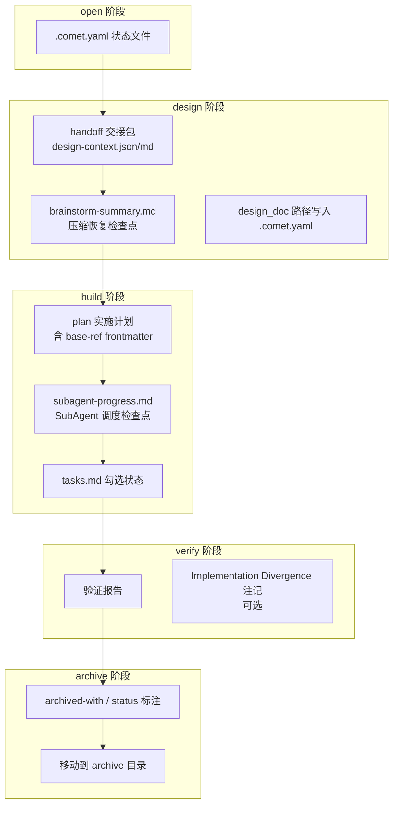

Comet 在 `/comet` 五阶段流程中会创建一系列中间产物。
这些工作文件用于**上下文压缩、状态恢复、证据记录和阶段交接**。proposal、design、tasks 和代码仍是最终交付物。

理解这些产物能帮你在上下文压缩后快速恢复，在排障时快速定位文件，也能在归档前检查生命周期是否完整。

## 产物总览



<p align="center">
  
</p>

<p align="center">每类中间产物分别服务上下文、恢复、交接和验证证据</p>

下文用 `<classic-root>` 表示当前 Classic OpenSpec 根目录：新项目默认是 `docs/openspec/`，保留旧布局的项目是 `openspec/`。实际位置由 `classic.artifact_layout` 决定，详见[项目文件结构](/zh/guides/project-structure)。

## .comet.yaml：贯穿全程的状态文件

| 属性     | 说明                                        |
| -------- | ------------------------------------------- |
| 位置     | `<classic-root>/changes/<name>/.comet.yaml` |
| 创建阶段 | open（`comet-state init`）                  |
| 更新阶段 | 每个阶段都更新对应字段                      |
| 管理     | machine-managed（脚本写、guard 校验）       |

这是 Comet 唯一的跨阶段状态文件。字段随阶段推进逐步填写。详见[状态管理](/zh/concepts/state-management)。

<Note>
  Comet 的经典工作流仍以 <code>.comet.yaml</code> 作为当前状态来源。
  <code>.comet/state-events.jsonl</code> 是追加式审计日志，用来解释状态转换历史。
  <code>.comet/run-state.json</code> 和 <code>trajectory.jsonl</code> 属于 Comet 自动维护的
  运行细节。跨会话恢复主要靠 <code>.comet.yaml</code>、handoff 文件和检查点
  markdown，排查状态为何变化时再看事件日志。
</Note>

### state-events.jsonl（状态转换审计）

| 属性 | 说明                                                                               |
| ---- | ---------------------------------------------------------------------------------- |
| 位置 | `<classic-root>/changes/<name>/.comet/state-events.jsonl`                          |
| 创建 | 第一次成功 state transition 时                                                     |
| 作用 | 记录 `comet-state transition`、`comet-guard --apply` 和 archive 更新造成的状态变化 |
| 管理 | Comet 追加写入，用户可读，不要手工改                                               |

它不是当前状态来源。当前状态仍以 `.comet.yaml` 为准。事件日志适合回答：这次 `phase` 是由 guard、手工 transition，还是 archive 流程改的？实际改了哪些字段？

## design 阶段产物

design 阶段是中间产物最丰富的阶段，主要服务于上下文压缩和 OpenSpec→Superpowers 交接。

### handoff 交接包

| 属性 | 说明                                                                              |
| ---- | --------------------------------------------------------------------------------- |
| 位置 | `<classic-root>/changes/<name>/.comet/handoff/`                                   |
| 创建 | `comet-handoff.mjs <change> design --write`                                       |
| 作用 | 把 open 阶段的 OpenSpec 产物整理成 Superpowers brainstorming 能读懂的上下文 |
| 管理 | machine-generated（guard 校验脚本标记和 hash）                                    |

交接包根据 `context_compression` 配置有两种形态：

| 模式          | 产出文件                                    | 内容                                                                                  |
| ------------- | ------------------------------------------- | ------------------------------------------------------------------------------------- |
| `off`（默认） | `design-context.json` + `design-context.md` | 完整产物摘要，每文件带源路径、行范围、sha256。超 80 行截断。                   |
| `beta`        | `spec-context.json` + `spec-context.md`     | delta spec 原样写入，proposal/design/tasks 只存 hash 引用。节省约 25–30% token。 |

交接包还把 `handoff_context` 和 `handoff_hash` 写入 `.comet.yaml`。guard 在离开 design 时重算 hash 检测漂移。详见[上下文压缩机制](/zh/concepts/context-compression)和[comet-handoff](/zh/scripts/comet-handoff)。

### brainstorm-summary.md

| 属性 | 说明                                                                 |
| ---- | -------------------------------------------------------------------- |
| 位置 | `<classic-root>/changes/<name>/.comet/handoff/brainstorm-summary.md` |
| 创建 | design 阶段 brainstorming 过程中增量写入                             |
| 作用 | **上下文压缩的恢复检查点**，压缩发生后从这里恢复已确认的设计决策     |
| 管理 | Agent 维护（结构和位置由 Skill 规定）                                |

它记录：

- 已确认的技术方案
- 关键权衡和风险
- 测试策略
- Spec Patch（如果有）
- 未确认项标记为 `pending`/`candidate`

<Tip>
  <code>brainstorm-summary.md</code> 是 design 阶段最重要的恢复检查点。上下文压缩后，Agent
  从这里恢复已确认决策，省去重新 brainstorming。它在 brainstorming 过程中<strong>增量更新</strong>
  ，在用户确认方案后定稿。
</Tip>

## build 阶段产物

build 阶段的中间产物主要服务于 SubAgent 调度恢复和任务跟踪。

### 实施计划（plan）

| 属性 | 说明                                              |
| ---- | ------------------------------------------------- |
| 位置 | `docs/superpowers/plans/YYYY-MM-DD-<feature>.md`  |
| 创建 | build 阶段（由 SubAgent 加载 `writing-plans` 生成） |
| 作用 | 实施计划。frontmatter 是 verify 阶段的关键证据    |
| 管理 | Agent-written                                     |

计划的 frontmatter 是验证阶段依赖的证据：

```yaml
---
change: <openspec-change-name>
design-doc: docs/superpowers/specs/YYYY-MM-DD-<topic>-design.md
base-ref: <实现前的 git HEAD>
---
```

`base-ref` 是实现开始前的 commit SHA，verify 用它重新计算变更规模。`plan` 路径写入 `.comet.yaml`。

### subagent-progress.md

| 属性 | 说明                                                                  |
| ---- | --------------------------------------------------------------------- |
| 位置 | `<classic-root>/changes/<name>/.comet/subagent-progress.md`           |
| 创建 | build 阶段（仅 `build_mode: subagent-driven-development` 时）         |
| 作用 | **SubAgent 调度检查点**，是 `brainstorm-summary.md` 在 build 阶段的对应物 |
| 管理 | 主会话（main session）维护                                          |

它记录当前任务的调度状态：

- 当前 plan 任务文本 + 对应的 OpenSpec 任务文本
- 当前阶段（`implementing`/`task-review`/`checkoff`/`done`/`blocked`）
- 实现的 commit hash、改动文件、RED/GREEN 证据
- 选定的 `review_mode`
- 已通过的审查阶段 + 未解决的 reviewer 反馈
- 当前 review-fix 轮数

<Warning>
  <code>subagent-progress.md</code> 每个任务替换一次。SubAgent（implementer/reviewer）
  <strong>不能</strong>
  编辑它。只有主会话能写。实现者只能写代码，reviewer 只能写反馈，主会话负责推进检查点。这避免 SubAgent 擅自标记任务完成。
</Warning>

### tasks.md 勾选状态

| 属性 | 说明                                     |
| ---- | ---------------------------------------- |
| 位置 | `<classic-root>/changes/<name>/tasks.md` |
| 作用 | 任务完成跟踪（`- [ ]` → `- [x]`）        |
| 管理 | 主会话编辑                               |

Comet 没有单独的任务勾选文件。勾选状态就在 `tasks.md` 内。用 `grep -c '\- \[ \]' tasks.md` 统计未完成项，用 `comet-state task-checkoff <file> <text>` 验证特定任务已勾选。

SubAgent 模式下，实现者**不能**勾选任务，只有主会话按 review_mode 规定的任务级审查通过后才勾选（off 模式无 reviewer，靠自测证据勾选）。

## verify 阶段产物

### 验证报告

| 属性 | 说明                                                                |
| ---- | ------------------------------------------------------------------- |
| 位置 | `docs/superpowers/reports/YYYY-MM-DD-<change-name>-verify.md`       |
| 创建 | verify 阶段，写盘后才标记 pass                                      |
| 作用 | 验证证据：6 项（light）或 7 项（full）检查结果、PASS/FAIL、接受原因 |
| 管理 | Agent-written                                                       |

`verification_report` 路径写入 `.comet.yaml`。guard 要求 `verify-pass` 转换时这个文件必须存在。

### Implementation Divergence 注记（可选）

| 属性 | 说明                                                               |
| ---- | ------------------------------------------------------------------ |
| 位置 | 追加到 Design Doc（`docs/superpowers/specs/...-design.md`）        |
| 触发 | full verify 发现 delta spec 和 Design Doc 矛盾，用户选择接受偏差时 |
| 作用 | 记录实现和设计文档的差异                                           |

如果用户选择接受偏差，接受原因和影响会记录在验证产物中。归档时 Design Doc 按常规流程标注 `archived-with`。

## archive 阶段产物

archive 阶段不创建新文件，而是给已有产物加标注并移动目录。

### frontmatter 标注

| 文件                   | 标注                                             | 含义                     |
| ---------------------- | ------------------------------------------------ | ------------------------ |
| Design Doc             | `archived-with: <archiveName>` + `status: final` | 归档归属 + 最终状态      |
| Design Doc（如有偏差） | 接受原因记录在验证产物中                         | 实现偏离已确认，主 spec 为准 |
| Plan                   | `archived-with: <archiveName>`                   | 归档归属                 |

### 归档目录

整个 change 目录移动到 `<classic-root>/changes/archive/YYYY-MM-DD-<name>/`，包括 `.comet.yaml`、`.comet/handoff/`、`.comet/subagent-progress.md` 和 delta spec。归档后 `.comet.yaml` 设 `archived: true`。

## 按目的分类

| 目的             | 产物                                                                      |
| ---------------- | ------------------------------------------------------------------------- |
| **上下文压缩**   | handoff 交接包（design-context/spec-context）、brainstorm-summary.md      |
| **状态恢复**     | .comet.yaml、subagent-progress.md、brainstorm-summary.md                  |
| **状态审计**     | state-events.jsonl                                                        |
| **阶段交接**     | handoff 交接包（OpenSpec→Superpowers）、plan base-ref（build→verify）     |
| **证据**         | 验证报告、plan frontmatter、tasks.md 勾选、Implementation Divergence 注记 |
| **生命周期标注** | archived-with、status、archived: true                                     |

## 文件作用速览

| 你想知道的                    | 看哪个产物                                              |
| ----------------------------- | ------------------------------------------------------- |
| 当前阶段和执行方式            | `.comet.yaml`                                           |
| design 交接的 OpenSpec 上下文 | `.comet/handoff/design-context.md` 或 `spec-context.md` |
| brainstorming 确认了什么      | `.comet/handoff/brainstorm-summary.md`                  |
| SubAgent 做到哪个任务的哪一步  | `.comet/subagent-progress.md`                           |
| 任务完成进度                  | `tasks.md` 的勾选状态                                   |
| 验证结果                      | `docs/superpowers/reports/...-verify.md`                |
| handoff 是否漂移              | `.comet.yaml` 的 `handoff_hash` + 重新算 hash 对比      |
| phase 为什么变了              | `.comet/state-events.jsonl` 的最后几行                  |

## 下一步

- [工作流概念](/zh/concepts/workflow) — 这些产物在五阶段中的位置
- [状态管理](/zh/concepts/state-management) — `.comet.yaml` 字段详解
- [上下文压缩机制](/zh/concepts/context-compression) — handoff 交接包详解
- [comet-handoff](/zh/scripts/comet-handoff) — 交接包生成的脚本细节
- [运维与排查](/zh/guides/resuming-workflow) — 用这些产物恢复中断的工作
