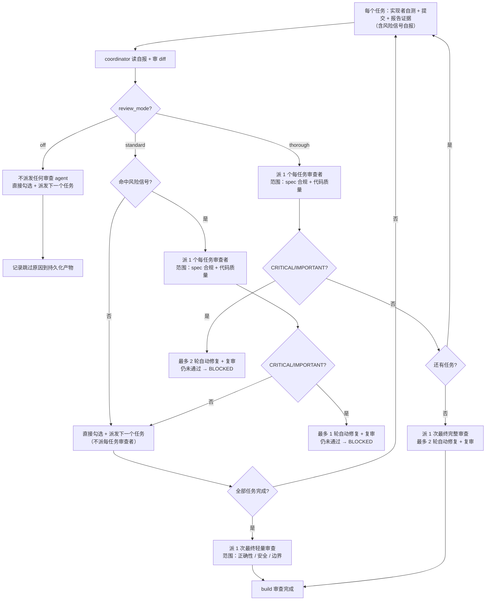

`review_mode` 控制 build 阶段的**自动代码审查强度**。它形成一条真实梯度——`off`（零审查）→ `standard`（风险触发的每任务审查）→ `thorough`（每任务审查）——决定 Comet 何时加载 Superpowers 的 `requesting-code-review`、给哪些任务派审查者、做几轮自动修复。

这个机制的设计目标，是让**低风险任务不被审查拖慢**，同时让高风险变更能拿到**即时的、聚焦的每任务审查**，而不是拖到批次边界才抓问题。

## 核心规则：review_mode 接管默认审查流，不双重审查

<Warning>
  <strong>这是最关键的一条规则。</strong>Superpowers 的 <code>subagent-driven-development</code> 默认流程要求"每个任务后派一个任务审查者"。Comet 的 <code>review_mode</code> <strong>接管这一阶段</strong>，决定哪些任务拿到每任务审查者。<strong>不要派发 <code>review_mode</code> 规定之外的审查者。</strong>拿不到审查者的任务（<code>off</code>：全部；<code>standard</code>：非风险任务）直接走任务勾选并派发下一个任务。一个变更的审查总数<strong>仅由下方预算表决定</strong>。
</Warning>

## build 阶段审查预算表

这张表**只覆盖 build 阶段**，且只派这些审查者，不额外增加：

| `review_mode` | 每任务审查者（build） | 最终审查（build） |
| --- | --- | --- |
| `off` | 0 | 0 |
| `standard` | 仅风险任务（见下方规则） | 1 次（轻量） |
| `thorough` | 每个任务（spec 合规 + 代码质量） | 1 次（完整） |

<Note>
  <strong>verify 阶段的审查不在这张表里。</strong>verify 阶段的审查由 <code>verify_mode</code>（light/full）驱动，<code>review_mode</code> 只决定 verify 是否触发自动代码审查（<code>off</code> 跳过；<code>standard</code>/<code>thorough</code> 在 light 验证下跑一次轻量代码审查，在 full 验证下依赖 <code>openspec-verify-change</code>）。verify 阶段没有单独的 per-<code>review_mode</code>"完整"代码审查——权威行为见 verify 阶段文档。
</Note>

<p align="center">
  
</p>

<p align="center">review_mode 是一条真实梯度：越往右审查越强，时间和 token 成本也越高</p>

## 三种模式一图看懂



## 三种模式对比

| 维度 | `off` | `standard` | `thorough` |
| --- | --- | --- | --- |
| **每任务审查者** | 0 | 仅风险任务 | **每个任务** |
| **最终审查** | 0 | 1 次（轻量） | 1 次（完整） |
| **审查范围** | — | 风险任务：spec + 质量；最终：正确性/安全/边界 | 每任务 + 最终：spec 合规 + 代码质量（完整） |
| **自动修复上限** | 0 轮 | 风险任务/最终各 **最多 1 轮** + 复审 | 每任务/最终各 **最多 2 轮** + 复审 |
| **执行速度** | 最快 | 中等（低风险任务跳过审查） | **最慢**（每任务都要审查） |
| **token 消耗** | 最低 | 中等 | **最高** |
| **适合场景** | hotfix/tweak、低风险小改 | 日常 full workflow | 高风险、多模块、架构/安全变更 |
| **默认值** | hotfix/tweak 默认 | full workflow 默认（含运行时 fallback） | — |

## off 模式（最低强度）

**不派发任何**自动 spec 审查者、代码质量审查者、最终审查者或审查修复 agent。任务是否完成，由实现者的自测、构建/测试证据、当前 worktree 确认和任务勾选验证决定。

<Warning>
  <code>off</code> 只跳过<strong>自动代码审查</strong>，<strong>不跳过</strong>构建、测试、安全检查和 debug gate 协议。如果执行中出现测试失败、构建失败或异常行为，仍然必须走 debug gate——<code>off</code> 不能用来绕过真实问题。
</Warning>

off 模式必须在**持久化产物**（tasks.md、commit body、验证报告草稿等）里记录跳过自动代码审查的原因。

- hotfix 和 tweak 预设默认 `off`。
- full workflow 也可以显式选 `off`，但离开 build 前必须确认这个选择并记录原因。

## standard 模式（中等强度）

standard 不再是"只在最后审一次"。它形成一个**风险触发**的每任务审查 + 一次最终轻量审查的组合。

### build 阶段

1. 默认**不派发每任务审查者**。实现者自测、提交、报告证据（包括**风险信号自报**）；coordinator 做针对性的勾选验证。
2. **风险触发**：读完实现者自报 + 审 diff 后，**只有当自报命中任何风险信号，或 coordinator 的 diff 审查发现任何风险信号时**，才给这个任务派一个每任务审查者，同时检查 spec 合规和代码质量。
3. 风险任务的 CRITICAL/IMPORTANT 发现进入 **1 轮** review-fix（最多 1 轮），复审未通过 → 标记 **BLOCKED**，暂停交给用户。
4. 命中风险信号的任务直接走针对性勾选验证。
5. 全部任务完成后，仍派发**恰好 1 次**最终轻量代码审查，范围限定在**正确性、安全、边界条件**。
6. 最终审查发现 CRITICAL/IMPORTANT → 派**最多 1 个**修复 agent 并复审一次；仍未通过 → **BLOCKED**。非 CRITICAL 可接受并记录原因。

### 风险信号列表

命中以下**任意一条**即标记为风险任务（实现者自报 + coordinator diff 审查共同判定）：

- 跨模块 / 跨子系统协调改动
- 安全敏感面：认证、授权、加密、SQL、外部输入处理、密钥/凭据
- 并发、锁、共享可变状态
- 数据或 schema 迁移
- 公共 API 契约或外部接口变更
- 实现者返回 `DONE_WITH_CONCERNS`
- 单任务 diff 超过 200 行

## thorough 模式（最高强度）

thorough 不再做"按批次合并审查"。高风险变更要求**每个任务都拿到即时的、聚焦的审查**——拖到批次边界才抓问题代价太大。

### build 阶段关键规则

1. **每个任务都派一个每任务审查者**（spec 合规 + 代码质量）：实现者自测、提交、报告证据后，coordinator 给这个任务派一个全新后台审查者。
2. CRITICAL/IMPORTANT 发现进入 review-fix（**最多 2 轮**）；仍未通过 → 标记 **BLOCKED**，暂停交给用户。
3. 全部任务后，派 **1 个**最终完整审查者。
4. 最终审查**最多 2 轮**自动修复 + 复审；仍未通过 → **BLOCKED**。

<Note>
  thorough 不跑批次审查——高风险变更需要对<strong>每个任务</strong>做即时、聚焦的审查。把问题拖到批次边界再抓代价太高。
</Note>

### 为什么 thorough 慢且费 token

thorough 的开销是**结构性**的：N 个任务就会派 N 个每任务审查者 + 1 个最终审查者，每个审查者都可能触发最多 2 轮修复。对于 12 个任务的变更，standard 可能只给少数风险任务派审查者 + 1 次最终审查，而 thorough 会跑 12 次每任务审查 + 1 次最终审查——审查 + 修复的 agent 数量是 standard 的数倍。

<Tip>
  <strong>经验法则</strong>：如果变更涉及安全、认证、数据迁移、跨模块 API 或架构调整，用 <code>thorough</code>；否则 <code>standard</code> 足够。<code>thorough</code> 不是"更安全"的默认值，而是有代价的强审查——它会明显拖慢 build 并增加 token 消耗。
</Tip>

## standard 和 thorough 的核心差异

| 维度 | standard | thorough |
| --- | --- | --- |
| 每任务审查者 | 仅风险任务 | **每个任务** |
| 审查时机 | 风险任务即时 + 最终一次 | 每任务即时 + 最终一次 |
| 最终审查范围 | 轻量（正确性/安全/边界） | 完整（spec 合规 + 代码质量） |
| 自动修复上限 | 每审查 **1 轮** | 每审查 **2 轮** |
| BLOCKED 触发 | 任何审查 1 轮修复未通过 | 任何审查 2 轮修复未通过 |
| 执行开销 | 中等 | **最高** |

## 每任务派发的模型选择（强制）

每一次实现者/修复者/审查者派发都**必须显式指定模型**。省略模型会静默继承会话里最贵的模型，拖慢执行并抬高成本。遵循 Superpowers `subagent-driven-development` 的 Model Selection 规则：

| 角色 | 模型选择 |
| --- | --- |
| 实现者 / 修复者 | 1–2 个文件 + 完整 spec → 最便宜档；多文件集成/模式匹配/调试 → 标准档；需要设计判断或广泛代码理解 → 最强档。计划文本已含完整待写代码（抄写 + 测试）时用最便宜档 |
| 审查者（每任务 / 最终） | 按 diff 的规模、复杂度和风险缩放。小型机械 diff 不需要最强模型；微妙的并发改动需要 |
| 最终整分支审查 | 用可用的最强模型，不是会话默认 |

省略模型 = 让它跑会话里最贵的模型，直接违背这条规则的目标。

## 与 build_mode 的配合

| build_mode | standard 行为 | thorough 行为 |
| --- | --- | --- |
| `subagent-driven-development` | 风险任务派每任务审查者 + 最终轻量审查 | **每个任务**派每任务审查者 + 最终完整审查 |
| `executing-plans` | 全部任务完成后一次轻量审查（见下方 review gate） | 每 3 个任务做一次分段审查 + 最终一次（见下方 review gate） |

### executing-plans review gate（按 review_mode 缩放）

`executing-plans` 下主会话直接执行任务（没有隔离的实现者子代理），所以没有 `subagent-driven-development` 那样的每任务审查者。代码审查针对已完成 diff，并按 `review_mode` 缩放：

- **`review_mode: off`**：不做自动代码审查，不加载 `requesting-code-review`。在验证报告草稿或 tasks.md 记录跳过原因。
- **`review_mode: standard`**：全部任务完成后、build → verify phase guard 之前，用 Skill 工具加载 `requesting-code-review` 做一次轻量代码审查（正确性、安全、边界），范围是整个变更。
- **`review_mode: thorough`**：除最终一次审查外，每 3 个任务做一次**分段代码审查**（按该段 diff 范围）。总任务 ≤ 3 时跳过中间分段，只做最终审查。每段审查用 `requesting-code-review` 针对该段 commit 区间。这是 `executing-plans` 能提供的、最接近 `subagent-driven-development` 每任务审查的等价物，因为它没有隔离实现者可逐任务审查。

**要求**（standard 和 thorough 适用）：

- `requesting-code-review` 必须在 `comet-guard build --apply` **之前**加载。
- 如果 skill 不可用，跳过审查门禁，但在 tasks.md 记录 `<!-- review skipped: skill unavailable -->`。
- **CRITICAL** 发现（安全漏洞、数据丢失风险、构建/测试失败）必须在 verify 前修复。
- 非 CRITICAL 发现可以接受，但必须把原因和影响记录到持久化产物。

## 审查者怎么工作

在 `subagent-driven-development` 下，审查者是**全新的后台 agent**，不是实现者的延续。审查者拿到的是完整任务、实现 commit/diff 和（开启 TDD 时）RED/GREEN 证据——**审查者不能只看实现者的摘要就下结论**。这保证审查基于真实代码而不是自述。

修复 agent 也是全新后台 agent，根据审查反馈独立修改代码。

### 进度检查点

coordinator 维护 `.comet/subagent-progress.md`，记录每个任务的实现 commit、改动的文件、RED/GREEN 证据、所选 `review_mode`、已过的审查阶段、未解决的审查反馈、当前 review-fix 轮数（`standard` 最多 1、`thorough` 最多 2、`off` 为 0），以及 standard 模式下该任务是否已触发过风险每任务审查（恢复时不重复派发已完成的每任务审查）。

## 怎么设置

### 优先级

`review_mode` 的解析优先级：

```text
change 的 .comet.yaml  >  COMET_REVIEW_MODE 环境变量  >  .comet/config.yaml  >  standard
```

新 change 创建时，full workflow 会把项目默认值快照到自己的 `.comet.yaml`；hotfix/tweak 直接硬编码为 `off`。

<Note>
  从 0.4.0-beta.1 起，运行时 fallback 从 <code>null</code>（关闭）改为 <code>standard</code>。也就是说，当 change 的 <code>.comet.yaml</code>、环境变量和项目配置都没有显式设置 <code>review_mode</code> 时，默认按 <code>standard</code>（风险触发的每任务审查）处理，而不再是无审查。这适用于 init 模板、<code>classic-state-command.ts</code> 运行时 fallback 和冻结的 0.3.9 契约 fixture。
</Note>

### 项目默认值

编辑 `.comet/config.yaml`：

```yaml
review_mode: thorough
```

新 change 创建时快照到自己的 `.comet.yaml`。注意：环境变量和项目配置只在 resolver 层提供默认值，**不影响已写入 change 的 `review_mode`**。

### 单个 change

full workflow 在 build Step 3（执行方式选择）时由用户选择，通过 `comet-state` 写入：

```bash
node "$COMET_STATE" set <change-name> review_mode standard
```

这是 build 阶段的用户决策点。

### 环境变量

```bash
export COMET_REVIEW_MODE=standard
```

仅在 resolver 层提供默认值，不影响已写入 change 的 `review_mode`。

## 硬约束（full workflow 离开 build）

`review_mode` 是 full workflow 的**硬性门禁**，由两层独立检查强制：

| 层 | 检查点 | 失败行为 |
| --- | --- | --- |
| `comet-guard build` | `review_mode selected` 检查 | 提示用户选择并给出 `comet-state set` 命令 |
| `comet-state transition build-complete` | `requireBuildDecisions` | 拒绝 transition |

两层都必须通过才能离开 build。hotfix/tweak 豁免这个检查（它们默认 `off`）。

<Note>
  <code>review_mode</code> 不在 <code>REQUIRED_CLASSIC_KEYS</code> 里，这样 0.4.0 之前的 <code>.comet.yaml</code> 文件不用迁移就能解析。强制检查发生在 build→verify 的 transition guard，旧文件缺少该字段时走兼容路径，恢复时应回填。非法值（非 <code>off</code>/<code>standard</code>/<code>thorough</code>）会被枚举校验拒绝。
</Note>

## 状态转换交互

`review_mode` 是 build 阶段的门禁字段，**不**参与 `applyStateUpdate` 或 `transition` 事件逻辑本身。相关转换：

- `build-complete` → 调用 `requireBuildDecisions`（含 review_mode 检查），通过后 `phase: verify, verify_result: pending`。
- `verify-pass` → 要求 `verification_report` 存在且 `branch_status: handled`，然后 `phase: archive, verify_result: pass`。
- `verify-fail` → `verify_result: fail, phase: build`（回滚，下次 build-complete 时 review_mode 必须再次满足）。

## 怎么选

| 场景 | 推荐模式 | 理由 |
| --- | --- | --- |
| hotfix / tweak | `off`（默认） | 低风险小改，不需要强审查 |
| 日常功能开发 | `standard` | 低风险任务跳过审查，风险任务即时审查，开销可控 |
| 安全/认证/数据迁移 | `thorough` | 每个任务都拿到即时审查，覆盖高风险面 |
| 跨模块 / 架构变更 | `thorough` | 每任务审查能抓住跨模块问题 |

## 下一步

- [状态与配置](/zh/concepts/state-management) — review_mode 字段和配置优先级
- [build 阶段](/zh/phases/build) — review_mode 在 build 中的使用位置和 build_mode 配合
- [verify 阶段](/zh/phases/verify) — verify 中 light 路径的审查检查（由 verify_mode 驱动）
- [上下文压缩机制](/zh/concepts/context-compression) — 另一个影响执行开销的项目配置项
