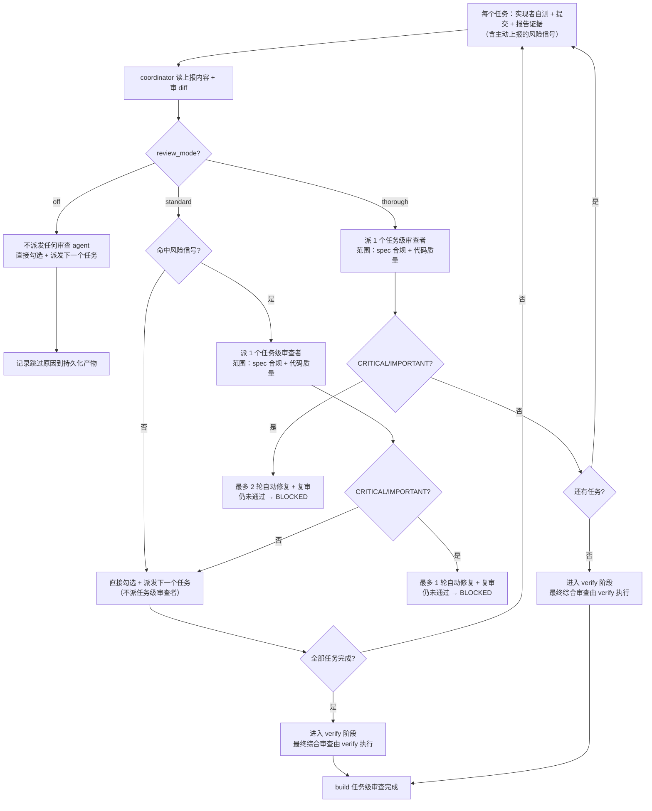

`review_mode` 控制 Classic 在 build 阶段何时派发任务级代码审查、允许多少轮修复，并决定 verify 阶段最终综合审查的强度。build 内：`off` 不派审查者；`standard` 只审查风险任务；`thorough` 审查每个任务。整个变更的**最终综合代码审查只发生在 verify 阶段**，build 完成全部任务后不再追加审查者。

<Note>
  <code>review_mode</code> 只管流程内的<strong>自动</strong>审查。此外还可以随时手动调用{' '}
  <code>/comet-review</code>，对当前 change 做一次只读按需审查；它独立于{' '}
  <code>review_mode</code>，也不推进工作流。它只报告实现 diff 中的正确性、安全、边界和覆盖问题，不修改文件、更新状态或替代 Verify。
</Note>

## 模式选择

| 模式       | 适合                        | 成本 | 建议           |
| ---------- | --------------------------- | ---- | -------------- |
| `off`      | 文档、低风险 hotfix / tweak | 最低 | 只在低风险时用 |
| `standard` | 日常 full workflow          | 中等 | 默认推荐       |
| `thorough` | 安全、架构、多模块变更      | 最高 | 高风险时用     |

<Tip>
  不确定时选 <code>standard</code>。它只给风险任务派任务级审查者，最终综合审查由 verify 阶段执行。
</Tip>

## review_mode 接管自动审查流

<Warning>
  Superpowers 的 <code>subagent-driven-development</code>{' '}
  默认流程要求"每个任务后派一个任务审查者"。Comet 的 <code>review_mode</code>{' '}
  <strong>接管这一阶段</strong>，决定哪些任务拿到任务级审查者。
  <strong>
    不要派发 <code>review_mode</code> 规定之外的审查者。
  </strong>
  拿不到审查者的任务（<code>off</code>：全部；<code>standard</code>
  ：非风险任务）直接走任务勾选并派发下一个任务。一个变更的审查总数
  <strong>仅由下方预算表决定</strong>。
</Warning>

## 与 Superpowers SDD 的边界

Comet 的 `subagent-driven-development` 扩展现在只依赖 Superpowers 公开的 task reviewer 契约：实现者完成任务后，协调者按任务材料、真实 diff、测试证据和风险信号决定是否派审查者。Comet 不读取、不写入、也不要求 Superpowers `subagent-driven-development` 的内部脚本名、workspace 路径或私有实现细节。

这意味着：

- Superpowers 仍提供连续任务调度、预检查 plan review、文件型 handoff、reviewer 中立提示、"材料不足无法验证" 的反馈语义，以及 progress reconciliation。
- Comet 只接管 reviewer 触发策略和 review-fix 预算，也就是 `review_mode` 决定哪些任务要 task reviewer。
- 文档、恢复和测试都以公开行为为准，不把 shipped Skill 文案绑定到 Superpowers 内部目录结构。

<Info>
  在 build 阶段选择 `off`、`standard` 或 `thorough`。Superpowers SDD 可以独立升级实现，但需要继续满足公开的 task reviewer 契约。
</Info>
## build 阶段审查预算表

这张表**只覆盖 build 阶段的任务级审查**，且只派这些审查者，不额外增加。全部任务完成后不追加最终审查者，直接进入 verify：

| `review_mode` | 任务级审查者（build）            |
| ------------- | -------------------------------- |
| `off`         | 0                                |
| `standard`    | 仅风险任务（见下方规则）         |
| `thorough`    | 每个任务（spec 合规 + 代码质量） |

<Note>
  <strong>verify 阶段的审查不在这张表里。</strong>verify 阶段的审查由 <code>verify_mode</code>
  （light/full）驱动，<code>review_mode</code> 只决定 verify 是否触发自动代码审查（<code>off</code>{' '}
  跳过；<code>standard</code>/<code>thorough</code> 在 light 验证下跑一次轻量代码审查，在 full
  验证下依赖 <code>openspec-verify-change</code>）。verify 阶段没有单独的 per-
  <code>review_mode</code>"完整"代码审查——权威行为见 verify 阶段文档。
</Note>

<p align="center">
  
</p>

<p align="center">off、standard 和 thorough 对应不同的审查次数与 token 成本</p>

## 三种模式一图看懂



## 三种模式对比

| 维度             | `off`                    | `standard`                                    | `thorough`                                  |
| ---------------- | ------------------------ | --------------------------------------------- | ------------------------------------------- |
| **任务级审查者** | 0                        | 仅风险任务                                    | **每个任务**                                |
| **最终综合审查** | verify 跳过              | 在 verify 阶段执行                            | 在 verify 阶段执行                          |
| **审查范围**     | —                        | 风险任务：spec 合规 + 代码质量               | 每个任务：spec 合规 + 代码质量              |
| **自动修复上限** | 0 轮                     | 风险任务的单次审查 **最多 1 轮** + 复审       | 单次审查 **最多 2 轮** + 复审                |
| **执行速度**     | 最快                     | 中等（低风险任务跳过审查）                    | **最慢**（每个任务都审查）                  |
| **token 消耗**   | 最低                     | 中等                                          | **最高**                                    |
| **适合场景**     | hotfix/tweak、低风险小改 | 日常 full workflow                            | 高风险、多模块、架构/安全变更               |
| **默认值**       | hotfix/tweak 默认        | full workflow 默认（含运行时 fallback）       | —                                           |

## off 模式（最低强度）

**不派发任何**自动 spec 审查者、代码质量审查者或审查修复 agent（verify 阶段的最终综合审查也会跳过）。任务是否完成，由实现者的自测、构建/测试证据、当前 worktree 确认和勾选前的核验决定。

<Warning>
  <code>off</code> 只跳过<strong>自动代码审查</strong>，<strong>不跳过</strong>
  构建、测试、安全检查和 debug gate 协议。如果执行中出现测试失败、构建失败或异常行为，仍然必须走
  debug gate——<code>off</code> 不能用来绕过真实问题。
</Warning>

off 模式必须在**持久化产物**（tasks.md、commit body、验证报告草稿等）里记录跳过自动代码审查的原因。

- hotfix 和 tweak 预设默认 `off`。
- full workflow 也可以显式选 `off`，但离开 build 前必须确认这个选择并记录原因。

## standard 模式（中等强度）

standard 不再是"只在最后审一次"。它形成**风险触发**的逐任务审查组合，最终综合审查交给 verify 阶段。

### build 阶段

1. 默认**不派发任务级审查者**。实现者自测、提交、报告证据（包括**主动上报的风险信号**）；coordinator 核验通过后才勾选任务。
2. **风险触发**：读完实现者主动上报的内容 + 审 diff 后，**只有当实现者主动上报的内容命中任何风险信号，或 coordinator 的 diff 审查发现任何风险信号时**，才给这个任务派一个任务级审查者，同时检查 spec 合规和代码质量。
3. 风险任务的 CRITICAL/IMPORTANT 发现进入 **1 轮** review-fix（最多 1 轮），复审未通过 → 标记 **BLOCKED**，暂停交给用户。
4. 命中风险信号的任务核验通过后直接勾选。
5. 全部任务完成后**不追加最终审查者**，直接进入 verify。整个变更的最终综合代码审查由 verify 阶段按 review_mode 执行（见 verify 阶段文档）。

### 风险信号列表

命中以下**任意一条**即标记为风险任务（实现者主动上报 + coordinator diff 审查共同判定）：

- 跨模块 / 跨子系统协调改动
- 安全敏感面：认证、授权、加密、SQL、外部输入处理、密钥/凭据
- 并发、锁、共享可变状态
- 数据或 schema 迁移
- 公共 API 契约或外部接口变更
- 实现者返回 `DONE_WITH_CONCERNS`
- 单任务 diff 超过 200 行

## thorough 模式（最高强度）

thorough 不再做"按批次合并审查"。高风险变更要求**每个任务都拿到即时的、聚焦的审查**——拖到批次边界才抓问题代价太大。

### build 阶段关键规则

1. **每个任务都派审查者**（spec 合规 + 代码质量）：实现者自测、提交、报告证据后，coordinator 给这个任务派一个全新后台审查者。
2. CRITICAL/IMPORTANT 发现进入 review-fix（**最多 2 轮**）；仍未通过 → 标记 **BLOCKED**，暂停交给用户。
3. 全部任务完成后**不追加最终审查者**，直接进入 verify；最终综合审查由 verify 阶段执行。

<Note>
  thorough 不跑批次审查——高风险变更需要对<strong>每个任务</strong>
  做即时、聚焦的审查。把问题拖到批次边界再抓代价太高。
</Note>

### 为什么 thorough 慢且费 token

thorough 的开销是**结构性**的：N 个任务就会派 N 个任务级审查者，每个审查者都可能触发最多 2 轮修复。对于 12 个任务的变更，standard 可能只给少数风险任务派审查者，而 thorough 会跑 12 次逐任务审查——审查 + 修复的 agent 数量是 standard 的数倍。

<Tip>
  <strong>经验法则</strong>：如果变更涉及安全、认证、数据迁移、跨模块 API 或架构调整，用{' '}
  <code>thorough</code>；否则 <code>standard</code> 足够。<code>thorough</code>{' '}
  是有代价的强审查：会明显拖慢 build 并增加 token 消耗，因此不适合作为默认值。
</Tip>

## standard 和 thorough 的核心差异

| 维度         | standard                 | thorough                     |
| ------------ | ------------------------ | ---------------------------- |
| 任务级审查者 | 仅风险任务               | **每个任务**                 |
| 审查时机     | 风险任务即时             | 每个任务即时                 |
| 最终综合审查 | 在 verify 阶段执行       | 在 verify 阶段执行           |
| 自动修复上限 | 逐任务审查 **1 轮**      | 逐任务审查 **2 轮**          |
| BLOCKED 触发 | 任何审查 1 轮修复未通过  | 任何审查 2 轮修复未通过      |
| 执行开销     | 中等                     | **最高**                     |

## 派发模型的选择规则（强制）

每一次实现者/修复者/审查者派发都**必须显式指定模型**。省略模型会静默继承会话里最贵的模型，拖慢执行并抬高成本。遵循 Superpowers `subagent-driven-development` 的 Model Selection 规则：

| 角色                    | 模型选择                                                                                                                                                       |
| ----------------------- | -------------------------------------------------------------------------------------------------------------------------------------------------------------- |
| 实现者 / 修复者         | 1–2 个文件 + 完整 spec → 最便宜档；多文件集成/模式匹配/调试 → 标准档；需要设计判断或广泛代码理解 → 最强档。计划文本已含完整待写代码（抄写 + 测试）时用最便宜档 |
| 任务审查者 | 按 diff 的规模、复杂度和风险选择模型档位。小型机械 diff 不需要最强模型；微妙的并发改动需要                                                                             |
| 最终综合审查（verify 阶段） | 用可用的最强模型，不是会话默认                                                                                                                             |

省略模型 = 让它跑会话里最贵的模型，直接违背这条规则的目标。

## 与 build_mode 的配合

| build_mode                    | standard 行为                                    | thorough 行为                                              |
| ----------------------------- | ------------------------------------------------ | ---------------------------------------------------------- |
| `subagent-driven-development` | 风险任务派任务级审查者                           | **每个任务**派任务级审查者                                |
| `executing-plans`             | 不做 build 内整变更审查，任务验收后进入 verify   | 每 3 个任务做一次分段审查（≤3 个任务时无 build 内审查）   |

### executing-plans review gate（强度随 review_mode 调整）

`executing-plans` 下主会话直接执行任务（没有隔离的实现者子代理），所以没有 `subagent-driven-development` 那样的任务级审查者。代码审查针对已完成 diff，强度随 `review_mode` 调整：

- **`review_mode: off`**：不做自动代码审查，不加载 `requesting-code-review`。在验证报告草稿或 tasks.md 记录跳过原因，任务验收后进入 verify（verify 阶段也会按 off 跳过最终综合审查）。
- **`review_mode: standard`**：build 内不请求整变更审查，任务全部验收后直接进入 verify。整个变更的最终综合审查由 verify 阶段执行。
- **`review_mode: thorough`**：每完成 3 个任务做一次**分段代码审查**（仅针对该段 diff），用 `requesting-code-review` 针对该段 commit 区间；总任务 ≤ 3 时 build 内不做任何审查，直接进入 verify。这是 `executing-plans` 下最接近逐任务审查的做法：主会话没有隔离的实现者子代理，无法逐任务派发审查者。

**要求**（thorough 适用）：

- 分段审查对应的 `requesting-code-review` 必须在进入 verify 前完成加载。
- 如果必需的审查 Skill 无法加载，**停止并报告失败**，不得静默跳过。
- **CRITICAL/IMPORTANT** 发现（安全漏洞、数据丢失风险、构建/测试失败）必须在进入 verify 前修复。
- 非 CRITICAL 发现可以接受，但必须把原因和影响记录到持久化产物。

## 审查者怎么工作

在 `subagent-driven-development` 下，审查由**全新的后台 agent**执行。审查者会获得完整任务、实现 commit/diff 和（开启 TDD 时）RED/GREEN 证据，并必须直接核对真实代码后再下结论。

修复 agent 也是全新后台 agent，根据审查反馈独立修改代码。

### 进度检查点

coordinator 维护 `.comet/subagent-progress.md`，记录每个任务的实现 commit、改动的文件、RED/GREEN 证据、所选 `review_mode`、已过的审查阶段、未解决的审查反馈、当前 review-fix 轮数（`standard` 最多 1、`thorough` 最多 2、`off` 为 0），以及 standard 模式下该任务是否已触发过风险任务审查（恢复时不重复派发已完成的任务审查）。

## 怎么设置

### 优先级

`review_mode` 的解析优先级：

```text
change 的 .comet.yaml  >  COMET_REVIEW_MODE 环境变量  >  .comet/config.yaml 的 classic.review_mode  >  standard
```

新 change 创建时，full workflow 会把项目默认值快照到自己的 `.comet.yaml`；hotfix/tweak 直接硬编码为 `off`。

<Note>
  从 0.4.0-beta.1 起，新建 change 的默认值从 <code>null</code>（关闭）改为 <code>standard</code>
  ：<code>comet init</code> 和新 change 创建快照时，若环境变量和项目配置都没有设置{' '}
  <code>review_mode</code>，默认写入 <code>standard</code>（风险触发的逐任务审查），而不再是无审查。
  已经存在的 change 不受影响：缺少该字段的存量 full change 在离开 build 时会被守卫拦截，
  提示先运行 <code>comet state set &lt;change&gt; review_mode &lt;off|standard|thorough&gt;</code> 再继续。
</Note>

### 项目默认值

编辑 `.comet/config.yaml`：

```yaml
classic:
  review_mode: thorough
```

新 change 创建时快照到自己的 `.comet.yaml`。注意：环境变量和项目配置只在 resolver 层提供默认值，**不影响已写入 change 的 `review_mode`**。

### 单个 change

full workflow 在 build Step 3（执行方式选择）时由用户选择，通过 `comet-state` 写入：

```bash
node "$COMET_STATE" set <change-name> review_mode standard
```

这是 build 阶段的用户决策点。

### 环境变量

```bash
export COMET_REVIEW_MODE=standard
```

仅在 resolver 层提供默认值，不影响已写入 change 的 `review_mode`。

## 硬约束（full workflow 离开 build）

`review_mode` 是 full workflow 的**硬性门禁**，由两层独立检查强制：

| 层                                      | 检查点                      | 失败行为                                  |
| --------------------------------------- | --------------------------- | ----------------------------------------- |
| `comet-guard build`                     | `review_mode selected` 检查 | 提示用户选择并给出 `comet-state set` 命令 |
| `comet-state transition build-complete` | `requireBuildDecisions`     | 拒绝 transition                           |

两层都必须通过才能离开 build。hotfix/tweak 豁免这个检查（它们默认 `off`）。

<Note>
  <code>review_mode</code> 不是必填字段，0.4.0 之前的{' '}
  <code>.comet.yaml</code> 文件不用迁移就能解析。强制检查发生在 build→verify 的阶段守卫上，旧文件缺少该字段时走兼容路径，恢复时应回填。非法值（非 <code>off</code>/
  <code>standard</code>/<code>thorough</code>）会被枚举校验拒绝。
</Note>

## 状态转换交互

`review_mode` 是 build 阶段的门禁字段。它不会改变 transition event 的字段 effects，但会在 `build-complete` 前作为硬性决策被检查。相关转换：

- `build-complete` → 调用 `requireBuildDecisions`（含 review_mode 检查），通过后 `phase: verify, verify_result: pending`。
- `verify-pass` → 要求 `verification_report` 存在且 `branch_status: pending`，然后写入 `phase: archive, verify_result: pass`；`handled` 由 Archive 在最终交付确认后写入。
- `verify-fail` → `verify_result: fail, phase: build`（回滚，下次 build-complete 时 review_mode 必须再次满足）。

## 怎么选

| 场景               | 推荐模式      | 理由                                           |
| ------------------ | ------------- | ---------------------------------------------- |
| hotfix / tweak     | `off`（默认） | 低风险小改，不需要强审查                       |
| 日常功能开发       | `standard`    | 低风险任务跳过审查，风险任务即时审查，开销可控 |
| 安全/认证/数据迁移 | `thorough`    | 每个任务都拿到即时审查，覆盖高风险面           |
| 跨模块 / 架构变更  | `thorough`    | 逐任务审查能抓住跨模块问题                     |

## 下一步

- [Classic 配置](/zh/classic/configuration) — review_mode 字段和配置优先级
- [build 阶段](/zh/phases/build) — review_mode 在 build 中的使用位置和 build_mode 配合
- [verify 阶段](/zh/phases/verify) — verify 中 light 路径的审查检查（由 verify_mode 驱动）
- [上下文压缩机制](/zh/concepts/context-compression) — 另一个影响执行开销的项目配置项
