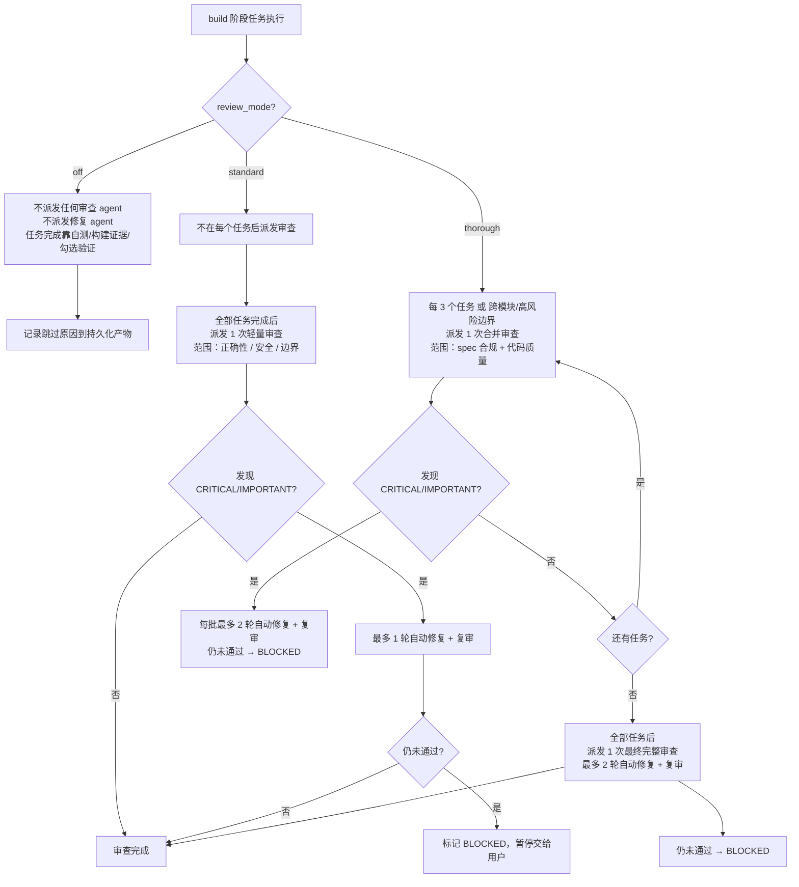

`review_mode` 控制 build 和 verify 阶段的**自动代码审查强度**。它决定了 Comet 何时加载 Superpowers 的 `requesting-code-review`、审查做几轮、每轮能自动修复几次。

这个机制的设计目标，是让**简单任务不被反复审查拖慢**，同时让高风险变更能拿到足够强的审查。三种模式的核心差异是**审查轮数、自动修复上限和执行开销**。

## 三种模式一图看懂



## 三种模式对比

| 维度 | `off` | `standard` | `thorough` |
| --- | --- | --- | --- |
| **审查 agent** | 0 个 | 1 个（最终轻量） | 多个（按批/边界）+ 1 个（最终完整） |
| **每任务双重审查** | 否 | 否 | 否（不按任务双重审查） |
| **审查范围** | — | 正确性 / 安全 / 边界 | spec 合规 + 代码质量（完整） |
| **自动修复上限** | 0 轮 | **最多 1 轮** + 复审 | 每批 **最多 2 轮** + 最终 **最多 2 轮** |
| **执行速度** | 最快 | 中等 | **最慢**（多轮审查 + 修复拖慢 build） |
| **token 消耗** | 最低 | 中等 | **最高**（多个审查 + 修复 agent 各自消耗 token） |
| **适合场景** | hotfix/tweak、低风险小改 | 日常 full workflow | 高风险、多模块、架构/安全变更 |
| **默认值** | hotfix/tweak 默认 | full workflow 推荐 | — |

## off 模式（最低强度）

**不派发任何**自动 spec 审查者、代码质量审查者、最终审查者或审查修复 agent。任务是否完成，由实现者的自测、构建/测试证据、当前 worktree 确认和任务勾选验证决定。

<Warning>
  <code>off</code> 只跳过<strong>自动代码审查</strong>，<strong>不跳过</strong>构建、测试、安全检查和 debug gate 协议。如果执行中出现测试失败、构建失败或异常行为，仍然必须走 debug gate——<code>off</code> 不能用来绕过真实问题。
</Warning>

off 模式必须在**持久化产物**（tasks.md、commit body、验证报告草稿等）里记录跳过自动代码审查的原因。

- hotfix 和 tweak 预设默认 `off`。
- full workflow 也可以显式选 `off`，但离开 build 前必须确认这个选择并记录原因。

## standard 模式（中等强度）

### build 阶段

1. **不在每个任务后**派发审查者。实现者自测、提交、报告证据；coordinator 做针对性的勾选验证。
2. 全部任务完成后，派发**恰好 1 次**最终轻量代码审查，范围限定在**正确性、安全、边界条件**（不查 spec 覆盖和 design drift）。
3. 如果最终轻量审查发现 **CRITICAL 或 IMPORTANT** 问题，派发**最多 1 个**修复 agent 并复审一次。
4. 仍未通过 → 标记 **BLOCKED**，暂停交给用户。

### 与 build_mode 的配合

| build_mode | standard 行为 |
| --- | --- |
| `subagent-driven-development` | 不做每任务审查，只在最后做一次合并轻量审查 |
| `executing-plans` | 全部任务完成后、`comet-guard build --apply` 之前，用 Skill 工具加载 `requesting-code-review` 做一次审查 |

### verify 阶段

light verify 的第 6 项检查：加载 `requesting-code-review`，请求**轻量审查**，只查正确性、安全、边界条件。审查输入应限制在这个 change 的 diff、tasks.md 和必要测试结果。如果发现 CRITICAL 或 IMPORTANT，视为验证失败，进入 Step 1b。

## thorough 模式（最高强度）

thorough 是**最慢、token 消耗最高**的模式，因为它在执行过程中插入多轮审查和修复。适合高风险变更、多模块协调、架构或安全相关改动。

### 关键规则

1. **不按任务双重审查**——即使 thorough 也不对每个任务都派发审查者，避免简单任务陷入循环。
2. **按批次或风险边界**做合并审查：每 **3 个任务**，或跨模块/高风险边界时，派发 **1 个**合并审查者，同时检查 **spec 合规**和**代码质量**。
3. **批次审查的跳过条件**：如果总任务数 **≤ 3** 且没有高风险边界，跳过中间批次审查，只做最终审查。
4. **每批最多 2 轮**自动修复 + 复审；仍未通过 → 标记 **BLOCKED**，暂停交给用户。
5. **全部任务后**，派发 **1 个**最终完整审查者，覆盖完整范围。
6. **最终审查最多 2 轮**自动修复 + 复审；仍未通过 → 标记 **BLOCKED**，暂停交给用户。

### 为什么 thorough 慢且费 token

thorough 的开销是**结构性**的，不是单一系数。一次 thorough build 会派发：

- `ceil(任务数 / 3)` 个批次合并审查者（每个都是新的后台 agent）
- 每个批次最多触发 2 个修复 agent
- 1 个最终完整审查者
- 最终最多 2 个修复 agent

这些 agent 各自消耗 token，且每次修复后都要复审。对于 12 个任务的变更，standard 可能只跑 1 轮审查（+ 最多 1 轮修复），而 thorough 可能跑 4 轮批次审查 + 1 轮最终审查，每轮都可能触发修复——审查 + 修复的 agent 数量是 standard 的数倍。

<Tip>
  <strong>经验法则</strong>：如果变更涉及安全、认证、数据迁移、跨模块 API 或架构调整，用 <code>thorough</code>；否则 <code>standard</code> 足够。<code>thorough</code> 不是"更安全"的默认值，而是有代价的强审查——它会明显拖慢 build 并增加 token 消耗。
</Tip>

### 与 build_mode 的配合

| build_mode | thorough 行为 |
| --- | --- |
| `subagent-driven-development` | 只做批次/风险边界合并审查 + 最终完整审查，**不做**每任务双重审查 |
| `executing-plans` | 同 standard 的 review gate（加载 `requesting-code-review`），但审查范围更广 |

### verify 阶段

verify 的 light 路径和 standard 一样用轻量 `requesting-code-review`，只查正确性/安全/边界。

## standard 和 thorough 的核心差异

| 维度 | standard | thorough |
| --- | --- | --- |
| 审查时机 | 仅最后一次 | 执行中分批（每 3 任务/边界）+ 最终 |
| 最终审查范围 | 轻量（正确性/安全/边界） | 完整（spec 合规 + 代码质量） |
| 审查轮数 | 1 轮 | 多批 + 1 轮最终 |
| 自动修复上限 | **1 轮** | 每批 **2 轮** + 最终 **2 轮** |
| BLOCKED 触发 | 1 轮修复未通过 | 任何一批或最终在 2 轮内未通过 |
| 执行开销 | 中等 | **最高** |

## 审查门禁规则（executing-plans）

`review_mode: standard`/`thorough` 配合 `build_mode: executing-plans` 时：

- `requesting-code-review` 必须在 `comet-guard build --apply` **之前**加载。
- 如果 skill 不可用，跳过审查门禁，但在 tasks.md 记录 `<!-- review skipped: skill unavailable -->`。
- **CRITICAL** 发现（安全、数据丢失、构建/测试失败）必须在 verify 前修复。
- 非 CRITICAL 发现可以接受，但必须把原因和影响记录到 tasks.md、commit body、验证报告草稿或其他持久化产物。

`review_mode: off` 跳过加载 `requesting-code-review`，但仍需记录跳过原因。

## 审查者怎么工作

在 `subagent-driven-development` 下，审查者是**全新的后台 agent**，不是实现者的延续。审查者拿到的是完整任务、实现 commit/diff 和（开启 TDD 时）RED/GREEN 证据——**审查者不能只看实现者的摘要就下结论**。这保证审查基于真实代码而不是自述。

修复 agent 也是全新后台 agent，根据审查反馈独立修改代码。

## 怎么设置

### 优先级

`review_mode` 的解析优先级：

```text
change 的 .comet.yaml  >  COMET_REVIEW_MODE 环境变量  >  .comet/config.yaml  >  null
```

新 change 创建时，full workflow 会把项目默认值快照到自己的 `.comet.yaml`；hotfix/tweak 直接硬编码为 `off`。

### 项目默认值

编辑 `.comet/config.yaml`：

```yaml
review_mode: thorough
```

新 change 创建时快照到自己的 `.comet.yaml`。注意：环境变量和项目配置只在 resolver 层提供默认值，**不影响已写入 change 的 `review_mode`**。

### 单个 change

full workflow 在 build Step 3（执行方式选择）时由用户选择，通过 `comet-state` 写入：

```bash
node "$COMET_STATE" set <change-name> review_mode standard
```

这是 build 阶段的用户决策点。

### 环境变量

```bash
export COMET_REVIEW_MODE=standard
```

仅在 resolver 层提供默认值，不影响已写入 change 的 `review_mode`。

## 硬约束（full workflow 离开 build）

`review_mode` 是 full workflow 的**硬性门禁**，由两层独立检查强制：

| 层 | 检查点 | 失败行为 |
| --- | --- | --- |
| `comet-guard build` | `review_mode selected` 检查 | 提示用户选择并给出 `comet-state set` 命令 |
| `comet-state transition build-complete` | `requireBuildDecisions` | 拒绝 transition |

两层都必须通过才能离开 build。hotfix/tweak 豁免这个检查（它们默认 `off`）。

<Note>
  <code>review_mode</code> 不在 <code>REQUIRED_CLASSIC_KEYS</code> 里，这样 0.4.0 之前的 <code>.comet.yaml</code> 文件不用迁移就能解析。强制检查发生在 build→verify 的 transition guard，旧文件缺少该字段时走兼容路径，恢复时应回填。非法值（非 <code>off</code>/<code>standard</code>/<code>thorough</code>）会被枚举校验拒绝。
</Note>

## 状态转换交互

`review_mode` 是 build 阶段的门禁字段，**不**参与 `applyStateUpdate` 或 `transition` 事件逻辑本身。相关转换：

- `build-complete` → 调用 `requireBuildDecisions`（含 review_mode 检查），通过后 `phase: verify, verify_result: pending`。
- `verify-pass` → 要求 `verification_report` 存在且 `branch_status: handled`，然后 `phase: archive, verify_result: pass`。
- `verify-fail` → `verify_result: fail, phase: build`（回滚，下次 build-complete 时 review_mode 必须再次满足）。

## 怎么选

| 场景 | 推荐模式 | 理由 |
| --- | --- | --- |
| hotfix / tweak | `off`（默认） | 低风险小改，不需要强审查 |
| 日常功能开发 | `standard` | 1 轮轻量审查足够，开销可控 |
| 安全/认证/数据迁移 | `thorough` | 分批 + 完整审查覆盖高风险面 |
| 跨模块 / 架构变更 | `thorough` | 按边界审查能抓住跨模块问题 |
| CI 想强制审查 | 项目配置 `standard` 或 `thorough` | 快照到每个新 change |

## 下一步

- [状态与配置](/zh/concepts/state-management) — review_mode 字段和配置优先级
- [build 阶段](/zh/phases/build) — review_mode 在 build 中的使用位置和 build_mode 配合
- [verify 阶段](/zh/phases/verify) — verify 中 light 路径的审查检查
- [上下文压缩机制](/zh/concepts/context-compression) — 另一个影响执行开销的项目配置项
