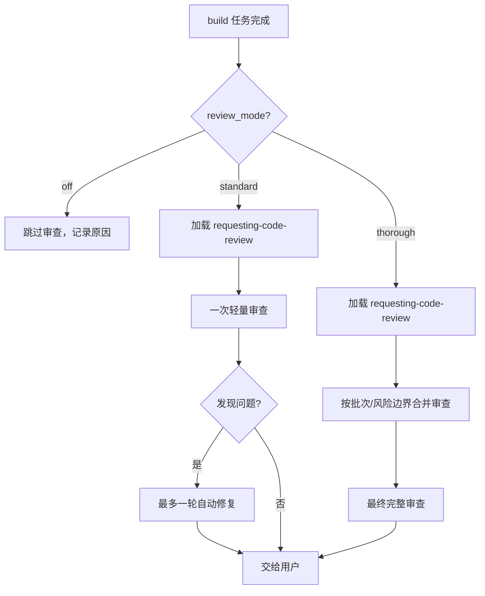

`review_mode` 控制 build 和 verify 阶段的自动代码审查强度。它决定了 Comet 何时加载 Superpowers 的 `requesting-code-review`、审查做几轮、覆盖什么范围。

## 三种模式

| 模式 | build 阶段行为 | verify 阶段行为 | 适合场景 |
| --- | --- | --- | --- |
| `off` | 跳过自动代码审查，记录跳过原因 | 跳过自动代码审查（仍跑构建/测试/安全检查） | hotfix/tweak 默认；风险可控的小改动 |
| `standard` | 全部任务完成后做一次轻量审查，最多一轮自动修复 | 轻量审查：只查正确性/安全/边界 | 日常 full workflow |
| `thorough` | 按批次或风险边界做合并审查 + 最终完整审查 | 轻量审查（同 standard） | 高风险、多模块、架构或安全变更 |

## off 模式

跳过自动代码审查，但**不跳过构建、测试、安全和调试**。build 阶段不加载 `requesting-code-review`，在验证报告草稿或 tasks.md 里记录跳过原因。

- hotfix 和 tweak 预设默认 `off`。
- full workflow 也可以显式选 `off`，但需要在离开 build 前确认这个选择。

## standard 模式

### build 阶段

全部计划任务完成后、build→verify guard 之前：

1. 加载 Superpowers `requesting-code-review`。
2. 请求一次轻量代码审查。
3. 如果发现问题，最多自动修复一轮，然后交给用户处理。

`build_mode: subagent-driven-development` 配合 `standard` 时：不做每任务审查，只在最后做一次合并审查。

### verify 阶段

light verify（6 项检查的第 6 项）：加载 `requesting-code-review`，请求轻量审查，只查：

- 正确性
- 安全
- 边界条件

不查 spec 覆盖和 design drift。

## thorough 模式

### build 阶段

- 按批次或风险边界运行合并审查（在执行过程中分批审查）。
- 最后再做一次完整审查。
- `build_mode: subagent-driven-development` 配合 `thorough` 时：只做批次/风险边界合并审查，不做每任务双重审查。

适合：高风险变更、多模块协调、架构或安全相关改动。

### verify 阶段

verify 的 light 路径和 standard 一样用轻量 `requesting-code-review`。

## standard 和 thorough 的区别

| 维度 | standard | thorough |
| --- | --- | --- |
| 审查时机 | 最后一次 | 执行过程中分批 + 最终 |
| 审查轮数 | 1 轮 + 最多 1 轮自动修复 | 多批 + 最终完整审查 |
| 自动修复 | 最多 1 轮 | 按审查结果处理 |
| 适合 | 日常 full workflow | 高风险/多模块/架构/安全 |



## 审查门禁规则

`review_mode: standard`/`thorough` 配合 `build_mode: executing-plans` 时：

- `requesting-code-review` 必须在 `comet-guard build --apply` **之前**加载。
- 如果 skill 不可用，跳过审查门禁，但在 tasks.md 记录 `<!-- review skipped: skill unavailable -->`。
- **CRITICAL** 发现（安全、数据丢失、构建/测试失败）必须在 verify 前修复。
- 非 CRITICAL 发现可以接受，但必须把原因和影响记录到 tasks.md、commit body、验证报告草稿或其他持久化产物。

## 怎么设置

### 项目默认值

编辑 `.comet/config.yaml`：

```yaml
review_mode: thorough
```

新 change 创建时快照到自己的 `.comet.yaml`。

### 单个 change

full workflow 在 build Step 3（执行方式选择）时由用户选择，通过 `comet-state` 写入：

```bash
node "$COMET_STATE" set <change-name> review_mode standard
```

这是 build 阶段的用户决策点。

### 环境变量

```bash
export COMET_REVIEW_MODE=standard
```

仅在 resolver 层提供默认值，不影响已写入 change 的 `review_mode`。

## 硬约束

| 约束 | 说明 |
| --- | --- |
| full workflow 离开 build | `review_mode` 必须是 `off`/`standard`/`thorough` |
| hotfix/tweak | 默认 `off` |
| 枚举校验 | `FIELD_ENUMS.review_mode = ['off', 'standard', 'thorough']`，非法值被拒 |

<Note>
  <code>review_mode</code> 不在 <code>REQUIRED_CLASSIC_KEYS</code> 里，这样 0.4.0 之前的 <code>.comet.yaml</code> 文件不用迁移就能解析。强制检查发生在 build→verify 的 transition guard，旧文件缺少该字段时走兼容路径，恢复时应回填。
</Note>

## 怎么选

| 场景 | 推荐模式 |
| --- | --- |
| hotfix/tweak | `off`（默认） |
| 日常功能开发 | `standard` |
| 安全/架构/多模块变更 | `thorough` |
| CI 想强制审查 | 项目配置设 `standard` 或 `thorough` |

## 下一步

- [状态与配置](/zh/concepts/state-management) — review_mode 字段和配置优先级
- [上下文压缩机制](/zh/concepts/context-compression) — 另一个项目配置项
- [build 阶段](/zh/phases/build) — review_mode 在 build 中的使用位置
- [verify 阶段](/zh/phases/verify) — verify 中的审查检查
