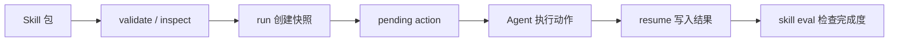

Comet 的 Skill 不只是 Markdown 提示词。0.4.0-beta.1 开始，Comet 同时提供 Skill 包管理、确定性 Run、运行证据和 runtime eval。

## 三类 Skill

| 类型 | 用途 | 常见入口 |
| --- | --- | --- |
| 内置工作流 Skill | 驱动 `/comet` 五阶段流程 | `/comet`、`/comet-open`、`/comet-build` |
| 项目 Skill | 安装到 `.comet/skills/<name>` 的本地能力 | `comet skill install` |
| Factory 生成 Skill | `/comet-any` 创建、优化或组合后的可分发能力 | `/comet-any`、`comet publish` |

## Skill Engine 解决什么

Engine 为多步骤 Skill 提供：

- 稳定内容 hash 和不可变快照。
- `.comet/run-state.json` 或 `.comet/runs/<run-id>` 运行状态。
- pending action、trajectory、artifact、checkpoint。
- guardrails 和 runtime eval。



## 什么时候用 `comet skill`

`comet skill` 是本地 Skill 包和 deterministic Run 的低层工具。它适合调试、集成和 Engine Run。

```bash
comet skill install ./my-skill --project .
comet skill validate my-skill --project .
comet skill inspect my-skill --json
comet skill run my-skill --run-id demo-run --project .
comet skill resume --run-id demo-run --status succeeded --summary "完成"
comet skill eval --run-id demo-run --scope completion
```

<Warning>
  `comet skill eval` 不是通用 Skill 评估。通用评估请使用 `comet eval run`。
</Warning>

## 什么时候用 `/comet-any`

如果你想把一个工作流变成团队可复用 Skill，不要从手写 Engine 文件开始。用 `/comet-any` 让它读取真实 Skill、生成结构化证据、评估并进入发布门禁。

正常用户路径是：

```text
/comet-any -> comet eval -> comet publish
```
