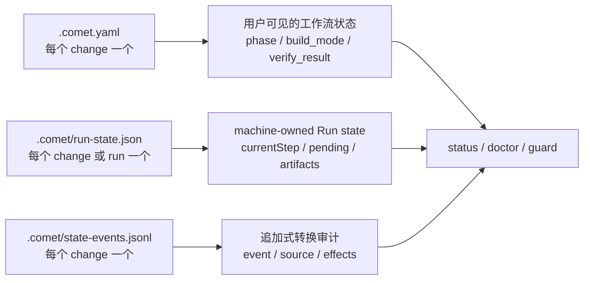

Comet 的恢复能力来自文件化状态：Classic 把"一个 change 走到哪一步、按什么方式执行、验证结果如何"写进仓库里的状态文件，每次调用 `/comet` 都重新读这些文件，不依赖对话历史。理解用户可读状态、机器运行状态和追加审计日志的分工，你就能知道 Classic 在每个阶段读什么、为什么推进或拒绝。项目级配置（`.comet/config.yaml`）见 [Classic 配置](/zh/classic/configuration)。

下文用 `<classic-root>` 表示当前 Classic OpenSpec 根目录：新项目默认是 `docs/openspec/`，保留旧布局的项目是 `openspec/`。实际位置由 `classic.artifact_layout` 决定，详见[项目文件结构](/zh/guides/project-structure)。

<Warning>
  <strong>误改状态的后果：</strong>状态守卫按失败关闭（fail closed）工作——宁可拒绝执行，也不带错误状态继续。手工改字段不会"解锁"流程，反而会让流程卡住，或带着与你实际工作树不符的状态走下去：

  - <code>.comet.yaml</code> 的 <code>phase</code> 只能由守卫或合法转换推进，直接{' '}
    <code>comet state set &lt;name&gt; phase &lt;value&gt;</code> 会被硬拒绝。
  - <code>.comet/run-state.json</code> 等由 Comet 自动维护（machine-owned）的字段不要手工编辑，也不要手工把已归档 change 标成完成（归档通过{' '}
    <code>/comet-archive</code> 完成）。
  - 状态真的坏了时，先按[状态损坏与恢复](/zh/guides/state-recovery)诊断，不要手工伪造状态。
</Warning>

本页围绕三个问题组织，完整字段参考放在文末附录：

- **我在哪**——状态存在哪些文件里、用哪几个字段判断当前进度；
- **哪些是我选的**——由你显式选择的字段在何时选、能否改；哪些字段由 Comet 自动维护、不要手改；
- **出问题去哪查**——state-events 转换历史、Run state 边界和诊断命令入口。

## 我在哪：状态放在哪、进度怎么看

想知道"现在做到哪了、还差什么"，正常路径是重新调用 `/comet`（见[恢复中断的工作](/zh/guides/resuming-workflow)）；想人工核对时运行 `comet status`。两者都从磁盘上的状态文件重读，不猜对话历史。

### 状态存在三类文件

| 文件                        | 位置                                            | 谁管理                                        | 作用                                                           |
| --------------------------- | ----------------------------------------------- | --------------------------------------------- | -------------------------------------------------------------- |
| `.comet.yaml`               | `<classic-root>/changes/<name>/.comet.yaml`     | 用户可见，通过 `/comet` 和 guard 流转         | 工作流状态：阶段、执行方式、验证结果                           |
| `.comet/run-state.json`     | `<changeDir>/.comet/` 或 `.comet/runs/<runId>/` | machine-owned（由 Comet 自动维护），不需要手动编写，运行时自动写入 | Engine Run 细节：currentStep、pending、trajectory              |
| `.comet/state-events.jsonl` | `<classic-root>/changes/<name>/.comet/`         | Comet 追加写入，用户可读                      | 成功 state transition 的审计日志                               |



<p align="center">
  
</p>

<p align="center">
  `.comet.yaml` 告诉你当前在哪，Run state 让运行时恢复，state events 解释状态为什么变了
</p>

### 看哪几个字段判断进度

`comet status` 和 `/comet` 的恢复路由主要读这几个字段；每个字段的完整类型和允许值见文末"字段速查（参考）"附录。

| 字段              | 告诉你什么                                                                          |
| ----------------- | ----------------------------------------------------------------------------------- |
| `phase`           | 当前停在哪一阶段；`/comet-classic` 据此路由到对应的阶段 Skill                        |
| `workflow`        | 走 full 完整流程还是 hotfix/tweak 预设，决定后续按哪套默认执行                       |
| `verify_result`   | 验证是否通过。`pass` 才能进入归档；`fail` 会回 build 修复                            |
| `build_pause`     | build 内部是否停在等你的地方。`plan-ready` = 计划已生成，等你确认或补选执行配置       |
| `branch_status`   | 远端交付方式确认到哪一步。verify 期间保持 `pending`；你在归档前确认立即推送或推送并创建 PR 后，归档完成时写 `handled` |
| `archived`        | change 是否已完成归档；已归档的 change 不再被当作活跃 change 恢复                     |

其中 `branch_status: handled` 只表示你在归档前已确认立即推送或推送并创建 PR，并在归档完成时写回，它不表示 push 或 PR 已经成功。

### 多个 change 并行时，先选目标

`.comet/current-change.json` 保存你当前明确选择的 workflow 和 change，在多个 active change 并行时消除写入歧义。它不替代 `.comet.yaml`。

```bash
comet state select <change-name>
comet state current
comet state clear-selection
```

- 只有一个 active change 时可以自动归属。
- 多个 active change 时，进入目标 change 后必须显式 `select`。
- 目标归档、选择文件损坏或 workflow 不匹配后，守卫会失败关闭（fail closed：宁可拒绝执行也不带错误状态继续）。
- `isolation` 已设为 `current`、`branch` 或 `worktree` 时，change 还会通过 `bound_branch` 固定到建立隔离的分支。发生漂移时，切回原分支；只有你明确确认当前分支应接管 change 后，才运行 `comet state rebind <change-name>`。
- 不要手工编辑 `current-change.json`。

选择与判断的完整命令说明见 [comet state](/zh/scripts/comet-state)。

## 哪些是我选的：由你决定的字段

`.comet.yaml` 里的字段按"谁写入"分成两类：一类由你在流程的停顿点显式选择，决定流程怎么执行；另一类由 Comet 自动维护（machine-owned），只记录运行时已经发生的事实，不要手改（见下一节）。

### 由你显式选择的字段：何时选、如何改

| 字段                  | 谁在何时选                                                                                                                                    | 之后如何改                                                                                                                            |
| --------------------- | --------------------------------------------------------------------------------------------------------------------------------------------- | ------------------------------------------------------------------------------------------------------------------------------------- |
| `language`            | 项目初始化时选 Skill 语言决定项目级 `classic.language`；每个 change 创建时把项目默认快照到自己的 `.comet.yaml`                                 | 改项目默认或环境变量只影响之后新建的 change，不追溯已有 change（[Classic 配置](/zh/classic/configuration)）                            |
| `isolation`           | open 阶段的工作区决策（停顿点 3）由你选 `current`/`branch`/`worktree`，三种模式都要显式选择；分支名也在该决策中确认                        | 选择写入 `isolation`，并把当前 Git 分支记为 `bound_branch`；build 阶段只校验目录与分支匹配，不会静默换目录                             |
| `build_mode`          | build 阶段的联合决策（停顿点 6）由你选 `subagent-driven-development`/`executing-plans`/`direct`；hotfix/tweak 预设固定 `direct`              | 选 `subagent-driven-development` 需要 `subagent_dispatch: confirmed`；full 用 `direct` 需要 `direct_override: true`                   |
| `tdd_mode`            | 同一联合决策由你选 `tdd`/`direct`；hotfix/tweak 默认 `direct`                                                                                  | `tdd` 强制每个任务先写失败测试；`direct` 不做 Red-Green-Refactor，但仍要求相关测试和 bug 回归证据                                      |
| `review_mode`         | 同一联合决策由你选 `off`/`standard`/`thorough`；full 默认取项目配置快照 `standard`，hotfix/tweak 固定 `off`                                    | 存量 change 缺该字段时守卫会拦截并提示补设，设置方法与生效范围见[代码审查机制](/zh/concepts/review-mode)                                |
| `context_compression` | 项目级 `classic.context_compression` 设好后，新建 change 时快照为默认（`off`）                                                                 | 改项目配置只影响新 change；单个 change 的调整方式见[上下文压缩机制](/zh/concepts/context-compression)                                    |
| `auto_transition`     | 项目级 `classic.auto_transition` 设好后快照为默认（`true`）                                                                                    | 只在 change 级字段为空时，环境变量 `COMET_AUTO_TRANSITION` 可以临时覆盖；行为与优先级见[自动推进机制](/zh/concepts/auto-transition) |

这些字段大多在 change 创建时先从项目配置快照默认值。如果你漏选了，守卫不会默默替你选——它会在离开对应阶段前拦截；缺字段时重新调用 `/comet`，路由会把你带回对应决策点补选，而不是让你手工编辑文件。build 阶段缺 `isolation`/`build_mode`/`tdd_mode` 的恢复路径见[恢复中断的工作](/zh/guides/resuming-workflow)。

### 守卫在推进前检查什么（状态机硬约束）

这些约束同时存在于 `comet guard` 和 `comet state transition` 两个守卫层：

| 约束                                      | 说明                                                                                                                           |
| ----------------------------------------- | ------------------------------------------------------------------------------------------------------------------------------ |
| `build → verify` 前                       | `isolation` 必须是 `current`、`branch` 或 `worktree`；三种模式都会校验绑定分支                                                 |
| `build → verify` 前                       | `build_mode` 必须已选择                                                                                                        |
| `build_mode: subagent-driven-development` | 需要 `subagent_dispatch: confirmed`                                                                                            |
| full workflow 离开 build                  | `tdd_mode` 必须是 `tdd` 或 `direct`                                                                                            |
| full workflow 离开 build                  | `review_mode` 必须是 `off`/`standard`/`thorough`                                                                               |
| `build_mode: direct`                      | hotfix/tweak 默认允许；full 需要 `direct_override: true`                                                                       |
| `verify → archive` 前                     | `verify_result` 必须是 `pass`                                                                                                  |
| `verify-pass` 转换                        | 需要 `verification_report` 指向已存在的文件；`branch_status` 保持 `pending`（分支处理在 archive 内完成）                       |
| 真实归档命令                              | 需要 `archive_confirmation: confirmed`；重新打开归档会清除旧确认                                                               |
| archive 完成                              | 用户已确认立即远端交付；归档完成后先写 `branch_status: handled` 并通过 `comet guard archive`，再把最终状态包含在唯一归档提交中 |
| `build_pause`                             | 不是执行方式，不能写进 `build_mode`                                                                                            |

<Note>
  直接 <code>comet state set &lt;name&gt; phase &lt;value&gt;</code> 会被硬阻止，除非设了{' '}
  <code>COMET_FORCE_PHASE=1</code>（仅修复用）。阶段推进只能通过 <code>comet guard --apply</code>{' '}
  或合法 transition。
</Note>

`COMET_FORCE_PHASE` 是排障专用开关，正常流程用不上；其它环境变量见 [Classic 配置](/zh/classic/configuration)。

### 预设升级只走合法转换

hotfix/tweak 命中升级信号（跨模块、新 API、schema 变更等）时，通过 `preset-escalate` 转换升级到 full：

- 一次性设置 `workflow`/`classic_profile` 为 `full`，回退 `phase` 到 `design`，清除 `design_doc`。
- 这是预设→full 升级的**唯一合法通道**——直接 `set phase design` 被硬阻止，`set classic_profile` 是 machine-owned 也被硬阻止。

## Comet 自动维护的字段：不要手改

这些字段都由 Comet 自动写入，日常使用不需要关心，也不出现在用户可见的字段参考里。它们在源码里统称 machine wire keys，但按"能否通过 `comet state set` 修改"分两类：

| 字段                | 含义                            | 能否 `set` 修改                            |
| ------------------- | ------------------------------- | ------------------------------------------ |
| `handoff_context`   | design 交接上下文文件路径       | 可以（machine-written，但可被 `set` 覆盖） |
| `handoff_hash`      | 交接上下文 hash                 | 可以（machine-written，但可被 `set` 覆盖） |
| `classic_profile`   | 只由状态机设置，等于 `workflow` | **不能**（machine-owned）                  |
| `classic_migration` | Classic 迁移版本（当前为 `1`）  | **不能**（machine-owned）                  |
| `run_id`            | 链接到 Engine Run state         | **不能**（machine-owned）                  |

`classic_profile`、`classic_migration`、`run_id` 是 machine-owned 字段，`set` 会被硬拒绝（报错 "is a machine-owned Run field and cannot be set directly"）。它们只由状态机的 transition 事件和归档流程写入，例如 `preset-escalate` 会一次性把 `classic_profile` 设为 `full`。

此外还有几类字段也标着 machine-owned：它们由 Comet 在特定时机落盘，值反映"当时绑定在哪、发生过什么"或"你已经确认了什么"，不是你现在想怎么跑：

- `bound_branch`：建立隔离时记录当前分支。入口检查与源码写入守卫会阻止意外分支漂移；不要直接 `set` 修改。
- `verify_failures`：连续验证失败计数。`verify-fail` 自增，`verify-pass` 或 `archive-reopen` 重置为 `0`。达到 3 次后，下一次失败会暂停，由你决定重试上限策略。
- `archive_confirmation`：verify 通过后 Comet 写 `pending`；你在归档前确认后才变 `confirmed`。真实归档命令要求 `confirmed`。
- `.comet/run-state.json` 的 `currentStep`、`pending`、`artifacts`、`trajectory`：Engine 运行时自动写入，不需要手动编写，不要手工编辑。

这些字段手改后，最直接的后果是状态和你实际的工作树、验证历史对不上——守卫要么拒绝执行，要么按错误状态继续推进。归档流程统一走 `/comet-archive`，不要手工把已归档 change 标成完成。

## 出问题去哪查

先区分两种情形：会话中断、上下文压缩或换设备属于正常中断，直接 `/comet` 恢复；`.comet.yaml` 缺失或格式异常、change 路由不对、声明的证据找不到，才需要 `comet status`/`comet doctor` 诊断。判断和处理的完整流程见[状态损坏与恢复](/zh/guides/state-recovery)。

### 转换历史：state-events.jsonl

Classic 状态转换共用同一套语义。成功的 `comet state transition`、`comet guard --apply` 和归档更新都会追加一行 JSON 到：

```text
<classic-root>/changes/<name>/.comet/state-events.jsonl
```

每条记录包含：

| 字段            | 含义                                                        |
| --------------- | ----------------------------------------------------------- |
| `schemaVersion` | 日志格式版本                                                |
| `timestamp`     | 写入时间                                                    |
| `change`        | change 名称                                                 |
| `event`         | `open-complete`、`build-complete`、`verify-pass` 等转换事件 |
| `source`        | `comet state`、`comet guard` 或 `comet archive`             |
| `from` / `to`   | 转换前后的 Classic 状态                                         |
| `effects`       | 实际变更的字段列表，例如 `phase: build -> verify`           |

`phase` 为什么改变、上一次转换发生了什么，从这里查。可用的 transition 事件与命令见 [comet state](/zh/scripts/comet-state) 和[自动推进机制](/zh/concepts/auto-transition)。

### Run state 边界

`.comet.yaml` 保存用户可理解的工作流状态。Engine 运行细节放在 `.comet/run-state.json`。两者通过 `run_id` 链接。

| 你想知道的                       | 看哪里                                              |
| -------------------------------- | --------------------------------------------------- |
| 当前阶段和下一步                 | `.comet.yaml` 的 `phase`                            |
| 执行方式和验证结果               | `.comet.yaml` 的 `build_mode`、`verify_result`      |
| Engine 当前步骤和 pending action | `.comet/run-state.json` 的 `currentStep`、`pending` |
| phase 为什么改变                 | `.comet/state-events.jsonl`                         |
| Engine 轨迹审计                  | `.comet/trajectory.jsonl`                           |

详见[Skill 与 Engine（进阶）](/zh/skill-creator/engine)。

### 诊断命令入口

Engine 层细节（`currentStep`、`pending`、`trajectory`）日常不需要处理，它们是排障时看的东西。入口是两条诊断命令：

- `comet status`——看活跃 change 的 `phase`、验证结果、声明的证据是否真的在磁盘上（`runtime_eval`），以及下一步提示。
- `comet doctor`——检查安装、环境、Skill 完整性和每个 change 的 `.comet.yaml` 是否有效。

两条命令的详细用法和常见症状见[状态损坏与恢复](/zh/guides/state-recovery)。

## 附录：`.comet.yaml` 字段速查（参考）

每个活跃 change 的 `.comet.yaml` 包含以下字段。正文已说明的字段（是否 machine-owned、谁能改）见对应章节；下表集中列出类型、允许值和含义，供查阅。标注 machine-owned 的字段由 Comet 自动维护，不要手工修改。

### 工作流与阶段

| 字段              | 类型 / 允许值                                          | 含义                                                                                                          |
| ----------------- | ------------------------------------------------------ | ------------------------------------------------------------------------------------------------------------- |
| `workflow`        | `full` \| `hotfix` \| `tweak`                          | 工作流预设                                                                                                    |
| `language`        | `en` \| `zh-CN`                                        | 产物主语言。创建 change 时从 `.comet/config.yaml` 快照，用于约束 OpenSpec / Superpowers / 验证报告 / 归档说明 |
| `phase`           | `open` \| `design` \| `build` \| `verify` \| `archive` | 当前阶段。init 设为 `open`，guard 推进                                                                        |
| `auto_transition` | `true` \| `false`                                      | 是否自动调用下一个 Skill                                                                                      |

### 执行方式

| 字段                  | 类型 / 允许值                                                  | 含义                                                                                                                          |
| --------------------- | -------------------------------------------------------------- | ----------------------------------------------------------------------------------------------------------------------------- |
| `build_mode`          | `subagent-driven-development` \| `executing-plans` \| `direct` | 执行方式                                                                                                                      |
| `build_pause`         | `null` \| `plan-ready`                                         | build 内部暂停点。`plan-ready` = 计划已生成，暂停等用户选择                                                                   |
| `subagent_dispatch`   | `null` \| `confirmed`                                          | 只有 `confirmed` 才允许 `build_mode: subagent-driven-development`                                                             |
| `tdd_mode`            | `tdd` \| `direct`                                              | `tdd` 强制每个任务先写失败测试；`direct` 不做 Red-Green-Refactor，但仍要求相关测试和 bug 回归证据。hotfix/tweak 默认 `direct` |
| `review_mode`         | `off` \| `standard` \| `thorough`                              | 代码审查强度。详见[代码审查机制](/zh/concepts/review-mode)                                                                    |
| `isolation`           | `current` \| `branch` \| `worktree`                            | 工作区隔离方式。三种模式都需要用户显式选择，并绑定设置命令实际运行所在目录的当前 Git 分支                                     |
| `bound_branch`        | Git 分支名或 `null`（machine-owned）                           | 当前工作区模式绑定的分支。入口检查与源码写入守卫会阻止意外分支漂移；不要直接 `set` 修改                                       |
| `context_compression` | `off` \| `beta`                                                | 从项目配置快照。详见[上下文压缩机制](/zh/concepts/context-compression)                                                        |

### 验证与分支

| 字段                  | 类型 / 允许值                 | 含义                                                                                                                                                                      |
| --------------------- | ----------------------------- | ------------------------------------------------------------------------------------------------------------------------------------------------------------------------- |
| `verify_mode`         | `light` \| `full`             | 验证深度                                                                                                                                                                  |
| `verify_result`       | `pending` \| `pass` \| `fail` | 验证结果                                                                                                                                                                  |
| `verify_failures`     | 整数（machine-owned）         | 连续验证失败计数。`verify-fail` 自增，`verify-pass` 或 `archive-reopen` 重置为 `0`。达到 3 次后，下一次失败会暂停，由你决定重试上限策略                                                 |
| `verification_report` | 相对路径                      | 验证报告路径，verify pass 前必须指向已存在的文件                                                                                                                          |
| `branch_status`       | `pending` \| `handled`        | 远端交付方式确认状态。verify 期间保持 `pending`；用户在归档前确认立即推送或推送并创建 PR 后，归档完成时写 `handled`，并包含在唯一归档提交中。它不表示 push 或 PR 已经成功 |
| `verified_at`         | `YYYY-MM-DD` 或 `null`        | 验证通过时间                                                                                                                                                              |

### 路径引用

| 字段              | 类型 / 允许值     | 含义                                                  |
| ----------------- | ----------------- | ----------------------------------------------------- |
| `design_doc`      | 相对路径或 `null` | Superpowers Design Doc 路径                           |
| `plan`            | 相对路径或 `null` | Superpowers 实施计划路径                              |
| `base_ref`        | git SHA 字符串    | change 创建时的 commit SHA，用于变更规模评估          |
| `direct_override` | `true` \| `false` | full workflow 用 `build_mode: direct` 时必须为 `true` |

### 时间与归档

| 字段                   | 类型 / 允许值                      | 含义                                                                            |
| ---------------------- | ---------------------------------- | ------------------------------------------------------------------------------- |
| `created_at`           | `YYYY-MM-DD`                       | change 创建日期，init 自动写入                                                  |
| `archived`             | `true` \| `false`                  | 是否已归档                                                                      |
| `archive_confirmation` | `null` \| `pending` \| `confirmed` | machine-owned 最终确认；verify 通过后为 `pending`，用户确认后才变为 `confirmed` |

## 下一步

- [Classic 配置](/zh/classic/configuration) — `.comet/config.yaml` 字段、配置优先级和环境变量
- [状态损坏与恢复](/zh/guides/state-recovery) — `comet status`/`comet doctor` 诊断与恢复流程
- [上下文压缩机制](/zh/concepts/context-compression) — context_compression 的 off/beta 模式详解
- [代码审查机制](/zh/concepts/review-mode) — review_mode 的 off/standard/thorough 详解
- [Skill 与 Engine（进阶）](/zh/skill-creator/engine) — Run state 和 Engine 运行语义
- [工作流概念](/zh/concepts/workflow) — 五阶段如何使用这些状态字段
