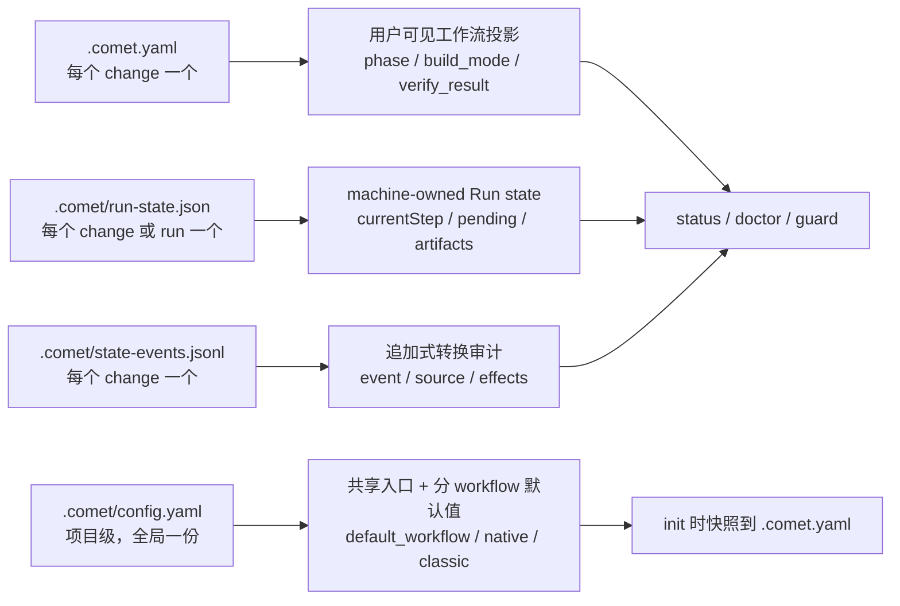

Comet 的恢复能力来自文件化状态。理解用户可读状态、机器运行状态、追加审计日志和项目配置，你就能知道 Comet 在每个阶段读什么、用户能配置什么、以及阶段推进为什么发生。

下文用 `<classic-root>` 表示当前 Classic OpenSpec 根目录：新项目默认是 `docs/openspec/`，保留旧布局的项目是 `openspec/`。实际位置由 `classic.artifact_layout` 决定，详见[项目文件结构](/zh/guides/project-structure)。

## 先看用户能改什么

| 目标                             | 看哪里                                                | 建议                                          |
| -------------------------------- | ----------------------------------------------------- | --------------------------------------------- |
| 设置 `/comet` 默认进入哪套工作流 | `.comet/config.yaml` 的 `default_workflow`            | 必须同时出现在 `workflows` 中                 |
| 控制自然语言续接是否自动探测     | `.comet/config.yaml` 的 `ambient_resume`              | 默认 `true`；不影响显式 `/comet`              |
| 设置 Native 产物语言             | `.comet/config.yaml` 的 `native.language`             | 只支持 `en` 或 `zh-CN`，影响新 Native change  |
| 设置 Native 澄清模式             | `.comet/config.yaml` 的 `native.clarification_mode`   | `sequential` 或 `batch`                       |
| 设置 Classic 产物语言            | `.comet/config.yaml` 的 `classic.language`            | 只支持 `en` 或 `zh-CN`，影响新 Classic change |
| 设置默认上下文压缩               | `.comet/config.yaml` 的 `classic.context_compression` | 项目级默认，影响新 Classic change             |
| 设置默认审查强度                 | `.comet/config.yaml` 的 `classic.review_mode`         | full workflow 默认走 `standard`               |
| 设置是否自动衔接下一阶段         | `.comet/config.yaml` 的 `classic.auto_transition`     | 想手动控制 Classic 阶段时设为 `false`         |
| 查看某个 change 当前在哪         | `<classic-root>/changes/<name>/.comet.yaml`           | 只读为主，让 `/comet` 和 guard 写入           |
| 恢复或排查卡住的运行             | `comet status` / `comet doctor`                       | 不要手工改 `.comet/run-state.json`            |

<Note>
  日常使用优先改 <code>.comet/config.yaml</code> 的项目默认值；<code>.comet.yaml</code> 是某个
  change 的状态投影，Run state 是机器恢复细节。
</Note>

## 当前 change 选择

`.comet/current-change.json` 保存当前明确选择的 workflow 和 change。它在多个 active change 并行时消除写入歧义，不替代 Classic 的 `.comet.yaml` 或 Native 的 `comet-state.yaml`。

```bash
comet state select <change-name>
comet state current
comet state clear-selection
# Native 使用：comet native select <change-name>
```

- 只有一个 active change 时可以自动归属。
- 多个 active change 时，进入目标 change 后必须显式 `select`。
- 目标归档、选择文件损坏或 workflow 不匹配后，守卫会失败闭合。
- `isolation` 已设为 `current`、`branch` 或 `worktree` 时，change 还会通过 `bound_branch` 固定到建立隔离的分支。发生漂移时，切回原分支；只有你明确确认当前分支应接管 change 后，才运行 `comet state rebind <change-name>`。
- 不要手工编辑 `current-change.json`。

## 三类状态 + 一层配置



<p align="center">
  
</p>

<p align="center">
  `.comet.yaml` 告诉你当前在哪，Run state 让运行时恢复，state events 解释状态为什么变了
</p>

| 文件                        | 位置                                            | 谁管理                                        | 作用                                                           |
| --------------------------- | ----------------------------------------------- | --------------------------------------------- | -------------------------------------------------------------- |
| `.comet.yaml`               | `<classic-root>/changes/<name>/.comet.yaml`     | 用户可见，通过 `/comet` 和 guard 流转         | 工作流投影：阶段、执行方式、验证结果                           |
| `.comet/run-state.json`     | `<changeDir>/.comet/` 或 `.comet/runs/<runId>/` | machine-owned，不需要手动编写，运行时自动写入 | Engine Run 细节：currentStep、pending、trajectory              |
| `.comet/state-events.jsonl` | `<classic-root>/changes/<name>/.comet/`         | Comet 追加写入，用户可读                      | 成功 state transition 的审计日志                               |
| `.comet/config.yaml`        | 项目根 `.comet/config.yaml`                     | 用户可手写或由 init 生成                      | `/comet` 共享入口配置，以及 Classic 和 Native 各自的项目默认值 |

<Warning>
  不要手工编辑 `.comet/run-state.json` 的 machine-owned 字段，也不要手工把已归档 change
  标成完成。归档应通过 `/comet-archive` 完成。
</Warning>

## 项目配置：.comet/config.yaml

`.comet/config.yaml` 是 Native 与 Classic 共用的项目级配置，全局一份。共享入口字段位于顶层；Native 和 Classic 默认值分别放在 `native:` 与 `classic:` 块中。

<Warning>
  Comet 不再读取仓库根目录的 <code>.comet.yaml</code> 或 <code>comet.yaml</code>。根目录只使用{' '}
  <code>.comet/config.yaml</code> 作为项目默认配置；每个 change 的状态只在{' '}
  <code>&lt;classic-root&gt;/changes/&lt;name&gt;/.comet.yaml</code>。
</Warning>

### 当前结构

同时启用两套工作流并选择中文时，项目级安装会生成类似配置：

```yaml
schema: comet.project.v1
default_workflow: classic
workflows:
  - native
  - classic
ambient_resume: true

native:
  artifact_root: docs
  language: zh-CN
  clarification_mode: sequential

classic:
  artifact_layout: docs
  language: zh-CN
  context_compression: off
  review_mode: standard
  auto_transition: true
```

### 共享字段与 Classic 字段

| 配置项             | 允许值                     | 含义                                                  |
| ------------------ | -------------------------- | ----------------------------------------------------- |
| `schema`           | `comet.project.v1`         | 当前结构化项目配置版本，由 Comet 管理                 |
| `default_workflow` | `native` \| `classic`      | `/comet` 默认进入哪套永久 Skill                       |
| `workflows`        | `native`、`classic` 或两者 | 项目已启用的工作流；必须包含默认工作流                |
| `ambient_resume`   | `true` \| `false`          | 是否允许 Agent 对普通自然语言续接请求自动运行恢复探测 |

下面这些 `classic.*` 字段只属于 Classic。`artifact_layout` 是项目级目录选择；其余四项会在创建新 Classic change 时快照到该 change 的 `.comet.yaml`：

| 配置项                        | 允许值                            | 默认值                                                            | 含义                                                                                         |
| ----------------------------- | --------------------------------- | ----------------------------------------------------------------- | -------------------------------------------------------------------------------------------- |
| `classic.artifact_layout`     | `legacy` \| `docs`                | 默认为 `docs`；升级时检测到已有根目录 `openspec/` 才补为 `legacy` | 选择 OpenSpec 根目录：`openspec/` 或 `docs/openspec/`                                        |
| `classic.language`            | `en` \| `zh-CN`                   | 由 `comet init` 选择的 Skill 语言映射；`--yes` 默认为 `en`        | 控制 OpenSpec、Superpowers、验证报告、归档说明等工作流产物的主语言                           |
| `classic.context_compression` | `off` \| `beta`                   | `off`                                                             | 控制 design→build 交接时的上下文压缩。详见[上下文压缩机制](/zh/concepts/context-compression) |
| `classic.review_mode`         | `off` \| `standard` \| `thorough` | `standard`（full workflow 默认）                                  | 控制代码审查强度。详见[代码审查机制](/zh/concepts/review-mode)                               |
| `classic.auto_transition`     | `true` \| `false`                 | `true`                                                            | 阶段推进后是否自动调用下一个阶段 Skill。详见[自动推进机制](/zh/concepts/auto-transition)     |

<Note>
  修改 <code>default_workflow</code> 只改变 <code>/comet</code> 的入口，不迁移任何 change。Classic
  项目默认值在创建新 change 时快照到 <code>.comet.yaml</code>；之后修改不会追溯改变已有 change。
</Note>

<Warning>
  直接修改 <code>classic.artifact_layout</code> 只会改变 Comet
  读取的目录，不会移动已有产物。已有项目切换布局时，应使用{' '}
  <code>comet classic root move docs --dry-run</code> 检查当前状态、冲突和阻塞项，再用{' '}
  <code>comet classic root move docs --apply</code> 执行迁移。Dry-run 不生成 plan ID。
</Warning>

`native.artifact_root`、`native.language` 和 `native.clarification_mode` 的含义、迁移方式及完整示例见 [Native 配置](/zh/native/configuration)。Native 不读取 Classic 的 `context_compression`、`review_mode` 或 `auto_transition`。

<Info>
  旧的纯 Classic 扁平配置仍可让 <code>/comet</code> 通过 legacy fallback 进入 Classic，但 Classic
  Runtime 只从 <code>classic:</code> 块读取项目默认值。运行 <code>comet init</code> 或{' '}
  <code>comet update</code> 会把旧值迁入新块，并补齐缺失的 Native 与 Classic 托管字段。
</Info>

### 产物语言和 Skill 语言的区别

`comet init` 里的“Skill 语言”会决定安装中文还是英文版 Comet Skill。Classic 的产物语言写入 `classic.language`；Native 的产物语言写入 `native.language`：

| init 选择                   | 安装的 Skill | Classic                   | Native                   |
| --------------------------- | ------------ | ------------------------- | ------------------------ |
| `English` / `--language en` | 英文 Skill   | `classic.language: en`    | `native.language: en`    |
| `中文` / `--language zh`    | 中文 Skill   | `classic.language: zh-CN` | `native.language: zh-CN` |

之后新建 Classic change 时，Comet 会把项目级 `classic.language` 快照到 `<classic-root>/changes/<name>/.comet.yaml`。OpenSpec proposal、design、tasks、Superpowers 设计/计划、验证报告和 archive 说明都会按这个配置输出，而不是按某次触发请求的语言临时判断。

如果你在中英文混合会话里继续同一个 change，Comet 会读取该 change 的 `language`，保持产物语言稳定。要切换已有 change 的产物语言，用状态命令改 change 级字段：

```bash
comet state set <change-name> language en
comet state set <change-name> language zh-CN
```

全局 `comet init` 和 `comet update` 会把选择的产物语言保存到 `~/.comet/config.yaml`。新建 Classic change 优先使用项目 `.comet/config.yaml` 的 `classic.language`；未配置时才回退到全局默认。Native 使用独立的 `native.language`，不读取这个 Classic 全局回退。

<Warning>
  项目级和 change 级语言值只接受 <code>en</code> 或 <code>zh-CN</code>。<code>zh</code> 只用于{' '}
  <code>comet init --language zh</code> 的 CLI 选择，不是 <code>.comet/config.yaml</code> 的合法值。
</Warning>

Comet guard 会检查关键工作流产物的主语言。如果配置是 `zh-CN`，但 `proposal.md`、`tasks.md`、`design.md` 等明显以英文为主，guard 会阻止阶段推进；配置是 `en` 时也会阻止明显中文为主的产物。代码块会被排除在判断之外，所以命令、路径、hash 或日志不会误导语言检查。

## 配置优先级

以下优先级只描述 Classic 的 `language`、`context_compression`、`review_mode` 和 `auto_transition`。共享入口字段与 `native.*` 不使用 Classic change 级覆盖：

```text
change 级 .comet.yaml 字段 > 环境变量 > 项目级 .comet/config.yaml > 全局 language 默认 > 内置默认值
```

| 层级                        | 说明                                                          | 设置方式                                                            |
| --------------------------- | ------------------------------------------------------------- | ------------------------------------------------------------------- |
| change 级 `.comet.yaml`     | 最高优先级。change 创建时从项目配置快照，之后由 `/comet` 流转 | 由 `/comet` 阶段 Skill 写入                                         |
| 环境变量                    | 仅在 change 级字段为空时生效，适合 CI/CD 临时覆盖             | `export COMET_AUTO_TRANSITION=true` / `export COMET_LANGUAGE=zh-CN` |
| 项目级 `.comet/config.yaml` | change 级为空、环境变量也未设时的回退                         | 手写或 init 生成                                                    |
| 全局 `~/.comet/config.yaml` | 只为 `language` 提供跨项目默认；项目配置优先                  | 全局 init/update 生成                                               |
| 默认值                      | 最后回退                                                      | 见上表                                                              |

## auto_transition 详解

`auto_transition` 控制阶段推进后是否自动调用下一个 Skill。

| 值             | 行为                                                                            |
| -------------- | ------------------------------------------------------------------------------- |
| `true`（默认） | guard 推进 `phase` 后，输出 `NEXT: auto`，自动调用下一个阶段 Skill              |
| `false`        | guard 推进 `phase` 后，输出 `NEXT: manual`，打印 HINT，由你手动运行下一个 Skill |

<Warning>
  <strong>阶段推进一定发生</strong>——guard 的 <code>--apply</code> 总是更新 <code>phase</code>{' '}
  字段，与 <code>auto_transition</code> 无关。<code>auto_transition</code> 只影响是否自动调用下一个
  Skill。用户决策点（确认 proposal、选择执行方式等）无论 <code>auto_transition</code>{' '}
  是什么都会阻塞。
</Warning>

环境变量覆盖（仅 change 级为空时生效）：

```bash
export COMET_AUTO_TRANSITION=true
```

## .comet.yaml 字段全表

每个活跃 change 的 `.comet.yaml` 包含以下字段。

### 工作流与阶段

| 字段              | 类型 / 允许值                                          | 含义                                                                                                          |
| ----------------- | ------------------------------------------------------ | ------------------------------------------------------------------------------------------------------------- |
| `workflow`        | `full` \| `hotfix` \| `tweak`                          | 工作流预设                                                                                                    |
| `language`        | `en` \| `zh-CN`                                        | 产物主语言。创建 change 时从 `.comet/config.yaml` 快照，用于约束 OpenSpec / Superpowers / 验证报告 / 归档说明 |
| `phase`           | `open` \| `design` \| `build` \| `verify` \| `archive` | 当前阶段。init 设为 `open`，guard 推进                                                                        |
| `auto_transition` | `true` \| `false`                                      | 是否自动调用下一个 Skill                                                                                      |

### 执行方式

| 字段                  | 类型 / 允许值                                                  | 含义                                                                                                                          |
| --------------------- | -------------------------------------------------------------- | ----------------------------------------------------------------------------------------------------------------------------- |
| `build_mode`          | `subagent-driven-development` \| `executing-plans` \| `direct` | 执行方式                                                                                                                      |
| `build_pause`         | `null` \| `plan-ready`                                         | build 内部暂停点。`plan-ready` = 计划已生成，暂停等用户选择                                                                   |
| `subagent_dispatch`   | `null` \| `confirmed`                                          | 只有 `confirmed` 才允许 `build_mode: subagent-driven-development`                                                             |
| `tdd_mode`            | `tdd` \| `direct`                                              | `tdd` 强制每个任务先写失败测试；`direct` 不做 Red-Green-Refactor，但仍要求相关测试和 bug 回归证据。hotfix/tweak 默认 `direct` |
| `review_mode`         | `off` \| `standard` \| `thorough`                              | 代码审查强度。详见[代码审查机制](/zh/concepts/review-mode)                                                                    |
| `isolation`           | `current` \| `branch` \| `worktree`                            | 工作区隔离方式。三种模式都需要用户显式选择，并绑定设置命令实际运行所在目录的当前 Git 分支                                     |
| `bound_branch`        | Git 分支名或 `null`（machine-owned）                           | 当前工作区模式绑定的分支。入口检查与源码写入守卫会阻止意外分支漂移；不要直接 `set` 修改                                       |
| `context_compression` | `off` \| `beta`                                                | 从项目配置快照。详见[上下文压缩机制](/zh/concepts/context-compression)                                                        |

### 验证与分支

| 字段                  | 类型 / 允许值                 | 含义                                                                                                                                                                      |
| --------------------- | ----------------------------- | ------------------------------------------------------------------------------------------------------------------------------------------------------------------------- |
| `verify_mode`         | `light` \| `full`             | 验证深度                                                                                                                                                                  |
| `verify_result`       | `pending` \| `pass` \| `fail` | 验证结果                                                                                                                                                                  |
| `verify_failures`     | 整数（machine-owned）         | 连续验证失败计数。`verify-fail` 自增，`verify-pass` 或 `archive-reopen` 重置为 `0`。达到 3 时下一次失败需重试上限策略决策                                                 |
| `verification_report` | 相对路径                      | 验证报告路径，verify pass 前必须指向已存在的文件                                                                                                                          |
| `branch_status`       | `pending` \| `handled`        | 远端交付方式确认状态。verify 期间保持 `pending`；用户在归档前确认立即推送或推送并创建 PR 后，归档完成时写 `handled`，并包含在唯一归档提交中。它不表示 push 或 PR 已经成功 |
| `verified_at`         | `YYYY-MM-DD` 或 `null`        | 验证通过时间                                                                                                                                                              |

### 路径引用

| 字段              | 类型 / 允许值     | 含义                                                  |
| ----------------- | ----------------- | ----------------------------------------------------- |
| `design_doc`      | 相对路径或 `null` | Superpowers Design Doc 路径                           |
| `plan`            | 相对路径或 `null` | Superpowers 实施计划路径                              |
| `base_ref`        | git SHA 字符串    | change 创建时的 commit SHA，用于变更规模评估          |
| `direct_override` | `true` \| `false` | full workflow 用 `build_mode: direct` 时必须为 `true` |

<Warning>
  <code>build_command</code> 和 <code>verify_command</code> 已移除，不再是合法字段。build guard
  会自动探测项目构建命令（例如 <code>npm run build</code>、Maven 或
  Cargo）；没有探测到时，先真实运行项目命令，再用{' '}
  <code>
    comet state record-check &lt;change&gt; &lt;build|verify&gt; --command "..." --exit-code 0
  </code>{' '}
  记录可审计结果。该命令不能替代真实执行。
</Warning>

### 时间与归档

| 字段                   | 类型 / 允许值                      | 含义                                                                            |
| ---------------------- | ---------------------------------- | ------------------------------------------------------------------------------- |
| `created_at`           | `YYYY-MM-DD`                       | change 创建日期，init 自动写入                                                  |
| `archived`             | `true` \| `false`                  | 是否已归档                                                                      |
| `archive_confirmation` | `null` \| `pending` \| `confirmed` | machine-owned 最终确认；verify 通过后为 `pending`，用户确认后才变为 `confirmed` |

### 机器管理字段（machine-managed）

这些字段都由 Comet 自动写入，日常使用不需要关心，也不出现在用户可见的字段参考里。它们在源码里统称 machine wire keys，但按"能否通过 `comet state set` 修改"分两类：

| 字段                | 含义                            | 能否 `set` 修改                            |
| ------------------- | ------------------------------- | ------------------------------------------ |
| `handoff_context`   | design 交接上下文文件路径       | 可以（machine-written，但可被 `set` 覆盖） |
| `handoff_hash`      | 交接上下文 hash                 | 可以（machine-written，但可被 `set` 覆盖） |
| `classic_profile`   | 只由状态机设置，等于 `workflow` | **不能**（machine-owned）                  |
| `classic_migration` | Classic 迁移版本（当前为 `1`）  | **不能**（machine-owned）                  |
| `run_id`            | 链接到 Engine Run state         | **不能**（machine-owned）                  |

`classic_profile`、`classic_migration`、`run_id` 是 machine-owned 字段，`set` 会被硬拒绝（报错 "is a machine-owned Run field and cannot be set directly"）。它们只由状态机的 transition 事件和归档流程写入，例如 `preset-escalate` 会原子地把 `classic_profile` 设为 `full`。

## 状态机硬约束

这些约束同时存在于 `comet guard` 和 `comet state transition` 两个守卫层：

| 约束                                      | 说明                                                                                                                           |
| ----------------------------------------- | ------------------------------------------------------------------------------------------------------------------------------ |
| `build → verify` 前                       | `isolation` 必须是 `current`、`branch` 或 `worktree`；三种模式都会校验绑定分支                                                 |
| `build → verify` 前                       | `build_mode` 必须已选择                                                                                                        |
| `build_mode: subagent-driven-development` | 需要 `subagent_dispatch: confirmed`                                                                                            |
| full workflow 离开 build                  | `tdd_mode` 必须是 `tdd` 或 `direct`                                                                                            |
| full workflow 离开 build                  | `review_mode` 必须是 `off`/`standard`/`thorough`                                                                               |
| `build_mode: direct`                      | hotfix/tweak 默认允许；full 需要 `direct_override: true`                                                                       |
| `verify → archive` 前                     | `verify_result` 必须是 `pass`                                                                                                  |
| `verify-pass` 转换                        | 需要 `verification_report` 指向已存在的文件；`branch_status` 保持 `pending`（分支处理在 archive 内完成）                       |
| 真实归档命令                              | 需要 `archive_confirmation: confirmed`；重新打开归档会清除旧确认                                                               |
| archive 完成                              | 用户已确认立即远端交付；归档完成后先写 `branch_status: handled` 并通过 `comet guard archive`，再把最终状态包含在唯一归档提交中 |
| `build_pause`                             | 不是执行方式，不能写进 `build_mode`                                                                                            |

<Note>
  直接 <code>comet state set &lt;name&gt; phase &lt;value&gt;</code> 会被硬阻止，除非设了{' '}
  <code>COMET_FORCE_PHASE=1</code>（仅修复用）。阶段推进只能通过 <code>comet guard --apply</code>{' '}
  或合法 transition。
</Note>

### 预设升级

hotfix/tweak 命中升级信号（跨模块、新 API、schema 变更等）时，通过 `preset-escalate` 转换升级到 full：

- 原子地设置 `workflow`/`classic_profile` 为 `full`，回退 `phase` 到 `design`，清除 `design_doc`。
- 这是预设→full 升级的**唯一合法通道**——直接 `set phase design` 被硬阻止，`set classic_profile` 是 machine-owned 也被硬阻止。

## 状态转换审计日志

Classic 状态转换共用同一套语义。成功的 `comet state transition`、`comet guard --apply` 和归档更新都会追加一行 JSON 到：

```text
<classic-root>/changes/<name>/.comet/state-events.jsonl
```

每条记录包含：

| 字段            | 含义                                                        |
| --------------- | ----------------------------------------------------------- |
| `schemaVersion` | 日志格式版本                                                |
| `timestamp`     | 写入时间                                                    |
| `change`        | change 名称                                                 |
| `event`         | `open-complete`、`build-complete`、`verify-pass` 等转换事件 |
| `source`        | `comet state`、`comet guard` 或 `comet archive`             |
| `from` / `to`   | 转换前后的 Classic 状态投影                                 |
| `effects`       | 实际变更的字段列表，例如 `phase: build -> verify`           |

<Tip>
  排查"为什么 phase 变了"时，先看 <code>.comet.yaml</code> 的当前状态，再看{' '}
  <code>.comet/state-events.jsonl</code> 的最后几行。它能告诉你是 guard、手工 transition 还是
  archive 流程写入了这次变化。
</Tip>

## 环境变量

| 环境变量                    | 用途                                            | 适用场景                             |
| --------------------------- | ----------------------------------------------- | ------------------------------------ |
| `COMET_LANGUAGE`            | 覆盖 language（change 级为空时生效）            | CI/CD 或临时指定新 change 的产物语言 |
| `COMET_AUTO_TRANSITION`     | 覆盖 auto_transition（change 级为空时生效）     | CI/CD 或临时覆盖                     |
| `COMET_CONTEXT_COMPRESSION` | 覆盖 context_compression（change 级为空时生效） | 临时测试压缩模式                     |
| `COMET_REVIEW_MODE`         | 覆盖 review_mode 默认解析（resolver 层）        | 临时指定审查模式                     |
| `COMET_FORCE_PHASE`         | `=1` 时允许直接 `set phase`（修复用逃逸口）     | 状态修复排障                         |
| `COMET_OPENSPEC`            | 指定 openspec CLI 路径（默认 `openspec`）       | 自定义 OpenSpec 安装位置             |

<Note>
  <code>COMET_LANGUAGE</code>、<code>COMET_AUTO_TRANSITION</code>、<code>COMET_FORCE_PHASE</code>、
  <code>COMET_OPENSPEC</code> 是用户可用的环境变量。<code>COMET_CONTEXT_COMPRESSION</code> 和{' '}
  <code>COMET_REVIEW_MODE</code> 存在于解析层但未在用户文档中正式记录，主要用于内部和测试。
</Note>

## 怎么配置

### 配置项目默认值

编辑 `.comet/config.yaml`：

```yaml
schema: comet.project.v1
default_workflow: classic
workflows:
  - native
  - classic
ambient_resume: true
native:
  artifact_root: docs
  language: zh-CN
  clarification_mode: sequential
classic:
  language: zh-CN
  context_compression: beta
  review_mode: thorough
  auto_transition: true
```

提交到仓库，团队成员的新 change 会用这些默认值。

### 临时覆盖（环境变量）

```bash
export COMET_LANGUAGE=zh-CN
export COMET_AUTO_TRANSITION=false
```

影响当前会话，不改文件。

### 修改单个 change 的字段

通过 `comet state` 命令（不要直接编辑文件）：

```bash
comet state set <change-name> verify_mode full
comet state set <change-name> review_mode thorough
```

`bound_branch` 由设置 `isolation` 时自动记录。若入口检查报告当前分支与绑定分支不一致，优先切回原分支；只有你确认当前分支应接管该 change 后才运行：

```bash
comet state rebind <change-name>
```

换绑会写入状态审计日志；未建立首次绑定或 detached HEAD 下会被拒绝。machine-owned 字段（包括 `bound_branch`、`classic_profile`、`classic_migration`、`run_id`）不能用 `set` 修改。

## 状态和 Run state 的边界

`.comet.yaml` 保存用户可理解的工作流投影。Engine 运行细节放在 `.comet/run-state.json`。两者通过 `run_id` 链接。

| 你想知道的                       | 看哪里                                              |
| -------------------------------- | --------------------------------------------------- |
| 当前阶段和下一步                 | `.comet.yaml` 的 `phase`                            |
| 执行方式和验证结果               | `.comet.yaml` 的 `build_mode`、`verify_result`      |
| Engine 当前步骤和 pending action | `.comet/run-state.json` 的 `currentStep`、`pending` |
| phase 为什么改变                 | `.comet/state-events.jsonl`                         |
| Engine 轨迹审计                  | `.comet/trajectory.jsonl`                           |

详见[Skill 与 Engine（进阶）](/zh/skill-creator/engine)。

## 下一步

- [上下文压缩机制](/zh/concepts/context-compression) — context_compression 的 off/beta 模式详解
- [代码审查机制](/zh/concepts/review-mode) — review_mode 的 off/standard/thorough 详解
- [Skill 与 Engine（进阶）](/zh/skill-creator/engine) — Run state 和 Engine 运行语义
- [工作流概念](/zh/concepts/workflow) — 五阶段如何使用这些状态字段
