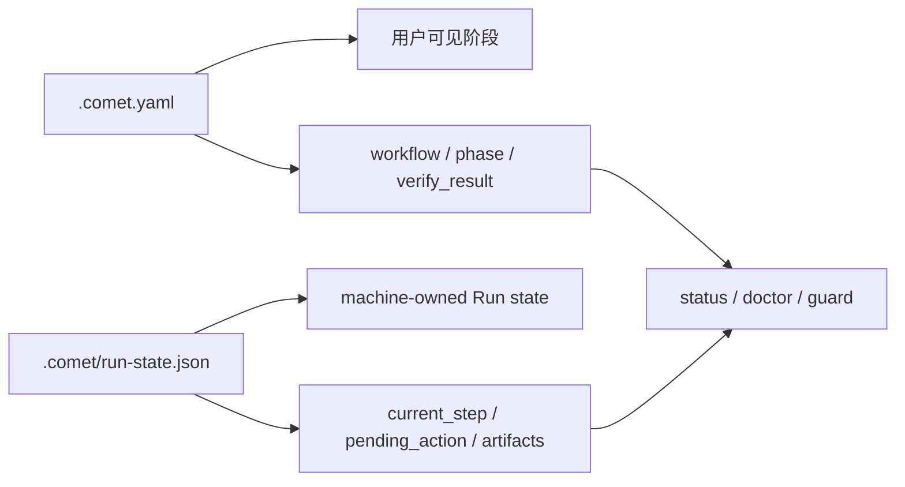

Comet 的恢复能力来自文件化状态。最重要的是 `.comet.yaml`、OpenSpec change 文件和 Engine Run state。

## `.comet.yaml`

每个活跃 change 都有自己的状态文件：

```text
openspec/changes/<name>/.comet.yaml
```

示例：

```yaml
workflow: full
phase: build
design_doc: docs/superpowers/specs/2026-06-23-demo-design.md
plan: docs/superpowers/plans/2026-06-23-demo.md
base_ref: a1b2c3d4e5f6
build_mode: subagent-driven-development
build_pause: null
subagent_dispatch: confirmed
tdd_mode: tdd
review_mode: standard
isolation: branch
verify_mode: light
verify_result: pending
verification_report: null
branch_status: pending
archived: false
```

## 状态字段怎么读

| 字段 | 你需要知道什么 |
| --- | --- |
| `workflow` | `full`、`hotfix` 或 `tweak` |
| `phase` | 当前阶段：`open`、`design`、`build`、`verify`、`archive` |
| `build_mode` | 执行方式，例如 subagent-driven 或 executing-plans |
| `isolation` | 使用 branch 或 worktree 隔离改动 |
| `review_mode` | 自动代码审查强度：`off`、`standard`、`thorough` |
| `auto_transition` | 阶段推进后是否自动调用下一个 Skill |
| `verify_result` | 验证结果：`pending`、`pass`、`fail` |

## 状态和 Run state 的边界

`.comet.yaml` 保存用户可理解的工作流投影。Engine 运行细节放在 `.comet/run-state.json` 或 `.comet/runs/<run-id>`。



## 项目配置

项目级配置位于：

```text
.comet/config.yaml
```

常见配置包括 `context_compression`、`review_mode` 和 `auto_transition`。这些配置影响默认行为，但不会替代阶段门禁。

## 不要手工改哪些内容

不要手工改 machine-owned Run 字段，也不要手工把已归档 change 标成完成。归档应通过 `/comet-archive` 或归档脚本完成，它会调用 OpenSpec archive 语义并移动目录。
