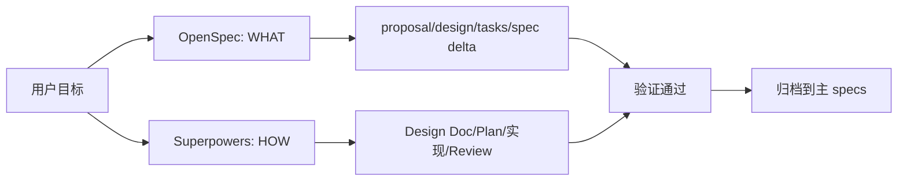
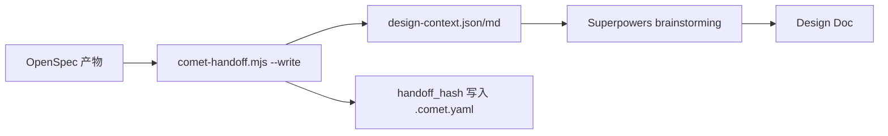
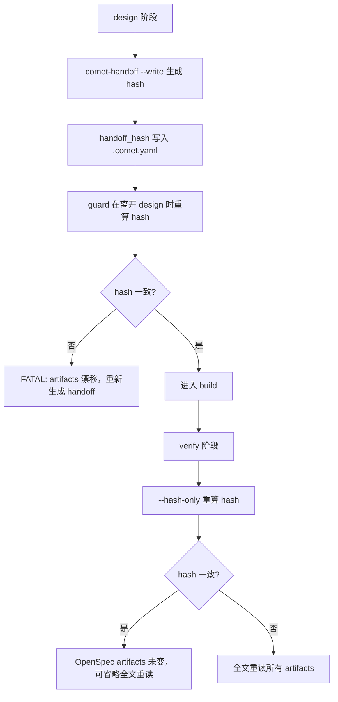
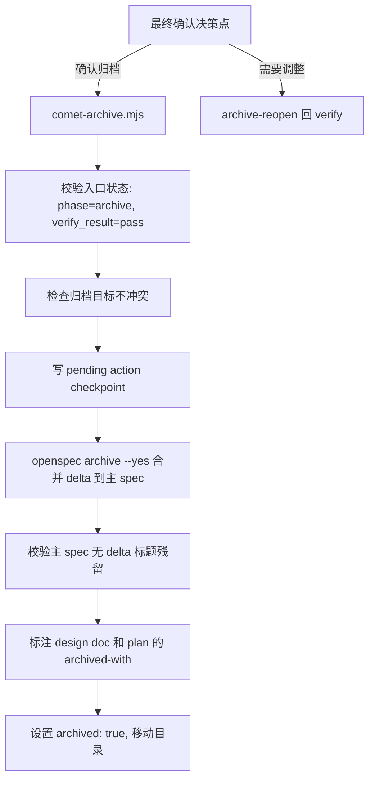
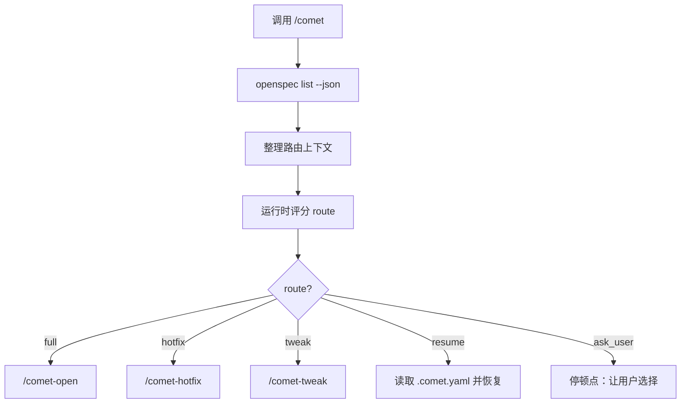

`/comet` 是 Comet 的经典 Spec 模式入口。它把一次变更拆成五个阶段：open、design、build、verify、archive。这五个阶段把 OpenSpec 和 Superpowers 两套工具连成一条可恢复的工作流。

## 为什么把 OpenSpec 和 Superpowers 串起来

OpenSpec 和 Superpowers 各有所长，但单独使用时都有短板：

| 工具 | 擅长 | 短板 |
| --- | --- | --- |
| OpenSpec | WHAT — 需求、提案、spec 生命周期、delta spec、归档 | 提案和 tasks 缺少深度设计的细节 |
| Superpowers | HOW — brainstorming、技术设计、计划、执行、收尾、验证 | 缺少状态化设计，spec 完成后只有勾选，Agent 恢复时容易反复回看文档和代码 |



<p align="center">
  
</p>

<p align="center">OpenSpec 记录 WHAT，Superpowers 组织 HOW，Comet 把两者夹到同一条可恢复链路上</p>

Comet 的职责不是替代任何一方，而是：

- **把两者的产物对齐到同一条链**——OpenSpec 记录的 WHAT 和 Superpowers 组织的 HOW 指向同一个 change。
- **用状态机和守卫保证交接可靠**——不让 Agent 靠对话历史猜进度，而是从文件状态和可检查证据恢复。
- **把文档同步自动化**——handoff、状态更新、验证和归档都进脚本流程，减少"记得更新设计文档""记得同步 spec""记得归档"这类反复提醒。

## 五个阶段

| 阶段 | 负责方 | 目标 | 主要产物 |
| --- | --- | --- | --- |
| open | OpenSpec | 把想法变成 OpenSpec change | `proposal.md`、`design.md`、`tasks.md`、delta spec |
| design | Superpowers | 做深度技术设计 | `docs/superpowers/specs/...-design.md`、handoff 包 |
| build | Superpowers | 写计划并执行 | `docs/superpowers/plans/...md`、代码改动、测试证据 |
| verify | 双方 | 验证实现符合设计和 spec | 验证报告、分支处理结果 |
| archive | OpenSpec | 合并 delta spec 并归档，给 Superpowers 文档打标 | `openspec/changes/archive/YYYY-MM-DD-name/`、design doc/plan 的 `archived-with` 标注 |

### open — OpenSpec 记录 WHAT

`/comet-open` 创建一个 OpenSpec change，产出：

```text
openspec/changes/<name>/
├── .openspec.yaml          # OpenSpec 状态
├── .comet.yaml             # Comet 工作流状态（Classic 字段 + run_id）
├── proposal.md             # Why + What
├── design.md               # How（高层）
├── tasks.md                # 任务清单
└── specs/<capability>/spec.md   # delta spec
```

Comet 会用 OpenSpec 的 `openspec instructions` 流程逐个生成 proposal、design、tasks，遵守项目的 `template`、`instruction`、`dependencies` 和 `resolvedOutputPath`，而不是一次性批量生成。完整工作流禁止跳过 brainstorming 直接 one-shot 生成提案。

<Warning>
  必须用 `/comet-open` 而不是 `/opsx:new` 创建 change。`/opsx:new` 只创建 OpenSpec artifacts，不会创建 `.comet.yaml`，change 会落在 Comet 状态机之外。
</Warning>

### design — Superpowers 深度设计，OpenSpec 保持权威

这是两套工具物理对接的阶段。Comet 用 `comet-handoff.mjs` 生成一个交接包，把 open 阶段的 OpenSpec artifacts（`proposal.md` 的需求动机、`design.md` 的高层方案、`tasks.md` 的任务边界，以及 `specs/<capability>/spec.md` 里的 delta spec）整理成 Superpowers 能读懂的上下文，再交给 Superpowers `brainstorming` 做深度设计。



Design Doc 的 frontmatter 显式声明 OpenSpec 是权威来源：

```yaml
---
comet_change: <name>
role: technical-design
canonical_spec: openspec   # OpenSpec 是权威，不是 Design Doc
---
```

关键约束：**Agent 不能写第二份需求 spec**。如果 delta spec 缺少验收场景，只能在 `specs/*/spec.md` 上写 Spec Patch（回写），不能扩大范围。

Spec Patch 是 design 阶段把需求缺口写回 OpenSpec 的唯一合法通道，它有三个硬边界：

- **只能做加法或修正**——补充验收场景、修正模糊描述、补充边界条件；不能重写 delta spec 的结构或范围。
- **只回写 OpenSpec**——Spec Patch 写回 `specs/*/spec.md`，不进 Design Doc。Design Doc 只记 HOW，OpenSpec 始终是 WHAT 的唯一权威。
- **写完必须重新生成 handoff**——delta spec 内容变了，hash 必然漂移，离开 design 阶段时 guard 会 FATAL。

如果改动超出了 Spec Patch 的边界（接口变化、新组件、数据流变化、全新 capability），属于设计层面的重大变更：要么在当前 change 退回 brainstorming 重新对齐，要么开新 change。这类"中途改 spec"的实践场景和具体操作见[中途修改 spec 或回退工作流](/zh/guides/mid-workflow-changes)。

### build — Superpowers 执行，以 OpenSpec 任务边界为输入

计划由加载 Superpowers `writing-plans` 的子代理生成，它的 frontmatter 是两个世界的显式链接：

```yaml
---
change: <openspec-change-name>
design-doc: docs/superpowers/specs/YYYY-MM-DD-<topic>-design.md
base-ref: <实现前的 git HEAD>
---
```

计划输入是 Design Doc（Superpowers）+ `tasks.md`（OpenSpec 任务边界）。Design Doc 已经在 design 阶段消化了 proposal、原始 design 和 delta spec，所以 build 阶段不必回读这些原始 artifacts；`tasks.md` 则作为活文档持续核对任务边界。执行方式由用户选择：`subagent-driven-development` 或 `executing-plans`，配合 `isolation`（branch/worktree）、`tdd_mode`、`review_mode`。

### verify — 双方都查，用 hash 检测漂移

verify 会加载 Superpowers `verification-before-completion`，然后按 `verify_mode` 分支：

- **light**（6 项检查）：任务完成、diff 对比、构建、测试、安全、轻量代码评审。跳过 spec 覆盖、Design Doc 一致性和漂移检查。
- **full**：额外加载 `openspec-verify-change`，同时检查 OpenSpec `design.md` 和 Superpowers Design Doc，包括"delta spec 与 design doc 无矛盾"。

## 产物如何交接：handoff hash

Comet 用一个 **handoff hash** 把 OpenSpec artifacts 和后续阶段绑在一起，这是它可靠性的核心机制。

### hash 怎么算

`comet-handoff.mjs` 对这些文件计算内容 hash：

```text
openspec/changes/<name>/proposal.md
openspec/changes/<name>/design.md
openspec/changes/<name>/tasks.md
openspec/changes/<name>/specs/<capability>/spec.md   # 每个 delta spec
```

对每个文件先算 per-file sha256，再把"相对路径 + per-file sha256"拼起来算最终 sha256，得到 `handoff_hash`。路径统一用正斜杠，保证 macOS/Linux/Windows 的 hash 输入字节一致。

### hash 在各阶段的作用



| 阶段 | hash 的作用 |
| --- | --- |
| design | 生成 hash，写入 `.comet.yaml` 的 `handoff_hash` 和 `handoff_context` |
| guard（离开 design） | 重算 hash，如果和记录的不一致就 FATAL，提示重新生成 handoff |
| verify | 用 `--hash-only` 快速重算，hash 一致说明 OpenSpec artifacts 没变，可省略全文重读；不一致则全文重读 |

<p align="center">
  
</p>

<p align="center">handoff hash 像一枚可靠的夹子，把前后阶段的证据绑在一起</p>

### handoff 包格式

`comet-handoff.mjs ... --write` 在 `openspec/changes/<name>/.comet/handoff/` 下产出：

| 模式 | 产出文件 | 内容 |
| --- | --- | --- |
| `off`（默认） | `design-context.json` + `design-context.md` | 完整 artifacts 内容，每文件带 SHA256 |
| `beta`（压缩） | `spec-context.json` + `spec-context.md` | spec 文件 verbatim 投影 + supporting 文件只存 hash，节省约 25–30% token |

JSON 包含 `change`、`phase`、`mode`、`canonical_spec: openspec`、`context_hash` 和 `files` 数组。guard 会额外验证 markdown 包带有 `Generated-by:` 标记和每个文件的 `Source:`/`SHA256:` 引用，保证 Superpowers 消费的上下文可追溯。

<Tip>
  beta 压缩模式是 Comet 的上下文压缩 beta 功能在 handoff 环节的体现——两种模式的原理、token 节省测算和何时该开 beta，见[上下文压缩机制](/zh/concepts/context-compression)。
</Tip>

## 如何处理 spec 范围

Comet **不做 spec 去重或重叠检测**。它处理 spec 范围问题的方式是 delta spec 生命周期 + 归档时委托 OpenSpec 合并。

<Tip>
  大型 PRD 拆分是 Comet 贴近现实需求开发的独立特性——把一个大需求拆成多个可独立设计、交付、归档的 change。详见[大型 PRD 拆分](/zh/guides/prd-splitting)。
</Tip>

### delta spec 语义

delta spec 的 `ADDED`/`MODIFIED`/`REMOVED`/`RENAMED` 是 **OpenSpec 原生概念**，不是 Comet 发明的。Comet 消费但不重写这些语义：

- open 阶段创建 delta spec，描述本次变更对哪些能力的增删改。
- build 阶段把 delta spec 当作**活文档**——小修直接改，中改重新 brainstorming，大改通过 `/comet-open` 开新 change。
- archive 阶段由 OpenSpec CLI 按 `ADDED`/`MODIFIED`/`REMOVED`/`RENAMED` 语义合并 delta 到主 spec。

### verify 的 spec 漂移决策

build 阶段允许小改 delta spec（补充验收场景、边界条件等），这些改动不一定同步回 Design Doc。verify 阶段会把 delta spec 和 Design Doc 放在一起查——如果发现 delta spec 里有内容、Design Doc 没反映（即 spec 漂移），**这是一个需要你做决策的阻塞点**，Comet 不会自动选，会暂停等你三选一：

| 选项 | 适用场景 | 做什么 | 之后 |
| --- | --- | --- | --- |
| A | 偏差合理但 Design Doc 漏了，想留个说明 | 在 Design Doc 追加 "Implementation Divergence" 段，记录偏差原因 | 继续验证，不再触发改动归因 |
| B | 偏差较大，设计没跟上 | `verify-fail` 回 build，加载 `brainstorming` 重新对齐 Design Doc 和 delta spec | 修完重新走 build→verify |
| C | 偏差可接受，不想补 Design Doc | 确认接受，继续验证 | 归档时 Design Doc 自动标记 `superseded-by-main-spec`，让位给主 spec |

判断口径：偏差是**说明性问题**（Design Doc 漏记，但实现没问题）选 A；是**设计性问题**（Design Doc 跟不上现实）选 B；偏差无关紧要、不值得回头补，选 C。

## 如何归档

archive 阶段关闭整个 spec 生命周期。`comet-archive.mjs` 是归档的确定性入口，但它把 delta→主 spec 的合并**委托给 OpenSpec CLI**，自己做前后校验。

### 归档流程



`comet-archive.mjs` 逐步做：

1. **校验 change 名**（kebab-case）。
2. **定位 change 目录**，如果已被之前的归档移走，扫描 archive 目录恢复。
3. **校验入口状态**：`phase` 必须是 `archive`，`verify_result` 必须是 `pass`。
4. **检查归档目标可用**：`openspec/changes/archive/YYYY-MM-DD-<name>` 不能已存在。
5. **写 pending action checkpoint**，支持归档中断后恢复。
6. **调用 OpenSpec archive**：`openspec archive <change> --yes`，这一步真正执行 delta→主 spec 合并并移动 change 目录。
7. **解析归档目录**：重新定位 OpenSpec 实际放的位置（日期前缀可能变化）。
8. **校验主 spec 干净**：扫描 `openspec/specs/*/spec.md`，如果残留 `## ADDED/MODIFIED/REMOVED/RENAMED Requirements` 这类 delta-only 标题就 FATAL。
9. **标注 Superpowers 文档 frontmatter**：在 design doc 和 plan 的 frontmatter 写入 `archived-with: <archiveName>`，把 Superpowers 产物锚定到具体的归档目录；design doc 额外加 `status: final`，表明设计文档生命周期结束。幂等设计，已有标注会先移除 `archived-with:` 旧值再重写。这样 Agent 在归档后检索 Design Doc/Plan 时，能直接从 frontmatter 知道它属于哪次归档、是否已结案，而不必反查 `.comet.yaml`。
10. **更新归档状态**：设置 `archived: true`，Run 状态转为 `completed`，清除 pending action。

### 归档目录结构

```text
openspec/changes/archive/YYYY-MM-DD-<change-name>/
```

日期取 UTC（`new Date().toISOString().slice(0,10)`），保证跨时区一致。

<Warning>
  归档成功后不要再跑 `comet-guard <name> archive`——活跃目录已不存在，guard 会报错。归档完整性由退出码和归档目录状态判断。
</Warning>

### 预览

`comet-archive.mjs ... --dry-run` 可以预览归档流程而不真正执行 OpenSpec，用 `[DRY-RUN]` 标记标注，报告多少步会成功。

## `/comet` 如何判断入口

每次调用 `/comet`，Comet 都会重新读取活跃 change 和 `.comet.yaml`，而不是依赖聊天历史。入口判断不再只靠提示词里的经验规则；Comet 会把用户原话、active change 列表和风险信号整理成结构化路由上下文（实现类型名为 `CometIntentFrame`），再交给运行时评分得到最终 route。

从用户视角，你只需要知道这些结果：

| route | 什么时候出现 | 下一步 |
| --- | --- | --- |
| `full` | 新能力、public API、schema、跨模块或架构变更 | 进入 `/comet-open` |
| `hotfix` | 修已有异常、回归或错误行为，且没有新增能力/API/schema/跨模块风险 | 进入 `/comet-hotfix` |
| `tweak` | 文案、配置、文档、prompt 或单一 OpenSpec change 的轻中量修改 | 进入 `/comet-tweak` |
| `resume` | 用户明确继续某个 active change | 读取该 change 的 `.comet.yaml` 并恢复阶段 |
| `ask_user` | 置信度不足、多个 active change、证据缺失或用户显式路径与风险信号冲突 | 暂停让你选择 |
| `out_of_scope` | 你只是提问，没有要求启动或恢复工作流 | 不初始化 change |



路由上下文让路由可解释：如果 Comet 没有足够证据证明某条路径安全，它会问你，而不是把 `hotfix`、`tweak` 或 `full` 猜到底。

## 用户会在哪些地方参与

Comet 会自动推进无歧义阶段，但不会替你做产品或风险决策。常见阻塞点包括：

- open 阶段确认 proposal、design 和 tasks（大型需求还会遇到 PRD 拆分，见[大型 PRD 拆分](/zh/guides/prd-splitting)）。
- design 阶段确认方案，以及是否写 Spec Patch。
- build 阶段选择隔离方式和执行方式。
- verify 失败后选择修复或接受偏差（A/B/C）。
- archive 前做最终确认。
- hotfix/tweak 命中升级信号时选择继续轻量路径或升级 full。

## 轻量预设

`/comet-hotfix` 和 `/comet-tweak` 都跳过完整 brainstorming，但仍保留 OpenSpec 状态、验证和归档。两者的定位不同：

- **`/comet-hotfix`** 适合快速 bug 修复，无需 Design Doc。
- **`/comet-tweak`** 适合 OpenSpec 链式的轻量变更——配置调整、文档或提示词优化，以及 **spec 驱动（含 delta spec）的中等变更**。在 tweak 里 delta spec 是一等产物，单凭"需要 delta spec"不构成升级理由。

共同前提：变更能装进单个 OpenSpec change，不需要 Superpowers 深度设计。一旦出现跨模块/跨层协调、新 public API、schema 变更或深层架构问题等质变信号，应升级到 full（升级路径见[中途修改 spec 或回退工作流](/zh/guides/mid-workflow-changes)）。

## 下一步

- [大型 PRD 拆分](/zh/guides/prd-splitting) — 把大需求拆成多个可独立交付的 change
- [状态与配置](/zh/concepts/state-management) — 理解 `.comet.yaml` 字段和状态守卫
- [Skill 的类型与用途](/zh/concepts/skills) — Comet Skill 的三类来源
- [comet-handoff](/zh/scripts/comet-handoff) — 交接包和 hash 的脚本细节
- [comet-archive](/zh/scripts/comet-archive) — 归档脚本的完整说明
